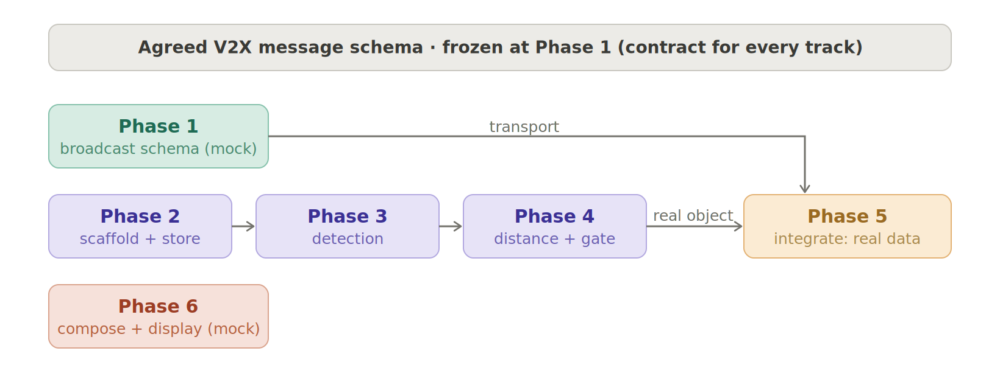
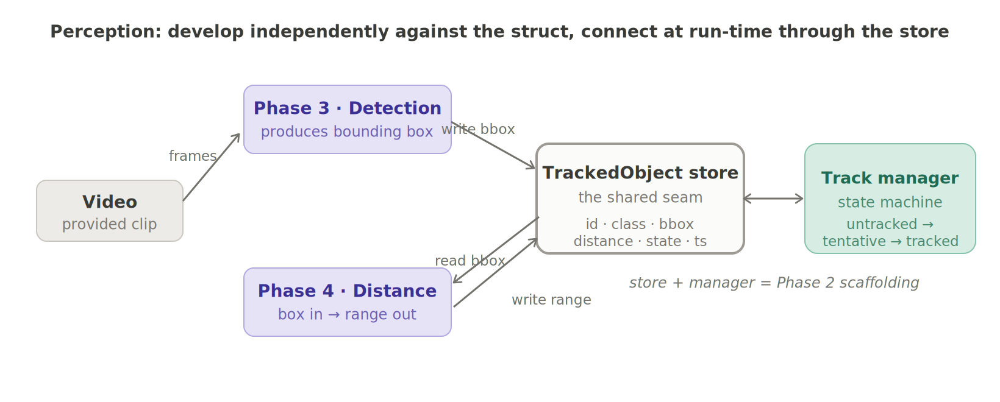
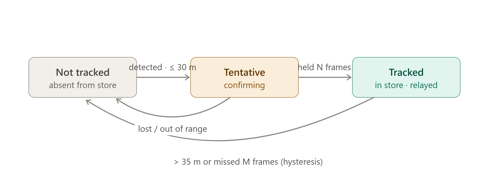

# Milestone 1 — Cooperative Vehicle Awareness (A ← B ← C)

## 1. Introduction

Milestone 1 demonstrates **cooperative (non-line-of-sight) awareness** over V2X: making a vehicle aware of a hazard it cannot see, by relaying another vehicle's perception.

Three vehicles drive in a collinear convoy — **A** follows **B** follows **C**. Vehicle A's view of C is **blocked by B**, so A's own camera can never detect C. Vehicle B *can* see C, detects it, and **broadcasts that perception to A over V2X**. The result: both A and B display vehicle C and its relative position, even though A never sees C directly.

*Objective — B's perception of C reaches A over a V2X relay. A reconstructs C's position by composing its own measurement of B with B's reported measurement of C:* `d_AC ≈ d_AB + d_BC` *(valid for the near-collinear convoy; absolute/GPS composition is a later milestone).*

This is the V2X "see-through" pattern: B answers *"what is ahead that A can't see?"*, the V2X link carries it, and A answers *"where does that put it relative to me?"*

---

## 2. Scope & Assumptions

- Video is **provided** (recorded / simulator). No live camera bring-up in M1.
- Vehicle C is a **generic car** → pretrained detector, **no model training**.
- **Security is skipped** (messages sent unsigned). Signing / PKI is deferred.
- **Encoding**: if a real V2X stack / OBU is used, the standard ASN.1 encoding is free — use it; if hand-rolling, JSON is acceptable for M1. Either way the message **schema** must be standard-conformant.
- GNSS (time + position) comes from the **modem's integrated receiver**. The separate Cortex-M GPS path is deferred.
- Composition assumes a near-collinear, same-heading convoy.
- Transport may run on a **stub** (UDP/ZeroMQ) and/or real **PC5**, depending on hardware.
- "Risk" is a **static label** on C in the relay/display path; ADA additionally computes a **simple TTC-based risk level** for logging (collision-risk event list + annotated-video TTC overlay — [requirements § System demo requirements](../../requirements/m1-cooperative-awareness.md#system-demo-requirements)). Full multi-object / curved-trajectory risk analysis is deferred (§6).

---

## 3. Development Plan & Order of Implementation

The plan is **contract-first**. Two interfaces are frozen up front, and every phase then becomes "swap mock data for real data" inside a shape that already works:

1. **V2X message schema** — the contract between the two vehicles (base it on the CPM / SDSM perceived-object container so no needed field is missing later).
2. **TrackedObject struct** — the contract between the perception sub-phases.

With those frozen, three tracks develop **in parallel** and converge at Phase 6:

*Comms (Phase 1), perception (Phases 2→3→4) and display (Phase 5) all build against the frozen schema. Phase 1 broadcasts the full message with mock contents; the perception track produces real data; Phase 5 is built on a mock message. They meet at Phase 6, which swaps mock for real.*

### Order of implementation

> **Step 0 — Freeze the contracts.** Agree the V2X message schema and the TrackedObject struct before any other work. Everything downstream depends on them; a missing field here ripples to all tracks.
>
> **Step 1 — Run three tracks in parallel:**
> - **Comms track:** Phase 1 (broadcast the full schema with mock payload).
> - **Perception track:** Phase 2 first (it defines the store + state machine), then Phases 3 and 4 — which themselves develop independently against the struct (see below).
> - **Display track:** Phase 5, built against a mock message.
>
> **Step 2 — Converge:** Phase 6 — replace mock contents with real perceived data from Phase 4, flowing over Phase 1's transport.
>
> **Step 3 — Finalize:** wire Phase 6's real data into the already-built Phase 5 and run the end-to-end demo.
>
> **Single-developer fallback:** if working alone, run the phases sequentially in number order **1 → 2 → 3 → 4 → 5 → 6**. The parallel plan above is the optimization for multiple people.

### Inside the perception track

Phases 3 and 4 do **not** call each other. They share only the video and the **TrackedObject struct**, so they develop independently and connect **at run-time through the store** — detection writes the bounding box, distance reads it and writes back the range:

*Detection and distance can be validated in isolation (ideally against a clip with ground-truth distance, e.g. CARLA/KITTI). The `untracked → tentative → tracked` state machine lives in the Phase 2 track manager and consumes both sides — detection supplies "present", distance supplies "within gate".*

### Development on the cloud platform (CARSKY)

M1 can be developed and demoed end-to-end on FPT's CARSKY virtual engineering platform (the hackathon's Round-2 "Virtual Development Platform") with **no vehicle hardware**. The platform's pieces map onto the tracks as follows:

| Platform capability | Role in M1 |
|---|---|
| **CabinSky** (vECU runtime: Linux/AUTOSAR containers in the cloud) | Vehicles A and B run as two Linux vECUs hosting the comms, perception, and display processes |
| **Nydus** (topology orchestration: CAN/LIN/Ethernet/SOME-IP; per-node fidelity swap mock → vECU → HIL) | The A↔B link is a simulated Ethernet segment; the mock-then-real convergence at Phase 6 is Nydus's native fidelity-swap workflow |
| **MCP interface** (AI-agent deploy / send / interact / verify) | Phase acceptance criteria can be executed as agent-driven test scripts (deploy topology → inject → screenshot/verify) |

Two hardware capabilities do not exist in the cloud and are substituted **behind the frozen contracts** — the message schema and all downstream phases are untouched:

- **V2X radio → stub transport (sanctioned in section 2).** A `broadcast(msg)` / `on_receive(callback)` transport interface with a UDP-broadcast or ZeroMQ pub/sub implementation over the Nydus Ethernet link. The cloud link is impaired with `tc netem` (loss, latency jitter) and the broadcast loop is capped at a realistic ~10 Hz cadence, so the Phase 6 latency criterion and the gate hysteresis are tested against real jitter, not a perfect LAN. Real PC5 remains deferred scope; when hardware arrives, only this adapter is reimplemented.
- **GNSS → `GnssProvider` interface** with a `SimGnssProvider` for M1-on-cloud (a `ModemGnssProvider` over QMI/AT is reserved for the hardware milestone):
  - *Timebase*: both vECUs disciplined by chrony/NTP against a common source; the common-timebase criterion is verified identically, only the discipline mechanism changes.
  - *Reference position*: NMEA replay via `gpsd`/`gpsfake`, generated from the dataset's ground-truth trajectory (KITTI raw ships per-frame OXTS GPS/IMU), so the message's reference position stays consistent with the video the perception track processes.

**Re-scoped Phase 1 acceptance criteria on cloud** (a documented substitution, not a silent drop — the remaining Phase 1 criteria apply unchanged):

| Hardware criterion | Cloud substitute |
|---|---|
| Modem identified, V2X mode confirmed, GNSS fix acquired | GNSS provider initialized; startup log names the active provider (`sim`) and reports a fix from replayed NMEA |
| Timestamps GNSS-disciplined to a common timebase | Timestamps chrony/NTP-disciplined; measured offset within the agreed bound |
| (implicit) real radio link | Stub transport with a documented netem impairment profile and ~10 Hz cadence |

**Portability constraint.** CARSKY is proprietary, competition-provided infrastructure. All M1 code must stay platform-agnostic — plain Linux processes talking over the transport interface — so nothing in the deliverable depends on CARSKY itself and the same code runs on any Linux host or future hardware bench.

---

## 4. Global Definitions

### V2X message schema (the contract)

A perceived-object message (CPM-/SDSM-shaped) carrying: sender `stationId`, `generationDeltaTime`, sender reference position/time, and a perceived-object entry for C (`objectId`, relative position / distance, `classification`, `confidence`). Frozen at Phase 1; broadcast with mock contents in Phase 1, real contents from Phase 6.

### TrackedObject struct

| Field | Meaning |
|---|---|
| `id` | Stable track identifier |
| `class` | Object class (e.g. `car`) |
| `source` | `own_sensor` or `v2x_relayed` |
| `first_seen`, `last_seen` | Timestamps |
| `bbox` | Bounding box (own-sensor tracks) |
| `distance` | Range to object (m) |
| `confidence` | Detection / relay confidence |
| `state` | `not_tracked` → `tentative` → `tracked` |

### Proximity gate constants (externalized, tuned against real jitter)

| Constant | Suggested | Meaning |
|---|---|---|
| `gate_enter` | 30 m | Admit C when within this range |
| `gate_exit` | 35 m | Drop C only beyond this range (hysteresis) |
| `confirm_hits` (N) | e.g. 3 | Consecutive in-range frames before admission |
| `miss_limit` (M) | e.g. 5 | Consecutive missed frames before expiry |

### Track admission state machine

Implemented in the Phase 2 track manager. A hard 30 m edge would flicker on noisy monocular distance, so admission uses **confirmation + hysteresis**:

*B gates on its own measured distance to C. A is the mirror case — it admits the relayed C on message receipt (`source = v2x_relayed`) and drops it when the messages stop. "C enters Tracked" in B is also the trigger to start relaying C; "C leaves the set" stops the relay.*

---

## 5. Phases

### Phase 1 — Bring up V2X heartbeat / message transport

**Objective.** Two vehicles broadcast and receive the **full agreed message** (with mock object contents) on a common GNSS-disciplined timebase.

**Working-environment reference (cloud).** The Phase 1 runtime flow on CARSKY — bench-node scenario player → ego `V2X_Comm` decode → `ADA` situation assessment → `IVI` warning — is illustrated by the swimlane ("lane") activity diagram [m1-phase1-working-env-activity.puml](../../requirements/m1-phase1-working-env-activity.puml) (researcher artifact; its companion component diagram and research note sit alongside it in [requirements/](../../requirements/m1-phase1-working-environment.md)).

**Tasks.**
- Host (Cortex-A) establishes the modem link over its control path (QMI/AT); query identity, firmware, V2X mode, GNSS fix; emit a startup log.
- Define a **V2X service** that auto-starts on boot (`systemd` unit, or an Adaptive Application started by Execution Management), initializes the stack, applies PC5 config, runs the broadcast loop.
- Read GNSS time + position periodically and log it.
- Broadcast the **full schema** with mock object fields; receive on the peer vehicle.
- Discipline local time to GNSS so both vehicles' timestamps are comparable.

**Tech stack.** C-V2X modem (integrated GNSS); V2X stack (vendor SDK / Vanetza) or UDP/ZeroMQ stub; `systemd` or Adaptive AUTOSAR EM; JSON or standard CPM/SDSM encoder.

**Acceptance Criteria.**
- [ ] Startup log shows the modem identified, V2X mode confirmed, and a GNSS fix acquired.
- [ ] The V2X service starts automatically on boot (verifiable via service status / log).
- [ ] Each vehicle logs GNSS position + timestamp at the configured period.
- [ ] A transmitted message contains **all** schema fields (mock object included) with correct units/ranges.
- [ ] Vehicle A logs the **full message** received from B (and vice versa), parsed into fields.
- [ ] Timestamps from both vehicles share a common timebase (offset within an agreed bound).
- [ ] Messages are sent unsigned (no security stack required to pass).

### Phase 2 — Perception scaffolding (no detector)

**Objective.** Stand up the video harness, the TrackedObject store, and the gate state machine, driven by a **mocked C** so the pipeline works before any ML.

**Tasks.**
- Identify the video container/codec/fps/resolution; choose a frame reader.
- Implement the TrackedObject store and the `not_tracked → tentative → tracked` manager (driven by mock distance for now).
- Inject a synthetic C track each frame; log lifecycle transitions.

**Tech stack.** Python, OpenCV `VideoCapture` (or PyAV / GStreamer for precise timestamps), NumPy.

**Acceptance Criteria.**
- [ ] The provided video opens; format, codec, fps, and resolution are detected and logged.
- [ ] Frames stream with a per-frame timestamp.
- [ ] The TrackedObject store exposes all required fields.
- [ ] With the mock enabled, the log shows C added/tracked with a timestamp, and a full `not_tracked → tentative → tracked → expired` cycle.
- [ ] No detector is invoked (confirmed by toggling the mock off → no tracks).

### Phase 3 — Object detection

**Objective.** Replace the mock with real detection of C (a generic car) using a pretrained model.

**Tasks.**
- Run a pretrained detector; keep vehicle classes; select the in-lane lead (largest central box).
- Write detections (bounding boxes) into the TrackedObject store.

**Tech stack.** Ultralytics YOLO (v8/v11, pretrained COCO) on PyTorch (GPU/NPU if available; CPU acceptable for recorded video).

**Acceptance Criteria.**
- [ ] The detector runs on the provided video and logs detections per frame.
- [ ] C is detected and classified as a vehicle (`car`/`truck`).
- [ ] The in-lane lead is correctly selected when multiple vehicles are present.
- [ ] Bounding boxes are written into the store (mock no longer required).
- [ ] Detection throughput keeps pace with the video frame rate (or meets the agreed latency target).

### Phase 4 — Distance estimation + proximity gate

**Objective.** Estimate range to C per frame, write it into the track, and make the proximity gate fully active.

**Tasks.**
- Compute monocular distance (bbox-bottom ground-plane projection, or height/similar-triangles) using camera intrinsics; read the bbox from the store, write the range back.
- Activate the gate: admit C only when ≤ `gate_enter` for `confirm_hits` frames; drop only beyond `gate_exit` or after `miss_limit` misses.

**Tech stack.** NumPy; camera calibration from the dataset (CARLA/KITTI provide intrinsics + ground truth).

**Acceptance Criteria.**
- [ ] A distance is computed each frame for the lead and stored on the track.
- [ ] Estimated distance matches ground truth within the agreed tolerance (e.g. ±15%).
- [ ] C is admitted to the store only when within `gate_enter`.
- [ ] C is not dropped until beyond `gate_exit` (no add/remove flicker at the boundary).
- [ ] Gate constants are externalized configuration, not hardcoded literals.

### Phase 5 — Compose + display

**Objective.** A reconstructs C's position and both vehicles display C with its relative position.

**Tasks.**
- A measures `d_AB` locally (B is its in-lane lead) and composes `d_AC = d_AB + d_BC` (lateral offsets added component-wise).
- B displays C from direct detection; A displays C as an occluded "ghost" marker on a bird's-eye-view (BEV).
- *Developed against a mock message (mock `d_AB` + `d_BC`); integrated against real data at the end.*

**Tech stack.** OpenCV overlay (camera view); OpenCV/matplotlib BEV; production GUI later.

**Acceptance Criteria.**
- [ ] **(Dev)** With a mock message, A renders C on the BEV at the composed position.
- [ ] A computes `d_AC` from its own `d_AB` plus B's relayed `d_BC`.
- [ ] B's display shows C (directly detected) with its relative position.
- [ ] A's display shows C as an occluded marker on the BEV, despite A never detecting C directly.
- [ ] The composed `d_AC` matches ground truth within the agreed tolerance.
- [ ] **(Integration)** With real Phase 6 data, C appears on A's display end-to-end.

### Phase 6 — Perceived object → V2X (real data)

**Objective.** Replace the mock contents with **real** perceived data; B relays C, A receives it. This is a swap-and-verify step, not a new build.

**Tasks.**
- Populate the message's perceived-object entry from Phase 4's real track (type, relative position/distance, confidence, timestamp).
- B includes C in the broadcast **only while C is in the `tracked` state** (relay window = gate).
- A receives, decodes, and admits a relayed C track (`source = v2x_relayed`) on receipt.

**Tech stack.** Same transport as Phase 1; the frozen schema; per-source admission logic in the store.

**Acceptance Criteria.**
- [ ] The transmitted message carries **real** C data from Phase 4 — **no mocks** anywhere in the path.
- [ ] B starts relaying C when it enters `tracked`, and stops when it leaves the set.
- [ ] A receives and decodes the message and creates a `v2x_relayed` track for C.
- [ ] The relayed track carries B's reference position/time needed by Phase 5.
- [ ] End-to-end latency from B's detection to A's receipt is within the agreed bound.

---

## 6. Deferred to Later Milestones

- Real PC5 over-the-air (if M1 used the stub), message **signing / PKI** (IEEE 1609.2), full **ASN.1** encoding.
- Full multi-object / curved-trajectory **risk analysis** — M1 includes only a simple TTC-based risk level for ADA demo logging (§2).
- Multi-object tracking, **absolute/GPS** composition, curve/heading-robust geometry.
- Cortex-M GNSS + telemetry path, V2N2V network relay, earlier-relay lead-time tuning.

## 7. Definition of Done

All six phases pass their acceptance criteria, and the end-to-end demo shows **vehicle C appearing on vehicle A's display purely via B's V2X relay**, while A's own perception cannot see C.
