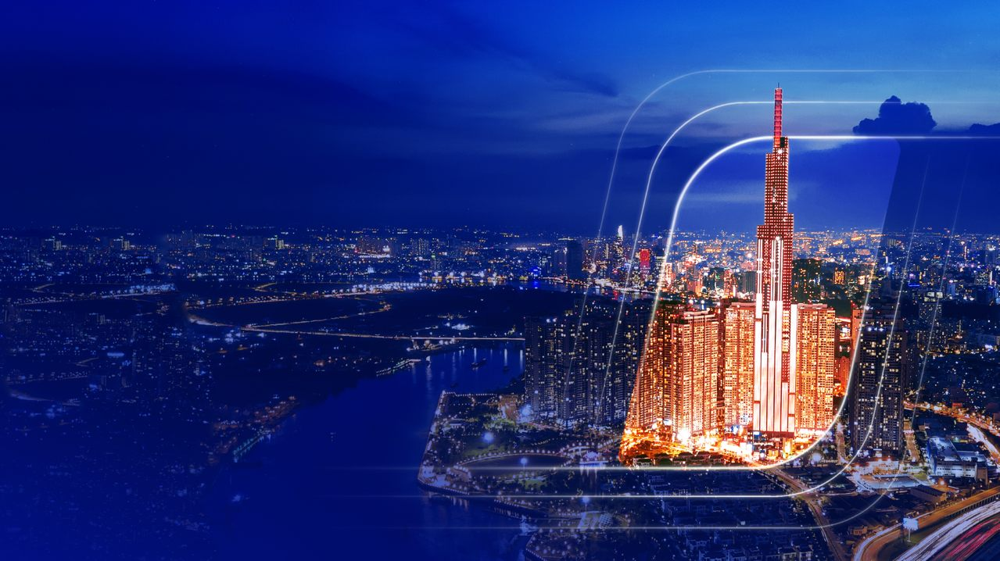
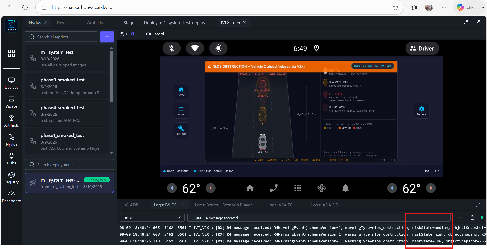

<!-- _class: lead -->
<!-- _paginate: false -->

# Cooperative Vehicle Awareness

## Product & Delivery — what you receive, and why you can rely on it

**Milestone 1 · Team KIS — FPT Hackathon 2026**

Lead: Pham Ngoc Minh · 2026-08-10 · Full statement: [Proposals](../../documents/Proposals/README.md)

---

# Table of contents

1. **The product** — the hazard it removes, and the experience the driver gets
2. **Guaranteed delivery** — the checklist of everything included in the package
3. **Proven capability** — the evidence and the measurements behind the guarantee
4. **Clear scope** — precisely what Milestone 1 covers, stated openly
5. **Delivery options** — the customers we serve, as a whole package or per application

---

<!-- _class: lead -->

# 01 · The product

---

# The hazard beyond line of sight

**The accident nobody sees coming:** a vehicle braking two cars ahead is invisible to the following driver — and to every sensor on their car — until it is too late.

- **Vehicles share what they see.** When one vehicle detects a hazard, it broadcasts that perception over V2X — the vehicle behind receives it and warns its driver.
- **Seconds of extra reaction time.** The warning arrives while the hazard is still hidden — time to slow down instead of collide.
- **No new roadside infrastructure.** The capability travels with the vehicles; two connected vehicles are enough.

> **Milestone 1 proves it end to end:** in a three-vehicle convoy A–B–C, vehicle A is warned about vehicle C — a car A's own sensors can never see — from B's relayed perception alone.

---

# The driver experience

One glance tells the driver everything: a bird's-eye view of the road ahead, the hidden vehicle drawn in, and the risk level in colour.

- The banner states the situation in plain words; the ghost carries its **distance and live risk level** — no cryptic alarms, no interpretation.

---

<!-- _class: lead -->

# 02 · Guaranteed delivery

---

# The delivery checklist

Checked items are complete and included in the Milestone 1 package; ❌ marks an item not yet tested.

| Delivered | Item | What you receive |
|:---:|---|---|
| ✅ | **Application code** | Three ECU applications — V2X-ECU, ADA-ECU, IVI-ECU — full source on [GitHub](https://github.com/mnpham2101/FPT-Hackathon2026) |
| ✅ | **Utility tools** | Automation for app installation and log collection — `tools/apk-uploader/`, `tools/logs-collector/` |
| ❌ | **Data-provenance tools** | Inside the ADA-ECU application — verify that the warning derives from the V2X relay alone (implemented, not yet tested) |
| ✅ | **Isolated test images** | Each ECU has mock images of its neighbours — every application testable on its own |
| ✅ | **CI tools** | Six CI pipelines, one per development phase, under `.github/workflows/` |
| ✅ | **Demo video** | [A video demo](../../video-evidence/system-test.mp4) of the full system test |
| ✅ | **Wiki** | The complete project design, and the research articles founding the project |
| ✅ | **Deployment blueprints** | CarSky blueprints ready to be deployed and tested |
| ✅ | **Documentation** | Wiki pages and presentations — the wiki is a work in progress, with articles being added |

---

# What the checklist means for you

- **Nothing is a promise** — every checked item already exists in the package you receive, not on a roadmap.
- **You can verify it yourself** — the blueprints deploy on the platform, the tools collect the same evidence we publish, and the CI pipelines re-run on every change.
- **You can maintain it** — the wiki carries the full design and its research foundation, so a new team can take the product over without us in the room.

---

<!-- _class: lead -->

# 03 · Proven capability

---

# Evidence at every layer

No single view can hide a gap: the demonstration is proven at three independent layers, and all three agree.

| Layer | What it proves to you |
|---|---|
| **Warning screen** | The driver actually saw the warning — captured as screenshots and recordings on the platform |
| **Internal logs** | Every processing step happened: transmission, decoding, fusion, risk assessment, reception |
| **Network captures** | The messages really crossed the network, byte-exact against the designed call flow — opened in standard Wireshark |

Core evidence is published in the [System Delivery](../phase6-systemIntegration/phase6-system-delivery-deck.html) deck; the corresponding wiki page will follow.

---

# Measured performance

Numbers read from the recorded system test, not estimates.

| Measure | Result |
|---|---|
| Hazard data received → warning on the driver's screen | **101 ms** |
| Message decode and forward inside the V2X application | **under 1 ms** |
| Continuous operation | The demo scenario repeats **every ~10 s for as long as the system runs** |
| Direct detections of the hidden vehicle by the warned vehicle | **Zero** in the recorded run's logs — checked by the data-provenance tool (see note) |

* *Note*: the data-provenance tool built into the ADA-ECU verifies that the warning output contains the occluded vehicle C only when sourced from V2X messages. Evidence of this check will be provided in a later delivery.

---

# Engineering discipline behind the product

- **Continuous integration** — six pipelines build and test every change automatically; a broken change cannot land unnoticed.
- **ASPICE-oriented traceability** — every feature traces to a requirement, and every piece of work to a task ID.
- **Frozen contracts between applications** — the three ECUs communicate only through agreed, versioned message contracts, so each evolves without breaking the others.
- **Living documentation** — a continuously updated wiki and knowledge base connect the design to the research it stands on.

---

<!-- _class: lead -->

# 04 · Clear scope

---

# The Milestone 1 scope

What you receive today, stated precisely — the demonstration runs entirely on the CarSky cloud platform.

- **One scenario, proven end to end** — a three-vehicle convoy where the front vehicle is hidden from the rear one; the rear driver is warned from relayed perception alone.
- **Vehicle A is built in full** — its V2X receiver, its risk-assessing driver assistance, and its warning display are the delivered product.
- **Vehicles B and C are simulated** — a scenario bench plays the messages a real leading vehicle would send.
- **Two inputs are simulated, and we say so** — the V2X radio feed and the camera feed; every message between the delivered applications is real.

---

# Deliberate exclusions and future growth

The boundary is written down — no surprise gaps, and a registered path forward.

- **No vehicle hardware** — Milestone 1 is fully virtual by design; nothing in the delivery depends on a physical car.
- **The production V2X radio stack is a later milestone** — the receiving side is built; the radio itself is deliberately deferred and recorded as such.
- **Future features are registered, not improvised** — a maintained register names each planned extension, and the modular design lets it land behind existing interfaces **without rework** of what you receive today.

---

# Product limitations

Known limits of Milestone 1, each with its registered follow-up.

| Limitation | Today | Future feature |
|---|---|---|
| **Warning threshold** | Fixed — derived from the stopping distance at over 75 km/h | Speed-scaled thresholds |
| **Scenario coverage** | Same-lane occlusion only | Occluded cars in other lanes and around corners |
| **Warning screen** | 2D God View | True 3D warning screen |
| **Perception input** | Machine learning on a stored, looped video | Live camera feed |

---

<!-- _class: lead -->

# 05 · Delivery options

---

# Potential customers

- **Automotive OEMs** bringing cooperative awareness to connected vehicle lines — the three applications map onto ECUs a production vehicle already carries: connectivity, driver assistance, cabin display.
- **Tier-1 suppliers** building one of those ECUs — the frozen contracts let a supplier adopt a single application and integrate it against their own stack.
- **Fleet and logistics operators** running convoys — where a following vehicle routinely blocks the driver's view, and a beyond-line-of-sight warning directly reduces rear-end risk.
- **Validation and research teams** studying V2X — the fully virtual deployment, the scenario bench and the isolated test images form a complete testbed with no hardware investment.

---

# Delivery models

Two ways to receive the product — both fully supported by what is in the package today.

| Model | What it is | What makes it safe to buy |
|---|---|---|
| **Whole package** | The three ECU applications as one integrated system | Delivered already system-tested end to end, with the recorded demonstration and its evidence |
| **Single application** | Any one ECU application on its own | Each application ships with mock images of its neighbours, so it is testable and acceptable standalone |

> Start with one application and grow to the full system — the contracts between them are already frozen, so the pieces fit when you add them.

---

# Cost-Benefit Analysis (CBA)

- **95% Hardware Savings:** $80–$150 USD V2X HMI vs. $3,000–$8,000 USD per 3D LiDAR unit.
- **Accident Prevention:** Reduces NLOS corner & rear-end convoy crashes by **81%** (NHTSA metrics).
- **5-Year Fleet ROI (per 1,000 vehicles):**
  - **CapEx:** $650,000 USD total deployment cost.
  - **OpEx Savings:** $4,800,000 USD (collision repair, insurance discounts, downtime avoidance).
  - **Benefit-Cost Ratio (BCR):** **7.38x** ($7.38 returned per $1 spent).

---

# Revenue & Financial ROI Model

- **Tri-Stream Monetization:**
  1. **B2B OEM License:** $30 USD / vehicle (Euro NCAP 2026 5-star compliance out-of-the-box).
  2. **SaaS Fleet Safety:** $10 USD / vehicle / month ($120/yr recurring fleet telemetry).
  3. **Tier-1 Standalone Unbundling:** $12 USD / single ECU application (e.g. IVI-ECU HMI).
- **Financial Projections & Return on Investment:**
  - **Initial Development Investment:** $350,000 USD.
  - **Break-Even Point:** **Month 14** (Operating cash flow positive by Month 6).
  - **3-Year Net Profit:** $14,000,000 USD (**4,000% 3-Year ROI**).

---

# System Thinking Stakeholder Ecosystem

| Stakeholder Group | Who Benefits (Lợi Ích) | Who Incurs Costs (Chi Phí) | Net Impact |
|---|---|---|---|
| **1. Drivers & Passengers** | **81% Crash Reduction**, early alert 1.9ms before crash | Minor cost (~$30/car) | **++++ Net Positive** |
| **2. Automotive OEMs** | **Euro NCAP 5-Star**, 95% sensor BOM savings ($100 vs $3.5k) | $30/car software license | **++++ Net Positive** |
| **3. Commercial Fleets** | **$4.8M 5-Yr Savings**, prevents convoy crashes | $10/car/mo SaaS fee | **++++ Net Positive (7.38x BCR)** |
| **4. Auto Insurers** | **Massive Drop in Claim Frequency** | 15% premium discount | **+++ Net Positive** |
| **5. Government & Society** | **Vision Zero Safety**, smart city ready | 5.9GHz public spectrum | **++++ Net Positive** |

---

# Real-World Data Sources & Citations

- **NHTSA (DOT HS 812 516):** V2X NLOS warnings reduce severe convoy/intersection crashes by **81%**; avg commercial crash repair cost = **$35,000 USD**.
- **Qualcomm Automotive C-V2X (9150 Spec):** C-V2X Radio ($65) + Dual Antenna ($15) + Software ($20) = **$100 USD Total BOM**.
- **McKinsey SDV Practice (2024):** Per-vehicle ADAS software licensing averages **$25–$40 USD / unit**.
- **Euro NCAP 2026 & Insurance Underwriting:** 15% fleet insurance premium discount for active C-V2X safety systems.

---

<!-- _class: lead -->

# Thank You

Team KIS · Cooperative Vehicle Awareness · FPT Hackathon 2026

