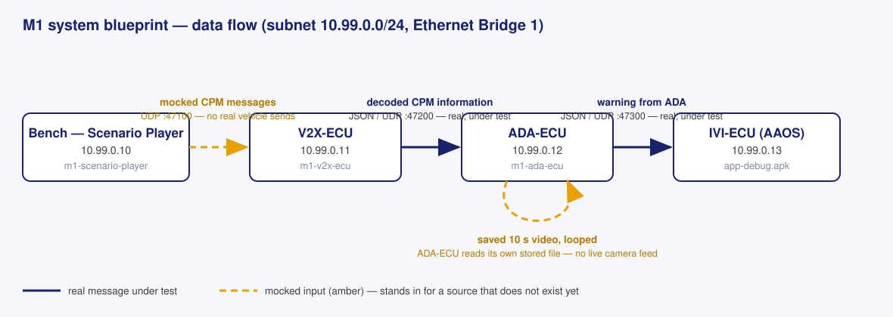
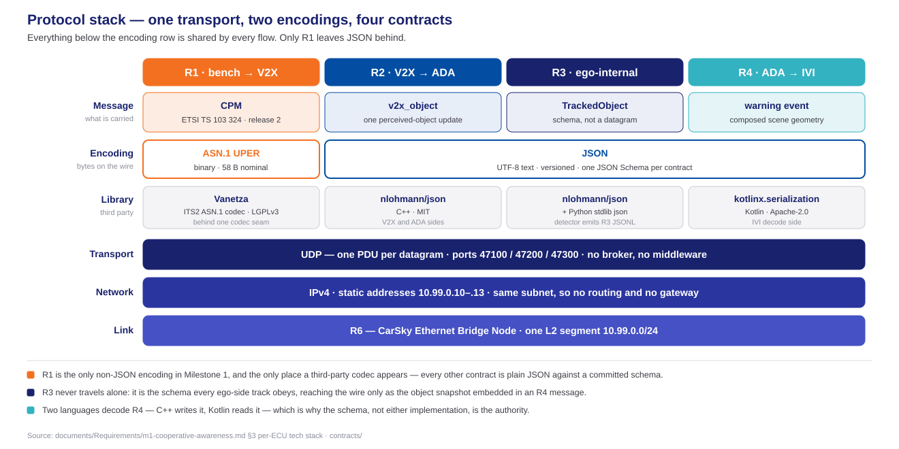
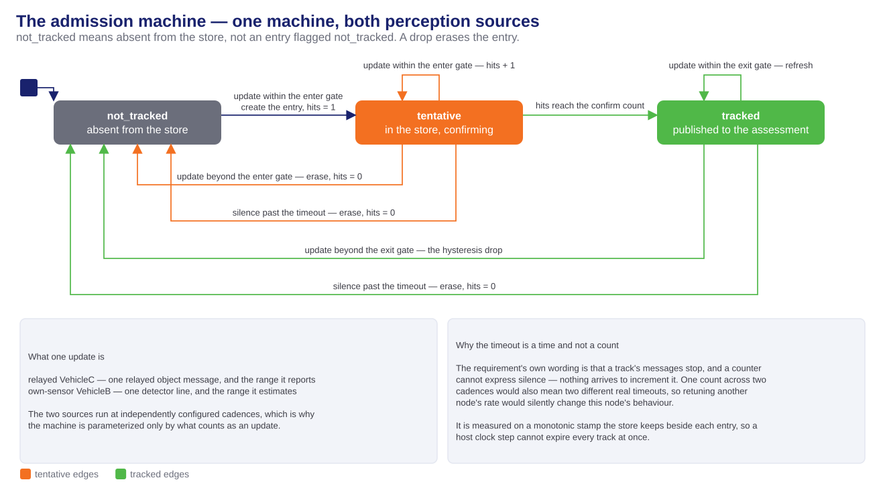

<!-- _class: lead -->
<!-- _paginate: false -->

# M1 System Design

## The blueprint, the data paths, and the algorithm

**Milestone 1 · Team KIS — FPT Hackathon 2026**

Full document: [system-design.md](../../documents/Design/SYSTEM-DESIGN/system-design.md) · per-node HLDs: [Module Design](../../documents/Design/MODULE-DESIGN/README.md)

---

# Table of contents

1. **Introduction** — the NLOS relay mission
2. **Blueprint design** — five nodes on one Ethernet bridge
3. **Data path** — messages, golden vectors, and the video path
4. **Protocol stack** — one transport, two encodings, four contracts
5. **Algorithm** — track admission as the risk gate

---

<!-- _class: lead -->

# 01 · Introduction

---

# The NLOS relay mission

- Three vehicles in a collinear convoy: **A follows B follows C**; B blocks A's view of C.
- **B's perception of C reaches A over V2X**; A composes `d_AC ≈ d_AB + d_BC` and renders C as a ghost object from the relay alone.
- Milestone 1 builds **only vehicle A**, entirely on the CarSky cloud platform; B and C are simulated by the bench.
- One blueprint is **one car** — the ego and the bench equipment around it.

---

<!-- _class: lead -->

# 02 · Blueprint design

---

# Five nodes on one Ethernet bridge

- A star on one bridge: every role node declares exactly one `ethernet` pin; the three flows are UDP ports on the same NIC.

---

# Ethernet as the Milestone 1 network

- **Chosen for ease of implementation.**
- The bridge is a platform-native node type.
- One L2 segment, static IPv4 — no routing, no gateway, no broker.
- Every hop is a direct UDP datagram to a known peer.
- **The code is not bound to the transport.**
- Addresses and ports come from blueprint env, never hardcoded.
- Each node holds its socket in one component behind a seam.
- A new protocol replaces that component — **not the message logic**.

---

<!-- _class: lead -->

# 03 · Data path

---

# The message path

| Message | Direction | Purpose |
| --- | --- | --- |
| **R1 — CPM** | Bench → V2X-ECU (`:47100`) | The mocked stream a real radio would deliver — perceived vehicle C |
| **R2 — decoded CPM information** | V2X-ECU → ADA-ECU (`:47200`) | One perceived-object update, after decode · validate · dedupe |
| **R3 — tracked object** | ADA-ECU internal | Feeds store, admission and risk; on the wire only inside R4 |
| **R4 — warning from ADA** | ADA-ECU → IVI-ECU (`:47300`) | The scene geometry and risk state the HMI renders |

- One UDP datagram per wire message.
- R1 is the only mocked wire source.

---

# Golden vectors

- Each vector is a **pair of two files**: `<case>.json` the content, `<case>.uper` the frozen wire bytes.
- Encoder and decoder test against the **same pairs** — the R1 wire format cannot drift.

| Vector | Pair | Exercises |
| --- | --- | --- |
| `nominal` | `.json` · `.uper` | The committed happy path |
| `gate-boundary` | `.json` · `.uper` | The admission-gate boundary — exactly 30.00 m |
| `coord-large` | `.json` · `.uper` | Coordinate bounds, datagram size budget |
| `mdt-min` / `mdt-max` | `.json` · `.uper` each | Measurement-delta-time bounds |
| `conf-unavailable` | `.json` · `.uper` | The unavailable-confidence mapping |

- Embedded in each CPM: sender reference position and time, station id, one perceived object.

---

# Video path — no live feed

- Live camera bring-up is a **frozen scope boundary**: the ego video is a saved 10 s clip **built into the ADA image**, looped at runtime.
- Video never crosses the network — the amber loop is a file read inside the node.

---

# Tracked objects on the wire

- Obstructed-object information travels as **tracked-object data inside messages over Ethernet** — the object snapshot embedded in each warning.

---

<!-- _class: lead -->

# 04 · Protocol stack

---

# One transport, two encodings

- Below the encoding row everything is shared: UDP one-message-per-datagram over static same-subnet IPv4 on one bridged L2 segment.
- The CPM is the only binary encoding (ASN.1 UPER, ETSI TS 103 324) and the only third-party codec; every other contract is versioned JSON against a committed schema.

---

<!-- _class: lead -->

# 05 · Algorithm

---

# Track admission as the risk gate

- One machine for both perception sources — relayed C and own-sensor B — parameterized only by what counts as an update.
- Distance gates with **hysteresis** (enter 30 m, exit 35 m) and a **monotonic silence timeout**; only a `tracked` entry is published to the risk assessment.
- **Vehicle variable speed is not used now** — the criterion is fixed distance; speed scaling is a registered future development.

---

<!-- _class: lead -->

# Thank you

Team KIS · Cooperative Awareness System · full document: system-design.md
