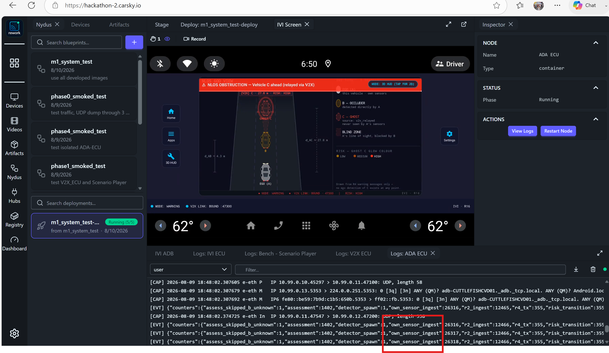
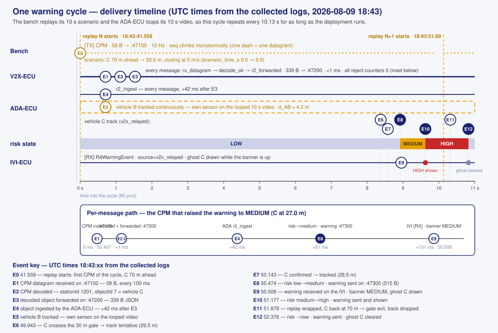

# M1 System Delivery — Acceptance Evidence

> The system-level delivery report for Milestone 1: what was deployed, on what resources, and the evidence that the full chain works. Abridged presentation: [phase6-system-delivery-deck.md](../../../presentation/phase6-systemIntegration/phase6-system-delivery-deck.md). How to reproduce every evidence item: [Test-Guides](../Test-Guides/README.md).

## Introduction

The system makes a vehicle aware of a hazard it cannot see by relaying another vehicle's perception. Milestone 1 implements one scenario, entirely on the CarSky cloud platform: three vehicles drive in a collinear convoy — A follows B follows C. A's view of C is blocked by B, so A's own camera can never detect C. B detects C and broadcasts that perception over V2X. A renders C as a ghost object with its relative position, sourced from the relay alone. M1 builds only vehicle A; B and C are simulated by the bench. Full scope and requirements: [m1-cooperative-awareness.md](../../Requirements/m1-cooperative-awareness.md).

| Field | Value |
|---|---|
| Team ID | KIS |
| Lead | Pham Ngoc Minh — mnpham1986@gmail.com |
| Solution name | Cooperative Awareness System |
| Reported version | Milestone 1 (Tag: V2.0 M1 Round2) |
| Evidence folder | `documents/Delivery/Acceptance/` |

The evidence folder is read in two steps:

1. **System evidence is reported in this page** — the screenshots in this folder and the § System test evidence sections that explain each one.
2. **Supporting guides to reproduce the evidence and collaborate** — [Test-Guides](../Test-Guides/README.md): [apk-deploy.md](../Test-Guides/apk-deploy.md) installs the IVI app, [testing-guide.md](../Test-Guides/testing-guide.md) drives a run and collects its logs, screen captures and pcaps.

## System Under Test

The System Under Test (SDT) is a complete five-node blueprint — three ECUs, a supporting Scenario Player bench, and the Ethernet bridge joining them. The bench generates V2X messages as if received from another vehicle *in the same lane*, *directly in front*.

| Node | Responsibility | Input | Output |
|---|---|---|---|
| Bench — Scenario Player | Emulates the V2X modem's connection point; plays the scenario that describes vehicle C | Scenario configuration file — nothing on the wire | Mocked CPM messages (UDP `:47100`) |
| V2X-ECU | Receives CPM messages, decodes, validates and dedupes them, forwards the result | CPM messages from the bench | Decoded CPM information (JSON, UDP `:47200`) |
| ADA-ECU | Fuses decoded CPM information with own-sensor detections of B, assesses collision risk, warns the IVI | Decoded CPM information; its own saved 10 s ego video, looped | Warning from ADA (JSON, UDP `:47300`) |
| IVI-ECU | Renders the driver warning: the God View with ego A, occluder B and ghost C | Warning from ADA | Warning screen — nothing on the wire |

Design details: [System Design](../../Design/SYSTEM-DESIGN/system-design.md) for the blueprint as a whole, [Module Design](../../Design/MODULE-DESIGN/README.md) for each node's HLD.

Two inputs are mocked, drawn amber above:

- **The CPM messages** — there is no vehicle sending them; the bench generates the stream that a real V2X radio would receive.
- **The video feed** — there is no live camera; the ADA-ECU reads a saved video stored inside its own image and loops it.

The real messages under test are **V2X-ECU → ADA-ECU** and **ADA-ECU → IVI-ECU**.

## Resources

The following section explain CarSky platform's resources that SDT utilize to deploy and proves that system works 

### Baseline resources

The CarSky platform provide resources the deployment stands on — provided by the organizers, not built by the team.

| Resource | What it is |
|---|---|
| KIS device | The team's device entry in the CarSky **Devices** panel; hosts the widgets bound to a deployment |
| IVI Screen widget | Screen-type widget rendering the AAOS guest's framebuffer live — the warning-screen evidence surface, with built-in recording |
| IVI ADB widget | ADB-type widget; its **Local ADB** tunnel is the path for APK install and `logcat` collection |
| AAOS image | The starter-pack `ANDROID_IMAGE` artifact, version `0.0.1`, arch `aarch64` — the guest the IVI app runs on |
| Skycraft node | CarSky VM node type; runs the AAOS guest (IVI-ECU) |
| Container node | CarSky container node type; runs the registry images (bench, V2X-ECU, ADA-ECU) |
| Ethernet bridge | Node type `eth-bridge`, `bridgeMode: linux`, subnet `10.99.0.0/24`; every node's `eth` pin wires to it in a star |

### ECU Images and APK

The IVI APK alone does not demonstrate the system — a demo run needs every node's artifact, all retrieved from GitHub.

| Node | Image / artifact | Where to get it | How to deploy |
|---|---|---|---|
| Bench — Scenario Player | `m1-scenario-player:latest` | GitHub Actions — `scenario-player-image` lane | Detailed guide to be added later |
| V2X-ECU | `m1-v2x-ecu:latest` | GitHub Actions — `v2x-ecu-image` lane | Detailed guide to be added later |
| ADA-ECU | `m1-ada-ecu:latest` | GitHub Actions — `ada-ecu-image` lane | Detailed guide to be added later |
| IVI-ECU | `app-debug.apk` | GitHub Actions — `ivi-assemble` artifact | [apk-deploy.md](../Test-Guides/apk-deploy.md) |

### Tools

#### CI tools

Six GitHub Actions workflows, one per development phase, all carrying identical triggers — every lane runs on every push and pull request. A lane is maintained in the file of the phase that develops the node it exercises, so the file named for a phase contains that phase's work. 

The following CI lanes are all implemented and working. 

**Note**: the images being built could have unit tests. But evidence to their work are only supported by either isolated tests or system tests. Some evidence are provided in this documents. Exhashtive evidence will be completed in wikipage. 

| Workflow | Lanes | What it verifies |
|---|---|---|
| `phase0-ci.yml` | `contracts-gate` · `netcheck-image` | Byte-identity of every node-local contract copy against the master schemas; build and registry push of the `m1-netcheck:latest` smoke-test image |
| `phase1-ci.yml` | `v2x-core-build` · `v2x-comms-check` · `v2x-ecu-image` · `sp-unit-tests` · `sp-codec-helper` · `scenario-player-image` | V2X-ECU build, unit tests and golden-vector determinism; the loopback receive chain asserted with `check_v2x_log.py`; bench unit tests and the `cpm_encode` helper; build, push and smoke-run of `m1-v2x-ecu:latest` and `m1-scenario-player:latest` |
| `phase2-ci.yml` | `ada-core-build` · `ada-loopback-check` | ADA-ECU core build and unit tests; the assembled `ada_ecu` exercised in four loopback arms — admission via a mock V2X sender, detector disabled, real detector subprocess, detector smoke on synthetic frames |
| `phase3-ci.yml` | `ada-detector-wheels` · `ada-detector-tests` · `ada-detector-run` · `ada-zero-c` | Pinned detector dependencies installable for linux/arm64; the detector test suite fully unskipped; timed detector runs over the committed ego clip (emit behaviour and CPU throughput); the zero-C data-provenance gate (§ Data Provenance tool) |
| `phase4-ci.yml` | `ada-e2e-loopback` · `ada-ecu-image` · `ada-bench-image` · `ada-bench-selfcheck` | The full relay chain end-to-end in loopback, with an out-of-range negative control; build, push and in-image detector smoke of `m1-ada-ecu:latest`; build and self-check of the `m1-ada-bench:latest` mock image |
| `phase5-ci.yml` | `ivi-unit-tests` · `ivi-assemble` | IVI-ECU Gradle unit tests on a plain JVM; APK assembly, with the debug APK uploaded as the artifact installed onto the AAOS guest |

#### Utility Tools

Automation used to deploy the APK, collect logs, check them against expected results, and export the Wireshark captures. Usage details are in the [Test-Guides README](../Test-Guides/README.md) and the guides it links — each tool row is documented there, not here.

| Tool | Purpose |
|---|---|
| `INSTALL-IVI-APK.cmd` | Install the APK onto the AAOS guest and own the ADB tunnel |
| `COLLECT-LOGS.cmd` | One pass over a deployed Room: every node's log, the guest logcat, and a pass/fail summary against expected results |
| `EXTRACT-PCAP.cmd` | Turn the base64 capture blocks inside a saved node log into `.pcap` files Wireshark opens |
| `capture.sh` (inside the V2X/ADA images) | Run tcpdump in-container; emit `[CAP]` lines and the rotating pcap into the node log |
| `check_v2x_log.py` | Assert the V2X receive chain on a saved `[EVT]` stream |
| `adb logcat` | Read the IVI app's `[RX]` lines — the only surface carrying them |

#### smock tests:

- Netcheck tool, used in phase0-smoked-test

#### Isolated Tests (module tests) tools: 

Each ECU is also exercised alone, in a reduced blueprint where purpose-built mock images stand in for its neighbours and generate the traffic they would send. `COLLECT-LOGS.cmd` carries a shortcut for every blueprint below.

| Test — image under test | Mock images | Blueprint |
|---|---|---|
| Isolated V2X — `m1-v2x-ecu:latest` | `m1-scenario-player:latest` (`Scenario_Player/`) — the bench plays the CPM stream of the mocked remote vehicle | `phase1_smoked_test` |
| Isolated ADA — `m1-ada-ecu:latest` | `m1-ada-bench:latest` (`tools/ada-bench/`), deployed twice — `ROLE=v2x_mock` sends decoded CPM objects upstream of the ADA, `ROLE=ivi_mock` sinks and validates its warnings downstream | `phase4_smoked_test` |
| Isolated IVI — `app-debug.apk` on the AAOS guest | `m1-r4-sim:latest` (`IVI_ECU/mock-sender/`) — scripted ADA-ECU stand-in firing warning messages at `:47300` | `phase5_smoked_test` |

#### Data Provenance tool:

The milestone's definition of done requires that vehicle C reaches vehicle A **only** through the V2X relay — the ADA-ECU's own detector must never produce C. One tool asserts it:

| Tool | Purpose |
|---|---|
| `check_zero_c.py` (`ADA_ECU/tools/`) | Scans the detector's captured detection stream and fails on any line claiming `source: v2x_relayed`, any track id in the `v2x:` namespace, or (with `--evt`) an own-sensor detection at the range and time of a relayed C sample. A clean exit prints the examined counts, so an empty log cannot pass vacuously |
| `ada-zero-c` CI lane (`phase3-ci.yml`) | Runs the real detector over the committed ego clip in a single un-looped pass, captures its detection stream, and gates the push on `check_zero_c.py` passing |

- Evidence to Data Provenance tests will be provided later.

## System test evidence

### Types of evidence

No single surface is sufficient: the screen does not prove where the data came from, the log does not prove anything rendered, and neither proves what crossed the wire. Collection procedure per type: [testing-guide.md § Step 3](../Test-Guides/testing-guide.md#step-3--evidence-collection).

| Type | What it proves | Surface |
|---|---|---|
| Warning screen | The driver-facing rendering happened | IVI Screen widget — screenshot or recording |
| Internal log | Each node produced and consumed what it should (`[TX]`, `[RX]`, `[EVT]` counters) | Node **View Log** (containers) · `adb logcat` (IVI app) |
| Wireshark capture | What actually crossed the wire, byte-exact | pcap exported from the V2X-ECU and ADA-ECU internal logs |

### Expected evidence per node

| Node | Warning screen | Internal log | Wireshark capture |
|---|---|---|---|
| Bench — Scenario Player | — | `[TX]` lines only | — |
| V2X-ECU | — | `[EVT]` decode/forward counters, `[CAP]` lines | Exported from its log; fits the expected call flow — CPM in on `:47100`, decoded object out on `:47200` |
| ADA-ECU | — | `[EVT]` fusion/risk counters, `[CAP]` lines | Exported from its log; fits the expected call flow — object in on `:47200`, warning out on `:47300` |
| IVI-ECU | God View with ghost C | `[RX]` warning lines in the app's logcat | — |

### Evidence 1 — Warning screen and IVI log

- The banner reads **NLOS OBSTRUCTION — Vehicle C ahead (relayed via V2X)**.
- Ego A and occluder B are drawn solid; **C is drawn dashed as a ghost** with a risk glow, badge `[V2X] C · 31.3 m · RISK: MEDIUM`, and connectors `d_AB`, `d_AC`.
- The legend states C's provenance: `source: v2x_relayed — never seen by A's sensors`.
- Status bar: `MODE: WARNING`, `V2X LINK: BOUND :47300`.
- The logcat below shows `[RX] R4 message received: R4WarningEvent(…, warningType=nlos_obstruction, riskState=…)` with **riskState stepping low → medium → high** (highlighted).
- The view is drawn from warning messages only — the ego never detects C directly.

### Evidence 2 — ADA-ECU internal log

- `[EVT]` counter lines show the fusion inputs side by side: `own_sensor_ingest` (highlighted, climbing 26316 → 26318) and `r2_ingest` — decoded CPM information from the V2X-ECU.
- `own_sensor_ingest` counts detections of **vehicle B from the ADA-ECU's own sensor path** — the detector running on its stored ego video.
- The ADA-ECU **loops its 10 s saved video** to keep B detected for the whole demo; no live camera is used.
- `r4_tx` and `risk_transition` count the warnings emitted toward the IVI-ECU.
- `[CAP]` tcpdump lines show the inbound wire traffic `10.99.0.11 → 10.99.0.12:47200`.

### Evidence 3 — V2X-ECU log

- `[EVT]` counters climb in lockstep: `rx_datagram` → `decode_ok` → `r2_forwarded`, with `decode_reject: 0`, `validate_reject: 0`, `dedupe_drop: 0`.
- Every received CPM is decoded and forwarded — the receive chain the milestone depends on.
- `[CAP]` lines show both wire sides: CPM in `10.99.0.10 → 10.99.0.11:47100` (58 bytes) and decoded object out `10.99.0.11 → 10.99.0.12:47200` (339 bytes).

### Evidence 4 — Bench log

- `[TX]` lines carry a monotonically climbing `seq` and the `scenario_time_s` position, 58 bytes per CPM datagram.
- `scenario_time_s` advances through the 10 s scenario; the **bench resends the scenario cyclically**, so the message stream — and the demo — runs continuously.
- The bench is the only mocked wire source: these are the CPM messages no real vehicle exists to send.

### Evidence 5 - Wireshark logs

- Wireashark logs are to be added in future. 
- Currently timing of invoking log collecting tool `logs-collect` comes too late, and PCAP extract tool `extract-pcap`returns error [PCAP-BEGIN ...] block`

### Evidence 6 - Degraded condition

- `warningType` allows future features addition. `unknown warningType` is considered degraded; a special log must be printed **preserving the wire value** , and special logic be handled.
- the scenario is supported in isolated IVI-ECU test, but evidence not yet gathered.  

## Delivery timeline — the logs and the video

How the delivery unfolds in time: what each log timestamp means, the event sequence of one warning cycle, and how that cycle maps onto the demo video.

### The run is cyclic

- The bench replays its 10 s scenario end to end: 100 CPM datagrams at 10 Hz, `seq` climbing monotonically across replays. Vehicle C starts 70 m ahead of the sender and closes at 5 m/s to 20.5 m; the replay then wraps and C jumps back to 70 m.
- The ADA-ECU loops its 10 s saved video, so vehicle B stays detected for the whole run — and because the video is identical every loop, B's own-sensor detections repeat at the same loop positions each cycle.
- The result is one warning cycle — risk low → medium → high → reset — repeating every **10.13 s** for as long as the deployment runs. Every cycle is the same delivery, so any one cycle is representative; the timeline below is one cycle read from the collected logs.

### Log time

Each evidence surface stamps time differently:

| Surface | Timestamp | Domain |
|---|---|---|
| V2X-ECU / ADA-ECU `[EVT]` lines | `epoch_ms` · `mono_ms` | Unix milliseconds, UTC · monotonic milliseconds since node start |
| V2X-ECU / ADA-ECU `[CAP]` lines | `2026-08-09 18:43:50.407` | UTC wall clock, from tcpdump |
| IVI app logcat `[RX]` lines | `08-09 18:43:50.508` | AAOS guest clock, UTC — agrees with the container clocks to within ~35 ms |
| Bench `[TX]` lines | none — `seq` and `scenario_time_s` only | position within the replay; a datagram's wall-clock time is its `rx_datagram` stamp at the V2X-ECU |

The log set behind the timeline is one `COLLECT-LOGS` pass over the running Room ([testing-guide.md](../Test-Guides/testing-guide.md)), written to `tools/logs-collector/test-report/system-test/` — generated output, reproduced on demand rather than committed.

### One warning cycle

The diagram illustrates the arrival time of events, detected from our logs, but don't necessary from the same attached demo in this project. 

Each marked event, the log line that records it, and the message content that proves it:

| Event | UTC 18:43:xx · Δ cycle | Log marker (node) | Message on the wire | Content |
|---|---|---|---|---|
| **E0** — replay starts | 41.559 · 0.00 s | `[TX] scenario_time_s: 0.0` (bench) · `rx_datagram` (V2X) | CPM, 58 B UDP → `:47100` | ASN.1 UPER CPM: C 70 m ahead of the sender, closing 5 m/s |
| **E1** — CPM received | every 100 ms | `[EVT] rx_datagram` (V2X) | same datagram | `bytes: 58`; `rx_datagram` counter +1 |
| **E2** — CPM decoded | +0 ms after E1 | `[EVT] decode_ok` (V2X) | — internal | `stationId: 1201`, `objectId: 7` (vehicle C), position and velocity in sender coordinates; `decode_reject: 0` |
| **E3** — decoded object forwarded | +1 ms | `[EVT] r2_forwarded` (V2X) | object message, 339 B JSON → `:47200` | `type: v2x_object`, position `(27.0, 1.2)`, `speed: 5.0`, `confidence: 0.95` |
| **E4** — object ingested | +42 ms | `[EVT] r2_ingest` (ADA) | same JSON | `rx_epoch_ms` stamps arrival; `r2_ingest` counter +1 |
| **E5** — vehicle B tracked | continuous | `[EVT] track_transition … "id":"own:…","source":"own_sensor","to":"tracked"` (ADA) | — internal, from the looped video | B held at `d_AB ≈ 4.2 m`; the warning geometry's `vehicleB` comes from this track |
| **E6** — C crosses the 30 m gate | 49.943 · 8.38 s | `[EVT] track_transition … "id":"v2x:1201:7","reason":"gate_enter","to":"tentative"` (ADA) | — internal | `distance: 29.52` — first CPM position under the 30 m admission gate |
| **E7** — C confirmed tracked | 50.143 · 8.58 s | `[EVT] track_transition … "reason":"confirmed","to":"tracked"` (ADA) | — internal | `distance: 28.53`, `source: v2x_relayed` — C is now a tracked object A itself never detected |
| **E8** — risk low → medium, warning sent | 50.474 · 8.92 s | `[EVT] risk_transition` + `r4_tx` (ADA) | warning, 515 B JSON → `10.99.0.13:47300` | `riskState: medium`, `d_ac: 31.27` (= d_AB 4.24 + C's relayed offset 27.03), `ttc: 6.26 s`, geometry ego/B/C |
| **E9** — warning received on IVI | 50.508 · 8.95 s | `[RX] R4WarningEvent(…)` (IVI logcat) | same JSON | `riskState=medium`, `source=v2x_relayed` — banner up, ghost C drawn |
| **E10** — risk medium → high | 51.177 · 9.62 s | `risk_transition` + `r4_tx` (ADA) · `[RX]` (IVI) | warning → `:47300` | `d_ac: 27.78`, `ttc: 5.56 s`; `riskState=high` shown |
| **E11** — replay wraps, C leaves the gate | 51.878 · 10.32 s | `[EVT] track_transition … "reason":"gate_exit","to":"not_tracked"` (ADA) | — internal | `distance: 70.01` — C jumped back to 70 m, past the 35 m exit threshold |
| **E12** — risk reset, ghost cleared | 52.376 · 10.82 s | `risk_transition` (`no_tracked_c`) + `r4_tx` (ADA) · `[RX]` (IVI) | warning → `:47300` | `riskState: low`, `vehicleC=null` — the God View drops the ghost until the next cycle |

### Measured latencies

Read directly off the event timestamps above:

| Path | Events | Measured |
|---|---|---|
| CPM decode + forward inside the V2X-ECU | E1 → E3 | < 1 ms |
| V2X-ECU → ADA-ECU ingest | E3 → E4 | 42 ms |
| CPM arrival → warning emitted | E1 → E8 | 67 ms |
| CPM arrival → warning rendered input on the IVI | E1 → E9 | **101 ms** |
| Replay start → first warning on the IVI | E0 → E9 | 8.95 s |
| Warning cycle period | E0 → next E0 | 10.13 s |

### The video

- The recorded demo run is [`video-evidence/system-test.mp4`](../../../video-evidence/system-test.mp4) — 3 min 23 s, captured 2026-08-06 against this blueprint. It ships in the submission packet and through the organizers' demo channel; at 143 MB it is not in the git history.
- Its wall clock differs from the log set above — different run, same deployment, same 10 s scenario and looped video — so timestamps do not line up one-to-one, but **every warning cycle in the video is the E0–E12 sequence above**. Over 3 min 23 s the video spans ≈ 20 cycles.
- What to watch, per cycle: the banner appears at **MEDIUM** about 8.9 s after each replay start (E9), steps to **HIGH** ~0.7 s later (E10), and clears ~1.2 s after that when the replay wraps (E12). While the banner is up, C is the dashed ghost with `source: v2x_relayed` — the on-screen restatement that A never saw C itself.
