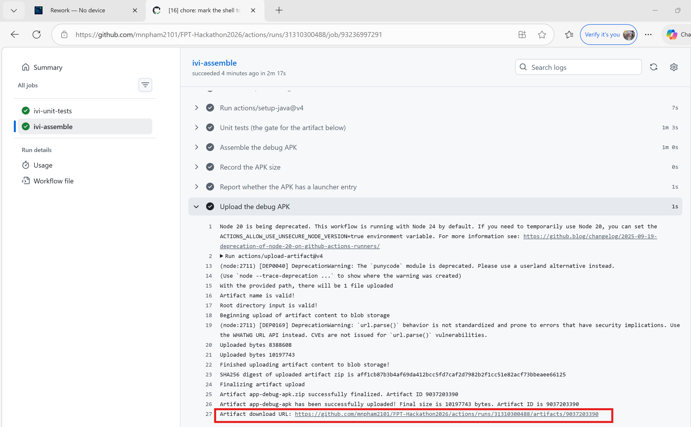
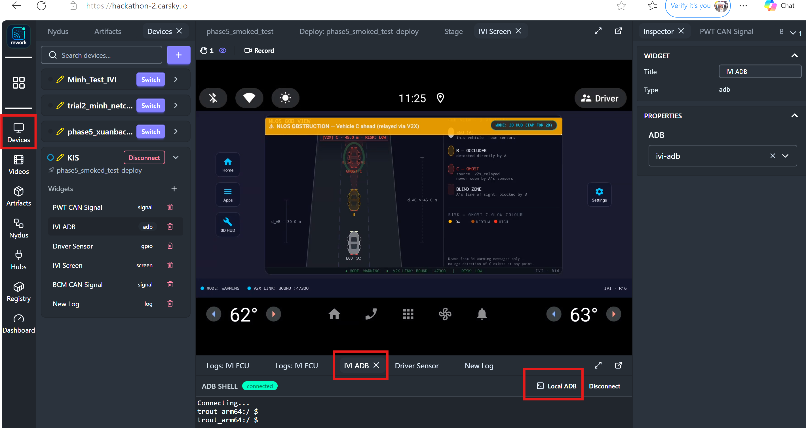

# Phase 5 — IVI HMI AAOS build & deployment

How to build the team APK, install it on the CarSky Skycraft (AAOS) node, and confirm the app is up. Driving R4 warnings at it and collecting the evidence is [testing-guide.md](testing-guide.md), a separate guide that numbers its own steps from 1. Node-level blueprint/VM config lives in [node-ivi-ecu.md](../../requirements/car-sky-guide/node-ivi-ecu.md); this note is the APK path only.

## Prerequisites

- Android SDK Platform-Tools, with `adb` on `PATH` — it installs to `%LOCALAPPDATA%\Android\Sdk\platform-tools`; add that folder to `PATH` if `adb version` does not answer
- The `reach-backend` tunnel CLI, unpacked at `tools/apk-uploader/reach_be/reach/` (organizer-supplied; git-ignored, so it will not arrive with a fresh clone)
- A CarSky workbench login
- **For Route B of Step 1 only** — JDK 17+ (the Android Studio JBR is fine) and the Gradle wrapper already in this tree (`IVI_ECU/gradlew` / `gradlew.bat`); no global Gradle install. Route A needs neither.

Working directory for the Gradle commands in Step 1 Route B: **`IVI_ECU/`**. Every PowerShell block in Steps 2–4 runs from the **repo root**.

**On Windows, run the `.cmd` wrapper, not the `.ps1` beside it.** A fresh Windows blocks `.ps1` files from running, so `.\install-ivi-apk.ps1` fails with *"running scripts is disabled on this system"*. `INSTALL-IVI-APK.cmd` carries `-ExecutionPolicy Bypass` for its own invocation and changes no machine-wide setting. To run the `.ps1` directly anyway, prefix it: `powershell -ExecutionPolicy Bypass -File .\tools\apk-uploader\install-ivi-apk.ps1`. On Linux, macOS and Git Bash run `install-ivi-apk.sh`. The same holds for the tools in [testing-guide.md](testing-guide.md).

## The automation tool

**The tool does most of Steps 3 and 4**

[INSTALL-IVI-APK.cmd](../../tools/apk-uploader/INSTALL-IVI-APK.cmd) runs 
* the whole install-and-verify chain in one window — tunnel, 
* Room-network fix, 
* install apk, 
* app-state checks, 
* evidence logcat, pass/fail table. 

To run on Windows: double-click it, or from the repo root:

```powershell
.\tools\apk-uploader\INSTALL-IVI-APK.cmd                 # install and verify
.\tools\apk-uploader\INSTALL-IVI-APK.cmd -SkipInstall    # re-sample evidence only
.\tools\apk-uploader\INSTALL-IVI-APK.cmd -KeepTunnel     # leave adb usable afterwards
```

Windows PowerShell 5.1 on any architecture: `adb` is discovered across the standard SDK locations, and the organizers' x64 tunnel CLI runs under emulation on ARM64. Options and failure modes: [tools/apk-uploader/README.md](../../tools/apk-uploader/README.md).

| Step | What happens | Who |
|---|---|---|
| 1 · Get the APK | CI download, or `assembleDebug` | **Manual** |
| 2 · Deploy the blueprint | Nodes to `Running` in the workbench | **Manual** |
| 2 · Copy the `a8k_` token | Local ADB dialog → `secrets\reach-adb-token-ivi.txt` | **Manual** |
| 3 · Open the tunnel | `reach-backend adb`, port waited on | Automated |
| 3 · Connect ADB | `adb connect`, retried while the guest boots | Automated |
| 3 · Guest preflight | API level ≥ 29, `automotive` feature | Automated |
| 3 · Room-network fix | Rename `buried_eth0` → `eth0`, set the pin address (§ Troubleshooting) | Automated |
| 3 · Install the APK | `adb install -r`, package presence confirmed | Automated |
| 4 · App state | Package, process, MainActivity resumed, focus, screen awake | Automated |
| 4 · Warning screen | Seen on the IVI Screen widget, in the browser | **Manual** |

The same run also reaches past this document: it dumps the evidence logcat that [testing-guide.md Step 3](testing-guide.md#step-3--evidence-collection) asks for, into `tools/apk-uploader/logs/`, checked for `[RX]`, provenance, `risk=high` and crashes. The recording, the screenshots and the pcap extraction there stay manual.

The manual rows are manual by nature, not by omission: minting the token needs the browser dialog, and this build logs nothing from its UI layer, so the switch to the Warning View is confirmable only on screen. The steps below remain authoritative — read them when the tool fails, and to run any row by hand.

## Step 1 — Get `app-debug.apk` into `tools/apk-uploader/`

Two routes produce the same artifact. Pick either; the chain ends at the same place — the APK sitting beside the uploader tool, which is where Step 3 reads it from.

### Route A — download the CI build

The `ivi-assemble` lane builds the APK on every push and publishes it as a run artifact. No local Android toolchain needed.

1. GitHub → the repo → **Actions**.
2. Pick the workflow **phase5-ci.yml** in the left-hand list, then the run you want (the latest green one on your branch).
3. Open the **`ivi-assemble`** job.
4. Confirm its last step, **Upload the debug APK**, succeeded — its log ends with `Artifact app-debug-apk has been successfully uploaded!` and an artifact download URL.
5. Download the artifact **`app-debug-apk`** from the run summary page (it downloads as `app-debug-apk.zip`) and unzip it. Inside is a single file, `app-debug.apk`.



The box marks the last line of **Upload the debug APK** — the confirmation sub-step 4 asks for. The two lines above it are the ones that matter: `Artifact app-debug-apk.zip successfully finalized` and `Artifact app-debug-apk has been successfully uploaded!`. Take the download from the **Summary** page in the left-hand list rather than by pasting that URL; the URL is an API endpoint, not the browser download.

The artifact name `app-debug-apk` is stable and must not be renamed — this document and the walkthrough both tell a human to fetch exactly that name.

### Route B — build locally in Android Studio / Gradle

Working directory `IVI_ECU/`:

```bash
# Linux / macOS
./gradlew assembleDebug

# Windows
gradlew.bat assembleDebug
```

In Android Studio the equivalent is **Build → Build Bundle(s) / APK(s) → Build APK(s)**. Output:

```text
IVI_ECU/app/build/outputs/apk/debug/app-debug.apk
```

Acceptance: build succeeds; APK size under 50 MB (`dir` / `ls -lh` on the path above).

### Then — copy it to the uploader folder

Whichever route produced it, put the APK at:

```text
tools/apk-uploader/app-debug.apk
```

Overwrite the copy already there. Application id: `com.hackathon.v2x.ivi`.

## Step 2 — Deploy the blueprint and copy the tunnel command (browser, human)

Everything here happens in the CarSky workbench. Nothing is run on your machine yet; this step's only output is the two commands you copy at the end, which Step 3 runs.

1. **Log in** to the CarSky workbench at `https://hackathon-2.carsky.io`.
2. **Deploy the blueprint you want to test on**, and wait for it to go **green — every node in `Running` state**. The Skycraft (IVI) node is the slowest to come up; wait for it rather than assuming it, because a tunnel started against a node that is not yet running has nothing to dial.

   > **Which blueprint?** The isolated IVI-ECU bring-up and the full system test are **different blueprints**. Deploy whichever one this run is for. This document names neither on purpose, so it does not go stale when a blueprint is renamed or replaced.

3. **Devices** → find **the device the deployed blueprint is running on** → **Connect**. The button reads **Switch** instead if another device session is already open. After connecting, the dot beside the device name is lit, the button turns into **Disconnect**, and the deployment's name appears under it.
4. **Choose the IVI ADB widget** in the panel below the Stage. The ADB SHELL panel opens with a green `connected` badge.
5. Top-right of that panel → **Local ADB**. A dialog opens showing two copyable commands. **Copy both** — they are the input to Step 3:

   ```text
   reach-backend adb --gateway https://hackathon-2.carsky.io --key a8k_…
   adb connect localhost:5555
   ```

   The first carries the gateway URL and the **per-device `a8k_` token**; the second is the port the tunnel will serve on.



The three boxes mark the three things this step depends on, in the order the sub-steps above reach them: the **Devices** rail on the far left (step 3), the **IVI ADB** tab that opens in the panel below the Stage once its widget is chosen (step 4), and **Local ADB** at that panel's top right (step 5). **Disconnect** beside the device name and the lit dot are what a connected session looks like; the ADB SHELL badge reads `connected` and the shell has reached a `trout_arm64:/ $` prompt, which is the state to capture before going further. **Disconnect** at the panel's top right re-dials the shell after a redeploy; it does not re-mint the token — the Local ADB dialog is the only place the current one is shown.

The device's **Widgets** list on the left names the widget chosen in step 4 (`IVI ADB`, type `adb`) alongside the Screen and Log widgets the testing guide collects evidence from. The Stage above already shows the app's Warning View, because this capture was taken on a Room whose chain was running — on a fresh install the Stage shows the home screen instead.

The `a8k_` token is **derived per device, not a CarSky API key**, and a redeploy mints a new one — so re-open this dialog after every redeploy instead of reusing an old value. Keep it out of the repository: paste it into `secrets/reach-adb-token-ivi.txt` (one line, no quotes; the folder is git-ignored) rather than into a command line, a log, or a document.

## Step 3 — Establish the tunnel and install the APK (local machine, two terminals)

Step 2 produced the two commands; this step runs them. The first terminal holds the tunnel open for as long as you need the guest, and the second does the install through it.

### Terminal 1 — establish the tunnel, then leave it alone

The command copied from the dialog names the CLI as bare `reach-backend`, which is not on `PATH` — type the repo's own binary by its path instead, and paste your `a8k_` token in place of the placeholder. From the repo root:

```powershell
.\tools\apk-uploader\reach_be\reach\reach-backend.exe adb --gateway https://hackathon-2.carsky.io --key a8k_PASTE_YOUR_TOKEN_HERE --port 5555
```

`reach-backend.exe` is the Windows build; `reach-backend` beside it is the macOS/Linux one.

This opens a local TCP server on `localhost:5555`. **Leave this terminal open** — closing it drops the tunnel and every later command fails. If it exits immediately, it is one of three things: the token is stale (redeploy → re-copy it from the Local ADB dialog), the gateway URL is wrong, or port 5555 is already taken (pass a different `--port` here and use that same port below).

### Terminal 2 — connect and install

Every `adb` command in this document assumes `adb` is on `PATH`. If it is not, add `%LOCALAPPDATA%\Android\Sdk\platform-tools` to your `PATH` once and open a fresh terminal; the commands below then work exactly as typed.

```powershell
adb connect localhost:5555
adb devices
adb install -r .\tools\apk-uploader\app-debug.apk
adb shell pm list packages
```

Expected, in order: `connected to localhost:5555`; a `localhost:5555   device` row; `Success`; and `package:com.hackathon.v2x.ivi` somewhere in the package list. `-r` reinstalls over an existing copy and keeps its data — use it on every reinstall.

If `adb devices` shows `offline` or nothing at all, the tunnel in Terminal 1 is not serving. Do not retry the install blind — check that terminal is still alive and its blueprint still `Running`, restart it, then reconnect.

## Step 4 — Confirm the app on screen (browser, human)

**The app launches itself.** Once the blueprint is correctly deployed and the APK is installed, it comes up on the guest with no `am start` and no tap — [AndroidManifest.xml](../../IVI_ECU/app/src/main/AndroidManifest.xml) declares `MainActivity` as the only `MAIN`/`LAUNCHER` activity on the node. An app that has to be started by hand is a finding: either the install did not take, or the guest is not the node you think it is.

So the deployment is confirmed by looking at it, not by a log line — this build writes nothing from its UI layer, which is why this step is manual and cannot be automated away. Back in the workbench:

1. **Devices** → the device the blueprint is deployed on → **Connect** (**Switch** if another session is open). This is the same device you connected in Step 2, and the session may still be open from it.
2. **Choose the IVI Screen widget** — the `screen`-type widget in that device's Widgets list. It opens on the Stage, showing the guest's framebuffer live.
3. **Observe the screen.** Pass is the app's own UI: the Display Area with its side buttons and the status bar reading `V2X LINK: BOUND :47300`. With a producer already streaming, the Warning View is up and ghost C is drawn.

What each outcome means:

| What the Stage shows | What it means |
|---|---|
| The app's Display Area and status bar | Installed and running — Step 4 passes |
| The AAOS home screen or launcher | The install did not take, or this is not the node you installed onto — re-run Step 3 and check `adb shell pm list packages` |
| A black or frozen frame | The guest has not finished booting, or the Screen widget is bound to a part that no longer exists — re-point it at this deployment's part |
| The app, but the status bar shows no bound port | The app is up and its listener is not — read `R4ListenerService` in logcat for the bind failure |
| The app with a bound port, but never a warning | Installed correctly; nothing is producing R4 yet. That is [testing-guide.md](testing-guide.md)'s subject, unless the guest never took its pin address — [§ Troubleshooting](#troubleshooting) |

The status bar reading `BOUND :47300` is the app's own claim, not proof a datagram ever arrived — that is [testing-guide.md Step 3](testing-guide.md#step-3--evidence-collection)'s job. This step goes no further than *the app is up and drawing*.

Capturing what is on the screen — recording, screenshots, and the full list of elements a warning frame must show — is [testing-guide.md § 1 · Warning screen](testing-guide.md#1--warning-screen). Set **Recorder Part** on this widget *before* the run you intend to keep, or there is nothing to save afterwards.

## Troubleshooting

### No R4 message reaches the IVI application

**Issue.** The app is installed and running, logcat carries `R4ListenerService: UDP socket open on port 47300`, the producer logs `[TX] … -> 10.99.0.13:47300` at its cadence — and no `[RX]` ever appears. `/proc/net/udp6` shows the socket bound on `B8C4` with `rx_queue` and `drops` both frozen at zero, so nothing is arriving rather than arriving and being mishandled.

**Explanation.** The guest brings its bridge NIC up as `buried_eth0`. AAOS `EthernetTracker` matches interfaces on the `eth<n>` name, so netd never adopts this one, never creates its network, and it never takes the node's `ethernet` pin address. `ip -4 addr` in the guest shows only cuttlefish NAT addresses (`10.0.2.x`) and no `10.99.0.13`, so datagrams addressed to the pin are dropped before the guest sees them. The app is not at fault and no app change fixes it.

**Fix.** Rename the NIC, then give it the pin address — as root over the ADB tunnel:

```powershell
adb shell "su 0 sh -c 'ip link set buried_eth0 down; ip link set buried_eth0 name eth0; ip link set eth0 up'"
adb shell "su 0 ifconfig eth0 10.99.0.13/24 up"
```

- **Chain the three link commands in one shell.** Run separately, an interrupted call leaves the NIC down and the guest unreachable on the bridge.
- **netd does the rest.** It adopts `eth0` on the rename and creates the routing table and policy rules itself, so `ip route add … table eth0` answers `File exists` — the healthy result, not an error. No default route is needed while the producer is on-subnet.
- **Confirm:** `ip -4 addr show eth0` reads `10.99.0.13/24`, then `[RX]` lines appear within one producer cycle.
- **Renaming does not drop ADB** on this guest, because adbd is on vsock rather than TCP over that NIC. On an unfamiliar guest, check first: `cat /proc/net/tcp` must show no listener on `15B3` (5555).

**Scope.** A live mutation of the running guest. It does **not** survive a guest reboot or a redeploy — re-apply after either. [INSTALL-IVI-APK.cmd](../../tools/apk-uploader/INSTALL-IVI-APK.cmd) applies it automatically and idempotently on every run.

## Verification checklist

Every row here holds on both test paths, because nothing in Steps 1–4 differs between them. What the app then does with a warning stream is checked in [testing-guide.md § Verification checklist](testing-guide.md#verification-checklist); a failure below invalidates all of it, so clear this table first.

| Check | Pass criteria |
|---|---|
| APK obtained | CI artifact `app-debug-apk` downloaded, or `assembleDebug` exits 0 |
| APK size | `app-debug.apk` &lt; 50 MB |
| Blueprint green | Every node in `Running` before the tunnel is started |
| ADB connected | `adb devices` shows `localhost:5555   device` |
| Install | `adb install -r …` prints `Success`, package `com.hackathon.v2x.ivi` listed |
| Launch | App is up on the AAOS guest without being started by hand; no `FATAL EXCEPTION` in logcat |
| Layout | On the IVI Screen widget: Display Area + side buttons + status bar visible (R16) |
| Guest address | `ip -4 addr show eth0` reads `10.99.0.13/24` — otherwise § Troubleshooting |

