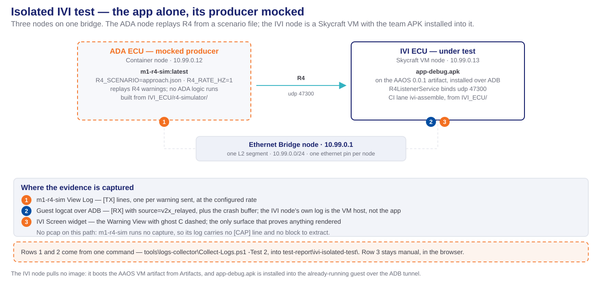
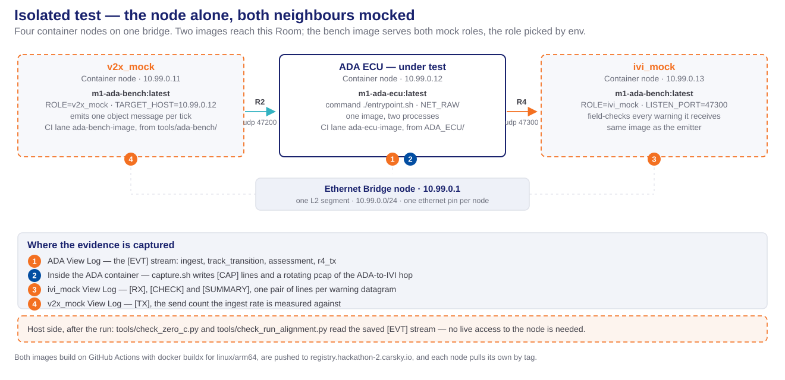
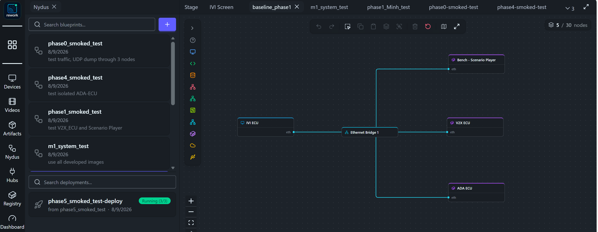
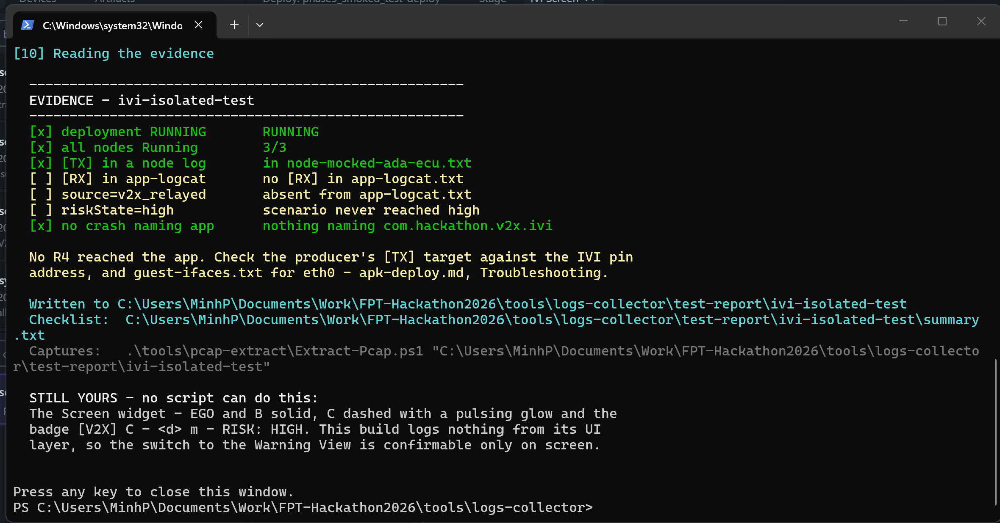

# Phase 5 — IVI HMI test & evidence

How to drive R4 warnings at the installed app and collect the evidence that closes the requirement. It picks up from [apk-deploy.md](apk-deploy.md), which builds the APK, opens the ADB tunnel, installs it and confirms the app is up — do that one first. **Each guide numbers its own steps from 1**, so a step number below always means a step of this document.

## Prerequisites

- A Room deployed green, with `app-debug.apk` installed and the app confirmed on screen — all of [apk-deploy.md](apk-deploy.md)
- For anything that runs `adb`: the tunnel still serving on `localhost:5555` — [apk-deploy.md Step 3, Terminal 1](apk-deploy.md#terminal-1--establish-the-tunnel-then-leave-it-alone), or `INSTALL-IVI-APK.cmd -KeepTunnel`
- A CarSky workbench login for the browser-only surfaces — the Screen widget, the Log widget, node logs

Every PowerShell block below runs from the **repo root**.

**On Windows, run the `.cmd` wrapper, not the `.ps1` beside it.** A fresh Windows blocks `.ps1` files from running, so `.\Collect-Logs.ps1` fails with *"running scripts is disabled on this system"*. Each wrapper — `INSTALL-IVI-APK.cmd`, `COLLECT-LOGS.cmd`, `EXTRACT-PCAP.cmd` — carries `-ExecutionPolicy Bypass` for its own invocation and changes no machine-wide setting. To run a `.ps1` directly anyway, prefix it: `powershell -ExecutionPolicy Bypass -File .\tools\logs-collector\Collect-Logs.ps1`. On Linux, macOS and Git Bash run the `.sh` of the same name.

## The automation tool

Two tools cover most of Step 3. [INSTALL-IVI-APK.cmd](../../tools/apk-uploader/INSTALL-IVI-APK.cmd) samples the evidence logcat as the tail of its install run, and `-SkipInstall` re-samples it without touching the Room. [COLLECT-LOGS.cmd](../../tools/logs-collector/COLLECT-LOGS.cmd) collects the whole set in one pass — every container node's log over REST, the guest-side logs over ADB, and a plain-text `summary.txt` of the checks below — resolving the node keys itself instead of asking you to paste them. Which rows stay manual, and why: [apk-deploy.md § The automation tool](apk-deploy.md#the-automation-tool). The steps below stay authoritative — read them when a tool fails, and to run any row by hand.

### Every tool that pulls a log or a pcap

The **Images** column is what each tool has anything to say about — a tool absent from an image's row cannot produce evidence for it. Names are image names only; every one resolves to `registry.hackathon-2.carsky.io/<name>:latest`, except `app-debug.apk`, which is an APK installed into the AAOS guest and never enters the registry.

| Tool name | Purpose | Export log location | Images |
|---|---|---|---|
| [INSTALL-IVI-APK.cmd](../../tools/apk-uploader/INSTALL-IVI-APK.cmd) (`install-ivi-apk.ps1` / `.sh`) | Installs the APK, then dumps the app's tagged logcat as the tail of its own run. Also owns the ADB tunnel every guest-side tool needs | `tools/apk-uploader/logs/` | `app-debug.apk` |
| [COLLECT-LOGS.cmd](../../tools/logs-collector/COLLECT-LOGS.cmd) (`Collect-Logs.ps1` / `collect-logs.sh`) | One pass over a whole Room: every node's log over REST whatever the node is, and — where the Room has a Skycraft VM — the guest's logcat, crash buffer, sockets and interfaces over ADB | `test-report/<run>/`, one file per node | any deployed blueprint: `app-debug.apk`, `m1-r4-sim`, `m1-ada-ecu`, `m1-v2x-ecu`, `m1-scenario-player`, `m1-ada-bench`, `m1-netcheck` |
| `capture.sh` — inside the image, not run by hand | Runs tcpdump in the container: `[CAP]` lines for the live "traffic is flowing" check, and a rotating pcap emitted to stdout as base64 between `[PCAP-BEGIN]` / `[PCAP-END]` | The node's own **View Log**, `user` stream — the log is a container's only egress | pcap **and** `[CAP]`: `m1-v2x-ecu`, `m1-ada-ecu` · `[CAP]` only: `m1-ada-bench`, `m1-netcheck` |
| [EXTRACT-PCAP.cmd](../../tools/pcap-extract/EXTRACT-PCAP.cmd) (`Extract-Pcap.ps1` / `extract_pcap.sh`) | Turns the base64 blocks inside a saved node log into `.pcap` files Wireshark can open | Beside the input log, or `-OutDir` | `m1-v2x-ecu`, `m1-ada-ecu` |
| `adb logcat` — by hand, over the tunnel | The only place the IVI app's `[RX]` lines exist; the IVI node's REST log is the Skycraft VM host, not the app | Wherever you redirect it (§ Step 3) | `app-debug.apk` |
| [check_v2x_log.py](../../tools/comms_check/check_v2x_log.py) | Asserts the receive chain on a saved `[EVT]` stream — `rx_datagram` → `decode_ok` → `r2_forwarded` — and exits non-zero naming the first missing link | Reads a log, writes none; the exit status is the result | `m1-v2x-ecu` |

Four consequences worth reading off that table before planning a run.

- **The ADB tunnel gates everything read out of the guest, and `[RX]` lives only there.** Node logs come over REST and need no tunnel; `app-logcat.txt`, `app-crash.txt`, `guest-udp6.txt` and `guest-ifaces.txt` come over ADB and are skipped without one — reported, not failed, so a run with no tunnel still exits 0 and looks complete. Since `[RX]` exists nowhere but `app-logcat.txt`, **collect with the tunnel up or the run proves nothing about the app.** `INSTALL-IVI-APK.cmd` holds the tunnel open until you close its window, so collect from a second terminal while it is up; `-KeepTunnel` leaves it up afterwards and `-CloseTunnel` shuts it immediately.

- **Only `m1-v2x-ecu` and `m1-ada-ecu` carry a pcap.** The other images print `[CAP]` lines or nothing at all, so a path built from them has no block to extract and Wireshark evidence is simply unavailable on it.
- **`m1-r4-sim` has no CI lane.** Unlike the five images above it, nothing in `.github/workflows/` builds or pushes it, so it has to be built and pushed by hand before an isolated IVI run can pull it.
- **The collector reads the Room, not a script constant.** `-Test 1`–`5` are shortcuts for the blueprints below; `-Blueprint <name>` collects any other. Either way the node list decides what is collected, so a blueprint the script has never heard of works as long as it is deployed.

### What an isolated test looks like



The rectangles are the Room's nodes and the bold line inside each is the image it runs — `m1-r4-sim` on the stand-in, `app-debug.apk` on the node under test. Dashed orange is mocked, solid navy is the thing being tested, and that convention holds across every isolated-test diagram in this folder. The numbered badges tie a node to the evidence surface it produces, which is the panel below; note that badge 2 comes off ADB rather than off the node's own log, because the IVI node's REST log belongs to the VM host.

Non-IVI nodes are tested the same way — the node alone, its neighbours replaced by mocks on the same bridge:



Two differences are worth the comparison. The ADA path mocks **both** neighbours, from a single image whose role is picked by env, where the IVI path needs only an upstream producer. And its node under test carries `NET_RAW` and `capture.sh`, so it has the pcap the IVI path does not.

## Available blueprints

One blueprint per node under test, plus the full chain. Each isolated blueprint follows the shape of the two diagrams above — the node under test, its neighbours replaced by mocks, everything on one Ethernet bridge — so picking a blueprint is picking which node is real.

**Blueprint names are underscore-separated**, and the deployment CarSky builds from one takes the blueprint's name with a `-deploy` suffix. Deploying `phase5_smoked_test` gives you the Room `phase5_smoked_test-deploy`; that derived name is what the REST API and the log collector look for, so neither is ever typed by hand.

The last column is a shortcut number, not a limit. **Any deployed blueprint can be collected by name**, whether or not it appears in this table:

```powershell
.\tools\logs-collector\COLLECT-LOGS.cmd -Blueprint phase4_smoked_test   # same as -Test 3
.\tools\logs-collector\COLLECT-LOGS.cmd -Blueprint <any_deployed_name>  # no shortcut needed
```

The collector reads the Room's node list and collects every node in it, so what it can reach is decided by what is deployed rather than by anything written into the script. Where the Room has no Skycraft VM — every row below except phases 5 and the system test — the guest-side files are not attempted and their evidence rows read `[-]`, absent rather than failed.

| Blueprint | What it tests | Node under test | Supporting images | `Collect-Logs -Test` |
|---|---|---|---|---|
| `phase0_smoked_test` | "test traffic, UDP dump through 3 nodes" — the platform baseline, before any of our code | none | `m1-netcheck` ×3 | `5` · netcheck-test |
| `phase1_smoked_test` | "test V2X_ECU and Scenario Player" | V2X ECU (`m1-v2x-ecu`) | `m1-scenario-player` | `4` · v2x-isolated-test |
| `phase4_smoked_test` | "test isolated ADA-ECU" | ADA ECU (`m1-ada-ecu`) | `m1-ada-bench`, once per mocked side | `3` · ada-isolated-test |
| `phase5_smoked_test` | The isolated IVI test of Step 2 Path 1 | IVI ECU (`app-debug.apk`) | `m1-r4-sim` | `2` · ivi-isolated-test |
| `m1_system_test` | "use all developed images" — the whole chain, the milestone's definition of done | none; the chain itself is the subject | `m1-scenario-player`, `m1-v2x-ecu`, `m1-ada-ecu`, `app-debug.apk` | `1` · system-test |



The left pane is the blueprint list and the pane under it is **Deployments** — a blueprint is a definition, a deployment is a Room built from one, and only the second has logs. `phase5_smoked_test-deploy`, `from phase5_smoked_test`, is that suffix rule in the UI; its `Running (3/3)` badge is three of three nodes up, the green the prerequisites ask for. The canvas on the right is one blueprint opened for editing: five nodes, each with an `eth` pin wired to **Ethernet Bridge 1**, which is the topology every row above shares. The blueprint list is scrolled — `phase5_smoked_test` sits outside the visible window and is named by its deployment card.

> The tabs along the top of the canvas are open editors and still carry older labels. The **list pane on the left is the authority** on what a blueprint is called.

## Step 1 — Choose a test path

The two paths differ only in **what produces the R4 warning stream**. The app, the install and the evidence are identical across both, so they are listed in the order you would run them — the second adds real components upstream of the app.

| Path | What produces the R4 stream | What it proves that the other cannot |
|---|---|---|
| **Isolated test** | the images to be tested and other images serving as mocked ECU | The node under tests performs expected behavior or note |
| **System test** | The full chain — bench → V2X ECU → ADA ECU | That ghost C on the screen came from a relayed detection, which is the milestone's definition of done |

> **Addresses are the same in both**, because every path is derived from the same subnet: bridge `10.99.0.1/24`, bench `10.99.0.10`, V2X `10.99.0.11`, ADA (or whatever stands in for it) `10.99.0.12`, IVI `10.99.0.13`. The IVI node's own config never changes between paths — same address, same pin, same `image` block.

## Step 2 — Deploy and run the path you chose

Follow one of the two sections below, not both. Each gives the Room's nodes with the config every node needs, then the order to bring them up in. Step 3 is the same either way.

### Path 1 — Isolated test

**Isolated IVI test guide** serves as guide for all other isolated test.

**Topology**: Three nodes. The bench and V2X nodes contribute nothing to display work, and every node removed is one fewer image that can fail to pull while the Skycraft guest — always the slowest to reach `Running` — is still booting.

| Node name | Image to deploy | Its config |
|---|---|---|
| **Ethernet Bridge** | — (node type `eth-bridge`, no image) | `bridgeMode: linux`, `subnet: 10.99.0.0/24` |
| **ADA ECU** (simulator standing in) | `registry.hackathon-2.carsky.io/m1-r4-sim:latest` | `command: ["./entrypoint.sh"]` · `IVI_ECU_HOST=10.99.0.13`, `IVI_ECU_PORT=47300`, `R4_SCENARIO=/app/scenarios/approach.json`, `R4_RATE_HZ=1`, `START_DELAY_S=20` · pin `10.99.0.12` |
| **IVI ECU** | The AAOS VM artifact — **Artifacts → AAOS**, version `0.0.1`, `arch aarch64`; no registry pull | `prefix: ivi`, `displayWidth: 1920`, `displayHeight: 1080`, `gpuBackend: virglrenderer` · pin `10.99.0.13` |

`START_DELAY_S=20` exists so the simulator is not already mid-stream when the guest finishes booting.

The following diagram illustrates blueprint for Isolated IVI-ECU test:


The following diagram illustrates blueprint for Isolated ADA-ECU test:

**Steps to deploy:**

1. Deploy the blueprint **`<blueprint name>`** — it carries the three nodes above with their `ethernet` pins already wired to the bridge.
2. Confirm the ADA node carries the simulator image and the env of the table above. Nothing about the IVI node changes between this path and Path 2.
3. Wait for all three nodes green, then run [apk-deploy.md Steps 2–4](apk-deploy.md#step-2--deploy-the-blueprint-and-copy-the-tunnel-command-browser-human) to install the APK and confirm it is up.
4. Swap `R4_SCENARIO` to `/app/scenarios/degrade.json` and redeploy that node to exercise the degraded cases: an unknown `warningType` with `schemaVersion: 2` must render a generic warning while **preserving the wire value** in the log; an `object.source: "own_sensor"` message must **trip** the provenance guard into a yellow `[? UNKNOWN SOURCE]` marker — on that scenario the trip is the pass; a raw non-JSON step must be dropped with the next valid warning still rendering.

### Path 2 — System test

The full five-node blueprint — the chain the milestone is judged on.

| Node name | Image to deploy | Its config |
|---|---|---|
| **Ethernet Bridge** | — (node type `eth-bridge`, no image) | `bridgeMode: linux`, `subnet: 10.99.0.0/24` |
| **Bench — Scenario Player** | `registry.hackathon-2.carsky.io/m1-scenario-player:latest` | `command: ["python", "main.py"]` · `SCENARIO_CONFIG=/app/scenarios/default.yaml`, `V2X_ECU_HOST=10.99.0.11`, `V2X_ECU_PORT=47100` · pin `10.99.0.10` |
| **V2X ECU** | `registry.hackathon-2.carsky.io/m1-v2x-ecu:latest` | `command: ["./v2x_ecu"]` · `LISTEN_PORT=47100`, `ADA_ECU_HOST=10.99.0.12`, `ADA_ECU_PORT=47200` · `capabilities: ["NET_RAW"]` for capture · pin `10.99.0.11` |
| **ADA ECU** | `registry.hackathon-2.carsky.io/m1-ada-ecu:latest` | `command: ["./ada_ecu"]` · `V2X_LISTEN_PORT=47200`, `IVI_ECU_HOST=10.99.0.13`, `IVI_ECU_PORT=47300`, `GATE_ENTER_M=30`, `GATE_EXIT_M=35` · pin `10.99.0.12` |
| **IVI ECU** | The AAOS VM artifact — **Artifacts → AAOS**, version `0.0.1`, `arch aarch64`; no registry pull | `prefix: ivi`, `displayWidth: 1920`, `displayHeight: 1080`, `gpuBackend: virglrenderer` · pin `10.99.0.13` |

The IVI row is byte-identical to Path 1's. That is deliberate: converging from the isolated Room to this one is an image swap on the ADA node, never an IVI config edit.

**Steps to deploy:**

1. Confirm all four container images are actually in the registry — not merely that their CI lanes were green.
2. Create the blueprint by cloning one that already has pins. If you import the five nodes from JSON instead, expect to add **all five ethernet pins and their edges to the bridge by hand**, and to fill in the Skycraft `image` block, which import usually drops.
3. Deploy and wait for every node green. The Skycraft node is last.
4. Run [apk-deploy.md Steps 2–4](apk-deploy.md#step-2--deploy-the-blueprint-and-copy-the-tunnel-command-browser-human) to install the APK and confirm it is up.
5. Restart the Bench node to replay the scenario from its first step.

Pass is the whole chain: the bench emits CPMs, the V2X ECU decodes and relays, the ADA ECU gates and emits a warning, and the app draws ghost C — with **zero direct detections of C on the ego vehicle**, every rendered frame sourced from `v2x_relayed`.

## Step 3 — Evidence collection

Both paths converge here — the evidence is the same regardless of what produced the stream, and no single surface is sufficient on its own. The screen does not prove where the data came from, the log does not prove anything rendered, and neither proves what actually crossed the wire.

### 1 · Warning screen

[apk-deploy.md Step 4](apk-deploy.md#step-4--confirm-the-app-on-screen-browser-human) already put the Warning View in front of you on the **IVI Screen** widget. This section is about capturing it rather than finding it.

- **Screen recording** — set **Recorder Part** on the Screen widget *before* the run starts; the clip lands under **Videos** and downloads as `.mp4`. Recording is at native resolution, so files are large.
- **Screenshots** — from the same Screen widget.
- What must be visible: `EGO` and `B` drawn solid, **C dashed** with a pulsing risk glow and the badge `[V2X] C · <d> m · RISK: HIGH`, and the connector labels `d_AB` and `d_AC`. A yellow `[? UNKNOWN SOURCE]` marker where ghost C belongs means the provenance guard tripped — on the approach scenario that is a blocking defect, not a display quirk.

### 2 · Logs

Two surfaces, both required — one for the producer, one for the app.

| Surface | How to read it | What it carries |
|---|---|---|
| **Node log** (the sending container) | Deployment Viewer → the node → **View Log** | `[TX]` lines from the producer, and `[CAP]` tcpdump lines on nodes that have `NET_RAW` |
| **Guest logcat** (the app) | The **Log** widget, or `adb logcat` over the tunnel | `[RX]` and `[DROP]` on `IVI_V2X`; the bind line on `R4ListenerService` |

Two ways to get them. Path 1 needs only a browser; Path 2 needs the tunnel and collects more.

#### Path 1 — copy and paste nodes logs directly from the CarSky platform

| Surface | Where |
|---|---|
| Producer node | **Nydus** → the deployment → the node → **View Log** → the `user` stream |
| Guest logcat | **Devices** → the device → the **Log** widget, bound to the IVI node's part |

Select all → copy → paste into a text file under `tools\apk-uploader\test-report\<isolated|system>\`, one file per node. Name them however you like, then read them against § What the logs must show.

- Pick the **`user`** stream. `sidecar` carries the platform's own connection chatter, not the application's output.
- A Log widget bound to a part that no longer exists in the Room shows nothing — re-point it at this deployment's part.
- On the isolated path the producer is the ADA node; on the system path repeat for the bench, V2X and ADA nodes.

**The app's log — the `Logs: IVI ECU` tab, stream `logcat`.**


This is the only place `[RX]` appears in a browser. The selector left of the filter box must read **`logcat`** — it is the tab's stream picker, and the other streams carry the VM host's output rather than the app's. The three highlighted lines are the pass: `R4 message received: R4WarningEvent(schemaVersion=1, warningType=nlos_obstruction, riskState=…)` with `riskState` stepping `low` → `medium` → `high` as the scenario approaches. `objectSnapshot=R3Snapshot(id=trk-c-001, …)` on each line is ghost C's track, and it is the same `trk-c-001` the producer sent.

Note the screenshot has **two** `Logs: IVI ECU` tabs open — a second one adds nothing, since both read the same node. Close the spare rather than wondering why they agree.

**The producer's log — the `Logs: MOCKED ADA ECU` tab, stream `user`.**


Reached from **Devices** → **KIS** → the deployment's widget list, or from the tab strip under the Stage. The stream selector reads **`user`**, not `logcat` — this node is a container, not a VM. Each line is one datagram leaving the simulator:

```
[TX] cycle=10 step=3 bytes=442 -> 10.99.0.13:47300 type=warning risk=high warningType=nlos_obstruction
```

Read three things off it: the **destination** `10.99.0.13:47300` must be the IVI node's pin address and port, the **risk** must reach `high` somewhere in the cycle, and the **cycle** number must keep climbing — a frozen cycle means the simulator stalled rather than the link failing. This log is what separates "the producer never sent" from "the app never received", which is the first split § Troubleshooting asks you to make.

#### Path 2 — run commands from PowerShell to collect nodes logs

**First, put `adb` on `PATH`.** `adb version` answering `'adb' is not recognized` means it is missing. Add it once, in the User scope, then **open a new PowerShell window** — an already-open one keeps the old `PATH`:

```powershell
$p = [Environment]::GetEnvironmentVariable("PATH","User")
[Environment]::SetEnvironmentVariable("PATH", "$p;$env:LOCALAPPDATA\Android\Sdk\platform-tools", "User")
```

**Keep `-s localhost:5555` on every command.** A local emulator is a second device, and with two attached `adb` acts on the wrong one or refuses outright.

**Make the run's folder.** From the repo root, with the tunnel serving. `isolated` or `system` are the two paths of Step 1 — change that one word in every path below for a system-test run:

```powershell
mkdir tools\apk-uploader\test-report\isolated
```

`test-report/` is git-ignored in full: a run's logs, dumps and pcaps are evidence kept with the delivery report, not committed to the repository.

In each command below, the **last part sets the output file** — `| Out-File <path> -Encoding utf8`. Change that path to name the file whatever you like; the rest of the command decides what goes into it. Each is one line, safe to paste on its own.

**To get the IVI-ECU app's log** — the main evidence, and the only place `[RX]` appears:

```powershell
adb -s localhost:5555 logcat -d -v threadtime -s IVI_V2X R4ListenerService R4Deserializer | Out-File tools\apk-uploader\test-report\isolated\app-logcat.txt -Encoding utf8
```

`logcat -d` prints the buffer once and exits instead of streaming — the app started before you attached, so a live stream would show nothing that already happened. `-s IVI_V2X R4ListenerService R4Deserializer` keeps those three tags and silences everything else.

**To check the app never crashed:**

```powershell
adb -s localhost:5555 logcat -d -b crash | Out-File tools\apk-uploader\test-report\isolated\app-crash.txt -Encoding utf8
```

`-b crash` reads Android's separate crash buffer rather than the main one. The pass is a file with nothing in it naming the app.

**To find out whether datagrams reached the guest at all** — this is what separates "nothing arrived" from "arrived and was mishandled":

```powershell
adb -s localhost:5555 shell cat /proc/net/udp6 | Out-File tools\apk-uploader\test-report\isolated\guest-udp6.txt -Encoding utf8
adb -s localhost:5555 shell ip -4 addr show | Out-File tools\apk-uploader\test-report\isolated\guest-ifaces.txt -Encoding utf8
```

**To get a container node's log — ADA-ECU, V2X-ECU, or the Scenario Player bench.** These run as containers rather than on the guest, so `adb` cannot see them; their logs come over REST. `Invoke-RestMethod` is PowerShell's built-in HTTP client, so no separate API tool is needed.

**Not for IVI-ECU.** That node is a Skycraft VM, and this endpoint returns the VM host's own output — WebRTC encoder and GPU lines — with nothing the app wrote. The IVI app's log comes only from `adb logcat` above, or the Log widget in Path 1.

*Step 1 — list the nodes.* Paste this block; PowerShell runs the four lines in sequence and prints one row per node:

```powershell
$key = "PASTE-YOUR-CARSKY-API-KEY"
$base = "https://hackathon-2.carsky.io/api/v1"
$room = (Invoke-RestMethod -Headers @{"X-API-Key"=$key} -Uri "$base/deployments/find?blueprint=phase5").roomId
Invoke-RestMethod -Headers @{"X-API-Key"=$key} -Uri "$base/deployments/$room/nodes" | Select-Object name, displayName, nodeType, phase
```

*Step 2 — fetch one node's log.* In the table above, the **`name`** column is the node key and `displayName` tells you which node it is. Take the key of the node you want, replace `PASTE-NODE-NAME` with it, rename the output file to match, then paste:

```powershell
(Invoke-RestMethod -Headers @{"X-API-Key"=$key} -Uri "$base/deployments/$room/logs/PASTE-NODE-NAME`?container=user&tail=5000").lines | Out-File tools\apk-uploader\test-report\isolated\node-ada.txt -Encoding utf8
```

Repeat Step 2 per node. `$key`, `$base` and `$room` stay defined for the rest of the window, so Step 1 is run once.

**Check what you collected**, before tearing the Room down:

```powershell
cd tools\apk-uploader\test-report\isolated
Select-String app-logcat.txt -Pattern "UDP socket open on port 47300" | Measure-Object | % Count
Select-String app-logcat.txt -Pattern "\[RX\]"                        | Measure-Object | % Count
Select-String app-logcat.txt -Pattern "source=v2x_relayed"            | Measure-Object | % Count
Select-String app-logcat.txt -Pattern "riskState=high"                | Measure-Object | % Count
Select-String node-ada.txt   -Pattern "\[TX\]"                        | Measure-Object | % Count
Select-String app-crash.txt  -Pattern "com.hackathon.v2x.ivi"         | Measure-Object | % Count
cd ..\..\..\..
```

Scope the crash count **to the package**: a bare `FATAL` search matches the stock AAOS Bluetooth stack aborting at boot (`droid.bluetooth`, `Fatal signal 6`), which is guest noise.

Two smaller points. `Out-File … -Encoding utf8` rather than `>`, because bare redirection in Windows PowerShell 5.1 writes UTF-16. And when a filtered line needs surrounding context, the unfiltered buffer is the same command without `-s …` — tens of megabytes, so collect it only when something needs explaining:

```powershell
adb -s localhost:5555 logcat -d -v threadtime | Out-File tools\apk-uploader\test-report\isolated\app-logcat-full.txt -Encoding utf8
```

#### What the logs must show

| File | Pass |
|---|---|
| `app-logcat.txt` | `R4ListenerService: UDP socket open on port 47300`, then `[RX] R4 message received: R4WarningEvent(…)` with `source=v2x_relayed` on every warning, and `riskState` reaching `high` |
| `app-crash.txt` | No `FATAL EXCEPTION` naming `com.hackathon.v2x.ivi` |
| `guest-udp6.txt` | A listener on `B8C4` (47300 in hex) owned by the app's uid |
| `guest-ifaces.txt` | `eth0` carrying `10.99.0.13/24` — missing, or present as `buried_eth0`, is the cause of a run with no `[RX]`: § Troubleshooting |
| `node-ada.txt` | `[TX] … -> 10.99.0.13:47300` at the configured cadence |

`[RX]` is the line that matters: its fields are read off the **parsed** message, so it proves the JSON decoded into the typed model, and `source=v2x_relayed` on every warning is the definition of done in text.

**No `[RX]` at all, while `[TX]` passes?** That is the known guest-NIC fault, not an app defect — see § Troubleshooting.

Three things that look like defects and are not: an empty `IVI_V2X` filter before the first datagram is normal; the bind is logged on `R4ListenerService` rather than as the designed `[LINK] state=bound` line on `IVI_V2X`; and the socket appears in `/proc/net/udp6`, not `/proc/net/udp`, because it is bound dual-stack.

**No log line proves the UI switched.** This build has no logging in its UI layer, so the Warning View is evidenced only by § 1 above.

**There is no in-app injector.** No `DEV_INJECT` receiver exists in the app or its manifest, so the UI cannot be driven without a real datagram. The only R4 messages the repository builds without a network are the JVM fixtures under `IVI_ECU/app/src/test/resources/contracts/samples/`, which never reach a running guest.

### 3 · Wireshark

There is **no platform pcap facility** — capture runs inside the container, and the log is the node's only egress. A node needs `"capabilities": ["NET_RAW"]` flat in its `config`; without it the capture degrades to `/proc/net/dev` packet counters. The node image runs two tcpdump processes: one printing `[CAP]` lines for the live "traffic is flowing" check, and one writing a rotated pcap emitted to stdout as base64 between `[PCAP-BEGIN <name>]` and `[PCAP-END]` markers, which keeps the export byte-perfect.

**The pcap arrives inside a node log you have already collected.** No separate download exists: the ADA-ECU and V2X-ECU logs gathered in § 2 Logs — either path — are the input here. Collect them there first, then extract.

This is **system-test evidence**. The isolated path's `m1-r4-sim` stand-in does not run a capture, so its log carries no `[CAP]` lines and no blocks to extract.

**Step 1 — extract the captures.** One `.pcap` per block, written beside the input log:

```powershell
.\tools\pcap-extract\EXTRACT-PCAP.cmd tools\apk-uploader\test-report\system\node-v2x.txt
```

`-OutDir <dir>` writes elsewhere. Exit status: `0` every block extracted, `1` no block in the log at all — which usually means the node is missing `NET_RAW` — `2` a usage error, `3` a block failed and the reason was printed. Truncated blocks are reported rather than written, so a half file never masquerades as a complete capture. [extract_pcap.sh](../../V2X_ECU/tools/extract_pcap.sh) is the same tool for Git Bash.

**Step 2 — open it in Wireshark** and filter `udp.port == 47100 || udp.port == 47200 || udp.port == 47300`.

Reading it: **R1 CPMs on 47100 will not dissect as ITS.** Wireshark's ITS dissector covers ETSI's **Intelligent Transport Systems** message family — CAM, DENM and the CPM this project sends — and identifies a message by the GeoNetworking/BTP framing that normally wraps it. Our wire format is raw UPER with no such envelope, so the dissector has nothing to key on and the payload shows as opaque UDP data. That is expected. Correlate those datagrams with the node's `[EVT]` log by timestamp and byte length, and match the bytes against the golden vectors in `contracts/golden-vectors/*.uper`. R2 on 47200 and R4 on 47300 are plain JSON and read directly in the packet-bytes pane.

## Troubleshooting

Failures seen while collecting evidence, each identified by the row or line that fails rather than by what it looks like on screen. Every entry is **Symptom**, **Root cause**, **Solution**, in that order.

**Install-side failures come first and are not here.** A tunnel that will not connect, a token the gateway rejects, an APK that never installs, a guest that never takes its Room address — all of those are [apk-deploy.md § Troubleshooting](apk-deploy.md#troubleshooting). Clear them before reading on, because every entry below assumes the app is installed, running, and reachable over `adb`.

### No `[RX]` in `app-logcat.txt` while the producer's `[TX]` passes

**Symptom.** The collected checklist shows every node-side row passing and every app-receive row failing, together:



| Row | Result | What it rules out |
|---|---|---|
| `deployment RUNNING`, `all nodes Running` | pass | A Room that never came up |
| `[TX] in a node log` | pass | A producer that never sent |
| `no crash naming app` | pass | An app that died before binding |
| `[RX] in app-logcat` | **fail** | — |
| `source=v2x_relayed` | fail | Follows from the row above; not a separate fault |
| `riskState=high` | fail | Follows from the row above; not a separate fault |

Those last three fail *together and only together*. One failing alone is a different problem — the next two entries.

**Root cause.** The guest never takes the node's `10.99.0.13` pin address, so datagrams are dropped before the app sees them. The bridge NIC is present and carrying, but AAOS has not adopted it: `netd` creates no routing table and no policy rule for it, and it holds no IPv4 address. It has been seen as `buried_eth0` — the name AAOS `EthernetTracker` refuses because it does not match `eth<n>` — and as `eth1` alongside the cuttlefish NAT interface on `eth0`. Not an app defect, and no app change fixes it. Full explanation: [apk-deploy.md § No R4 message reaches the IVI application](apk-deploy.md#no-r4-message-reaches-the-ivi-application).

**Identify the NIC with `ip link`, never `ip -4 addr`.** An interface with no IPv4 address does not appear in `ip -4 addr` output at all, which is exactly the state this NIC is in — so the check that looks for it there always comes back empty:

```powershell
adb -s localhost:5555 shell "ip link show"
```

The bridge NIC is the one that is `UP,LOWER_UP`, has no IPv4, and is **not** the `10.0.2.x` cuttlefish NAT interface.

**Solution.** Re-run the installer, which applies the rename and the pin address idempotently:

```powershell
.\tools\apk-uploader\INSTALL-IVI-APK.cmd                 # reinstall and re-apply
.\tools\apk-uploader\INSTALL-IVI-APK.cmd -SkipInstall    # re-apply the network fix only
```

Do not pass `-SkipNetworkFix` — that is the flag that turns the repair off. Where the NIC is not named `buried_eth0`, the installer cannot recognise it and the address must be set by hand against whatever `ip link` showed; substitute that name for `eth1` below:

```powershell
adb -s localhost:5555 shell "su 0 ifconfig eth1 10.99.0.13/24 up"
adb -s localhost:5555 shell "su 0 ip route add 10.99.0.0/24 dev eth1 table 1015 proto static scope link"
adb -s localhost:5555 shell "su 0 ip rule add from all oif eth1 lookup 1015 priority 17050"
adb -s localhost:5555 shell "su 0 ip rule add from 10.99.0.13 lookup 1015 priority 17050"
```

Confirm before re-collecting: `guest-ifaces.txt` must show the NIC carrying `10.99.0.13/24`, and `[RX]` should appear within one producer cycle. The mutation is live and **does not survive a guest reboot or a redeploy**, so re-apply after either.

### `[RX]` arrives but `riskState=high` never does

**Symptom.** `[RX]` lines are present and parsed, and only the `riskState=high` row fails.

**Root cause.** The transport is fine. `riskState` reaching `high` is a property of what the producer sent, not of the receive path — the scenario never escalated within the collected window.

**Solution.** Let the scenario run a full cycle before collecting, and read the producer's node log to confirm it emitted the escalation at all. On the isolated path `m1-r4-sim` drives this from its scenario file, and `node-mocked-ada-ecu.txt` shows the risk level on every `[TX]` line.

### `source=v2x_relayed` missing while `[RX]` arrives

**Symptom.** The app receives and parses, but warnings carry another provenance.

**Root cause.** A finding about the **producer**, not the IVI node — the field is copied from what arrived. On the system path it means the relay chain degraded to a direct detection; on the isolated path the simulator's scenario is emitting the wrong `source`.

**Solution.** Read the producer's node log rather than the app's, and fix the scenario or the relay that produced it. Nothing in the IVI node can correct a provenance it was handed.

### The collector stops with "the deployment is not running"

**Symptom.** `COLLECT-LOGS.cmd` exits 1 without writing a run folder.

**Root cause.** By design — logs of a Room that is not running are evidence of nothing.

**Solution.** Redeploy the blueprint, wait for every node to report `Running`, then collect again. Remember the deployment takes the blueprint's name with a `-deploy` suffix, so collecting `phase5_smoked_test` looks for the Room `phase5_smoked_test-deploy`.

### Only the node logs are collected — nothing from inside the AAOS guest

**Symptom.** The run folder holds the `node-*.txt` files but not `app-logcat.txt`, `app-crash.txt`, `guest-udp6.txt` or `guest-ifaces.txt`, and the run still exited 0. The checklist reads `not collected - no ADB tunnel` against every app row.

**Root cause.** The ADB tunnel was not up. Node logs come over REST and always land; the four files above are read out of the guest over ADB and need the tunnel. The collector reports them skipped rather than failed, because a node-side collection is useful on its own — which is why a tunnel-less run exits 0 and looks complete while proving nothing about the app.

**Solution.** Open the tunnel and leave it up, then collect again while it is open:

```powershell
.\tools\apk-uploader\INSTALL-IVI-APK.cmd -SkipInstall
```

That run holds the tunnel open until you press a key to close its window, so run the collector from a second terminal before closing it. `-KeepTunnel` instead leaves the tunnel up after that window is gone.

### The IVI node's own log contains nothing the app wrote

**Symptom.** `skycraft-<slug>-vmhost.txt` is large but carries no application line.

**Root cause.** Expected. That file is the Skycraft **VM host's** output — WebRTC and GPU — not the guest's. The app's log exists only over ADB.

**Solution.** Read `app-logcat.txt` instead. A run with an empty-looking IVI node log and a healthy `app-logcat.txt` is a correct run.

### `EXTRACT-PCAP.cmd` exits 1 — no block found

**Symptom.** The extractor reports no `[PCAP-BEGIN]` block in the log it was given.

**Root cause.** Only `m1-v2x-ecu` and `m1-ada-ecu` capture. On any other node log there is nothing to extract — including the isolated path's `m1-r4-sim`, which runs no capture at all.

**Solution.** Point it at a capturing node's log. Where the node *should* capture, exit 1 usually means the container is missing `NET_RAW`; check the blueprint node's `capabilities`.

### A script will not run on Windows

**Symptom.** `.\Collect-Logs.ps1` fails with *"running scripts is disabled on this system"* (`UnauthorizedAccess`).

**Root cause.** A fresh Windows blocks `.ps1` files from running.

**Solution.** Run the `.cmd` wrapper beside it — `COLLECT-LOGS.cmd`, `EXTRACT-PCAP.cmd`, `INSTALL-IVI-APK.cmd` — as § The automation tool describes. Each carries `-ExecutionPolicy Bypass` for its own invocation only.

## Verification checklist

The install-side rows are in [apk-deploy.md § Verification checklist](apk-deploy.md#verification-checklist); a failure there invalidates everything below, so run that one first. A row that fails here has an entry in § Troubleshooting.

| Check | Pass criteria | Path |
|---|---|---|
| Socket bound | Status bar reads `BOUND :47300`; `R4ListenerService: UDP socket open on port 47300` | all |
| Warning parsed | `[RX] type=warning … cSource=v2x_relayed` in logcat | all |
| Wake-on-warning | The Display Area switches to the Warning View by itself | all |
| Additive version | An unknown `warningType` renders generically, wire value preserved, no crash | isolated |
| Provenance guard | `object.source: "own_sensor"` trips the yellow `[? UNKNOWN SOURCE]` marker | isolated |
| Malformed survival | `[DROP] reason=malformed …`, and the next valid warning still renders | isolated |
| Zero direct C | Ghost C rendered with no direct detection of C on the ego vehicle | system |
| Evidence captured | Screen recording + logcat excerpt + extracted `.pcap` all retained | all |
