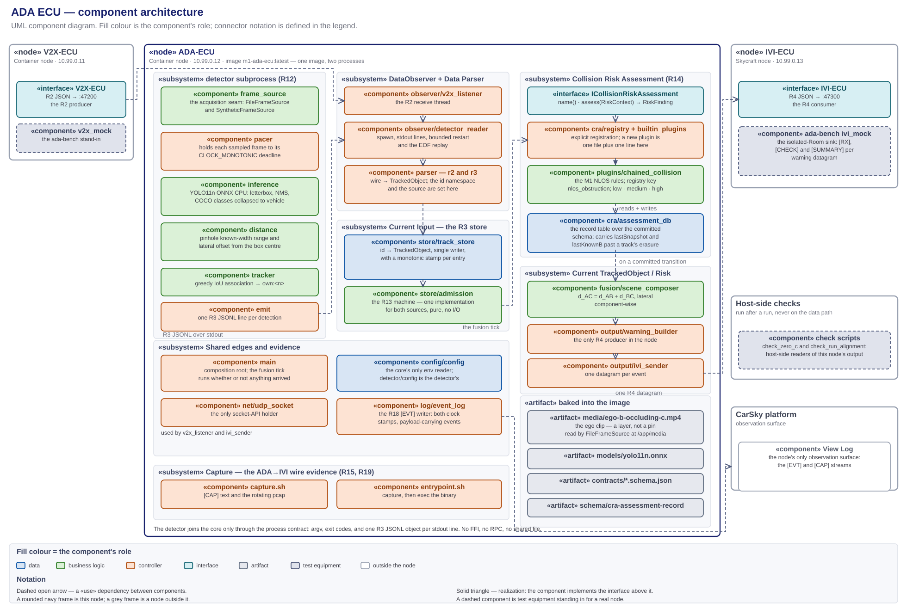
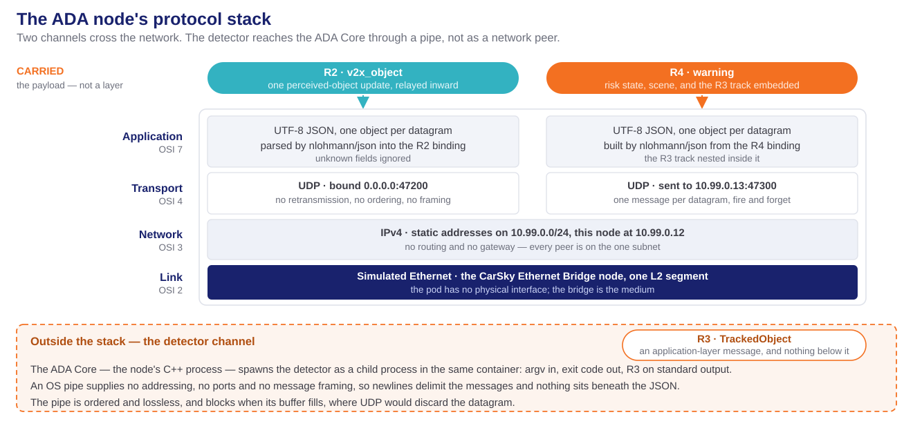

# ADA ECU — high-level design (R3, R12–R15; R18 ADA side)

> **The ADA node's HLD, and the sole design authority for `ADA_ECU/`.** Every component this node runs, its role, input and output, where it lives, and how the components connect. Decision record: [ada-ecu-design-decisions.md](ada-ecu-design-decisions.md) (D1–D11). Frozen contracts: [r2-v2x-object.schema.json](../../../contracts/r2-v2x-object.schema.json) in, [r3-tracked-object.schema.json](../../../contracts/r3-tracked-object.schema.json) as the store's object model, [r4-ada-ivi.schema.json](../../../contracts/r4-ada-ivi.schema.json) out. Deploy and verify: [deploy-ada-ecu-walkthrough.md](../../../requirements/car-sky-guide/deploy-ada-ecu-walkthrough.md). Node facts: [node-ada-ecu.md](../../../requirements/car-sky-guide/node-ada-ecu.md).
>
> Diagrams: [ada-ecu-module-architecture.svg](ada-ecu-module-architecture.svg) (components, paired with its `.drawio`) · [phase2-4-ada-ecu-components.puml](phase2-4-ada-ecu-components.puml) (module graph) · [phase2-4-ada-ecu-callflow.puml](phase2-4-ada-ecu-callflow.puml) (sequence) · [phase2-4-ada-ecu-admission.puml](phase2-4-ada-ecu-admission.puml) (the R13 state machine).

**Abridged version.** A reader who does not need the full document can take the design deck instead: [Phases 2-4 — ADA ECU Design](../../../presentation/phase2-4/phase2-4-ada-ecu-design-deck.md) ([HTML](../../../presentation/phase2-4/phase2-4-ada-ecu-design-deck.html)). It presents this HLD; where the two differ, this document governs.

## 1. Scope and authority

`ADA_ECU/` only — ego's perception and fusion node, from the R2 datagram arriving on the wire and the clip frame leaving the decoder, to the R4 warning datagram leaving the node.

- **In scope:** this folder's C++17 core and Python detector, their components and seams, the node's two network endpoints, the model and clip it ships, and the host-side scripts that read its own logs.
- **Out of scope:** what the V2X ECU does before R2 and what the IVI does after R4, which are those nodes' designs; the deploy and verify procedure, which the walkthrough owns; the task breakdown, which the plan owns; the radar and live-camera inputs drawn in [ada-ecu.svg](../../../requirements/ada-ecu.svg) — M1 has no radar and no live camera bring-up.

**This is the only design document governing this node.** It fixes the component set and each component's responsibility, every deliverable's path, the seams, the configuration keys, and the evidence log lines.

- **Task planning decomposes from this document plus the requirements report, and nothing else.** Requirement numbers and acceptance come from [m1-cooperative-awareness.md](../../../requirements/m1-cooperative-awareness.md); everything structural comes from here — which component a subtask creates, its path, the interface it satisfies, the log line that closes it. Deploy and verify subtasks come from the walkthrough, per [walkthrough-driven-delivery.md](../../../.claude/rules/walkthrough-driven-delivery.md).
- **Plans cite; they do not restate.** A brief links the section governing its step, so a change lands in one place.
- **Implementation does not extend this silently.** A component, path or configuration key not designated here is not created ad hoc — the design changes first.
- **What overrides it:** the requirements report, the frozen R2/R3/R4 contracts, and the walkthrough for procedure. On conflict, the CLAUDE.md authority order decides.

## 2. Required reading and sourced notes

### Requirement documents

**Read in full before this design is written or changed.** The requirements decide what the node must do; this document only decides how.

| Document | What it fixes for this node |
|---|---|
| [m1-cooperative-awareness.md](../../../requirements/m1-cooperative-awareness.md) — **the authority** | R3, R12, R13, R14, R15 whole — definition, dependency, acceptance, tech stack. R2 as the input contract and R4 as the output contract. R5/R6: node type, bridge, address, ports. R18: the evidence stream. R19: zero direct C detections for the whole run. §1: this node's responsibility list and the demo table. §3(d)/(f)/(g): the stack. §4: the standing decisions |
| Its figures — [ada-ecu.svg](../../../requirements/ada-ecu.svg) · [vehicleC_track_admission_state_machine.png](../../../requirements/vehicleC_track_admission_state_machine.png) | The R14 module shape this design realizes — DataObserver, Data Parser, Current Input, Collision Risk Assessment, Current TrackedObject/Risk — and the R13 lifecycle, realized as [phase2-4-ada-ecu-admission.puml](phase2-4-ada-ecu-admission.puml) |
| [r2-v2x-object.schema.json](../../../contracts/r2-v2x-object.schema.json) · [r3-tracked-object.schema.json](../../../contracts/r3-tracked-object.schema.json) · [r4-ada-ivi.schema.json](../../../contracts/r4-ada-ivi.schema.json) | The three frozen contracts, field for field, with their bounds and their nullable fields (§10) |
| [m1-run-timing-and-event-triggering.md](../../../requirements/m1-run-timing-and-event-triggering.md) | R20/R21/R22 whole. §6.2's clock-domain ruling, which this design makes (D10); §6.1's three detector pacing keys and the two risk-band values; §6.6's run choreography — `T0`, the paced clip, the matched bench-cycle and clip periods, and the band pair on the composed range (D11); §6.4's `tools/check_run_alignment.py` and its K1–K6 checks (§12) |
| [m1-video-source-and-ivi-dashcam.md](../../../requirements/m1-video-source-and-ivi-dashcam.md) | The clip reaches the container as one image layer and by no other route. The IVI dashcam view is deferred, and no part of it is built here (D6) |
| [milestone1_high_level_plan.md](../../Plan%20and%20Proposal/milestone1_high_level_plan.md) | §4's R13 gate constants; §2's near-collinear composition assumption; Phases 2, 3 and 4 acceptance; §6's deferred scope |
| [node-ada-ecu.md](../../../requirements/car-sky-guide/node-ada-ecu.md) | Image tag, blueprint `command` and `capabilities`, env set, pin, address |
| [deploy-ada-ecu-walkthrough.md](../../../requirements/car-sky-guide/deploy-ada-ecu-walkthrough.md) | The isolated-Room configuration and the observables its § Expected outputs and acceptance names (§12) |

### Research notes

Non-authoritative scratch; on any conflict the CLAUDE.md authority order wins.

| Note | Adopted here |
|---|---|
| [phase0-contract-freeze-hld.md](../../../deprecated/phase0-contract-freeze-hld.md) | D1's access model — byte-synced schema copies, no cross-folder reads; D2's bindings as pure model code; D4's additive-version tolerance. The bindings in `src/contracts/` are the only message models this design uses (D1) |
| [v2x-ecu-hld.md](../V2X-ECU/v2x-ecu-hld.md) and its [decisions](../V2X-ECU/v2x-ecu-design-decisions.md) | The sole-socket-holder rule; the `[EVT]` line's `mono_ms`/`epoch_ms` pair and its payload-carrying events, so one offline reader walks both nodes (D8); the clock discipline this node continues (D10); the `entrypoint.sh` plus `capture.sh` tcpdump pattern, reused here for the ADA→IVI hop (D9) |
| [scenario-player-hld.md](../SCENARIO-PLAYER/scenario-player-hld.md) and its [decisions](../SCENARIO-PLAYER/scenario-player-design-decisions.md) | The bench cadence `cpm_rate_hz` (10 Hz default), which is the relayed-update rate this design sizes `TRACK_TIMEOUT_MS` against; the two committed scenarios — `default.yaml` closing C from 70 m to 20.5 m across a 10.0 s cycle, crossing the gate 8.0 s in, and `c-out-of-range.yaml` held beyond the exit gate — as the R13 and R14 exercise inputs; the bench half of the R22 alignment, `start_delay_s` set to this node's detector warm-up (D11) |

## 3. The component architecture



Source: [research_notes/ada-ecu-module-architecture.svg](ada-ecu-module-architecture.svg), paired with its [`.drawio`](ada-ecu-module-architecture.drawio). The module graph alone is [phase2-4-ada-ecu-components.puml](phase2-4-ada-ecu-components.puml).

A UML component diagram. Fill colour is the component's role; `«use»` dependencies are dashed with an open arrowhead; realization is dashed with a hollow triangle; a seam is a provided interface meeting a required one. The two packages inside the image are the processes of D2: the C++17 `ada_ecu` core and the Python `detector` subprocess. The core's inner packages carry [ada-ecu.svg](../../../requirements/ada-ecu.svg)'s block names — DataObserver, Data Parser, Current Input, Collision Risk Assessment, Current TrackedObject/Risk. Component names below are the short `package/module` form — §4 resolves each to its path.

### MVC separation

Every component sits in exactly one layer, held there by the rule in the right-hand column.

| Layer | Where | Rule that keeps it separate |
|---|---|---|
| **Data** | `src/contracts/`, `detector/contracts/`, `store/track_store`, `cra/assessment_db` with `schema/`, `config/config`, `log/event_log` | Models and stores hold no rules: the store keeps, refreshes and erases entries but never decides what a distance means, and the bindings carry no transport |
| **Business logic** | `store/admission`, `cra/plugins/chained_collision`, `fusion/scene_composer`, and the detector's `inference`, `distance` and `tracker` | Pure functions of their inputs. None opens a socket, reads the environment, or formats a wire message |
| **UI logic (controller)** | `main`, `observer/`, `parser/`, `output/warning_builder`, `output/ivi_sender`, and the detector's `main`, `pacer` and `emit` | The controller owns the clock, the threads, the subprocess and the sockets. It holds no rules, and it is what builds the message the IVI's view model consumes |
| **UI** | none — the node is headless | The rendering surface is the IVI's God view (R16/R17), which consumes R4; the local observation surface is the `[EVT]` stream (§12) |

## 4. Folder structure

**The tree designates the path of every component this document names.** The image workdir `/app` mirrors this folder, so `/app/detector/main.py` is `detector/main.py` here.

```
ADA_ECU/
├── Dockerfile                      two stages, one base image, single-platform arm64 (D9)
├── entrypoint.sh                   starts capture.sh, then execs ./ada_ecu (D9)
├── capture.sh                      ADA→IVI live [CAP] text and rotating pcap (D9)
├── .dockerignore                   keeps doc/, tests/ and tools/ out of the build context
├── CMakeLists.txt                  the ada_ecu executable, the module libraries, the CTest targets
├── README.md                       one-screen orientation; points here
│
├── contracts/                      byte-synced r2 · r3 · r4 schema copies (D1)
├── schema/
│   └── cra-assessment-record.schema.json   the R14 record schema — node-local, not a synced contract (D4)
│
├── src/                            the ada_ecu core — C++17
│   ├── main.cpp                    the composition root and process entry (D2)
│   ├── config/config.{hpp,cpp}     the node's only env reader
│   ├── net/udp_socket.{hpp,cpp}    the only socket-API holder
│   ├── observer/
│   │   ├── input_queue.hpp         the bounded queue: two producers, one consumer (D2)
│   │   ├── v2x_listener.{hpp,cpp}  the R2 receive thread
│   │   └── detector_reader.{hpp,cpp}   detector spawn, lifecycle, and the stdout JSONL read thread
│   ├── parser/
│   │   ├── r2_parser.{hpp,cpp}     R2Message → TrackedObject, source v2x_relayed
│   │   └── r3_parser.{hpp,cpp}     detector JSONL line → TrackedObject, source own_sensor
│   ├── store/
│   │   ├── track_store.{hpp,cpp}   the R3 store: single writer, monotonic expiry stamp (D10)
│   │   └── admission.{hpp,cpp}     the R13 state machine — pure, no I/O (D3)
│   ├── cra/
│   │   ├── i_collision_risk_assessment.hpp   the R14 interface (D4)
│   │   ├── registry.{hpp,cpp}      the plugin registry, lookup by warningType
│   │   ├── builtin_plugins.cpp     the one file edited when a plugin is added (D4)
│   │   ├── assessment_db.{hpp,cpp} the typed accessor over the schema/ record (D4)
│   │   └── plugins/chained_collision.{hpp,cpp}   the M1 NLOS plugin (D5)
│   ├── fusion/scene_composer.{hpp,cpp}   d_AC = d_AB + d_BC, lateral component-wise (D5)
│   ├── output/
│   │   ├── warning_builder.{hpp,cpp}   RiskFinding + geometry → R4WarningEvent (D7)
│   │   └── ivi_sender.{hpp,cpp}    the R4 UDP egress (D7)
│   ├── log/event_log.{hpp,cpp}     the R18 [EVT] JSONL writer (D8)
│   └── contracts/{r2_message,tracked_object,r4_message}.{hpp,cpp}   the frozen bindings (D1)
│
├── detector/                       the R12 detector — Python 3.11 subprocess
│   ├── main.py                     argv, wiring, exit codes — the process contract's detector side
│   ├── config.py                   the detector's only env reader
│   ├── frame_source.py             the frame-source seam, FileFrameSource and SyntheticFrameSource (D6)
│   ├── pacer.py                    the CLOCK_MONOTONIC deadline scheduler over sampled frames (D10)
│   ├── inference.py                the YOLO11n ONNX session, letterbox, NMS, class mapping
│   ├── distance.py                 the pinhole known-width range and lateral offset
│   ├── tracker.py                  greedy IoU association → stable own:<n> ids
│   ├── emit.py                     R3 JSONL on stdout through the frozen binding
│   ├── contracts/tracked_object.py the R3 Python binding (D1)
│   ├── requirements.txt            runtime: onnxruntime · opencv-python-headless · numpy
│   ├── requirements-dev.txt        pytest · jsonschema
│   └── tests/                      test_r3_roundtrip · test_frame_source · test_pacer
│                                   test_distance · test_tracker · test_emit_contract
│
├── models/yolo11n.onnx             exported once by tools/export_yolo11n.py, committed (D6)
├── media/
│   ├── ego-b-occluding-c.mp4       the ego clip, baked into the image (D6)
│   └── ego-b-occluding-c.source.md its provenance and licence
│
├── tools/                          host-side scripts: no image, no data path, outside the build context
│   ├── export_yolo11n.py           the one-off Ultralytics → ONNX export (D6)
│   ├── make_sample_video.py        the CI decode fixture generator, never the demo source
│   ├── check_zero_c.py             the R12/R19 zero-C check (D6)
│   ├── check_run_alignment.py      the R21/R22 run-alignment check, K1–K6 (D10, D11)
│   ├── event_report.py             [EVT] → the collision-risk event list (D8)
│   └── extract_pcap.sh             host-side log → .pcap (D9)
│
├── tests/                          GoogleTest + CTest
│   ├── test_sanity.cpp
│   ├── contracts/                  test_r2_roundtrip · test_r3_roundtrip · test_r4_roundtrip
│   │                               test_r4_additive_version
│   ├── store/                      test_track_store · test_admission_own_sensor
│   │                               test_admission_relayed · test_expiry_monotonic
│   ├── parser/                     test_r2_parser · test_r3_parser
│   ├── cra/                        test_registry · test_assessment_db · test_chained_collision
│   ├── fusion/test_scene_composer.cpp
│   ├── output/test_warning_builder.cpp
│   └── fixtures/
│       ├── samples/                byte-synced contract samples
│       ├── own_sensor_mock.jsonl   the recorded own-sensor stream the reader replays (D2)
│       └── malformed/              the R2 and R3 rejection corpus
│
└── doc/                            this document, the decision record, the diagrams, research_notes/
```

## 5. Platform and boundary

| Component | Role | Input | Output |
|---|---|---|---|
| **CarSky Container Node** | the platform this node runs on: one pod, one image, no volume | the image pulled from Zot; env from the blueprint node config | a process on the Room network at `10.99.0.12`, and its stdout |
| `«interface»` **V2X-ECU** | the producer's side of R2 — a dependency on an address, never on an implementation | the CPM it decoded | one R2 JSON datagram per perceived-object update, to `10.99.0.12:47200` |
| `«interface»` **IVI-ECU** | the consumer's side of R4 — a dependency on an address | the warning this node composes | nothing; the wire is one way |
| **the ego clip** | the R12 frame source: a file inside the image, not a stream and not a pin (D6) | — | H.264 frames to `FileFrameSource` |
| **View Log** — CarSky | the node's only observation surface | the process stdout | the `[EVT]` and `[CAP]` streams, live in the Deployment Viewer or over the logs route |

The V2X ECU is a Container node at `10.99.0.11`; the IVI is the Skycraft node at `10.99.0.13`. Two things can stand at each address — the real node, or a `tools/ada-bench/` role in the isolated Room (§7). **Nothing on this side changes with either swap**, which is why the node's image and env are identical in both blueprints ([walkthrough §5.6](../../../requirements/car-sky-guide/deploy-ada-ecu-walkthrough.md#56-the-full-blueprint-route)).

## 6. Internal components

Each row is one component's single responsibility. A component does what its row says and no more; work fitting no row belongs to a component this document has not defined.

### Business logic

Pure functions of their inputs, free of the clock, the socket and the environment.

| Component | Role | Input | Output |
|---|---|---|---|
| `store/admission` | the R13 machine of D3: one implementation for both sources, holding the Schmitt band, the confirm counter and the expiry test | a track id, its source, an update's distance, the current monotonic time | the next state, or erasure; one `track_transition` per edge |
| `cra/plugins/chained_collision` | the M1 NLOS rules of D5: composed range, closing rate and TTC against the three risk bands, debounced by `RISK_DWELL_MS` | a `RiskContext` — the store, the assessment database, the current time | a `RiskFinding`; the updated assessment record |
| `fusion/scene_composer` | the geometry: `vehicleB` from the nearest own-sensor track, `vehicleC = (d_AB + d_BC, y_B + y_BC)`, ego at the origin | the two tracks | the R4 `geometry` triple |
| `detector/inference` | the YOLO11n ONNX session: letterbox, run, NMS, and the COCO-to-`vehicle` class collapse | one `Frame` | zero or more scored bounding boxes |
| `detector/distance` | the pinhole known-width estimate of D6: range from box width, lateral offset from box centre | a box, the frame width, `VEHICLE_WIDTH_M`, `CAMERA_HFOV_DEG` | `distance` and `position.y`, metres |
| `detector/tracker` | greedy IoU association against the previous sampled frame, holding an id while IoU ≥ `TRACK_IOU_MIN` | this frame's boxes, the previous frame's ids | a stable `own:<n>` per box |

### Data

| Component | Role | Input | Output |
|---|---|---|---|
| `src/contracts/` — `R2Message`, `TrackedObject`, `R4WarningEvent`, `R4StateMessage` | the typed C++ binding of the three frozen schemas, and the node's only object model (D1) | decoded JSON, constructed values | the structs every other component passes around |
| `detector/contracts/tracked_object` | the R3 Python binding: the same fields, the same wire keys, on the detector side of the process boundary | constructed values, JSONL lines | `TrackedObject` and its JSONL form |
| `store/track_store` | the R3 store — the figure's Current Input: `id → TrackedObject` with a parallel monotonic stamp per entry (D10), and the sole writer of `state` (D3) | upserts from the two parsers, erasures from admission | the current track set; `nearest(source)` for composition |
| `cra/assessment_db` | the R14 record table of D4: typed `get` / `upsert` / `erase` over the committed record schema, carrying a track's last snapshot past its erasure | assessment records | the prior record a plugin's edge-trigger and closing-rate need |
| `config/config` | the node's only env reader; validates and fails loud, naming the offending key | `environ` | an immutable configuration struct |
| `log/event_log` | the R18 writer of D8: one `[EVT]` JSONL line per event, both clock stamps, flushed per line, to stdout and optionally to a file | event name and payload | the evidence stream |

### UI logic — the controller

| Component | Role | Input | Output |
|---|---|---|---|
| `main` | the composition root: load config, register plugins, bind the socket, spawn the detector, run the fusion tick, and turn any startup or fatal exception into one logged line and a non-zero exit | the process environment | the running node |
| `observer/v2x_listener` | the R2 receive thread: one blocking receive per datagram on `V2X_LISTEN_HOST:V2X_LISTEN_PORT` | UDP datagrams | raw bodies onto the input queue |
| `observer/detector_reader` | the detector's lifecycle and its stdout: spawn `DETECTOR_CMD`, read lines, respawn on EOF or a non-zero exit within `DETECTOR_RESTART_MAX` (D2) | the subprocess pipe | raw JSONL lines onto the queue; `detector_spawn`, `detector_eof`, `detector_restart` |
| `observer/input_queue` | the one bounded queue: two producers, one consumer, so the main thread stays the single writer | items from both readers | items in arrival order |
| `parser/r2_parser` | R2 → `TrackedObject` with `source = v2x_relayed` and id `v2x:<stationId>:<objectId>`, applying §10.1's mapping rules. A malformed body is rejected and counted, never fatal | a raw R2 body | one `TrackedObject`, or one `parse_reject` |
| `parser/r3_parser` | one detector JSONL line → `TrackedObject` with `source = own_sensor`, ignoring the incoming `state` (D3) | a raw JSONL line | one `TrackedObject`, or one `parse_reject` |
| `output/warning_builder` | the node's only R4 producer: `RiskFinding` plus geometry onto the frozen binding (D7) | a committed risk transition | one serialized R4 warning event |
| `output/ivi_sender` | the only R4 egress: one datagram per event to `IVI_ECU_HOST:IVI_ECU_PORT` | the serialized event | one UDP datagram; one `r4_tx` carrying the body |
| `net/udp_socket` | the only code that includes a socket header; both the listener and the sender consume it, and transient errors are counted and logged rather than thrown | bind, receive, send calls | datagrams and error counts |
| `detector/main` | the detector's composition root: read env, open the frame source, drive source → pacer → inference → distance → tracker → emit, and exit non-zero on an unrecoverable error | the process environment | the R3 JSONL stream on stdout |
| `detector/pacer` | the D10 deadline scheduler: hold each sampled frame until its wall-clock instant, and apply `DETECTOR_START_DELAY_S` before the first | sampled frames, `DETECTOR_CLIP_FPS`, the stride | the same frames, released on schedule |
| `detector/emit` | one R3 JSONL line per detection per sampled frame, through the frozen binding | a tracked detection | one line on stdout |

### Configuration and descriptors

Every runtime value the deployment wires enters through env. Core values are read by `config/config`, detector values by `detector/config`, and each is read in exactly one place.

| Env — core | Default | Meaning |
|---|---|---|
| `V2X_LISTEN_HOST` · `V2X_LISTEN_PORT` | `0.0.0.0` · `47200` | the R2 ingress |
| `IVI_ECU_HOST` · `IVI_ECU_PORT` | `10.99.0.13` · `47300` | the R4 egress |
| `GATE_ENTER_M` · `GATE_EXIT_M` | `30` · `35` | the R13 admission and drop gate (D3) |
| `CONFIRM_HITS` | `3` | in-gate updates before `tracked` (D3) |
| `TRACK_TIMEOUT_MS` | `1000` | monotonic silence before a track is erased (D3, D10) |
| `FUSION_TICK_MS` | `100` | the expiry and assessment tick (D2) |
| `DETECTOR_ENABLED` · `DETECTOR_CMD` | `true` · `python3 /app/detector/main.py` | the detector spawn; the fixture override is how the core runs without a model (D2) |
| `DETECTOR_RESTART_MAX` | `5` | bounded restarts after a non-zero exit (D2) |
| `CRA_ENABLED` | `nlos_obstruction` | the active plugin list (D4) |
| `RISK_NEAR_M` · `RISK_CRITICAL_M` | `60` · `30` | the `medium` and `high` thresholds on the composed range `d_AC` (D5, D11) |
| `RISK_TTC_WARN_S` · `RISK_TTC_CRITICAL_S` | `6` · `3` | the `medium` and `high` TTC thresholds (D5) |
| `RISK_DWELL_MS` | `300` | the debounce before a transition commits (D5) |
| `STATE_RATE_HZ` | `0` | the optional R15 periodic awareness state (D7) |
| `EVENT_LOG_PATH` · `ASSESS_LOG_EVERY_MS` | *(empty = stdout only)* · `1000` | the R18 file sink and the assessment heartbeat (D8) |
| `CAPTURE_FILTER` · `PCAP_DIR` · `CAPTURE_ROTATE_S` | `udp` · `/data/capture` · `60` | the capture (D9) |

| Env — detector | Default | Meaning |
|---|---|---|
| `VIDEO_CLIP_PATH` | `/app/media/ego-b-occluding-c.mp4` | the clip `FileFrameSource` opens (D6) |
| `DETECTOR_FRAME_STRIDE` | `4` | decimation: every Nth decoded frame is sampled |
| `DETECTOR_LOOP` | `true` | restart the clip at EOF (D2) |
| `DETECTOR_REALTIME_PACING` | `true` | release sampled frames at wall-clock rate rather than as fast as the CPU allows; `true` for every demo run, since clip time is run time only under pacing (D10, D11) |
| `DETECTOR_CLIP_FPS` | `20.0` — the committed clip's declared rate | the rate pacing targets; overridable (D10) |
| `DETECTOR_START_DELAY_S` | `0.0` | grace from spawn before the first emitted frame (D10) |
| `MODEL_PATH` | `/app/models/yolo11n.onnx` | the ONNX session |
| `CONF_THRESHOLD` · `IOU_THRESHOLD` | `0.35` · `0.45` | the detection score floor and the NMS overlap |
| `TRACK_IOU_MIN` | `0.3` | the frame-to-frame association floor (D6) |
| `VEHICLE_WIDTH_M` · `CAMERA_HFOV_DEG` | `1.8` · `60` | the pinhole distance inputs (D6) |

The addresses, the ports and the two gate constants are fixed by a committed source — [node-ada-ecu.md](../../../requirements/car-sky-guide/node-ada-ecu.md#blueprint-node-config) and [milestone1_high_level_plan.md §4](../../Plan%20and%20Proposal/milestone1_high_level_plan.md#track-admission-gate-r13). Every other default above is this design's proposal. A value the blueprint omits falls through to the app's own default, never to an `ENV` baked into the image.

**Startup validation.** `config/config` asserts the rules below and nothing beyond them. A violation names the offending key and exits non-zero. Each rule orders values of one quantity, or bounds a single value. **No rule relates a risk threshold to a gate threshold**, because the two measure different ranges (D5).

| Rule | Quantity it constrains |
|---|---|
| `0 < GATE_ENTER_M < GATE_EXIT_M` | the relayed or estimated range of one source, `d_BC` or `d_AB` — the R13 Schmitt band (D3) |
| `0 < RISK_CRITICAL_M < RISK_NEAR_M` | the composed range `d_AC` — the R14 bands (D5) |
| `0 < RISK_TTC_CRITICAL_S < RISK_TTC_WARN_S` | time to collision on `d_AC` (D5) |
| `CONFIRM_HITS ≥ 1`; `TRACK_TIMEOUT_MS > 0`; `FUSION_TICK_MS > 0`; `RISK_DWELL_MS ≥ 0`; `STATE_RATE_HZ ≥ 0`; `DETECTOR_RESTART_MAX ≥ 0` | a single value's domain |
| ports in 1–65535; hosts non-empty; `CRA_ENABLED` naming registered plugins only | a single value's domain |
| `DETECTOR_CLIP_FPS > 0`; `DETECTOR_FRAME_STRIDE ≥ 1`; `DETECTOR_START_DELAY_S ≥ 0`, asserted by `detector/config` | a single value's domain, detector side |

| Artifact | Role |
|---|---|
| `contracts/*.schema.json` | the byte-synced R2, R3 and R4 schemas the bindings bind against (D1) |
| `schema/cra-assessment-record.schema.json` | the R14 assessment-record schema, node-local (D4) |
| `Dockerfile` · `entrypoint.sh` · `capture.sh` | the image, the process launch and the capture (D9) |
| `media/ego-b-occluding-c.source.md` | the clip's provenance, licence and encode parameters |

## 7. External related components

Outside the node boundary: the `V2X-ECU` and `IVI-ECU` interfaces and the View Log of §5, plus the contract sources and the test equipment below.

- **The frozen schemas live in `contracts/` at the repo root.** This folder holds byte-synced copies gated by `contracts/check_sync.py`; a copy edited in place is a drift defect the gate fails on (D1).
- **The shared samples live there too** and are synced into `tests/fixtures/samples/` and the detector's test resources.

### Test equipment

Scaffolding for exercising this node alone. None of it ships in the node image.

| Component | Role | Input | Output |
|---|---|---|---|
| `tools/ada-bench/` → `m1-ada-bench:latest`, at the repo root | replaces both neighbours in the isolated Room: `ROLE=v2x_mock` emits R2 at `10.99.0.11`, `ROLE=ivi_mock` binds `47300` at `10.99.0.13` and checks every warning | env-configured profile, rate and distance walk | R2 datagrams; `[RX]`, `[CHECK]`, `[SUMMARY]` and `[CAP]` lines |
| `tests/fixtures/own_sensor_mock.jsonl` | a recorded own-sensor stream the real `detector_reader` replays through `DETECTOR_CMD`, so the core runs with no model and no clip (D2) | — | R3 JSONL lines |
| `tools/make_sample_video.py` | a synthetic clip proving the decoder and the JSONL path in CI; it cannot produce R12 detection evidence (D6) | — | a short `.mp4` |
| `tools/check_zero_c.py` · `tools/check_run_alignment.py` · `tools/event_report.py` | host-side readers of this node's own output | the `[EVT]` stream, the detector's R3 JSONL, the bench's `[TX]` JSONL | the zero-C verdict, the K1–K6 verdict, the collision-risk event list |

**A mock of another node never lives in this folder.** `tools/ada-bench/` sits at the repo root so it can change without rebuilding the thing it tests, and so bench code cannot ship inside the real image ([node-code-layout § `tools/`](../../../.claude/rules/node-code-layout.md#tools--test-equipment-and-ecu-mocks), [walkthrough §2.4](../../../requirements/car-sky-guide/deploy-ada-ecu-walkthrough.md#24-where-the-bench-sources-live-and-why)). The scripts in `ADA_ECU/tools/` mock nothing: they read this node's own logs, build no image, and are excluded from the build context.

## 8. Interfaces, ports and the layer rule

- **`V2X-ECU` and `IVI-ECU`** — the node's two outside dependencies, and addresses rather than implementations (§5).
- **`udp :47200`** — bound by `observer/v2x_listener` through `net/udp_socket`; the node's only listening port.
- **`udp → 10.99.0.13:47300`** — the egress on `output/ivi_sender` through the same holder; the node's only outbound socket. Nothing else opens one.
- **The detector process contract** — argv in, exit code out, one R3 JSONL object per stdout line. `observer/detector_reader` requires it; `detector/main.py` provides it in a run, and a fixture replayed through `DETECTOR_CMD` provides it in a test (D2).
- **`ICollisionRiskAssessment`** — the R14 seam. `cra/registry` requires it; `ChainedCollision` and every future plugin provide it (D4).
- **`FrameSource`** — the detector's acquisition seam. `detector/main` requires it; `FileFrameSource` and `SyntheticFrameSource` provide it, and a live source would be a third (D6).
- **`Detector`** — the model seam inside `detector/inference`, so the network swaps without touching the pipeline.

No layer is collapsed: the admission machine cannot reach a socket, a plugin cannot send a datagram, and the detector cannot reach the store — its only route in is one JSONL line through a parser.

### Protocol stack



Source: [phase2-4-ada-protocol-stack.svg](../../../presentation/assets/phase2-4-ada-protocol-stack.svg).

Two channels cross the network — R2 inbound and R4 outbound — and they share every layer below the encoding row. Which component owns each layer:

| Layer | Owned here by |
|---|---|
| Message | `contracts/r2_message`'s `R2Message` inbound (§10.1); `contracts/r4_message`'s `R4WarningEvent` outbound (§10.3), with the `contracts/tracked_object` record nested inside it (§10.2) |
| Encoding | the nlohmann/json bindings inside those three contract types — UTF-8 JSON, one object per datagram, unknown fields ignored on the inbound side |
| Transport, network, link | `net/udp_socket` alone — the layer rule above is what keeps it there |

- **The stack carries no ASN.1 and no ITS envelope.** This node never sees a CPM; the air message is decoded one hop upstream, so nothing here links a codec ([§11](#11-tech-stack-build-and-ci)).
- **IPv4 is static and routerless.** Every peer sits on `10.99.0.0/24` with this node at `10.99.0.12`, and the link layer is the CarSky Ethernet Bridge — one simulated L2 segment, since the pod has no physical interface (R6).
- **The detector channel is outside the stack.** `observer/detector_reader` spawns `detector/main.py` as a child process in the same container and reads R3 records from its standard output: an OS pipe supplies no addressing, no ports and no framing, so newlines delimit the messages and nothing sits beneath the JSON (D2).
- **That asymmetry is a behavioural difference, not a notational one.** The pipe is ordered and lossless and blocks when its buffer fills, where UDP discards the datagram — which is why back-pressure appears on the detector path and loss appears on the network paths.

## 9. Call flow

[phase2-4-ada-ecu-callflow.puml](phase2-4-ada-ecu-callflow.puml) — PlantUML sequence: bring-up and detector spawn, then B detected in the clip → R3 JSONL → store, relayed C → store, and the fusion tick driving expiry → R13 admission → R14 assessment → R15 emission → IVI, with the parse-reject, `b_unknown` and detector-EOF branches.

## 10. The contract

This node sits between two frozen contracts and owns a third. It **consumes R2** from the V2X ECU, **produces R4** to the IVI ECU, and holds every object in the **R3** shape in between. All three are frozen: a field change is a re-freeze across every consumer, and the node's copies under `contracts/` are byte-synced to the normative files (D1).

### 10.1 R2 — the message set from the V2X ECU (consumed)

| Property | Value |
|---|---|
| Direction | V2X-ECU → ADA-ECU, one way |
| Transport | UDP to `10.99.0.12:47200`, one message per datagram |
| Encoding | UTF-8 JSON, one `type: "v2x_object"` message per perceived-object update |
| Normative schema | [r2-v2x-object.schema.json](../../../contracts/r2-v2x-object.schema.json) |
| Node copy | `ADA_ECU/contracts/r2-v2x-object.schema.json`; `src/contracts/r2_message` binds against it |

The schema's field table is normative and is not restated. What this node owes it, at the `parser/r2_parser` boundary:

| Obligation | How it is met |
|---|---|
| `object.distance` is R13's admission input, and the V2X ECU derives it — this node never recomputes it | `admission` reads the field as received |
| `object.confidence` is nullable when the CPM confidence was unavailable, while R3 `confidence` is required in 0–1 | a null maps to `0.0`, the lowest confidence; the received value stays visible in the `r2_ingest` payload |
| `position.confidence` is a position accuracy in metres and has no R3 home | it is carried in the `r2_ingest` payload and dropped from the track |
| `sender.speed` is nullable until the V2X ECU has seen two CPMs from that station | this node reads it for evidence only; no rule depends on it |
| Track identity must not collide with an own-sensor id | the id is `v2x:<stationId>:<objectId>`, a namespace the detector cannot mint (D3) |
| `rxTime` is the V2X ECU's clock | it is a record value; no arithmetic mixes it with this node's clock (D10) |
| Unknown extra fields are tolerated | the binding ignores them, per the Phase 0 additive-version rule |

### 10.2 R3 — the object model of the store (owned)

| Property | Value |
|---|---|
| Role | the one schema every perception source conforms to, so sources are interchangeable behind one interface |
| Crossing points | the detector's stdout JSONL (own-sensor entries), and the `object` field of an R4 warning (§10.3) |
| Normative schema | [r3-tracked-object.schema.json](../../../contracts/r3-tracked-object.schema.json) |
| Node copies | `ADA_ECU/contracts/r3-tracked-object.schema.json`, bound by `src/contracts/tracked_object` in the core and `detector/contracts/tracked_object` in the detector |

Two fields need a rule beyond the schema, because the schema cannot say who fills them.

- **`state` is written by the store alone** (D3). An incoming detector line or R2-derived object carries `not_tracked` by convention, and that value is ignored.
- **`timestamps` are filled per source**, all from `CLOCK_REALTIME` (D10):

| Field | `v2x_relayed` | `own_sensor` |
|---|---|---|
| `measured` | `rxTime + timeOfMeasurement` — both from the same R2 message, so one clock domain | the detector's stamp at frame capture |
| `received` | `rxTime` — the V2X ECU's clock, as a record value | the detector's emit time |
| `lastUpdated` | this node's clock at the store write | this node's clock at the store write |

Track expiry does not read `lastUpdated`; it compares the parallel monotonic stamp `track_store` keeps beside each entry (D10).

### 10.3 R4 — the message set to the IVI ECU (produced)

| Property | Value |
|---|---|
| Direction | ADA-ECU → IVI-ECU, one way |
| Transport | UDP to `10.99.0.13:47300`, one message per datagram, no framing header |
| Encoding | UTF-8 JSON |
| Normative schema | [r4-ada-ivi.schema.json](../../../contracts/r4-ada-ivi.schema.json), embedding the R3 schema |
| Node copy | `ADA_ECU/contracts/r4-ada-ivi.schema.json`; `src/contracts/r4_message` binds against it, and `output/warning_builder` is its only producer (D7) |

Two message kinds share the port, discriminated by `type`.

**`type: "warning"`** — edge-triggered, the committed message, emitted on every committed change of `riskState` for a `(warningType, trackId)` in both directions (D5):

| Field | Filled from |
|---|---|
| `schemaVersion` · `type` | the binding's constants |
| `warningType` | the plugin's registry key; M1 emits `nlos_obstruction` (D4) |
| `riskState` | the `RiskFinding`'s level — `low`, `medium` or `high` (D5) |
| `object` | the R3 snapshot of the triggering track C, from the store, or from the assessment record's `lastSnapshot` once the track has been erased (D4) |
| `geometry.ego` | the frame origin |
| `geometry.vehicleB` | the nearest own-sensor track, or `lastKnownB` on a clearing event — the field is required and never null (D5) |
| `geometry.vehicleC` | the composed C position, and null exactly when C's track has been erased |

**`object.source` is what the R19 claim rests on.** It is `v2x_relayed` on every warning this node emits, because only a relayed track can be C (D6); the IVI's provenance guard renders ghost C on that value alone.

**`type: "state"`** — the optional periodic awareness state of R15: `schemaVersion`, `type`, `seq` and `vehicles` with the same three positions, last-value-wins by `seq`. `STATE_RATE_HZ = 0` leaves it off, and no acceptance criterion depends on it (D7).

## 11. Tech stack, build and CI

No dependency outside this table enters the node without a design change. Traces are to [m1-cooperative-awareness.md](../../../requirements/m1-cooperative-awareness.md) and to the [decision record](ada-ecu-design-decisions.md).

| Area | Stack | Trace |
|---|---|---|
| Core | C++17: one process, two receive threads, a single-writer main loop | report §3(d); D2 |
| Messages | nlohmann/json through the frozen bindings — R2 in, R3 in the store, R4 out | R2/R3/R4 tech stack; D1 |
| Transport | POSIX UDP through `src/net/` | report §3(f), R6 |
| Detector | Python 3.11; YOLO11n exported to ONNX on ONNX Runtime CPU; OpenCV `opencv-python-headless` decode; numpy | report §3(g), R12; D6 |
| Process boundary | argv, exit codes and R3 JSONL over stdout — no FFI, no RPC | report §3(d); D2 |
| Build and test | CMake ≥ 3.22 with GoogleTest and CTest; pytest with jsonschema | Phase 0 toolchain |
| Evidence | JSONL `[EVT]` stream; tcpdump for the ADA→IVI capture | R18; R15/R19; D8, D9 |
| Image | Docker multi-stage, one base `python:3.11-slim`, single-platform `linux/arm64` | R5; D9 |

Deliberately absent: Vanetza, since this node never touches UPER; any database engine (D4); any tracking or monocular-depth library (D6).

Build commands, from the repo root:

```
cmake -S ADA_ECU -B ADA_ECU/build && cmake --build ADA_ECU/build -j
ctest --test-dir ADA_ECU/build --output-on-failure
python -m pytest ADA_ECU/detector/tests
docker buildx build --platform linux/arm64 --provenance=false --sbom=false -t m1-ada-ecu:latest ADA_ECU/
```

| CI lane | File | What it does |
|---|---|---|
| `ada-core-build` | [phase2-ci.yml](../../../.github/workflows/phase2-ci.yml) | configure, build and `ctest` the C++ core on a plain runner |
| `ada-detector-tests` | `phase3-ci.yml` | the detector suite, against `SyntheticFrameSource` |
| `contracts-gate` | [phase0-ci.yml](../../../.github/workflows/phase0-ci.yml) | byte-identity of this folder's schema and sample copies (D1) |
| `ada-ecu-image` | [phase4-ci.yml](../../../.github/workflows/phase4-ci.yml) | the `linux/arm64` image build from context `ADA_ECU/`, pushed to Zot when `CARSKY_ZOT_API_KEY` is set |

The image lane runs under emulation on an x86_64 runner, so its timeout matches the existing image lanes. A green image lane is not evidence that a tag reached the registry — the push step is gated on the secret ([node-code-layout § Build rules](../../../.claude/rules/node-code-layout.md#build-rules-all-container-nodes)). The bench image the isolated Room needs is built by its own lane from `tools/ada-bench/` ([walkthrough §3.2](../../../requirements/car-sky-guide/deploy-ada-ecu-walkthrough.md#32-build-and-push-the-images-on-ci)).

## 12. Test strategy

Four configurations exercise the same node, differing only in what stands at the two edges.

- **Unit — no network, no subprocess.** GoogleTest over the pure modules with injected values and fixtures; pytest over the detector modules with `SyntheticFrameSource`. This is where the D3 gate boundaries at 30 m and 35 m, the D5 band table, the composed geometry and the pinhole maths are proved against hand-computed values.
- **Fixture-driven core.** `DETECTOR_ENABLED=true` with `DETECTOR_CMD` replaying `tests/fixtures/own_sensor_mock.jsonl` through the real reader, and relayed traffic arriving as real datagrams on the real socket. The core runs whole with no model and no clip, and no branch inside `src/` knows the difference (D2).
- **Isolated Room** — the walkthrough's four-node blueprint: the bridge, `tools/ada-bench/` as `v2x_mock` at `.11`, this node at `.12`, and `ada-bench` as `ivi_mock` at `.13`.
- **Full blueprint** — the real bench, V2X ECU and IVI Skycraft node at the same addresses and ports.

**Expected output is identical in the last two**, because this node's image, `command`, `capabilities` and env are unchanged between them (§5) — a difference between the runs is a neighbour finding, not an ADA one.

Expected observables, per [walkthrough § Expected outputs and acceptance](../../../requirements/car-sky-guide/deploy-ada-ecu-walkthrough.md#8-expected-outputs-and-acceptance):

| Observable | Produced by |
|---|---|
| `detector_spawn`, then `own_sensor_ingest` one line per detection per sampled frame | `observer/detector_reader`, `detector/emit` |
| `r2_ingest` carrying the received R2 body, at ≥ 90 % of the producer's send count | `observer/v2x_listener` → `parser/r2_parser` → `log/event_log` |
| `parse_reject` count 0 against a conforming producer | `parser/r2_parser`, `parser/r3_parser` |
| `track_transition` to `tentative` then `tracked` for `v2x:<stationId>:<objectId>`, `"source":"v2x_relayed"` | `store/admission` |
| `track_transition` to `tracked` for `own:<n>`, `"source":"own_sensor"` | `store/admission` |
| zero own-sensor entries claiming a relayed source or a `v2x:` id, and zero relayed entries claiming an `own:` id | structural (D6), asserted by `tools/check_zero_c.py` |
| `assessment` carrying `d_AC`, the TTC and the rationale; `risk_transition` on each committed change | `cra/plugins/chained_collision` |
| `r4_tx` carrying the emitted R4 body, with `object.source` `v2x_relayed` and numeric `geometry.vehicleB` | `output/warning_builder` → `output/ivi_sender` |
| `[CAP] IP 10.99.0.12.<port> > 10.99.0.13.47300: UDP` | `capture.sh` |
| with the relayed object held beyond the gate, `r2_ingest` still counting up and no relayed `track_transition` at all | `store/admission`'s gate — the negative case |

The single strongest line is `r4_tx`: it proves both tracks existed at the same instant rather than at two different times, which is Phase 4's output acceptance.

R20/R21/R22 alignment is checked after a run by `tools/check_run_alignment.py` (D10, D11). K1–K3 and K6 read this node's `[EVT]` stream, K4 the detector's R3 JSONL, K5 the bench's `[TX]` JSONL — each check stays inside one clock domain.

| # | Check | Bound |
|---|---|---|
| K1 | at every `r4_tx`, a `tracked` `own_sensor` B entry exists whose `lastUpdated` is within `TRACK_TIMEOUT_MS` | pass |
| K2 | the first `own_sensor` → `tracked` transition precedes the first `v2x_relayed` → `tracked` transition | ≥ 1.0 s |
| K3 | `max │lastUpdated(own_sensor B) − lastUpdated(v2x_relayed C)│` over all `r4_tx` | ≤ 1000 ms |
| K4 | the detector's frame-index advance against its own emit-timestamp advance, over ≥ 60 s | ±2 % of `DETECTOR_CLIP_FPS / DETECTOR_FRAME_STRIDE` |
| K5 | the bench's `scenario_time_s` advance against its `mono_ms` advance, over ≥ 60 s | ±1 % |
| K6 | the interval from `T0` — the run's first `own_sensor` R3 line — to the first `r4_tx` | 8.0 s ≤ Δ < 10.0 s |

K6 is R22's ADA-side observable, and it is what the D11 configuration exists to produce. Its IVI-side counterpart, K7, is read from the guest and belongs to that node ([ivi-ecu-hld.md §12](../IVI-ECU/ivi-ecu-hld.md#12-test-strategy)).

## 13. Design decisions

[ada-ecu-design-decisions.md](ada-ecu-design-decisions.md) — D1–D11, binding on implementation and cited by number throughout this document: the one folder and one object model (D1), the process and thread model (D2), R13 admission (D3), the R14 interface, registry and database (D4), the risk vocabulary and edge-triggered emission (D5), the R12 detector (D6), the R15 output stage (D7), the R18 evidence stream (D8), the deployment shape (D9), the clock domains with paced stimulus (D10), and the R22 run choreography (D11).
