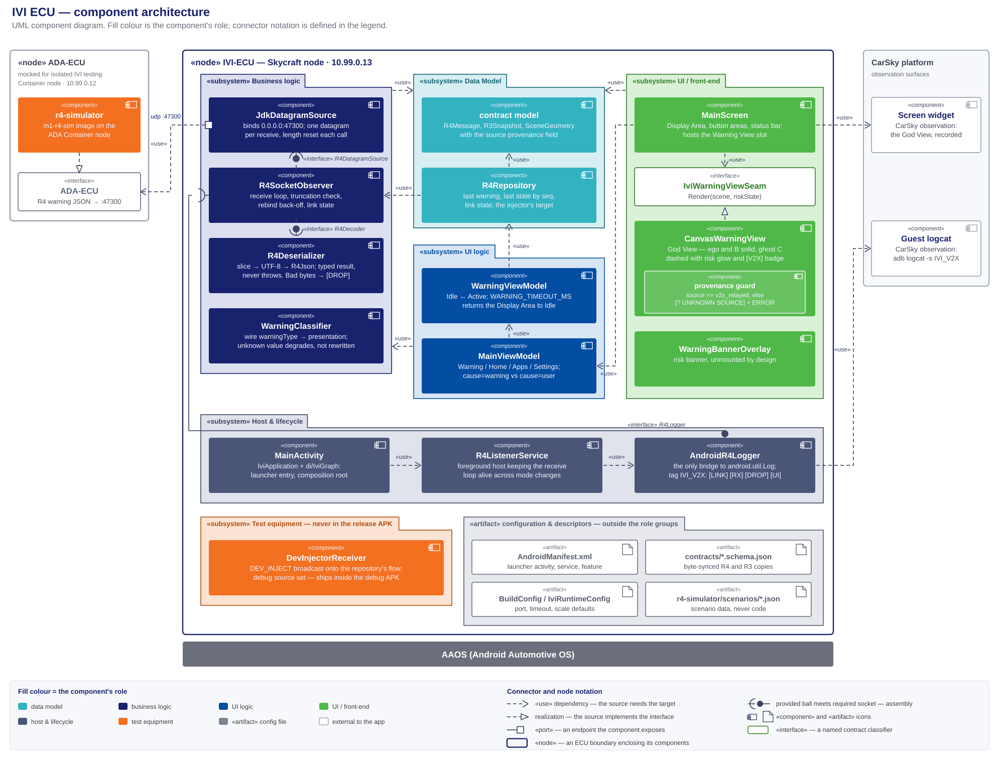

# IVI ECU — high-level design

> **The IVI node's HLD, and the sole design authority for `IVI_ECU/`.** Every component this node runs, its role, input and output, where it lives, and how the components connect. Decision record: [ivi-ecu-design-decisions.md](ivi-ecu-design-decisions.md) (D1–D13). Frozen contract: [r4-ada-ivi.schema.json](../../../contracts/r4-ada-ivi.schema.json). Build, install and verify: [deploy-ivi-hmi-walkthrough.md](../../../requirements/car-sky-guide/deploy-ivi-hmi-walkthrough.md). Node facts: [node-ivi-ecu.md](../../../requirements/car-sky-guide/node-ivi-ecu.md).
>
> Diagrams: [ivi-ecu-module-architecture.svg](ivi-ecu-module-architecture.svg) (components) · [phase5-ivi-callflow.puml](phase5-ivi-callflow.puml) (sequence) · [phase5-ivi-components.puml](phase5-ivi-components.puml) (modules).

**Author:** Vũ Xuân Bách 

**Abridged version.** A reader who does not need the full document can take the design deck instead: [Phase 5 — IVI ECU Design](../../../presentation/phase5/phase5-design-ivi-ecu-deck.md) ([HTML](../../../presentation/phase5/phase5-design-ivi-ecu-deck.html)). It presents this HLD; where the two differ, this document governs. The demo deck [Phase 5 — IVI HMI & 2D God View](../../../presentation/phase5/phase5-ivi-deck.md) shows the running result rather than the design.

## 1. Scope and authority

`IVI_ECU/` only — the consumer side of R4 and everything downstream, up to the rendered God View and the log lines that evidence it.

- **In scope:** this folder's five Gradle modules, their components and seams, the node's one network endpoint, and the test equipment that exercises the node alone.
- **Out of scope:** how the R4 message is produced; the deploy/verify procedure, which the walkthrough owns; the task breakdown, which the plan owns; the ADA→IVI wire capture of R15 and R19, which is the ADA node's evidence.

**This is the only design document governing this node.** It fixes the component set and each component's responsibility, the module graph, every deliverable's path, the seams, the configuration keys, and the evidence log lines.

- **Task planning decomposes from this document plus the requirements report, and nothing else.** Requirement numbers and acceptance come from [m1-cooperative-awareness.md](../../Requirements/m1-cooperative-awareness.md); everything structural comes from here — which component a subtask creates, its path, the interface it satisfies, the log line or scene that closes it. Deploy and verify subtasks come from the walkthrough, per [CLAUDE.md § Repository layout](../../../CLAUDE.md).
- **Plans cite; they do not restate.** A brief links the section governing its step, so a change lands in one place.
- **Implementation does not extend this silently.** A component, path or configuration key not designated here is not created ad hoc — the design changes first.
- **What overrides it:** the requirements report, the frozen R4/R3 contracts, and the walkthrough for procedure. On conflict, the CLAUDE.md authority order decides.

## 2. Required reading and sourced notes

### Requirement documents

**Read in full before this design is written or changed.** The requirements decide what the node must do; this document only decides how.

| Document | What it fixes for this node |
|---|---|
| [m1-cooperative-awareness.md](../../Requirements/m1-cooperative-awareness.md) — **the authority** | R4, R16, R17 whole — definition, dependency, acceptance, tech stack. R5/R6: node type, bridge, port. R18/R19: what the run must evidence. §3(e)/(f): the stack. §4: the standing decisions, restated in D11 |
| Its figures — [ivi-ecu.svg](../../Requirements/ivi-ecu.svg) · [ivi-god-view-scene.svg](../../Requirements/ivi-god-view-scene.svg) · [ivi-god-view-warning-screen.svg](../../Requirements/ivi-god-view-warning-screen.svg) | The R16 layout; R17's visual language; and the annotated variant, which is explanatory and never rendered |
| [r4-ada-ivi.schema.json](../../../contracts/r4-ada-ivi.schema.json) · [r3-tracked-object.schema.json](../../../contracts/r3-tracked-object.schema.json) | The frozen input contract, field for field (§10) |
| [m1-run-timing-and-event-triggering.md](../../../requirements/deprecated/m1-run-timing-and-event-triggering.md) | R20/R21 oblige this node with nothing: R4 carries no timestamp, so the warning timeout is a local countdown, and pacing belongs to the bench and the detector. R22 obliges it with two things: the app is listening on its R4 port before the first warning can arrive at `T0` + 8.0 s, and the Display Area holds Home until an active-risk warning raises it (D13). K7 is this node's observable (§12) |
| [m1-video-source-and-ivi-dashcam.md](../../../requirements/deprecated/m1-video-source-and-ivi-dashcam.md) | A dashcam view is deferred (D11). If accepted, the clip arrives over HTTP from the ADA node or as a local copy — never through a `video` pin |
| [node-ivi-ecu.md](../../../requirements/car-sky-guide/node-ivi-ecu.md) | VM artifact, pin, address |

### Research notes

Non-authoritative scratch, except the walkthrough, which is authoritative for its procedure.

| Note | Adopted here |
|---|---|
| [UDP-msg-parsing.md](../../KnowledgeBase/UDP-msg-parsing.md) | Wire truth — no application header, de-framing is slicing (D3); the decode-failure table as `R4DecodeResult`; unknown-`warningType` preservation (D4); pure-JVM module placement (D1, D2) |
| [phase5-r4-simulator.md](phase5-r4-simulator.md) | The simulator's two run modes and scenario cases; payloads come from the frozen samples, never a literal (D9) |
| [deploy-ivi-hmi-walkthrough.md](../../../requirements/car-sky-guide/deploy-ivi-hmi-walkthrough.md) | The mini-blueprint target (§4.11) and the ADA-node env contract — `IVI_ECU_HOST` / `IVI_ECU_PORT` / `R4_SCENARIO` / `R4_RATE_HZ` / `START_DELAY_S` (§4.8) — that the simulator reads verbatim |

## 3. The component architecture



Source: [research_notes/ivi-ecu-module-architecture.svg](ivi-ecu-module-architecture.svg).

A UML component diagram. Fill colour is the component's role; `«use»` dependencies are dashed with an open arrowhead; realization is dashed with a hollow triangle; a seam is a provided interface meeting a required one at an assembly connector. The two `«node»` rectangles are **IVI-ECU**, everything this node runs, and **ADA-ECU**, the producer it depends on; the CarSky observation surfaces sit outside both. Component names below are the short `package/File` form — §4 resolves each to its path.

### MVC separation

Every component sits in exactly one layer, held there by the rule in the right-hand column.

| Layer | Where | Rule that keeps it separate |
|---|---|---|
| **Data** | `:contract` models and samples; `:app data/R4Repository` | The repository stores and routes; it never decides what a warning *means* and never formats |
| **Business logic** | `:serializer`, `:observer`, `warning/WarningClassifier`, `ui/view/SceneCoordinateMapper` | All four are free of Android UI types, three of Android entirely, and every one is testable without a device |
| **UI logic** | `ui/WarningViewModel`, `ui/MainViewModel`, `config/IviRuntimeConfig` | View-models hold no drawing code and no socket; they turn domain state into what the Display Area shows |
| **UI** | `ui/screen/MainScreen`, `ui/view/CanvasWarningView` behind `IviWarningViewSeam` | The seam is the swap point for the optional 3D renderer; `MainScreen` sees only `WarningUiState` |

## 4. Folder structure

Five Gradle modules under `IVI_ECU/`, all in package root `com.hackathon.v2x.ivi` — the Android module at `src/main/java/`, the four pure-JVM ones at `src/main/kotlin/`. **The tree designates the path of every component this document names**; each module's build script, tests and resources follow the standard Gradle layout inside it.

```
IVI_ECU/
├── settings.gradle.kts             includes :contract, :serializer, :observer, :app, :r4-simulator
├── gradle/libs.versions.toml       the version catalog for all five modules (D8)
├── contracts/                      byte-synced R4 and R3 schema copies
│
├── contract/                       :contract — the Data Model, pure JVM
│   └── src/main/kotlin/…/model/
│       ├── R4Message.kt            the R4 message set and R4Json
│       ├── R3Snapshot.kt           the carried snapshot, with its `source` field
│       ├── SceneGeometry.kt        SceneGeometry and VehiclePosition
│       └── R4Contract.kt           known schema version, sample paths, registry keys
│
├── serializer/                     :serializer — the parser, pure JVM
│   └── src/main/kotlin/…/serializer/
│       ├── R4Decoder.kt            the decode seam and R4DecodeResult
│       ├── R4Deserializer.kt       slice → BOM/UTF-8 → R4Json; never throws
│       └── PayloadPreview.kt       the bounded preview the [DROP] line carries
│
├── observer/                       :observer — the receive path, pure JVM
│   └── src/main/kotlin/…/observer/
│       ├── R4DatagramSource.kt     the source seam
│       ├── JdkDatagramSource.kt    the only socket holder
│       ├── R4SocketObserver.kt     the receive loop, truncation check, back-off, bounded flow
│       ├── R4Event.kt              R4Event and R4LinkState
│       ├── R4ObserverConfig.kt     port, buffer, capacity, back-off bounds
│       └── R4Logger.kt             the logging seam AndroidR4Logger fills
│
├── app/                            :app — the front end, the only Android module
│   └── src/
│       ├── main/AndroidManifest.xml    activity, service, automotive feature, permissions
│       ├── main/java/…/
│       │   ├── IviApplication.kt       the object graph and application scope
│       │   ├── MainActivity.kt         the Compose host and process entry
│       │   ├── di/IviGraph.kt          the composition root (D7)
│       │   ├── config/IviRuntimeConfig.kt   the one configuration merge point (D10)
│       │   ├── service/                R4ListenerService.kt, AndroidR4Logger.kt
│       │   ├── data/R4Repository.kt    the event raiser and injection target
│       │   ├── warning/WarningClassifier.kt   warningType → presentation
│       │   ├── ui/                     WarningUiState.kt, WarningViewModel.kt, MainViewModel.kt, DisplayMode.kt
│       │   ├── ui/screen/MainScreen.kt the R16 layout
│       │   └── ui/view/                IviWarningViewSeam.kt, CanvasWarningView.kt (with the provenance guard),
│       │                               SceneCoordinateMapper.kt, WarningBannerOverlay.kt
│       └── debug/java/…/debug/DevInjectorReceiver.kt   debug source set only
│
├── r4-simulator/                   :r4-simulator — test equipment; builds m1-r4-sim:latest
│   ├── Dockerfile · entrypoint.sh  the image the mini-blueprint's ADA node pulls
│   ├── scenarios/*.json            scenario data (D9)
│   └── src/main/kotlin/…/sim/      scenario load, message build, validation, UDP send
│
└── doc/                            this document, the decision record, the diagrams, research_notes/
```

Each module carries its own `src/test/` mirroring its main package.

## 5. Platform and boundary

| Component | Role | Input | Output |
|---|---|---|---|
| **AAOS** | the platform the app runs on: the Skycraft node's guest | the APK over ADB; touch and key events | datagram sockets, the Compose display surface, the logcat buffer |
| `«interface»` **ADA-ECU** | the producer's side of R4 — a dependency on the interface, never on a producer | the scene composed by whatever realizes it | one R4 JSON datagram per event, to `10.99.0.13:47300` |
| **Screen widget** — CarSky | the visual observation surface, part of neither ECU | the guest's display output | a recording or screenshot of the God View |
| **Guest logcat** — CarSky | the text observation surface | the `IVI_V2X` tag | `adb logcat -s IVI_V2X`, or the Devices panel's Log widget |

The ADA ECU is a Container node at `10.99.0.12`. Two components realize `ADA-ECU` there — the `r4-simulator` while the IVI is exercised alone, the real ADA image otherwise. Nothing on this side changes with the swap.

## 6. Internal components

Each row is one component's single responsibility. A component does what its row says and no more; work fitting no row belongs to a component this document has not defined.

### Business logic

Plain-JVM, free of Android types, so the receive path runs without a device.

| Component | Role | Input | Output |
|---|---|---|---|
| `observer/JdkDatagramSource` | the only socket holder; binds `0.0.0.0:47300`, never the node address, and resets packet length before every receive | UDP datagrams | `Received(buffer, offset, length)` through `R4DatagramSource` |
| `observer/R4SocketObserver` | the receive loop: truncation check, rebind back-off, and a bounded `DROP_OLDEST` flow so a slow collector cannot stall the socket | `Received`, the decoder's result | `R4Event.Message` / `.Dropped`, `R4LinkState`, the `[LINK]` `[RX]` `[DROP]` lines |
| `serializer/R4Deserializer` | the parser: slice → BOM/UTF-8 → `R4Json`. Returns a result rather than throwing, so one bad datagram cannot stop the next | `buffer, offset, length` | `R4DecodeResult.Decoded` (with `schemaVersionAhead`) or `.Failed(reason, detail, preview)` |
| `warning/WarningClassifier` | maps `warningType` to a presentation; an unrecognised value maps to the generic one and is never rewritten | `R4WarningEvent` | the presentation the Warning View renders |

Graceful degradation is split across the last two on purpose: the parser preserves the wire value and flags a newer schema version; the classifier decides what an unrecognised value looks like. Neither treats it as an error.

### Data Model

| Component | Role | Input | Output |
|---|---|---|---|
| `model/` — `R4Message`, `R3Snapshot`, `SceneGeometry`, `VehiclePosition`, `R4Json` | the typed binding of the R4 message set and its R3 snapshot, including `source` and the nullable `vehicleC` | decoded JSON | `R4WarningEvent` / `R4StateMessage`, and the `SceneGeometry` the renderer draws |
| `data/R4Repository` | the event raiser: routes received events into app state, and is the dev injector's single target | `R4Event`, injected samples | last warning, last `state` (last-value-wins by `seq`), link state |

### UI logic

| Component | Role | Input | Output |
|---|---|---|---|
| `ui/WarningViewModel` | the warning lifecycle Idle ↔ Active: an active-risk warning raises it, a `low` updates the scene without moving it, and `WARNING_TIMEOUT_MS` of R4 silence returns it to Idle (D13) | the presentation and its scene | `WarningUiState` |
| `ui/MainViewModel` + `ui/DisplayMode` | which view the Display Area shows — Warning / Home / Apps / Settings — and whether a message (`cause=warning`), a tap (`cause=user`) or the countdown (`cause=timeout`) changed it | mode requests, warning state | `currentMode`, the `[UI]` line |

### UI / front-end

| Component | Role | Input | Output |
|---|---|---|---|
| `ui/screen/MainScreen` | the R16 layout as [ivi-ecu.svg](../../Requirements/ivi-ecu.svg) fixes it: central Display Area, Home / Apps / Settings areas, mode labels, bottom status bar; hosts the Warning View slot | `DisplayMode`, `WarningUiState`, `R4LinkState` | the composed screen |
| `ui/view/IviWarningViewSeam` | the R17 render seam, `Render(scene, riskState)` — what lets an optional 3D renderer swap in with no consumer change | — | the interface both renderers realize |
| `ui/view/CanvasWarningView` | the God View as R17 fixes it: dark canvas, a lane-marked road converging toward the top, three car silhouettes in one lane with ego nearest. Ego and B solid; ghost C dashed and translucent on a pulsing ground glow coloured by risk; a `null` `vehicleC` drawn without C. **The scene alone is the warning** — no legend, no distance labels, no text overlay, no banner. The `[V2X]` badge and distance callouts belong to R17's annotated figure, not here | `SceneGeometry`, `riskState` | Compose Canvas draw calls |
| `ui/view/SceneCoordinateMapper` | scene metres → canvas coordinates. R17's camera is inclined, not overhead, so this is an oblique projection: depth compresses toward the top and each vehicle shows a shallow rear face. Pure math, no Android types | `SceneGeometry`, the base scale | screen-space geometry |
| the **provenance guard** inside `CanvasWarningView` | draws ghost C only when its snapshot `source` is `v2x_relayed`; any other value draws the yellow `[? UNKNOWN SOURCE]` marker and logs at ERROR. The mechanical form of the R19 claim | `SceneGeometry.vehicleCSnapshot` | ghost C, or the marker and an ERROR line |
| `ui/view/WarningBannerOverlay` | the risk banner, mounted nowhere (D11) so the canvas renders unobstructed | `riskState` | a banner, unmounted |

### Host and lifecycle

| Component | Role | Input | Output |
|---|---|---|---|
| `MainActivity` + `IviApplication` + `di/IviGraph` | process entry and composition root: one launcher activity, one object graph, one application scope | the launch `Intent`, `BuildConfig` defaults | the running screen, everything above wired together |
| `service/R4ListenerService` | the foreground host keeping the receive loop alive while the Display Area shows something else | start / stop | the observer's lifetime and foreground priority |
| `service/AndroidR4Logger` | the only bridge from the plain-JVM components to `android.util.Log`, on the tag `IVI_V2X`; realizes `R4Logger` | log calls from every layer | one `key=value` line per event: `[LINK]`, `[RX]`, `[DROP]`, `[UI]` |

### Configuration and descriptors

Files rather than components.

| Artifact | Role |
|---|---|
| `app/src/main/AndroidManifest.xml` | the launcher activity, the listener service, the `automotive` feature, the permissions |
| `IVI_ECU/contracts/*.schema.json` | the byte-synced R4 and R3 schemas the model binds against |
| `BuildConfig` / `config/IviRuntimeConfig` | the node's tunables and their merge point; keys and defaults in D10 |
| `r4-simulator/scenarios/*.json` | scenario data; a new case is a new file, never a new code branch |

## 7. External related components

Outside the node boundary: the `ADA-ECU` interface and the two observation surfaces of §5, plus the test equipment below.

### Test equipment

Scaffolding for exercising the IVI alone. No production component depends on it, and neither piece reaches a release build — the injector is excluded by source set, the simulator is a node away.

- **The simulator is a container image.** `r4-simulator/` builds `m1-r4-sim:latest`; CI pushes it to the CarSky Zot registry and the mini-blueprint's ADA node pulls that tag, the route every other node image takes ([walkthrough §4.11](../../../requirements/car-sky-guide/deploy-ivi-hmi-walkthrough.md#411-the-mini-blueprint-route), [zot-registry-api-key.md](../../../requirements/car-sky-guide/zot-registry-api-key.md)). It is the only place Zot enters IVI work; the APK never touches the registry.
- **The injector is not.** `DevInjectorReceiver` is a `BroadcastReceiver` in the debug source set — no image, no registry, no node. Hence the diagram places it inside the IVI-ECU boundary and the simulator inside ADA-ECU.

| Component | Role | Input | Output |
|---|---|---|---|
| `r4-simulator/` → `m1-r4-sim:latest` | realizes `ADA-ECU`; runs on the ADA node in place of the real image | a scenario file and the frozen samples | R4 datagrams at `R4_RATE_HZ` to `10.99.0.13:47300`, `[TX]` lines in the node log |
| `debug/DevInjectorReceiver` | exercises the whole UI path with no network | `am broadcast -a com.hackathon.v2x.ivi.DEV_INJECT --es sample …` | one sample message onto the repository's flow |

## 8. Interfaces, ports and the layer rule

- **`ADA-ECU`** — the node's only outside dependency, and an interface rather than a concrete producer (§5).
- **`udp :47300`** — a port on `JdkDatagramSource`, the app's one external endpoint and where it meets `ADA-ECU`. Nothing else opens a socket.
- **`R4DatagramSource`** and **`R4Decoder`** — the seams that make the receive loop testable: the loop requires them, a fake or the real implementation provides them.
- **`R4Logger`** — the seam keeping the plain-JVM components free of Android; `AndroidR4Logger` provides it.
- **`IviWarningViewSeam`** — realized by `CanvasWarningView`, used by `MainScreen`.

No layer is collapsed: the receive loop cannot reach a Composable, a Composable cannot reach a socket. The only path between them is `R4Event → R4Repository → WarningUiState`.

## 9. Call flow

[phase5-ivi-callflow.puml](phase5-ivi-callflow.puml) — PlantUML sequence: startup and bind, then the nominal path datagram → `JdkDatagramSource` → `R4SocketObserver` → `R4Deserializer` → `R4Repository` → `WarningViewModel` → `MainViewModel` → `MainScreen` → `CanvasWarningView` with the provenance guard, plus the malformed-drop, socket-rebind, warning-timeout and dev-injector branches.

## 10. The contract — R4, the message set from ADA-ECU

**This ECU's contract is its input schema: R4, what the ADA ECU sends to the IVI ECU.** It is the only thing crossing the boundary inward, and every component from `R4Deserializer` onward is written against it. The node consumes and never produces — no reply, no acknowledgement, no outbound message.

| Property | Value |
|---|---|
| Direction | ADA-ECU → IVI-ECU, one way |
| Transport | UDP to `10.99.0.13:47300`, one message per datagram, no framing header (D3) |
| Encoding | UTF-8 JSON |
| Normative schema | [r4-ada-ivi.schema.json](../../../contracts/r4-ada-ivi.schema.json), embedding [r3-tracked-object.schema.json](../../../contracts/r3-tracked-object.schema.json) |
| Node copy | `IVI_ECU/contracts/*.schema.json`, byte-synced; `:contract`'s models bind against it |
| Status | Frozen — a field change is a re-freeze across every consumer |

Two message kinds share the port, discriminated by `type`.

**`type: "warning"`** — edge-triggered, the committed message, the one the God View renders:

| Field | Type | Meaning |
|---|---|---|
| `schemaVersion` | integer ≥ 1 | contract version; a value above `R4Contract.KNOWN_SCHEMA_VERSION` is accepted and flagged, never rejected (D4) |
| `type` | `"warning"` | discriminator |
| `warningType` | string | registry key; M1 holds `nlos_obstruction`. An unrecognised value degrades to the generic presentation (D4) |
| `riskState` | string | the R14 risk level — `low` / `medium` / `high` — which colours ghost C's glow; what each level does to the Display Area is D13 |
| `object` | R3 TrackedObject | snapshot of the triggering track C: `source`, `position`, `distance`, `speed`, `confidence`, `state`, `timestamps` |
| `geometry` | object | the composed scene: `ego` (frame origin), `vehicleB` (occluder), `vehicleC` (`null` until C is tracked). Positions are `x` longitudinal / `y` lateral, metres, ego frame |

**`object.source` is what the R19 claim rests on.** It is `own_sensor` or `v2x_relayed`; the provenance guard draws ghost C only for `v2x_relayed`, so the field must reach `SceneGeometry.vehicleCSnapshot` intact (D12).

**`type: "state"`** — the optional periodic awareness state (R15): `schemaVersion`, `type`, `seq`, and `vehicles` with the same three positions. The consumer keeps the newest by `seq`; no acceptance criterion depends on it (D11).

Evolution is additive, and the schema fixes the consumer's three obligations: ignore unknown fields, tolerate a newer `schemaVersion`, treat an unknown `warningType` as generic. None is an error path.

## IVI R4 Message Observation

For details how IVI-ECU observes R4 Messages (ADA-ECU -> IVI-ECU), visit [How the IVI app observes ADA→IVI (R4) messages](./ivi-r4-observation-pipeline.md)

## 11. Tech stack, build and CI

No dependency outside this table enters the node without a design change. Traces are to [m1-cooperative-awareness.md](../../Requirements/m1-cooperative-awareness.md) and to the [decision record](ivi-ecu-design-decisions.md).

| Area | Stack | Trace |
|---|---|---|
| App language / UI | Kotlin 2.2.20, Jetpack Compose (BOM 2024.09.03), AndroidX, Material3 | report §3(e); R16/R17 |
| 2D renderer | Compose Canvas behind `IviWarningViewSeam`; SceneView/Filament optional | report §3(e), R17 |
| Contract binding | kotlinx.serialization-json | report R4 tech stack, D1 |
| Transport | `java.net.DatagramSocket`, UDP + versioned JSON | report §3(f), R6 |
| Concurrency | kotlinx-coroutines-core (`SharedFlow`/`StateFlow`) | D5 |
| Build | Gradle multi-project, AGP 8.13, JDK 17, version catalog; `minSdk 29` / `targetSdk 33` | D2, D8 |
| Tests | JUnit4 (+ kotlinx-coroutines-test in `:observer`); **no Robolectric** | D2 — the loop is plain JVM |
| Simulator image | multi-stage Docker; `linux/arm64` only, `--provenance=false --sbom=false` | the cluster rejects manifest indexes |

Build commands, from `IVI_ECU/`: `./gradlew assembleDebug` · `./gradlew :contract:test :serializer:test :observer:test :r4-simulator:test :app:testDebugUnitTest` · `./gradlew lint`.

| CI lane | File | What it does |
|---|---|---|
| `ivi-unit-tests` | [phase5-ci.yml](../../../.github/workflows/phase5-ci.yml) | the module tests on a plain JVM, no device |
| `ivi-assemble` | [phase5-ci.yml](../../../.github/workflows/phase5-ci.yml) | `assembleDebug` + `lint`, uploading `app-debug.apk` under the artifact name the walkthrough references |
| the simulator image | [phase5-ci.yml](../../../.github/workflows/phase5-ci.yml) | `linux/arm64` build of `m1-r4-sim:latest` from context `IVI_ECU/`, pushed to Zot and verified by pull-back |

The simulator's `Dockerfile` sits at `r4-simulator/Dockerfile` with context `IVI_ECU/` — a deviation from "own `Dockerfile` at the folder root", because this folder's primary artifact is the APK. Self-containment holds: the build reads nothing outside `IVI_ECU/`.

## 12. Test strategy

Two configurations exercise the same node, differing in one component — which realizes `ADA-ECU`:

- **Isolated IVI test — the mini-blueprint.** Ethernet Bridge + ADA node running `m1-r4-sim:latest` + the IVI Skycraft node. The scenario file selects what the producer sends, including degraded cases a real ADA run cannot reproduce on demand.
- **System test — the full blueprint.** The real ADA ECU sends R4 from its own fusion output, over the same bridge to the same port.

**Expected output and observed behaviour are identical in both** — the log lines below, and the God View as §6 describes it. No component here distinguishes the two producers, so a difference between the runs is a producer finding, not an IVI one.

Expected observables, per [walkthrough §6](../../../requirements/car-sky-guide/deploy-ivi-hmi-walkthrough.md#6-expected-outputs-and-acceptance):

| Observable | Produced by |
|---|---|
| `[LINK] state=bound port=47300`, and the status bar's link indicator | `R4SocketObserver` → `AndroidR4Logger`, `MainScreen` |
| `[RX] type=warning bytes=… from=…` | `JdkDatagramSource` → `R4SocketObserver` → `AndroidR4Logger` |
| `warningType=`, `risk=`, `cSource=`, `cPos=` on that line | `R4Deserializer`, read off the parsed message |
| `[DROP] reason=malformed …`, the next valid message still rendering | `R4Deserializer` returning a result instead of throwing |
| `[UI] mode=WarningView cause=warning` | `R4Repository` → `WarningViewModel` → `MainViewModel` |
| `cause=user` on a tap, `cause=timeout` back to Idle | `MainViewModel`; `WarningViewModel`'s `WARNING_TIMEOUT_MS` |
| a `medium` message followed by a `low` one leaving the Display Area on Warning, with the risk colour updated | `WarningViewModel` (D13) |
| the run's first `[UI] mode=WarningView cause=warning` line following the startup `[UI] mode=HomeView` line by ≥ 8.0 s | R22's K7 — `MainViewModel` under D13, against the real producer |
| the God View in the Display Area | `MainScreen` → `IviWarningViewSeam` → `CanvasWarningView` |
| `[? UNKNOWN SOURCE]` on an `own_sensor` message | the provenance guard |

**Where each half of D13 is proved.** The rules themselves — a `low` raises nothing, a `low` dismisses nothing, silence dismisses — are view-model tests on a plain JVM, plus a mini-blueprint scenario stepping `medium` then `low` on demand. The margin between the countdown and the producer's cycle is a property of the pair, so only a full-blueprint run shows the warning surviving a cycle wrap; K7 and that margin are read from the guest's logcat and the screen recording. A dismissal observed between cycles is a `WARNING_TIMEOUT_MS` finding against the producer's cycle length, not a defect in the rules.

Below both sits the plain-JVM unit layer: `:contract`, `:serializer` and `:observer` run against a fake source or a loopback socket, proving the receive path without a Room, and the dev injector reaches the real UI with no network. Two of those tests are R4's own acceptance:

- **Round-trip** over every frozen sample — what makes this side of the contract match the producer's.
- **Additive version** — a message with a newer `schemaVersion`, an unknown `warningType` and an unknown extra field decodes and degrades instead of failing.

### Deployment shape (R5 / Phase 5)

The following deployment scheme supports IVI-ECU isolated tests and system tests

| Path | Topology | Port | Guide |
|---|---|---|---|
| Local / emulator | mock-sender → `127.0.0.1` | 5004 | [mock-sender/README.md](../../../IVI_ECU/mock-sender/README.md) |
| Mock 2-node Room | `m1-mock-r4-sender` + Skycraft IVI + bridge | 5004 (align both) | [task51-2node-blueprint-answer.md](../../../plans/doc/deprecated/task51-2node-blueprint-answer.md), [blueprint-2node-task51-test-guide.md](../../../requirements/deprecated/blueprint-2node-task51-test-guide.md) |
| Mini ADA+IVI (optional) | ADA + IVI + bridge | **47300** | [phase5-mini-blueprint-ada-ivi.md](phase5-mini-blueprint-ada-ivi.md) — see §10 gap |
| Full M1 | 4 nodes + bridge | 47300 | [node-ivi-ecu.md](../../../requirements/car-sky-guide/node-ivi-ecu.md) |

Post-deploy always: build APK → ADB tunnel to Skycraft → `adb install` ([apk-deploy.md](../../Delivery/Test-Guides/apk-deploy.md)). Ethernet pins often missing after JSON import — add/wire in Nydus UI.

## Mini-blueprint: ADA ECU + IVI ECU

The following section describes how to set up a mini blueprint for isolated IVI ECU test [Mini Blueprint](./phase5-mini-blueprint-ada-ivi.md)

## 13. Design decisions

[ivi-ecu-design-decisions.md](ivi-ecu-design-decisions.md) — D1–D13, binding on implementation and cited by number throughout this document: the contract submodule and module graph (D1, D2), de-framing (D3), unknown-`warningType` handling (D4), the foreground service (D5), the frozen samples (D6), the composition root (D7), the version catalog (D8), the simulator (D9), configuration (D10), the standing decisions (D11), the provenance guard's fail-open property (D12), and the warning lifecycle's response to `riskState` (D13).
