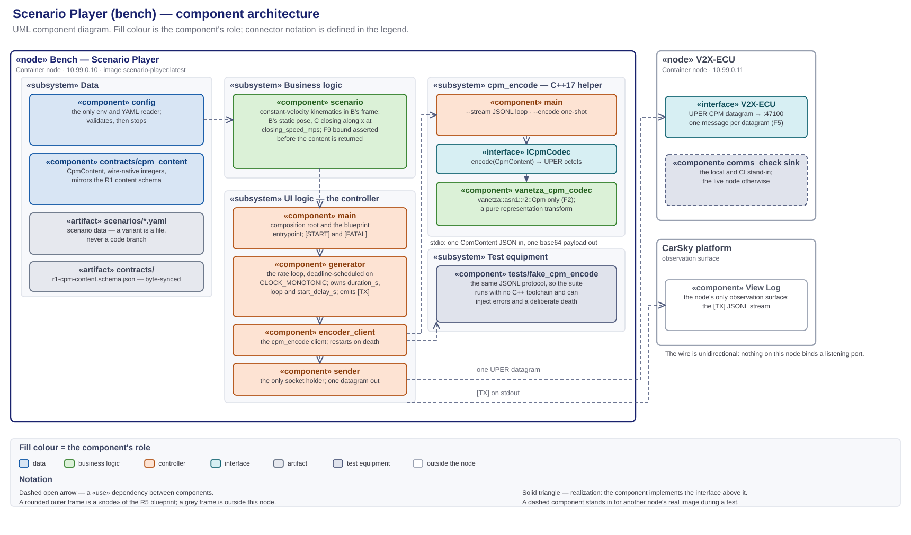

# Scenario Player — high-level design (R11; R1 producer side)

> **The bench node's HLD, and the sole design authority for `Scenario_Player/`.** Every component this node runs, its role, input and output, where it lives, and how the components connect. Decision record: [scenario-player-design-decisions.md](scenario-player-design-decisions.md) (D1–D7). Frozen contract: [r1-cpm-profile.md](../../../contracts/r1-cpm-profile.md) with [r1-cpm-content.schema.json](../../../contracts/r1-cpm-content.schema.json). Node facts: [node-scenario-player.md](../../../requirements/car-sky-guide/node-scenario-player.md).
>
> Diagrams: [scenario-player-module-architecture.svg](scenario-player-module-architecture.svg) (components, paired with its `.drawio`) · [scenario-player-components.puml](scenario-player-components.puml) (module graph) · [phase1-scenario-player-callflow.puml](phase1-scenario-player-callflow.puml) (sequence).

**Abridged version.** A reader who does not need the full document can take the design deck instead: [Phase 1 — Scenario Player Design](../../../presentation/phase1/phase1-design-scenario-player-deck.md) ([HTML](../../../presentation/phase1/phase1-design-scenario-player-deck.html)). It presents this HLD; where the two differ, this document governs.

## 1. Scope and authority

`Scenario_Player/` only — the bench that emulates the Quectel modem's connection point and generates the CPM stream describing vehicle C, up to the datagram leaving this node.

- **In scope:** this folder's Python package, its in-folder C++ encoder helper, the scenario data, the node's one network egress, and the test equipment that exercises the bench alone.
- **Out of scope:** what the V2X ECU does with the message, which is that node's design; the traffic capture, which happens at the V2X interface; the deploy procedure, which the node guide owns; the task breakdown, which the plan owns.

**This is the only design document governing this node.** It fixes the component set and each component's responsibility, every deliverable's path, the seams, the configuration keys, and the evidence log lines.

- **Task planning decomposes from this document plus the requirements report, and nothing else.** Requirement numbers and acceptance come from [m1-cooperative-awareness.md](../../Requirements/m1-cooperative-awareness.md); everything structural comes from here — which component a subtask creates, its path, the interface it satisfies, the log line that closes it.
- **Plans cite; they do not restate.** A brief links the section governing its step, so a change lands in one place.
- **Implementation does not extend this silently.** A component, path or configuration key not designated here is not created ad hoc — the design changes first.
- **The bench is sanctioned test equipment, not a mock to eliminate** (CLAUDE.md governing principle 2). It is a node of the R5 blueprint with its own address, its own image and its own requirement number.
- **What overrides it:** the requirements report, the frozen R1 profile, and the node guide for deployment facts. On conflict, the CLAUDE.md authority order decides.

## 2. Required reading and sourced notes

### Requirement documents

**Read in full before this design is written or changed.** The requirements decide what the node must do; this document only decides how.

| Document | What it fixes for this node |
|---|---|
| [m1-cooperative-awareness.md](../../Requirements/m1-cooperative-awareness.md) — **the authority** | R11 whole — definition, dependency, acceptance, tech stack. R1: the message family and the codec source this node shares. R5/R6: node type, bridge, address, port. §1: the bench emulates the modem connection point and simulates B. §3(c): the self-written Python generator. §4: the standing decisions, restated in D6 |
| [r1-cpm-profile.md](../../../contracts/r1-cpm-profile.md) · [r1-cpm-content.schema.json](../../../contracts/r1-cpm-content.schema.json) | The frozen output contract, field for field, with conventions F1, F2, F5, F8, F9 and VF (§10) |
| [m1-run-timing-and-event-triggering.md](../../../requirements/deprecated/m1-run-timing-and-event-triggering.md) | R20 obliges this node with the bench half of paced stimulus: scenario time advances on `CLOCK_MONOTONIC` deadlines, `start_delay_s` and `reference_time_epoch` are configuration, and `[TX]` carries `mono_ms` (D5). R21's run start is the operator restarting this node — no orchestrator, no trigger message, no clock exchange. R22 fixes the demo cycle this node emits: §6.6's geometry, the cycle period matched to the ego clip, and `start_delay_s` set to the ADA detector's warm-up (D7) |
| [milestone1_high_level_plan.md](../../Plan/milestone1_high_level_plan.md) | §4's R13 gate values, which the committed scenarios are authored against (D3); Phase 1's bench acceptance |
| [node-scenario-player.md](../../../requirements/car-sky-guide/node-scenario-player.md) | Image tag, blueprint `command`, env set, pin and address |

### Research notes

Non-authoritative scratch; on any conflict the CLAUDE.md authority order wins.

| Note | Adopted here |
|---|---|
| [scenario-player-v2x-callflow-messages.md](scenario-player-v2x-callflow-messages.md) | §2's wire model — the bench is the sole talker and the wire is unidirectional, so no listener and no reply path exists here; §4's M1 CPM profile as the content the generator produces; F3's ranked codec-path candidates, from which D1 picks the helper subprocess |
| [phase0-contract-freeze-hld.md](../../../plans/doc/deprecated/phase0-contract-freeze-hld.md) | D3's codec seam (`CpmContent` + `ICpmCodec`, wire-native units) as the exact source this bench reuses; D1's access model — byte-synced copies under `sync-manifest.json`, extended to the codec sources by D2 |

## 3. The component architecture



Source: [research_notes/scenario-player-module-architecture.svg](scenario-player-module-architecture.svg), paired with its [`.drawio`](scenario-player-module-architecture.drawio). The module graph alone is [scenario-player-components.puml](scenario-player-components.puml).

A UML component diagram. Fill colour is the component's role; `«use»` dependencies are dashed with an open arrowhead; realization is dashed with a hollow triangle; a seam is a provided interface meeting a required one. The `player` package is the Python process the blueprint starts; `cpm_encode` is the C++ helper it spawns. Component names below are the short `package/module` form — §4 resolves each to its path.

### MVC separation

Every component sits in exactly one layer, held there by the rule in the right-hand column.

| Layer | Where | Rule that keeps it separate |
|---|---|---|
| **Data** | `player/contracts/cpm_content`, `player/config`, `scenarios/*.yaml`, `tests/fixtures/golden/` | Models and configuration hold no behaviour: `CpmContent` carries wire-native integers and nothing derived, and the YAML is data a new variant is added to, never a code branch |
| **Business logic** | `player/scenario`, and the codec inside `cpm_encode` | Kinematics is a pure function of scenario time; the codec is a pure representation transform. Neither opens a socket, reads env, or logs |
| **UI logic (controller)** | `main`, `player/generator`, `player/encoder_client`, `player/sender` | The controller owns the clock, the subprocess and the socket. It holds no kinematics and no encoding |
| **UI** | none — the node is headless | Observability is the `[TX]` JSONL stream in the CarSky View Log (§12) |

## 4. Folder structure

**The tree designates the path of every component this document names.** The Python package is importable from the image workdir `/app`, which mirrors this folder.

```
Scenario_Player/
├── Dockerfile                      multi-stage, one base image: cmake builds cpm_encode → python runtime (D4)
├── .dockerignore                   keeps doc/ and tests/ out of the build context
├── main.py                         the composition root and the blueprint-fixed entrypoint
├── requirements.txt                runtime: PyYAML
├── requirements-dev.txt            pytest · jsonschema
├── README.md                       one-screen orientation; points here
│
├── player/                         the generator package
│   ├── config.py                   env + scenario-YAML load and validation; the only env reader
│   ├── scenario.py                 the kinematic model: scenario time → CpmContent
│   ├── generator.py                the rate loop, the scenario clock, loop/duration handling
│   ├── encoder_client.py           the persistent cpm_encode client (JSONL ↔ base64)
│   ├── sender.py                   UDP tx to V2X_ECU_HOST:V2X_ECU_PORT
│   └── contracts/cpm_content.py    the CpmContent dataclass, wire-native units
│
├── codec_helper/                   the cpm_encode helper — built into the image, never deployed alone
│   ├── CMakeLists.txt              builds cpm_encode against the pinned Vanetza ASN.1 targets
│   ├── cmake/vanetza-pin.cmake     synced copy (D2)
│   ├── src/main.cpp                the CLI: --stream (JSONL loop) · --encode <file> (one-shot)
│   └── src/codec/                  synced copies of the V2X ECU codec seam (D2) — never edited here
│
├── contracts/r1-cpm-content.schema.json   byte-synced schema copy
├── scenarios/                      scenario data (D3)
│   ├── default.yaml                C approaching: 70 m closing at 5.0 m/s over a 10.0 s cycle (D7)
│   └── c-out-of-range.yaml         C static at 60 m, beyond the R13 exit gate
│
├── tests/
│   ├── fake_cpm_encode.py          the stand-in helper, so the Python suite needs no C++ build
│   ├── test_config.py · test_scenario_kinematics.py · test_generator.py
│   ├── test_encoder_client.py · test_sender.py · test_main.py
│   ├── test_cpm_content_roundtrip.py · test_streams_differ.py
│   ├── test_encoder_golden.py      cpm_encode(golden .json) == golden .uper, byte for byte
│   └── fixtures/golden/            byte-synced golden vectors, .json and .uper
│
└── doc/                            this document, the decision record, the diagrams, research_notes/
```

## 5. Platform and boundary

| Component | Role | Input | Output |
|---|---|---|---|
| **CarSky Container Node** | the platform this node runs on: one pod, one image, no volume | the image pulled from Zot; env from the blueprint node config | a process on the Room network at `10.99.0.10`, and its stdout |
| `«interface»` **V2X-ECU** | the consumer's side of R1 — a dependency on an address, never on an implementation | one UPER CPM datagram per message | nothing; the wire is unidirectional (D6) |
| **View Log** — CarSky | the node's only observation surface | the process stdout | the `[TX]` stream, retrieved live in the Deployment Viewer or over the logs route |

The V2X ECU is a Container node at `10.99.0.11`, listening on UDP `47100`. Two things can stand at that address — the real V2X ECU image, or `tools/comms_check/`'s local loopback sink during a CI run. Nothing on this side changes with the swap.

## 6. Internal components

Each row is one component's single responsibility. A component does what its row says and no more; work fitting no row belongs to a component this document has not defined.

### Business logic

Pure functions of their inputs, free of the clock, the socket and the environment.

| Component | Role | Input | Output |
|---|---|---|---|
| `player/scenario` | the constant-velocity kinematic model in B's frame: B holds the configured static WGS84 pose and heading; C starts at `initial_distance_m` and closes along x at `closing_speed_mps` with a fixed `lateral_offset_m` | scenario time `t`, the reference-time stamp | one `CpmContent` in wire-native units, F9-bound-checked before it is returned |
| `codec_helper/src/codec/` — `VanetzaCpmCodec` behind `ICpmCodec` | the R1 encoder: `CpmContent` → UPER `CollectivePerceptionMessage`, using `vanetza::asn1::r2::Cpm` only (F2). A pure representation transform — no unit conversion, no derivation | `CpmContent` | UPER octets, or an encode error |

### Data

| Component | Role | Input | Output |
|---|---|---|---|
| `player/contracts/cpm_content` | the typed binding of the profiled logical CPM, wire-native integers throughout, mirroring `r1-cpm-content.schema.json` field for field | constructed values, or decoded JSON | the `CpmContent` the scenario emits and the encoder consumes |
| `player/config` | the node's only env reader and the only YAML loader; validates and fails loud, naming the offending key or file | `os.environ`, the file at `SCENARIO_CONFIG` | an immutable `EnvConfig` and `ScenarioConfig` |

### UI logic — the controller

| Component | Role | Input | Output |
|---|---|---|---|
| `main` | the composition root and the blueprint-fixed entrypoint: load config, wire the collaborators, run the loop, and turn any startup or fatal exception into one `[FATAL]` line and a non-zero exit | the process environment | the running generator, `[START]` on entry |
| `player/generator` | the rate loop: sample → encode → send → log, one tick per `1/cpm_rate_hz`, paced against `CLOCK_MONOTONIC` deadlines so scenario time tracks wall time (D5). Owns `duration_s`, `loop` and `start_delay_s`; an encode failure costs one message, never the loop | `ScenarioConfig`, the scenario, the encode and send callables | one datagram and one `[TX]` line per tick; `[ENC-SKIP]` on a lost message |
| `player/encoder_client` | the persistent `cpm_encode --stream` subprocess client: one `CpmContent` JSON per stdin line, one base64 UPER payload per stdout line. A helper death is logged and the helper restarted with backoff — the bench stays alive and observable | `CpmContent` | UPER bytes, or `EncodeError`; `[ENC]` lines on error and restart |
| `player/sender` | the only socket holder: one UDP datagram per encoded message to `V2X_ECU_HOST:V2X_ECU_PORT` | UPER bytes | the byte count sent; `[SND-ERR]` on a transient send failure |

### Configuration and descriptors

Files rather than components.

| Artifact | Role |
|---|---|
| `Scenario_Player/contracts/r1-cpm-content.schema.json` | the byte-synced schema `CpmContent` binds against |
| `scenarios/*.yaml` | scenario data; a new case is a new file, never a new code branch (D3) |
| `Dockerfile` | the two-stage build and the one base image both stages share (D4) |

Every runtime value the deployment wires enters through env; every value the *content* depends on lives in the scenario YAML.

| Env | Default | Meaning |
|---|---|---|
| `SCENARIO_CONFIG` | `/app/scenarios/default.yaml` (blueprint) | the active scenario file |
| `V2X_ECU_HOST` · `V2X_ECU_PORT` | `10.99.0.11` · `47100` (blueprint) | the R1 target peer |
| `ENCODER_PATH` | `/app/cpm_encode` | the helper binary, overridable by tests |

| Scenario key | Default | Meaning |
|---|---|---|
| `name` | — | the scenario's identity |
| `cpm_rate_hz` | `10.0` | tick rate; period `1/cpm_rate_hz` (F8) |
| `duration_s` · `loop` | — · — | cycle length and whether scenario time restarts at its end; a demo cycle's length is the ego clip's length (D7) |
| `start_delay_s` | `0.0` | grace from process start before the first CPM; a demo run sets it to the measured ADA detector warm-up (D5, D7) |
| `reference_time_epoch` | `its` | the epoch `referenceTime` is stamped against (D5) |
| `sender` | — | B's `station_id`, `lat`, `lon`, `heading_deg` |
| `object` | — | C's `object_id`, `initial_distance_m`, `closing_speed_mps`, `lateral_offset_m`, `classification`, `confidence` |

## 7. External related components

Outside the node boundary: the `V2X-ECU` interface and the View Log of §5, plus the contract sources and test equipment below.

- **The codec master lives in `V2X_ECU/src/codec/`.** This folder holds byte-synced copies, gated by `contracts/check_sync.py` (D2). A change to the codec is made there and synced here; a copy edited in place is a drift defect the gate fails on.
- **The golden vectors live in `contracts/golden-vectors/`** and are synced into `tests/fixtures/golden/` as `.json` and `.uper` pairs.

### Test equipment

Scaffolding for exercising the bench alone. Neither piece ships in the node image.

| Component | Role | Input | Output |
|---|---|---|---|
| `tests/fake_cpm_encode.py` | a stand-in speaking the same JSONL protocol as `cpm_encode`, so the Python suite runs with no C++ toolchain and can inject error and death cases on demand | `CpmContent` JSON lines | base64 lines, `{"error": …}` lines, or a deliberate exit |
| `tools/comms_check/send_cpm.py` | the bench-side send stand-in for local and CI runs: sends the golden `.uper` payloads as one datagram each to a target `host:port`. On the platform the live Scenario Player is the sender | the golden vectors | UDP datagrams at the V2X ECU |

## 8. Interfaces, ports and the layer rule

- **`V2X-ECU`** — the node's only outside dependency, and an address rather than an implementation (§5).
- **`udp → 10.99.0.11:47100`** — the egress on `player/sender`, the node's one external endpoint. Nothing else opens a socket, and nothing binds a listening port: the wire is unidirectional (D6).
- **The `cpm_encode` stdio protocol** — the seam between Python and the R1 codec: one JSON object per line in, one base64 payload or one `{"error": …}` object per line out. `encoder_client` requires it; `cpm_encode` and `tests/fake_cpm_encode.py` provide it.
- **`ICpmCodec`** — the frozen codec seam inside the helper, realized by `VanetzaCpmCodec`. It is the same seam the V2X ECU decodes through, which is why the two ends cannot drift.
- **The injected `encode` / `send` / `now` / `sleep` / `log` callables** — the seams that make `generator` testable without a subprocess, a socket or a clock.

No layer is collapsed: the scenario model cannot reach the socket, the sender cannot reach the kinematics, and the codec sees nothing but a `CpmContent`.

## 9. Call flow

[phase1-scenario-player-callflow.puml](phase1-scenario-player-callflow.puml) — PlantUML sequence: config load, helper spawn, then the rate loop sample → encode → send → `[TX]`, with the encode-error, helper-restart and scenario-loop branches.

## 10. The contract — R1, the message set this node produces

**This ECU's contract is its output: R1, the CPM the bench sends to the V2X ECU.** It is the only thing crossing the boundary, and every component from `scenario` onward is written against it. The node produces and never consumes — no reply, no acknowledgement, no inbound message.

| Property | Value |
|---|---|
| Direction | Bench → V2X-ECU, one way |
| Transport | UDP to `10.99.0.11:47100`, one message per datagram, no GeoNetworking/BTP envelope (F5) |
| Encoding | ASN.1 UPER `CollectivePerceptionMessage`, ETSI TS 103 324 v2.1.1, release 2 |
| Normative contract | [r1-cpm-profile.md](../../../contracts/r1-cpm-profile.md) with [r1-cpm-content.schema.json](../../../contracts/r1-cpm-content.schema.json) |
| Node copy | `Scenario_Player/contracts/r1-cpm-content.schema.json`, byte-synced; `player/contracts/cpm_content.py` binds against it |
| Status | Frozen at profile version 1 — a field change is a re-freeze across every consumer |

One message carries exactly two containers and exactly one perceived object. `CpmContent` is the logical model of that message in wire-native integer units; the profile's §3 field table is normative and is not restated here. What this node owes it:

| Obligation | Where it is met |
|---|---|
| Wire-native units only — no SI floats, no derived fields on the wire | `player/contracts/cpm_content`; the SI-to-wire conversion happens in `player/scenario` |
| `object.distance` is never transmitted — the V2X ECU derives it (F7) | `scenario` emits `position.x` / `position.y`; nothing computes a range here |
| `sender.speed` has no CPM field — the V2X ECU derives it from consecutive messages (F1) | the scenario emits B's pose and `referenceTime` per tick, which is what makes that derivation possible |
| `measurementDeltaTime` within ±2047 ms (F9) | asserted by `scenario` before the content leaves it; an out-of-bound value never reaches the encoder |
| Rate 10 Hz by default, never a literal (F8) | `cpm_rate_hz` in the scenario YAML |
| `referenceTime` is `TimestampIts`, ms since 2004-01-01 TAI | the `reference_time_epoch` key, applied by `scenario` (D5) |

## 11. Tech stack, build and CI

No dependency outside this table enters the node without a design change. Traces are to [m1-cooperative-awareness.md](../../Requirements/m1-cooperative-awareness.md) and to the [decision record](scenario-player-design-decisions.md).

| Area | Stack | Trace |
|---|---|---|
| Generator | Python 3.11, standard library plus PyYAML | report §3(c)/(d), R11 |
| Encoder | `cpm_encode`, C++17 over the shared Vanetza ITS2 `r2::Cpm` seam (LGPLv3, dynamically linked) | R11 tech stack "the shared R1 codec"; D1 |
| Transport | standard-library `socket`, UDP | report §3(f), R6 |
| Helper build | CMake ≥ 3.28, Vanetza pinned by `vanetza-pin.cmake`, ASN.1 targets only | D2; report §3(a) |
| Tests | pytest + jsonschema; the helper's golden check runs from pytest against the built binary | Phase 0 toolchain |
| Image | Docker multi-stage, **one base image for both stages** (`python:3.11-slim`), single-platform `linux/arm64`, `--provenance=false --sbom=false` | D4; the cluster rejects a manifest index |

Build commands, from the repo root:

```
python -m pytest Scenario_Player/tests
docker buildx build --platform linux/arm64 --provenance=false --sbom=false -t m1-scenario-player:latest Scenario_Player/
```

| CI lane | File | What it does |
|---|---|---|
| `sp-unit-tests` | [phase1-ci.yml](../../../.github/workflows/phase1-ci.yml) | the pytest suite against the fake helper, on a plain Python runner |
| `sp-codec-helper` | [phase1-ci.yml](../../../.github/workflows/phase1-ci.yml) | builds `cpm_encode` natively and runs `test_encoder_golden.py` against the real binary |
| `scenario-player-image` | [phase1-ci.yml](../../../.github/workflows/phase1-ci.yml) | the `linux/arm64` image build, pushed to Zot when `CARSKY_ZOT_API_KEY` is set |

A green image lane is not evidence that a tag reached the registry — the push step is gated on the secret ([CLAUDE.md § Repository layout](../../../CLAUDE.md)).

## 12. Test strategy

Three configurations exercise the same node, differing only in what stands behind the encoder seam and the socket.

- **Unit — the fake helper.** `tests/fake_cpm_encode.py` behind `encoder_client`, and injected `send` / `now` / `sleep` callables behind `generator`. Proves kinematics, configuration validation, loop semantics and error recovery with no C++ build and no network.
- **Integration — the real helper.** `test_encoder_golden.py` drives the built `cpm_encode` over the frozen golden vectors. This is what makes the bench's bytes the same bytes the V2X ECU decodes.
- **Deployed — the Room.** The bench node against the real V2X ECU, evidenced from both nodes' logs.

**Expected output is identical in the first two for the same `CpmContent`**, because the fake and the real helper differ only in what they put on the wire — so a difference between them is an encoder finding.

| Observable | Produced by |
|---|---|
| `[START] scenario=… target=…` | `main`, once per process |
| `[TX] {"seq":…,"scenario_time_s":…,"bytes":…,"mono_ms":…}` per datagram | `generator` |
| `[ENC-SKIP] {"seq":…,"reason":…}` on an un-encodable sample, the next tick still sending | `generator`, from `encoder_client`'s `EncodeError` |
| `[ENC] helper died — restarting after …` and the stream resuming | `encoder_client` |
| `[SND-ERR] …` on a transient socket error, the loop continuing | `sender` |
| `[FATAL] <type>: <message>` and exit 1 on a bad configuration | `main` |
| `cpm_encode(golden .json) == golden .uper`, byte for byte | `test_encoder_golden.py` over the synced fixtures |
| Two committed scenarios producing different `CpmContent` sequences | `test_streams_differ.py` — R11's acceptance at model level |
| The V2X ECU's `[EVT]` `rx_datagram` → `decode_ok` chain changing when `SCENARIO_CONFIG` is swapped | R11's acceptance at Room level, read on the consumer's log |
| `scenario_time_s` advancing within ±1 % of `mono_ms` over ≥ 60 s | `generator`'s deadline scheduling — R20's K5 (D5) |
| `scenario_time_s` restarting at `duration_s`, one cycle per clip length of wall time | `generator`'s loop handling — the bench half of R22 (D7) |

R11's acceptance is closed by the last two together: the model-level test proves the streams differ by construction, and the consumer's log proves the difference reaches the wire.

## 13. Design decisions

[scenario-player-design-decisions.md](scenario-player-design-decisions.md) — D1–D7, binding on implementation and cited by number throughout this document: the codec path (D1), the synced codec sources (D2), scenarios as data (D3), the runtime composition and the image (D4), the scenario clock and its configuration (D5), the standing decisions (D6), and the R22 demo cycle (D7).
