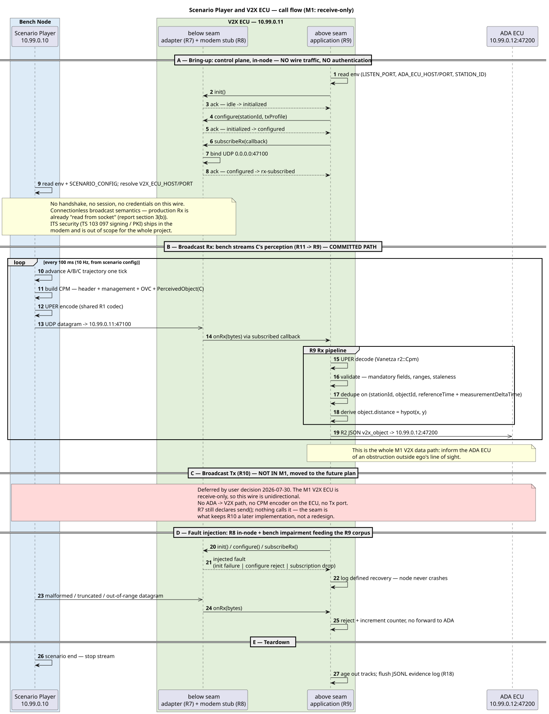

# Scenario Player ↔ V2X ECU — Call Flow & Message Structure

> **Status:** research note. Not authoritative. The authority is [m1-cooperative-awareness.md](../../Requirements/m1-cooperative-awareness.md) — R1, R2, R7–R11 and §3. Findings F1–F9 (§6) need ratification before implementation.
> **Verified against:** ETSI TS 103 324 v2.1.1 ASN.1, ETSI TS 102 894-2 (CDD) v2.1.1, Vanetza `master` — sources in §7.

## 1. Scope

The two nodes and the one wire between them ([baseline topology](../../Requirements/m1-cooperative-awareness.md#baseline-propose-topology)):

| | Node | Address | Role on this wire |
|---|---|---|---|
| **Scenario Player** | Container Node (bench) | `10.99.0.10` | emulates the Quectel modem's connection point; generates CPMs describing vehicle C (R11) |
| **V2X ECU** | Container Node | `10.99.0.11:47100` | receives, decodes, validates, forwards R2 JSON to ADA (R7–R9; R10 deferred) |

Everything below the R7 adapter seam is UDP on the R6 Ethernet Bridge. Above the seam the application is transport-blind — that is the portability goal.

## 2. Call flow

Sections § A – § E, four of them live. Only **§ B** is on the M1 critical path; § A and § D are in-node (no wire traffic). **§ C (ego Tx, R10) is struck out — moved to the future plan** (user decision 2026-07-30); the M1 V2X ECU is receive-only, so the bench→ECU direction is the only live flow.



*Source: [scenario-player-v2x-callflow.puml](scenario-player-v2x-callflow.puml) — re-render after editing with `java -jar plantuml.jar -tsvg -charset UTF-8 scenario-player-v2x-callflow.puml`.*

### 2.1 § A — Bring-up

- The R8 stub is **in-node**, so the `init → configure → subscribeRx` FSM produces **no packets** to the bench. Bench and V2X ECU start independently and in any order.
- On real hardware this block becomes telux `start` + Rx/Tx flow setup; the section exists so that swap stays mechanical (R7 port plan).

### 2.2 § A — Why there is no authentication sub-section

| Layer | M1 answer |
|---|---|
| Session / handshake | None. UDP fire-and-forget — real V2X broadcast has no peer session to authenticate against. |
| ITS message security (IEEE 1609.2 / ETSI TS 103 097 signing, enrolment, PKI) | Out of scope for the whole project — the V2X protocol stack ships in the modem ([§1 Input constraints](../../Requirements/m1-cooperative-awareness.md#input-constraints)). |
| Modem attach / 3GPP registration | Modelled by the R8 stub FSM only (§ A), never on the wire. |
| Network access control | The Room's bridge subnet is the boundary; no in-band credentials. |

Adding a bench↔V2X handshake would **lower** fidelity — production Rx is already "read from socket" ([§3(b)](../../Requirements/m1-cooperative-awareness.md#b-radio-transport-under-the-adapter-seam--serves-r7-r8)). Recommendation: none on the wire.

### 2.3 § B — The committed path

The only flow R19 depends on. Bench is the sole talker; the V2X ECU never requests, acks, or replies.

### 2.4 § C — Ego Tx: moved to the future plan

R10 is deferred (user decision 2026-07-30) — the M1 V2X ECU is receive-only. Consequences on this wire:

- The wire is **unidirectional**: bench → V2X ECU only. No Tx port, no bench listener, no ADA→V2X path (F4 is closed, not open).
- The bench needs a CPM **encoder** only; the V2X ECU needs a **decoder** only. The R1 codec seam still owns both, so the encoder returns with R10 without a contract change.
- R7's `send` stays declared and unimplemented — the seam is what keeps R10 a later implementation rather than a redesign.

## 3. CPM vs DENM

Both are ETSI ITS facility-layer messages carried in the same `ItsPduHeader`, distinguished by `messageId`.

| | **CPM** — Collective Perception Message | **DENM** — Decentralized Environmental Notification Message |
|---|---|---|
| Spec | TS 103 324 v2.1.1 | EN 302 637-3 |
| `messageId` | `cpm (14)` | `denm (1)` |
| Answers | "these are the objects **I perceive**, where they are, how fast, how sure I am" | "an **event** of cause X exists at position P until time T" |
| Third-party kinematics | **Yes** — per-object position, velocity, dimensions, class, confidence | **No** — event position + cause code only |
| Payload shape | ManagementContainer + up to 8 wrapped containers (§4) | management (actionId, detectionTime, eventPosition, validityDuration) + situation (CauseCode / SubCauseCode) + location + alacarte |
| Trigger | periodic, rate-adaptive (1–10 Hz) | event-driven; repeated until validity expires; supports update / cancellation / negation |
| **M1 status** | **The only type implemented** (R1) — bench sends it, V2X ECU decodes it | **Not implemented.** Named family for future hazard types (slippery road, rocks, holes, police…) |

**Why CPM alone satisfies M1:** A must compose `d_AC ≈ d_AB + d_BC`. That needs C's *range and velocity as measured by B* — a DENM cause code cannot carry it, and CAM describes only the sender. One message type, one codec, one profile ([§3(a)](../../Requirements/m1-cooperative-awareness.md#a-v2x-message-family--encoding--serves-r1-r9r11), [decision record](../../Requirements/m1-cooperative-awareness.md#4-decision-record)).

**Cost of adding DENM later:** one codec module + one dispatch entry in the R9 Rx pipeline — deferred, not foreclosed ([Future developments: extensible message-type dispatch](../../Requirements/m1-cooperative-awareness.md#future-developments)).

## 4. CPM message structure

Structural diagram: [cpm-message-structure.drawio](cpm-message-structure.drawio) *(export to `.svg` alongside it to embed, per the repo's drawio+svg pairing)*.

### 4.1 M1 profile — what the bench actually emits

One UDP datagram = one UPER-encoded `CollectivePerceptionMessage` = exactly **2 containers**, exactly **1 perceived object**.

```
CollectivePerceptionMessage
├─ header : ItsPduHeader              protocolVersion=2 · messageId=cpm(14) · stationId=B
└─ payload : CpmPayload
   ├─ managementContainer             referenceTime · referencePosition [· segmentationInfo · messageRateRange]
   └─ cpmContainers (SIZE 1..8)
      ├─ [id=1] OriginatingVehicleContainer    orientationAngle [· pitchAngle · rollAngle · trailerDataSet]
      └─ [id=5] PerceivedObjectContainer       numberOfPerceivedObjects=1 · perceivedObjects[0] → vehicle C
```

Containers `2` (RSU), `3` (SensorInformation) and `4` (PerceptionRegion) are unused in M1.

### 4.2 R1 profile → ASN.1 field mapping

Sample column uses the R2 example values from [R2](../../Requirements/m1-cooperative-awareness.md#contracts).

| R1 profile information | ASN.1 path | Type | Unit / range | Encoded sample |
|---|---|---|---|---|
| Station ID | `header.stationId` | `StationId` | 0..2³²-1 | `1201` |
| — | `header.messageId` | `MessageId` | `cpm(14)` | `14` |
| Reference time | `payload.managementContainer.referenceTime` | `TimestampIts` | 0,001 s since 2004-01-01 TAI | — |
| Sender reference position | `…managementContainer.referencePosition` | `ReferencePosition {latitude, longitude, positionConfidenceEllipse, altitude}` | 10⁻⁷ degree | `210285110` / `1058048170` |
| Sender heading | `…[id=1].orientationAngle.value` | `Wgs84AngleValue` | 0,1 degree · 0..3601 | `900` (= 90,0° East) |
| **Sender speed** | **— no field in CPM r2 —** | — | — | **F1** |
| Perceived object ID | `…[id=5].perceivedObjects[0].objectId` | `Identifier2B` | 0..65535 | `7` |
| Time of measurement | `….measurementDeltaTime` | `DeltaTimeMilliSecondSigned` | 0,001 s · **−2048..2047** | `-50` |
| Object relative position | `….position.xCoordinate.value` / `.yCoordinate.value` | `CartesianCoordinateLarge` | 0,01 m | `2500` / `120` |
| — position confidence | `….position.{x,y}Coordinate.confidence` | `CoordinateConfidence` | 0,01 m · 1..4096 | F6 |
| Object velocity | `….velocity.cartesianVelocity.xVelocity.value` | `VelocityComponentValue` | 0,01 m/s · −16383..16383 | `1520` |
| Object classification | `….classification[0].objectClass.vehicleSubClass` | `TrafficParticipantType` | `passengerCar(5)` | `5` |
| — class confidence | `….classification[0].confidence` | `ConfidenceLevel` | 1..101 (`101`=unavailable) | `95` |
| Object count | `…[id=5].numberOfPerceivedObjects` | `CardinalNumber1B` | 0..255 | `1` |
| **B→C range** (`R2 object.distance`) | **derived, not transmitted** | — | m | **F7** |

`PerceivedObject` carries 14 further OPTIONAL fields (acceleration, angles, dimensions, `objectAge`, `objectPerceptionQuality`, `sensorIdList`, correlation matrices, `mapPosition`). M1 sends none — every one is a future extension point requiring no schema change.

## 5. Tech stack

Copied verbatim from [m1-cooperative-awareness.md](../../Requirements/m1-cooperative-awareness.md) — no re-research.

**Per requirement (§2):**

| Req | Tech stack |
|---|---|
| R1 — CPM contract | [Vanetza](https://github.com/riebl/vanetza) ITS2 ASN.1 codecs (ETSI release-2 CPM, ASN.1 UPER wire encoding; LGPLv3) behind one codec seam shared by every encoder/decoder |
| R2 — V2X→ADA message | nlohmann/json (C++, MIT) |
| R6 — Inter-ECU network | CarSky Ethernet Bridge node; POSIX UDP sockets |
| R7 — Radio adapter seam | — (telux is the mirrored reference API, not a linked dependency) |
| R8 — Modem stub | — |
| R9 — Rx pipeline | Vanetza ITS2 codec; nlohmann/json |
| ~~R10 — Ego Tx~~ | ~~Vanetza ITS2 codec~~ — moved to the future plan |
| R11 — Bench generation | Python; the shared R1 codec (Vanetza-based encoder) |

**Per track (§3 stack summary):**

| Track / node | Language | Key components |
|---|---|---|
| V2X ECU (Container Node) | C++17 | radio adapter seam (R7) + modem stub (R8) + Vanetza CPM decoder + Rx pipeline (R9) — receive-only; ~~ego Tx (R10)~~ deferred |
| Bench (Container Node) | Python | scenario-configurable CPM generation (R11) via the shared R1 codec |

**Selection rationale (§3):**

- **(a) Family + encoding** — Pick: **CPM TS 103 324** (C1: Vanetza ships release-2 CPM codecs; C2: one message, one codec, one profile). Pick: **Vanetza ITS2 as the single codec source behind one codec seam** (C1: one proven codec, golden vectors cannot drift; C4: asn1-only build targets, no full-stack pull-in). Screened out: SAE J2735 BSM (paywalled), asn1tools (no X.681/X.683), raw asn1c (redundant), pycrate (no precompiled CPM).
- **(b) Transport under the seam** — Pick: **thin adapter + modem stub with call-flow FSM and fault injection** (C2: least work that still proves the seam; C3: port plan keeps the real-hardware swap open). Middleware screened out on fidelity.
- **(c) Bench generation** — Pick: **self-written Python generator** driving the shared R1 codec (C1: deterministic, no engine unknowns; C2: smallest build; C4: zero engine dependency). Screened out: MetaDrive, CARLA (GPU-heavy), SUMO (no perception concept).
- **(d) Languages** — **V2X ECU: C++17** (portability is the node's focus goal, telux is a C++ API, Vanetza is C++ so the codec stays in-process). **Bench: Python** (fastest to iterate scenario content; reuses the R1 codec for encoding).

## 6. Findings & open items

Ranked by impact on the R1/R11 freeze.

| # | Finding | Recommendation |
|---|---|---|
| **F1** | **CPM release 2 cannot carry sender speed.** `OriginatingVehicleContainer` is `{orientationAngle, pitchAngle?, rollAngle?, trailerDataSet?}` — heading/speed were dropped from the release-1 (TR 103 562) container. R1's profile table and R2's `sender.speed` both require it. | Keep CPM r2 frozen. Map `sender.heading ← orientationAngle`; make `sender.speed` **derived** at the V2X ECU from consecutive `referenceTime`/`referencePosition` deltas, and **optional** in R2 until two messages have arrived. No committed M1 acceptance criterion consumes B's speed. Fallback if it must be native: `r1::Cpm` (TR 103 562) carries `heading` + `speed` and ships in the same Vanetza build — but that re-freezes R1's family pick. |
| **F2** | **Vanetza's unqualified `asn1::Cpm` aliases `r1::Cpm`** (TR 103 562), not the release-2 type. `#include <vanetza/asn1/cpm.hpp>` and using `asn1::Cpm` silently compiles the wrong wire format. | Use `vanetza::asn1::r2::Cpm` explicitly everywhere; add a CI grep banning bare `asn1::Cpm`. Pin the variant in the golden vectors. |
| **F3** | **Python bench → C++ Vanetza encoder path is unresolved** — standing open item in [CLAUDE.md § Repository layout](../../../CLAUDE.md). | Ranked for [[project-architecture]] to decide in the R11 HLD: (1) a small C++ `cpm_encode` helper built from the same Vanetza target, invoked by Python over stdin/stdout JSON — reuses the exact R1 codec, mirrors the R12 subprocess pattern already sanctioned; (2) pybind11 binding — more toolchain; (3) pre-encoded vectors + byte patching — drifts, fails R11's "different configs → different streams". |
| ~~**F4**~~ | ~~**R10 has no Tx destination.**~~ **Closed by the 2026-07-30 R10 deferral** — the wire is unidirectional, so no Tx host/port is needed. Recorded here because it is the concrete reason R10 could not have been demonstrated as specified. | No action. Re-open with R10: the V2X ECU would need `V2X_TX_HOST`/`V2X_TX_PORT` and the bench a listen port. |
| **F5** | **Datagram encapsulation is undecided** — raw UPER CPM vs a BTP-B/GeoNetworking envelope. R1's acceptance demands the encoding be written into the profile document. | **Raw UPER `CollectivePerceptionMessage`, one PDU per datagram, no GN/BTP.** The GN/BTP stack ships in the modem and is out of scope for the whole project; adding an envelope adds a codec the ECU must strip for no acceptance gain. Write it into the R1 profile doc. |
| **F6** | **Confidence scales do not match.** R2 uses floats 0–1; CPM uses `ConfidenceLevel` 1..101 and `CoordinateConfidence` 1..4096 (0,01 m). | Fix the conversion in the R1 profile: `r2.confidence = ConfidenceLevel / 100` (clamped, `101` → `null`); position confidence converts to metres, not to a 0–1 score — it is an accuracy, not a probability. |
| **F7** | **`R2 object.distance` is derived, not received.** No CPM field carries range; the V2X ECU must compute `hypot(x, y)`. The report's own sample is not self-consistent — `x=25.0, y=1.2` gives `25.03`, not the stated `25.4`. | State the derivation in the R1 profile and correct the R2 sample. R13 admission (30 m threshold) reads this derived value. |
| **F8** | **Message rate is unspecified** in R1 and R11 ("configurable message rates"). | Default **10 Hz (100 ms)**, `cpm_rate_hz` in the scenario YAML — top of the CPM 1–10 Hz range. Never a literal (governing principle 5). |
| **F9** | **`measurementDeltaTime` is bounded to ±2047 ms.** A scenario that timestamps a measurement further from `referenceTime` produces an un-encodable CPM. | Bench-side validation: assert `|measurementDeltaTime| ≤ 2047` before encode; V2X ECU rejects and counts violations in the R9 malformed path. |
| — | **Object velocity frame is ambiguous** — R1 says "C's velocity relative to B"; TS 103 324 expresses `PerceivedObject.velocity` in the sender's cartesian reference frame. | Fix one convention in the R1 profile and state it; the bench and the V2X ECU must not disagree. |

## 7. Sources

- [ETSI TS 103 324 v2.1.1 — CPM ASN.1 (`asn/CPM-PDU-Descriptions.asn`, `CPM-OriginatingStationContainers.asn`, `CPM-PerceivedObjectContainer.asn`)](https://forge.etsi.org/rep/ITS/asn1/cpm_ts103324/-/tree/v2.1.1/asn)
- [ETSI TS 102 894-2 v2.1.1 — Common Data Dictionary (`ETSI-ITS-CDD.asn`)](https://forge.etsi.org/rep/ITS/asn1/cdd_ts102894_2/-/blob/v2.1.1/ETSI-ITS-CDD.asn)
- [ETSI TS 103 324 V2.1.1 specification PDF](https://www.etsi.org/deliver/etsi_ts/103300_103399/103324/02.01.01_60/ts_103324v020101p.pdf)
- [Vanetza `vanetza/asn1/cpm.hpp` — `r1::Cpm` / `r2::Cpm` and the default alias](https://github.com/riebl/vanetza/blob/master/vanetza/asn1/cpm.hpp)
- [Vanetza issue #194 — adding TS 103 324 v2.1.1 CPM](https://github.com/riebl/vanetza/issues/194)
- [ETSI TR 103 562 v2.1.1 — pre-standard CPM (release-1 container with heading/speed)](https://www.etsi.org/deliver/etsi_tr/103500_103599/103562/02.01.01_60/tr_103562v020101p.pdf)
