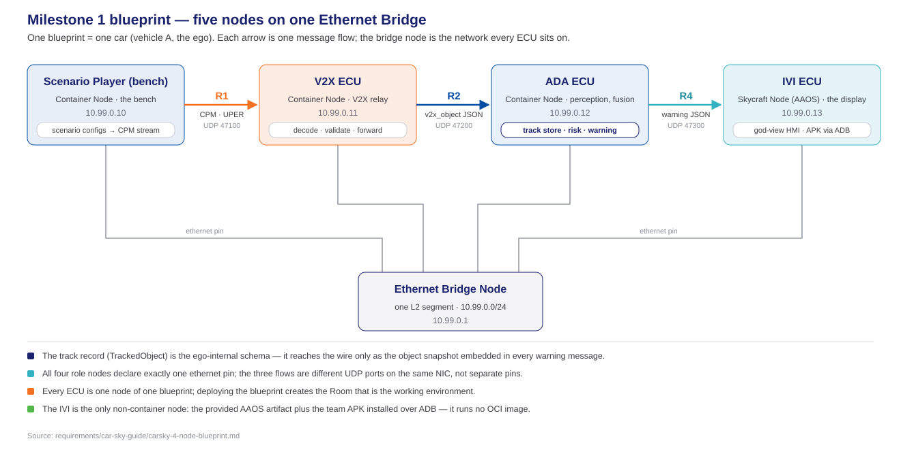
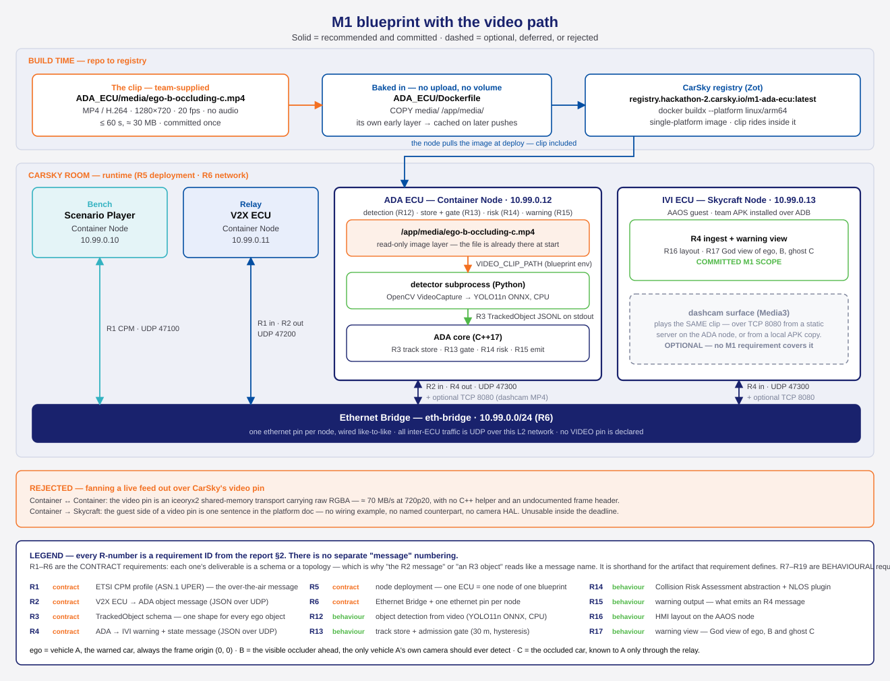

# M1 System Design

> The system-level design authority: the blueprint as a whole — the nodes, the contracts between them, and the network that joins them. Per-node design: [Module Design](../MODULE-DESIGN/README.md), one HLD per node. Requirements authority: [m1-cooperative-awareness.md](../../Requirements/m1-cooperative-awareness.md). Abridged presentation: [system-design-deck.md](../../../presentation/system-design/system-design-deck.md). Diagram sources (`.drawio`) sit beside this file; the copies under `presentation/assets/` are derived.

## Introduction

The system makes a vehicle aware of a hazard it cannot see by relaying another vehicle's perception. Milestone 1 implements one scenario on the CarSky cloud platform: three vehicles in a collinear convoy — A follows B follows C. A's view of C is blocked by B, so A's own sensors can never detect C. B detects C and broadcasts that perception over V2X. A reconstructs C's position by composing its own measurement of B with B's reported measurement of C (`d_AC ≈ d_AB + d_BC`) and renders C as a ghost object, sourced from the relay alone. M1 builds only vehicle A; B and C are simulated by the bench.

## System architecture

### Blueprint design

One blueprint is one car — vehicle A, the ego. Five nodes sit on one Ethernet Bridge: the Scenario Player bench, the V2X-ECU, the ADA-ECU, the IVI-ECU (a Skycraft/AAOS node), and the bridge itself. Each role node declares exactly one `ethernet` pin wired to the bridge — a star, not a chain.

Ethernet is the Milestone 1 network for ease of implementation:

- The bridge is a platform-native node type.
- One L2 segment with static IPv4 addresses needs no routing, no gateway and no broker.
- Every hop is a direct UDP datagram to a known peer.

The choice does not bind the code to the transport:

- Peer addresses and ports are injected by blueprint environment variables, never hardcoded.
- Each node holds its socket in a single component behind a seam.
- A different protocol — a real V2X radio link, another transport — replaces that component and its configuration, not the message logic.

### Data path

#### Messages

The message path is three hops on the wire plus one ego-internal record. Every wire message is one UDP datagram.

| Message | Direction | Purpose |
|---|---|---|
| **R1 — CPM** | Bench → V2X-ECU (`:47100`) | The mocked CPM stream a real V2X radio would deliver. Describes the perceived vehicle C. |
| **R2 — decoded CPM information** | V2X-ECU → ADA-ECU (`:47200`) | One perceived-object update per message, after decode, validation and dedupe. |
| **R3 — tracked object** | ADA-ECU internal | The record every perception source conforms to — relayed C and own-sensor B alike. Feeds the store, the admission gate and the risk assessment. Reaches the wire only as the object snapshot inside R4. |
| **R4 — warning from ADA** | ADA-ECU → IVI-ECU (`:47300`) | The composed scene geometry and risk state the HMI renders. |

**Golden vectors** pin the R1 wire format byte-exactly:

- Each vector is a pair of two files: `<case>.json`, the message content, and `<case>.uper`, its frozen wire encoding — asserted encode/decode-identical.
- The bench encoder and the V2X-ECU decoder test against the same pairs, so the wire format cannot drift between nodes.
- Every case is the nominal message with one stated variation.

| Vector | Pair | Variation vs nominal | Exercises |
|---|---|---|---|
| `nominal` | `nominal.json` · `nominal.uper` | none | The committed happy path |
| `gate-boundary` | `gate-boundary.json` · `gate-boundary.uper` | object position at exactly 30.00 m derived distance | The admission-gate boundary |
| `coord-large` | `coord-large.json` · `coord-large.uper` | maximum coordinate magnitudes | Coordinate bounds and the datagram size budget |
| `mdt-min` | `mdt-min.json` · `mdt-min.uper` | measurement-delta-time at its lower bound | The time-delta lower bound |
| `mdt-max` | `mdt-max.json` · `mdt-max.uper` | measurement-delta-time at its upper bound | The time-delta upper bound |
| `conf-unavailable` | `conf-unavailable.json` · `conf-unavailable.uper` | class confidence set to "unavailable" | The unavailable-confidence mapping |

The information embedded in each CPM:

- The sender's reference position (latitude/longitude) and reference time.
- The sender's station identifier.
- One perceived object: object id, x/y position with confidences, velocity, classification with class confidence, and the measurement delta time.

#### Video path

No live video feed is used in Milestone 1 — live camera bring-up is a frozen scope boundary. The ego video is a saved 10 s clip stored in the ADA-ECU and built into the ADA image as an image layer (`COPY media/` at build time); the node loops it so the occluder B stays detected for a run of any length. The amber loop arrow below marks it as a mocked input, beside the mocked CPM stream:

Video never crosses the network. Information about obstructed objects travels as **tracked-object data forwarded in messages over Ethernet**: the detector turns clip frames into tracked-object records, and the record reaches the wire only as the object snapshot embedded in each warning message. The full topology — build-time clip delivery, the runtime paths, and the rejected live-feed alternative:

### Protocol stack

One transport, two encodings, four contracts. Everything below the encoding row is shared by every flow:

- **Link** — the CarSky Ethernet Bridge node, one L2 segment `10.99.0.0/24`.
- **Network** — IPv4, static addresses `10.99.0.10–.13`, same subnet: no routing, no gateway.
- **Transport** — UDP, one message per datagram, ports `47100`/`47200`/`47300`; no broker, no middleware.
- **Encoding** — the CPM is ASN.1 UPER (ETSI TS 103 324, release 2, ~58 B nominal), the only binary encoding and the only third-party codec (Vanetza). Every other contract is versioned UTF-8 JSON against a committed schema — served by nlohmann/json on the C++ sides and kotlinx.serialization on the IVI, which is why the schema, not either implementation, is the authority.
- **Ego-internal** — the tracked-object schema is not a datagram: it reaches the wire only as the object snapshot inside a warning message.

### Algorithm — state design

Track admission is the risk gate: only a track admitted to the store is published to the collision-risk assessment, so admission is what separates a candidate detection from a hazard the system will warn about. One state machine serves both perception sources — the relayed vehicle C and the own-sensor vehicle B — parameterized only by what counts as an update:

- **`not_tracked`** — absent from the store; a drop erases the entry.
- **`tentative`** — an update within the enter gate creates the entry; repeated updates within the gate accumulate hits until the confirm count promotes the track.
- **`tracked`** — published to the assessment; refreshed by updates within the exit gate, dropped on an update beyond it (the hysteresis drop) or on silence past the timeout.

The gates are distances with hysteresis (enter `30 m`, exit `35 m`, blueprint-configured), and the timeout is a time measured on a monotonic stamp — not a message count, since two sources at independent cadences would turn one count into two different real timeouts. **Vehicle variable speed is not used in the algorithm now**: the admission criterion is fixed distance, and scaling it with traffic speed is a registered future development.

### 3rd Party Libraries

Third-party libraries in the delivered images, per node. Languages: Python 3.11 (bench, ADA detector), C++17 (V2X-ECU, ADA-ECU core), Kotlin 2.2.20 (IVI-ECU).

| Node | Library | License | Usage |
|---|---|---|---|
| Scenario Player | PyYAML 6.0.2 | MIT | Scenario YAML loading |
| Scenario Player | Vanetza ITS2 v26.06 | LGPLv3 (dynamically linked) | ASN.1 UPER encode of the CPM in the `cpm_encode` helper |
| Scenario Player | nlohmann/json 3.11.3 | MIT | JSON binding at the codec seam |
| Scenario Player | pytest ≥ 8 · jsonschema ≥ 4.18 | MIT | Unit tests, schema validation |
| V2X-ECU | Vanetza ITS2 v26.06 | LGPLv3 (dynamically linked) | ASN.1 UPER decode of inbound CPM |
| V2X-ECU | nlohmann/json 3.11.3 | MIT | Outbound object-message JSON and `[EVT]` log lines |
| V2X-ECU | Boost (transitive via Vanetza) | BSL-1.0 | Vanetza runtime dependency |
| V2X-ECU | GoogleTest 1.14.0 | BSD-3-Clause | Unit tests |
| V2X-ECU | tcpdump | BSD | In-container capture for the Wireshark evidence |
| ADA-ECU | nlohmann/json 3.11.3 | MIT | Contract bindings — object message in, tracked-object store, warning out |
| ADA-ECU | ONNX Runtime (CPU) 1.28.0 | MIT | YOLO11n inference session |
| ADA-ECU | YOLO11n (Ultralytics export) | AGPL-3.0 | Object-detection model, committed as ONNX |
| ADA-ECU | opencv-python-headless 5.0.0.93 | Apache-2.0 | Saved-clip frame decode |
| ADA-ECU | numpy 2.4.6 | BSD-3-Clause | Detector pre/post-processing math |
| ADA-ECU | GoogleTest 1.14.0 · pytest ≥ 8 | BSD-3-Clause / MIT | Core and detector unit tests |
| ADA-ECU | tcpdump | BSD | In-container capture for the Wireshark evidence |
| IVI-ECU | Jetpack Compose (BOM 2024.09.03) + Material3 | Apache-2.0 | The HMI layout and the God View canvas |
| IVI-ECU | kotlinx.serialization-json 1.9.0 | Apache-2.0 | Warning-message parsing into the typed model |
| IVI-ECU | kotlinx-coroutines 1.9.0 | Apache-2.0 | Receive loop and state propagation |
| IVI-ECU | Dagger Hilt 2.58 (+ Guava 33.4.0) | Apache-2.0 | Dependency injection |
| IVI-ECU | AndroidX Lifecycle 2.8.6 · activity-compose 1.9.2 | Apache-2.0 | ViewModel, service and Compose integration |
| IVI-ECU | JUnit4 · Robolectric 4.13 · MockK · Turbine | EPL-1.0 / Apache-2.0 / MIT | Unit tests |