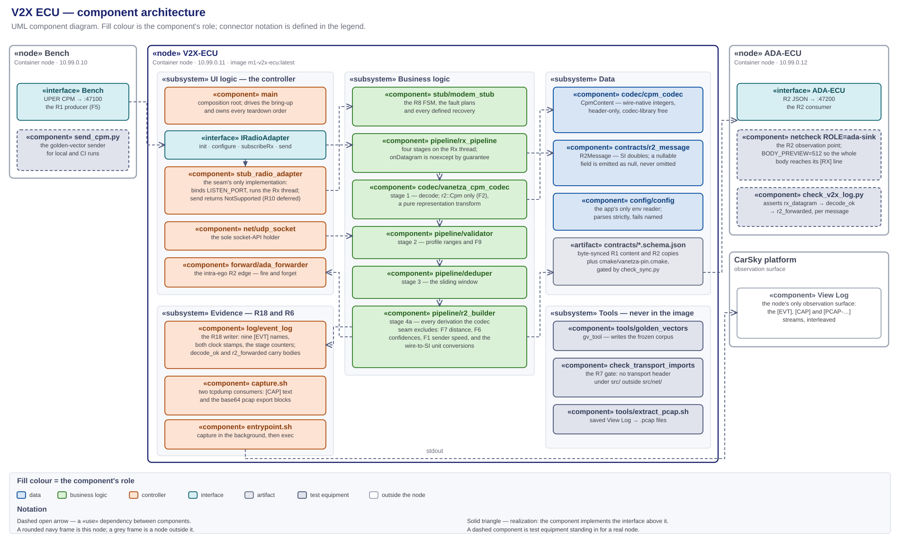

# V2X ECU — high-level design (R7–R9, R18; R1 consumer, R2 producer)

> **The V2X node's HLD, and the sole design authority for `V2X_ECU/`.** Every component this node runs, its role, input and output, where it lives, and how the components connect. Decision record: [v2x-ecu-design-decisions.md](v2x-ecu-design-decisions.md) (D1–D8). Frozen contracts: [r1-cpm-profile.md](../../../contracts/r1-cpm-profile.md) inbound, [r2-v2x-object.schema.json](../../../contracts/r2-v2x-object.schema.json) outbound. Capture retrieval: [traffic-capture-wireshark.md](../../../requirements/car-sky-guide/traffic-capture-wireshark.md). Node facts: [node-v2x-ecu.md](../../../requirements/car-sky-guide/node-v2x-ecu.md). Hardware port: [telux-parity-and-port-plan.md](telux-parity-and-port-plan.md).
>
> Diagrams: [v2x-ecu-module-architecture.svg](v2x-ecu-module-architecture.svg) (components, paired with its `.drawio`) · [v2x-ecu-components.puml](v2x-ecu-components.puml) (module graph) · [phase1-v2x-ecu-callflow.puml](phase1-v2x-ecu-callflow.puml) (sequence) · [phase1-des-protocol-stack.svg](../../../presentation/assets/phase1-des-protocol-stack.svg) (the stack, §8).

**Abridged version.** A reader who does not need the full document can take the design deck instead: [Phase 1 — V2X ECU Design](../../../presentation/phase1/phase1-design-v2x-ecu-deck.md) ([HTML](../../../presentation/phase1/phase1-design-v2x-ecu-deck.html)). It presents this HLD; where the two differ, this document governs.

## 1. Scope and authority

`V2X_ECU/` only — the ego's radio-facing node, from the datagram arriving at the listen port to the R2 message leaving for the ADA ECU, plus the traffic capture taken at this node's interface.

- **In scope:** this folder's C++17 application, the R7 adapter seam and the R8 modem stub behind it, the R9 Rx pipeline, the R18 `[EVT]` stream, the in-container capture, the node's two network endpoints, and the test equipment that exercises the node alone.
- **Out of scope:** what the bench puts on the wire, which is that node's design; what the ADA ECU does with an R2 message; the deploy procedure, which the node guide owns; the task breakdown, which the plan owns.

**This is the only design document governing this node.** It fixes the component set and each component's responsibility, every deliverable's path, the seams, the configuration keys, and the evidence log lines.

- **Task planning decomposes from this document plus the requirements report, and nothing else.** Requirement numbers and acceptance come from [m1-cooperative-awareness.md](../../../requirements/m1-cooperative-awareness.md); everything structural comes from here — which component a subtask creates, its path, the interface it satisfies, the log line that closes it.
- **Plans cite; they do not restate.** A brief links the section governing its step, so a change lands in one place.
- **Implementation does not extend this silently.** A component, path or configuration key not designated here is not created ad hoc — the design changes first.
- **The node is receive-only on the V2X side.** R10 is deferred, so `IRadioAdapter::send` is declared and never called (D2).
- **What overrides it:** the requirements report, the frozen R1 profile and R2 schema, and the node guide for deployment facts. On conflict, the CLAUDE.md authority order decides.

## 2. Required reading and sourced notes

### Requirement documents

**Read in full before this design is written or changed.** The requirements decide what the node must do; this document only decides how.

| Document | What it fixes for this node |
|---|---|
| [m1-cooperative-awareness.md](../../../requirements/m1-cooperative-awareness.md) — **the authority** | R7, R8, R9 whole — definition, dependency, acceptance, tech stack. R1: the message family and the codec seam this node decodes through. R2: the message this node produces. R5/R6: node type, bridge, address, ports. R18: the evidence stream. R10: deferred, so the seam declares `send` and nothing calls it. §1: the node's focus goal is hardware portability, and the whole M1 data path is receive-only. §3(a)/(b)/(d)/(f): the stack. §4: CPM as the only message family, the R10 deferral, the declined telux port, and Vanetza's LGPLv3 dynamic-linking posture |
| [baseline-topology-single-bridge.svg](../../../requirements/baseline-topology-single-bridge.svg) — the report's §1 figure | The four node addresses and the port per hop: this node at `10.99.0.11`, listening on `47100`, forwarding to `10.99.0.12:47200` |
| [r1-cpm-profile.md](../../../contracts/r1-cpm-profile.md) · [r1-cpm-content.schema.json](../../../contracts/r1-cpm-content.schema.json) | The frozen input contract, field for field, with conventions F1, F2, F5, F6, F7, F8, F9 and VF (§10.1) |
| [r2-v2x-object.schema.json](../../../contracts/r2-v2x-object.schema.json) | The frozen output contract, field for field (§10.2) |
| [m1-run-timing-and-event-triggering.md](../../../requirements/m1-run-timing-and-event-triggering.md) | R20's pacing obligation falls on the bench and the ADA detector; this node emits on no schedule of its own and has no scenario clock. What binds here is §6.2's clock-domain ruling and R21's naming of `rxTime` as the project's one cross-node timestamp of record — fixed as D8 |
| [milestone1.md](../../../plans/milestone1.md) | §5's Phase 1 acceptance, which this node's evidence closes (§12); §4's R13 gate values, which the derived `object.distance` feeds |
| [node-v2x-ecu.md](../../../requirements/car-sky-guide/node-v2x-ecu.md) | Image tag, blueprint `command` and `capabilities`, env set, pin and address |
| [traffic-capture-wireshark.md](../../../requirements/car-sky-guide/traffic-capture-wireshark.md) | The retrieval procedure the D5 export format feeds, and the dissection caveat it states |

### Research notes

Non-authoritative scratch; on any conflict the CLAUDE.md authority order wins.

| Note | Adopted here |
|---|---|
| [scenario-player-v2x-callflow-messages.md](../SCENARIO-PLAYER/scenario-player-v2x-callflow-messages.md) | §2's wire model — the bench is the sole talker, so this node binds a port and never sends on the R1 wire, and the bring-up FSM produces no packets; §4.2's ASN.1 field mapping, which the codec seam realizes; findings F1, F6 and F7 placed above the seam in `r2_builder`, F9 in `validator` |
| [baseline-connectivity-smoke-test.md](../../../plans/doc/research_notes/baseline-connectivity-smoke-test.md) | The capture technique D5 adopts — in-container tcpdump, `NET_RAW` flat in `capabilities`, the `/proc/net/dev` counter fallback — and the View-Log-as-retrieval model that both D5's pcap export and D7's on-platform check rest on; `tools/netcheck/` as the R2 observation sink (D6) |
| [phase0-contract-freeze-hld.md](../../../deprecated/phase0-contract-freeze-hld.md) | D3's codec seam (`CpmContent` + `ICpmCodec`, wire-native units) and its rule that every conversion and derivation happens above it; D1's access model — byte-synced copies gated by `sync-manifest.json` |

## 3. The component architecture



Source: [research_notes/v2x-ecu-module-architecture.svg](v2x-ecu-module-architecture.svg), paired with its [`.drawio`](v2x-ecu-module-architecture.drawio). The module graph alone is [v2x-ecu-components.puml](v2x-ecu-components.puml).

A UML component diagram. Fill colour is the component's role; `«use»` dependencies are dashed with an open arrowhead; realization is dashed with a hollow triangle; a seam is a provided interface meeting a required one. The `v2x_ecu` package is the C++ process the blueprint starts; `capture.sh` is the shell process the entrypoint starts beside it. Component names below are the short `dir/file` form — §4 resolves each to its path.

### MVC separation

Every component sits in exactly one layer, held there by the rule in the right-hand column.

| Layer | Where | Rule that keeps it separate |
|---|---|---|
| **Data** | `codec/cpm_codec` (`CpmContent`), `contracts/r2_message` (`R2Message`), `config/config`, `tests/fixtures/` | Models and configuration hold no behaviour: `CpmContent` carries wire-native integers, `R2Message` carries already-derived SI doubles, and `config` validates and stops |
| **Business logic** | `pipeline/validator`, `pipeline/deduper`, `pipeline/r2_builder`, `pipeline/rx_pipeline`, `stub/modem_stub`, `codec/vanetza_cpm_codec` | Not one of them names a socket, an address or an env variable, and both pipeline edges are injected. `tools/check_transport_imports.py` proves it on every CI run (D1) |
| **UI logic** | `main`, `adapter/stub_radio_adapter`, `net/udp_socket`, `forward/ada_forwarder`, `log/event_log`, `capture.sh` | The controller owns the process, the threads, the sockets and the evidence stream. It performs no decode, no validation and no derivation |
| **UI** | none — the node is headless | Observability is the `[EVT]`, `[CAP]` and `[PCAP-…]` streams in the CarSky View Log (§12) |

## 4. Folder structure

**The tree designates the path of every component this document names.** The build context is `V2X_ECU/` alone; the runtime image workdir is `/app`, holding the linked binary and the two shell scripts.

```
V2X_ECU/
├── Dockerfile                      multi-stage: cmake/g++ build → slim runtime + tcpdump (D5)
├── .dockerignore                   keeps doc/ out of the build context
├── .gitattributes                  the .uper fixtures are binary, never line-ending translated
├── entrypoint.sh                   capture.sh in the background, exec ./v2x_ecu in the foreground
├── capture.sh                      the two tcpdump consumers and the pcap export blocks (D5)
├── CMakeLists.txt                  every library, test and executable target (§11)
├── cmake/vanetza-pin.cmake         synced copy of the Vanetza tag and the ASN.1-only target list
├── contracts/                      byte-synced R1 content and R2 schema copies
│
├── src/
│   ├── main.cpp                    the composition root and the scripted bring-up (D2)
│   ├── config/config.{hpp,cpp}     the app's only env reader; the §6 defaults live here alone
│   ├── net/udp_socket.{hpp,cpp}    the sole socket-API holder (D1)
│   ├── adapter/i_radio_adapter.hpp the frozen R7 seam
│   ├── adapter/stub_radio_adapter.{hpp,cpp}   the seam's only implementation; Rx socket + Rx thread
│   ├── stub/modem_stub.{hpp,cpp}   the R8 FSM, the fault plans and every recovery (D2)
│   ├── codec/cpm_codec.hpp         the R1 codec seam: CpmContent + ICpmCodec, header-only
│   ├── codec/vanetza_cpm_codec.{hpp,cpp}      the sole ICpmCodec, r2::Cpm only (F2)
│   ├── contracts/r2_message.{hpp,cpp}         the R2 binding, producer side
│   ├── pipeline/rx_pipeline.{hpp,cpp}         the four-stage entry point (D3)
│   ├── pipeline/validator.{hpp,cpp}           stage 2 — profile ranges and F9
│   ├── pipeline/deduper.{hpp,cpp}             stage 3 — the sliding window
│   ├── pipeline/r2_builder.{hpp,cpp}          stage 4a — F1, F6, F7 and the unit conversions
│   ├── forward/ada_forwarder.{hpp,cpp}        stage 4b — the intra-ego R2 edge
│   └── log/event_log.{hpp,cpp}     the R18 [EVT] JSONL writer and the stage counters (D4)
│
├── tools/                          build-time and host-side only; none ships in the image
│   ├── golden_vectors/main.cpp     gv_tool — writes the frozen corpus into contracts/golden-vectors/
│   ├── check_transport_imports.py  the R7 transport-import gate (D1)
│   └── extract_pcap.sh             saved View Log → .pcap files (D5)
│
├── tests/
│   ├── config/test_config.cpp · net/test_udp_socket.cpp · log/test_event_log.cpp
│   ├── forward/test_ada_forwarder.cpp
│   ├── adapter/test_i_radio_adapter.cpp · test_stub_radio_adapter.cpp
│   ├── stub/test_modem_stub_fsm.cpp           FSM, every fault plan, every recovery
│   ├── codec/test_cpm_content_roundtrip.cpp · test_vanetza_cpm_codec.cpp
│   ├── codec/test_cpm_golden_vectors.cpp      the frozen corpus through the real codec
│   ├── contracts/test_r2_roundtrip.cpp
│   ├── pipeline/test_validator.cpp · test_deduper.cpp · test_r2_builder.cpp
│   ├── pipeline/test_rx_pipeline.cpp          composition, driven by a fake ICpmCodec
│   ├── pipeline/test_rx_pipeline_malformed.cpp   the malformed corpus through the real codec
│   ├── test_sanity.cpp                        the Vanetza ASN.1 link check
│   └── fixtures/
│       ├── golden/                 byte-synced golden vectors, .json and .uper
│       ├── samples/r2-object.json  the byte-synced shared R2 sample
│       └── malformed/              the R9 corpus — a local fixture, not a synced contract
│
└── doc/                            this document, the decision record, the diagrams
```

## 5. Platform and boundary

| Component | Role | Input | Output |
|---|---|---|---|
| **CarSky Container Node** | the platform this node runs on: one pod, one image, no volume | the image pulled from Zot; env and `NET_RAW` from the blueprint node config | two processes on the Room network at `10.99.0.11`, and their stdout |
| `«interface»` **Bench** — the R1 producer | the producer's side of R1 — a dependency on a bound port, never on an implementation | one UPER CPM datagram per message | nothing; the R1 wire is unidirectional (D2) |
| `«interface»` **ADA-ECU** — the R2 consumer | the consumer's side of R2 — a dependency on an address, never on an implementation | one R2 JSON datagram per forwarded message | nothing; there is no reply path |
| **View Log** — CarSky | the node's only observation surface | both processes' stdout | the interleaved `[EVT]`, `[CAP]` and `[PCAP-…]` streams, read live in the Deployment Viewer or saved to a file |

The bench is a Container node at `10.99.0.10`; the ADA ECU is a Container node at `10.99.0.12` listening on `47200`. Two things can stand at either address — the real node image, or the test equipment of §7. Nothing on this side changes with the swap.

## 6. Internal components

Each row is one component's single responsibility. A component does what its row says and no more; work fitting no row belongs to a component this document has not defined.

### Business logic

Pure logic, free of the socket, the address and the environment.

| Component | Role | Input | Output |
|---|---|---|---|
| `codec/vanetza_cpm_codec` — `VanetzaCpmCodec` behind `ICpmCodec` | the R1 decoder: UPER `CollectivePerceptionMessage` → `CpmContent`, using `vanetza::asn1::r2::Cpm` only (F2). A pure representation transform — no unit conversion, no derivation | datagram octets | `CpmContent`, or a `DecodeError` carrying its reason |
| `pipeline/rx_pipeline` | the R9 entry point: the four stages run synchronously on the Rx thread, one datagram in and at most one R2 message out. `onDatagram` is `noexcept` by hard guarantee, so nothing thrown by a stage, a codec or a sink escapes into the Rx thread | datagram octets from the seam's `RxCallback` | one `R2Message` through the injected `R2Sink`, and one `[EVT]` line per stage outcome |
| `pipeline/validator` | stage 2: the profile-range half of semantic validation, including F9's `\|measurementDeltaTime\| ≤ 2047`, which the wire encodes legally and the profile bans. Mandatory-field presence is structural — the seam's `from_json` throws on a missing required key, so a `CpmContent` reaching this stage is complete | `CpmContent` | `std::nullopt`, or the first violation as a typed reason token |
| `pipeline/deduper` | stage 3: duplicate suppression over `(stationId, objectId, referenceTime + measurementDeltaTime)` within a sliding window. Re-seeing a key at or after the window passes and refreshes it, so a message repeated every window + ε is never starved by its own history | `CpmContent` | drop or pass; the map is pruned once per window, bounded by two windows' keys |
| `pipeline/r2_builder` | stage 4a: `CpmContent` → `R2Message`, owning every derivation the codec seam excludes — F7 `distance = hypot(x, y)`, F6's two confidence conversions, F1's sender speed from consecutive `referencePosition`/`referenceTime` deltas per station — plus the wire-to-SI unit conversions. The pipeline's only stateful SI-side stage | `CpmContent`, the receipt timestamp | one `R2Message` |
| `stub/modem_stub` | the R8 FSM `Idle → Initialized → Configured → RxSubscribed`, the `FAULT_PLAN` injection, and every retry, backoff and recovery of D2's table. The illegal-order check runs before any plan, so an out-of-order call is a rejection regardless of the plan | seam calls from the adapter | a `RadioResult` per call, and one `TransitionEvent` per outcome through `TransitionObserver` |

### Data

| Component | Role | Input | Output |
|---|---|---|---|
| `codec/cpm_codec` — `CpmContent` | the typed binding of the profiled logical CPM, wire-native integers throughout, mirroring `r1-cpm-content.schema.json` field for field. Header-only, and free of every codec-library detail (F2) | decoded ASN.1, or JSON | the value the pipeline stages read and the `[EVT] decode_ok` line embeds |
| `contracts/r2_message` — `R2Message` | the typed binding of the R2 schema, producer side. Nullable fields are `std::optional<double>` and the key is always emitted, as `null` when empty — an emitter never omits it | values assigned by the builder | compact JSON for the forwarder, and the object the `[EVT] r2_forwarded` line embeds |
| `config/config` | the app's only env reader: applies the defaults below, parses strictly — `47100x` is rejected, not truncated — validates ranges, and throws `ConfigError` naming the offending variable | an injectable `EnvGetter` over the process environment | an immutable `Config` |

### UI logic — the controller

| Component | Role | Input | Output |
|---|---|---|---|
| `main` | the composition root: load config, construct every collaborator in an order whose reverse is a correct teardown, drive the D2 bring-up `init → configure → subscribeRx`, then block until signalled and join the Rx thread. It adds no retry of its own — a result reaching it is already terminal | the process environment and two signals | the running node, the `[BOOT]` banner, and a stable exit code |
| `adapter/stub_radio_adapter` | the R7 seam's only implementation: straight delegation for `init` and `configure`, plus the transport side of `rx-subscribed` that the pure-logic stub deliberately lacks — bind `LISTEN_PORT`, arm `kRxPollTimeout`, run one Rx thread, deliver each datagram to the subscribed callback. `send` logs and returns `NotSupported` (D2) | seam calls; datagrams from the socket | `RadioResult` per call; `RxCallback` invocations; `[RADIO]` operator text |
| `net/udp_socket` | the only code in this node that includes a transport header (D1): RAII over one fd, move-only, with a receive timeout that returns a distinct `Timeout` outcome rather than an error | bind, send and receive calls | datagrams, byte counts, or a `SocketError` naming the failing call |
| `forward/ada_forwarder` | the intra-ego R2 edge, deliberately outside the R7 seam (D1): serialize to compact JSON and send exactly one datagram to `ADA_ECU_HOST:ADA_ECU_PORT`. Fire and forget — no retry, no queue, and it never throws into the Rx thread | `R2Message` | one datagram, or `false` with one `[FWD-ERR]` line |
| `log/event_log` | the R18 evidence writer: one `[EVT] {json}` line per event, flushed, to stdout always and to `EVENT_LOG_PATH` when set. It owns the cumulative stage counters, so no other component keeps a parallel tally. Thread-safe — the Rx thread and main both log (D4) | event calls from every layer | the nine-name `[EVT]` stream, with `cpm` on `decode_ok` and `r2` on `r2_forwarded` |
| `capture.sh` | the R6 capture: two tcpdump consumers, the live `[CAP]` text and the rotating pcap exported as base64 marker blocks, supervised and degraded rather than fatal (D5) | the interface, `CAPTURE_FILTER` | `[CAP]` lines and `[PCAP-BEGIN <name>]…[PCAP-END]` blocks |
| `entrypoint.sh` | the container command: start `capture.sh` in the background, then `exec` the app so it becomes PID 1 and receives the platform's SIGTERM directly | the blueprint `command` | the two processes, and the app's exit code as the container's |

Exit codes are stable — the D7 lane and the restart policy key on "non-zero is terminal".

| Code | Meaning |
|---|---|
| `0` | signalled shutdown, Rx thread joined |
| `2` | invalid environment; nothing was constructed |
| `3` · `4` · `5` | `init` · `configure` · `subscribeRx` failed terminally after the D2 retries |

### Build-time and host-side tools

Inside this folder, outside the image.

| Tool | Role |
|---|---|
| `tools/golden_vectors/main.cpp` → `gv_tool` | encodes each corpus case, decodes it back, asserts identity, and writes the `.json`/`.uper` pair into `contracts/golden-vectors/` |
| `tools/check_transport_imports.py` | the permanent R7 gate: fails on a transport include anywhere under `src/` outside `src/net/`, and re-asserts the F2 ban on the bare `asn1::Cpm` token (D1) |
| `tools/extract_pcap.sh` | the host side of D5: cuts each export block out of a saved View Log, base64-decodes it, and writes `<name>.pcap` |

### Configuration and descriptors

Files rather than components. Every runtime value the deployment wires enters through env; the defaults live in `src/config/config.cpp` for the app and in `capture.sh` for the capture, and nowhere else — the image sets no `ENV` for any of them.

| Artifact | Role |
|---|---|
| `V2X_ECU/contracts/*.schema.json` | the byte-synced R1 content and R2 schemas the bindings mirror |
| `cmake/vanetza-pin.cmake` | the synced Vanetza tag and the ASN.1-only target list, shared with the bench's codec helper |
| `Dockerfile` | the two-stage build, the identical base tag in both stages, and the LGPLv3 dynamic-link posture (§11) |
| `tests/fixtures/malformed/` | the R9 corpus: empty, truncated, random, bit-flipped, trailing-garbage, oversized, wrong `messageId`, wrong `protocolVersion`, and an r1-variant CPM |

| Env | Default | Meaning |
|---|---|---|
| `LISTEN_PORT` | `47100` | the R1 Rx port, reached through `RadioConfig::rx_port` |
| `ADA_ECU_HOST` · `ADA_ECU_PORT` | `10.99.0.12` · `47200` | the R2 forward target; a set-but-empty host is rejected, never defaulted |
| `FAULT_PLAN` | `none` | the R8 plan: `none` · `init_fail` · `configure_reject` · `subscription_drop` |
| `INIT_RETRY_MAX` · `RETRY_BACKOFF_MS` | `3` · `500` | the bounded-retry ceiling and the constant wait per attempt (D2) |
| `DEDUPE_WINDOW_MS` | `1500` | the stage-3 sliding window |
| `EVENT_LOG_PATH` | *(empty — stdout only)* | the additional R18 file sink |
| `CAPTURE_FILTER` | `udp` | the tcpdump BPF filter; may be multi-word |
| `PCAP_DIR` · `CAPTURE_ROTATE_S` | `/data/capture` · `60` | the rotating pcap directory, and the rotation, export and supervision period |

## 7. External related components

Outside the node boundary: the `Bench` and `ADA-ECU` interfaces and the View Log of §5, plus the contract sources and test equipment below.

- **The contract masters live in `contracts/`.** This folder holds byte-synced copies of the R1 content schema, the R2 schema, the golden vectors and the Vanetza pin, gated by `contracts/check_sync.py`. A copy edited in place is a drift defect the gate fails on.
- **The codec seam's sources are mastered here.** `src/codec/` is the master that `Scenario_Player/codec_helper/src/codec/` is synced from, which is why the encoder and the decoder cannot drift.

### Test equipment

Scaffolding for exercising this node alone. None of it ships in the node image.

| Component | Role | Input | Output |
|---|---|---|---|
| `tools/comms_check/send_cpm.py` | the bench-side send stand-in for local and CI runs: sends the golden `.uper` payloads as one datagram each to a target `host:port`. On the platform the live Scenario Player is the sender (D7) | the golden vectors | UDP datagrams at the listen port |
| `tools/comms_check/check_v2x_log.py` | the receive-evidence assertion: for every message, `rx_datagram` → `decode_ok` carrying the decoded `CpmContent` → `r2_forwarded` carrying the R2 body, with the frozen counters making the pairing exact. Exits non-zero naming the first missing link (D7) | a captured stdout or a saved View Log | pass, or the broken link |
| `tools/netcheck/` as `ROLE=ada-sink` | the R2 observation point standing in for the ADA ECU: `LISTEN_PORT=47200`, no next hop, `BODY_PREVIEW=512` so the whole R2 body reaches its `[RX]` line (D6) | R2 datagrams | one `[RX]` line per message in its own View Log |

## 8. Interfaces, ports and the layer rule

- **`IRadioAdapter`** — the frozen R7 seam, `init · configure · subscribeRx · send` with typed result codes. `main` requires it; `StubRadioAdapter` provides it; a telux-backed implementation is a second provider and the only edit outside its own files is the construction line ([telux-parity-and-port-plan.md §4](telux-parity-and-port-plan.md)).
- **`ICpmCodec`** — the frozen R1 codec seam. `RxPipeline` requires it; `VanetzaCpmCodec` provides it, and a fake provides it under test. It is the same seam the bench encodes through (§7).
- **`R2Sink`** — the pipeline's egress, a `std::function` of the contract type alone. That is what keeps the pipeline transport-blind: `main` binds it to `AdaForwarder::send`, a test binds it to a recorder.
- **`TransitionObserver`** — the stub's outcome seam. `main` is the only component that knows both the stub's vocabulary and the event log's, so it owns the mapping from `EventKind` to `EventLog` method.
- **`EnvGetter`**, the injected `now_ms` sources, and the adapter's `LogSink` — the seams that make configuration, the dedupe window, `rxTime` and the adapter's diagnostics testable without a process environment, a clock or a console.
- **`udp :47100`** — bound on `0.0.0.0` by the adapter's Rx socket, never the node address, which the bridge assigns.
- **`udp → 10.99.0.12:47200`** — the egress on the forwarder's unbound send socket; the kernel picks the source port. Nothing else in the node opens a socket.

No layer is collapsed, and the rule is mechanical rather than cultural: **no file under `src/` outside `src/net/` may include a transport header**, and `tools/check_transport_imports.py` fails CI when one does. The pipeline cannot reach a socket, the socket cannot reach a decode, and the codec sees nothing but octets.

### Protocol stack


Source: [phase1-des-protocol-stack.svg](../../../presentation/assets/phase1-des-protocol-stack.svg).

Both flows share every layer below the encoding row, and this node is where the left column becomes the right one. Which component owns each layer:

| Layer | Owned here by |
|---|---|
| Message | `codec/cpm_codec`'s `CpmContent` inbound (§10.1); `contracts/r2_message`'s `R2Message` outbound (§10.2) |
| Encoding | ASN.1 UPER inbound, UTF-8 JSON outbound — `codec/vanetza_cpm_codec` behind `ICpmCodec`, and the nlohmann binding inside `R2Message` |
| Library | Vanetza serves the inbound encoding and nothing else; nlohmann/json serves the outbound one. The transport rows need no library ([§11](#11-tech-stack-build-and-ci)) |
| Transport, network, link | `net/udp_socket` alone — the layer rule above is what keeps it there |

- **No GeoNetworking and no BTP sit between the encoding and the transport row** (F5). That stack ships in the modem and is out of scope project-wide, which is why Wireshark's ITS dissector reads the R1 payload as opaque UDP data (D5).
- **IPv4 is static and routerless.** The four nodes hold `10.99.0.10` through `.13` on one subnet, and the link layer is the CarSky Ethernet Bridge — a single layer-2 segment over `10.99.0.0/24` (R6).
- **A hardware port replaces the bottom of the left column and nothing above it.** Everything over `IRadioAdapter` is transport-blind, so the swap touches the adapter's own files ([telux-parity-and-port-plan.md](telux-parity-and-port-plan.md)).
- **Both flows cross this node's one interface**, which is what makes it the single capture point for R6 (D5).

## 9. Call flow

[phase1-v2x-ecu-callflow.puml](phase1-v2x-ecu-callflow.puml) — PlantUML sequence: capture start, the in-node bring-up FSM, then the live loop datagram → decode → validate → dedupe → build → forward → `[EVT]`, with the decode-reject, validate-reject, dedupe-drop, bounded-retry and subscription-drop branches marked at their emission points.

## 10. The contract

This node sits between two frozen contracts and translates one into the other. Both are UDP on the R6 bridge, one message per datagram, with no reply in either direction.

### 10.1 R1 — the message set this node consumes, from the bench

| Property | Value |
|---|---|
| Direction | Bench → V2X-ECU, one way |
| Transport | UDP, bound on `0.0.0.0:47100`, no GeoNetworking/BTP envelope (F5) |
| Encoding | ASN.1 UPER `CollectivePerceptionMessage`, ETSI TS 103 324 v2.1.1, release 2 |
| Normative contract | [r1-cpm-profile.md](../../../contracts/r1-cpm-profile.md) with [r1-cpm-content.schema.json](../../../contracts/r1-cpm-content.schema.json) |
| Node copy | `V2X_ECU/contracts/r1-cpm-content.schema.json`, byte-synced; `src/codec/cpm_codec.hpp` binds against it |
| Status | Frozen at profile version 1 — a field change is a re-freeze across every consumer |

One message carries exactly two containers and exactly one perceived object. The profile's §3 field table is normative and is not restated here. What this node owes it:

| Obligation | Where it is met |
|---|---|
| `vanetza::asn1::r2::Cpm` only; the bare release-1 alias is banned under `src/` (F2) | `codec/vanetza_cpm_codec`, gated by `tools/check_transport_imports.py` |
| The codec stays a pure transform; every conversion and derivation happens above it | `pipeline/r2_builder` |
| `\|measurementDeltaTime\| ≤ 2047` rejected and counted, not clamped (F9) | `pipeline/validator`, reason `mdt_f9_range` |
| Malformed or out-of-profile input is rejected and counted, never fatal | `pipeline/rx_pipeline`'s `noexcept` guarantee and the `decode_reject` / `validate_reject` events |
| `PerceivedObject.position` and `.velocity` are read in the sender-B frame (VF) | `pipeline/r2_builder`, which carries the frame through unchanged into R2 |

The rate convention F8 binds the producer, not this node: nothing here assumes an arrival cadence.

### 10.2 R2 — the message set this node produces, for the ADA ECU

| Property | Value |
|---|---|
| Direction | V2X-ECU → ADA-ECU, one way |
| Transport | UDP to `10.99.0.12:47200`, one message per datagram, no framing header |
| Encoding | compact UTF-8 JSON, `schemaVersion: 1`, `type: "v2x_object"` |
| Normative schema | [r2-v2x-object.schema.json](../../../contracts/r2-v2x-object.schema.json) |
| Node copy | `V2X_ECU/contracts/r2-v2x-object.schema.json`, byte-synced; `src/contracts/r2_message.hpp` binds against it |
| Status | Frozen — a field change is a re-freeze across every consumer |

One perceived-object update becomes one R2 message. The schema's field table is normative; what the design fixes is where each value comes from.

| Field | Source |
|---|---|
| `stationId`, `object.objectId`, `object.timeOfMeasurement` | carried through from `CpmContent` unchanged |
| `rxTime` | stamped by `rx_pipeline` at datagram receipt, ms epoch on `CLOCK_REALTIME` — the project's one cross-node timestamp of record (D8) |
| `sender.lat` · `.lon` · `.heading` | the 10⁻⁷ ° and 0,1 ° wire units converted to degrees |
| `sender.speed` | derived from consecutive `referencePosition`/`referenceTime` deltas per station; `null` until the second message from that station (F1) |
| `object.distance` | `hypot(position.x, position.y)` in metres — derived, never on the CPM wire (F7); the input to R13 admission |
| `object.position.confidence` | `CoordinateConfidence × 0,01` metres — an accuracy, not a probability (F6) |
| `object.confidence` | `ConfidenceLevel / 100` clamped to `[0,1]`; `101` becomes `null` (F6) |
| `object.classification` | `"vehicle"` — the profile carries only `passengerCar(5)` |

Evolution is additive: unknown extra keys are ignored on parse, and a nullable field is always emitted as `null` rather than omitted, so a consumer never has to distinguish "absent" from "not yet derived".

## 11. Tech stack, build and CI

No dependency outside this table enters the node without a design change. Traces are to [m1-cooperative-awareness.md](../../../requirements/m1-cooperative-awareness.md) and to the [decision record](v2x-ecu-design-decisions.md).

| Area | Stack | Trace |
|---|---|---|
| Application | C++17, one process, one Rx thread | report §3(d), R7–R9 |
| R1 codec | Vanetza ITS2 `r2::Cpm` (LGPLv3, **dynamically linked**), ASN.1-only targets, pinned by `vanetza-pin.cmake` | report §3(a), R1; §4's licensing decision |
| R2 binding | nlohmann/json 3.11.3 | report R2 tech stack |
| Transport | POSIX UDP through `src/net/` | report §3(b), R6 |
| Build | CMake ≥ 3.28, pinned FetchContent, `Threads::Threads` | the floor comes from the Vanetza pin — see below |
| Tests | GoogleTest 1.14.0 + CTest, one binary per unit | Phase 0 toolchain |
| Capture | tcpdump, coreutils `base64`, mawk — image-installed; Wireshark host-side | D5; report §1 demo table |
| Image | Docker multi-stage, **the same pinned base tag in both stages**, single-platform `linux/arm64`, `--provenance=false --sbom=false` | the cluster rejects a manifest index |

The CMake floor is 3.28 because below it Vanetza's root project adds every component — geonet, security, gnss — to the `ALL` target; `debian:trixie-slim` is the base in both stages because bookworm's CMake is 3.25. The runtime stage stages the Vanetza shared objects onto the loader path and fails the **build** if any dependency is unresolved, so a loader error can never surface as a node stuck at start-up.

Build commands, from the repo root:

```
cmake -S V2X_ECU -B V2X_ECU/build && cmake --build V2X_ECU/build -j "$(nproc)"
ctest --test-dir V2X_ECU/build --output-on-failure
python V2X_ECU/tools/check_transport_imports.py
docker buildx build --platform linux/arm64 --provenance=false --sbom=false -t m1-v2x-ecu:latest V2X_ECU/
```

| CI lane | File | What it does |
|---|---|---|
| `contracts-gate` | [phase0-ci.yml](../../../.github/workflows/phase0-ci.yml) | `contracts/check_sync.py` and the R7 transport-import gate |
| `v2x-core-build` | [phase1-ci.yml](../../../.github/workflows/phase1-ci.yml) | full build, the whole CTest suite, and `gv_tool` run twice for byte-identical determinism |
| `v2x-comms-check` | [phase1-ci.yml](../../../.github/workflows/phase1-ci.yml) | the D7 loopback acceptance (§12) |
| `v2x-ecu-image` | [phase1-ci.yml](../../../.github/workflows/phase1-ci.yml) | the emulated `linux/arm64` image build, pushed to Zot when `CARSKY_ZOT_API_KEY` is set |

A green image lane is not evidence that a tag reached the registry — the push step is gated on the secret ([node-code-layout.md § Build rules](../../../.claude/rules/node-code-layout.md#build-rules-all-container-nodes)).

## 12. Test strategy

Four configurations exercise the same node, differing only in what stands at each end of it.

- **Unit — fakes at every seam.** A fake `ICpmCodec` scripted from the golden JSON, a map-backed `EnvGetter`, injected clocks, a loopback `UdpSocket`, and recording observers. Proves the FSM, every fault plan and recovery, the profile ranges, the window semantics, the F1/F6/F7 derivations and the composition, with no network and no Vanetza link.
- **Integration — the real codec.** `test_cpm_golden_vectors.cpp` decodes the frozen corpus, and `test_rx_pipeline_malformed.cpp` drives the whole pipeline with the real `VanetzaCpmCodec` over `tests/fixtures/malformed/`. A fake codec cannot prove that the actual ASN.1 decoder rejects garbage instead of crashing, which is the point of that suite.
- **Loopback — the comms check.** The `v2x-comms-check` lane runs the built `v2x_ecu` with a UDP sink standing in for the ADA ECU, sends the golden vectors with `send_cpm.py`, and asserts the chain over the captured stdout with `check_v2x_log.py` in expected-vector mode (D7).
- **Deployed — the Room.** The live bench upstream and the §7 sink at the ADA address; the same `check_v2x_log.py` runs in stream mode over a saved View Log.

**Expected output is identical in the last two for the same input vectors**, because only the sender and the sink change — so a difference between them is a bench or platform finding, not a node one.

| Observable | Produced by |
|---|---|
| `[BOOT] v2x_ecu listen_port=… ada_target=… fault_plan=…` | `main`, once per process — which configuration the container actually came up with |
| `[BOOT] bring-up complete, serving Rx on port …` | `main`, after all three seam calls returned `Ok` |
| three `[EVT] stub_transition` lines in the D2 order | `modem_stub`'s observer → `event_log` — R8's scripted call flow acked and logged |
| `[EVT] fault_injected` then `[EVT] recovery` under a non-`none` `FAULT_PLAN` | `modem_stub` — R8's defined, logged recovery per plan |
| `[EVT] rx_datagram` carrying `bytes` | `rx_pipeline`, on the Rx thread |
| `[EVT] decode_ok` carrying the whole `cpm` object | `vanetza_cpm_codec` through `rx_pipeline` — receipt, event and deserialization in one line (D4) |
| `[EVT] r2_forwarded` carrying the whole `r2` object, and the datagram at the ADA address | `r2_builder` → `event_log`; `ada_forwarder` |
| `[EVT] decode_reject` over the whole malformed corpus, counters advancing, zero crashes | `rx_pipeline`'s `noexcept` guarantee — R9's acceptance |
| `[EVT] validate_reject` with reason `mdt_f9_range`, and `[EVT] dedupe_drop` on a repeat | `validator`; `deduper` |
| `[CAP]` lines for both flows, and `[PCAP-BEGIN <name>]…[PCAP-END]` blocks every `CAPTURE_ROTATE_S` | `capture.sh`'s two consumers — R6's captured traffic, retrieved by `tools/extract_pcap.sh` |
| `[FWD-ERR]` on a send failure, the loop continuing | `ada_forwarder` |
| `[SHUTDOWN] signal received, stopping Rx` and exit `0` | `main`, on SIGTERM through `exec` |
| `check_transport_imports.py` exits 0 over `src/` | the R7 gate — the mechanical half of R7's acceptance; the written half is `doc/telux-parity-and-port-plan.md` (§4) |
| a decoded `[EVT] decode_ok` payload equal to a golden `.json`, byte for byte | `test_cpm_golden_vectors.cpp` and `check_v2x_log.py` in expected-vector mode |

The R2 body on the ADA-side `[RX]` line is what closes "R2 messages observed at the ADA ECU carrying decoded bench-scenario values": the values are the bench's scenario, not constants, because swapping `SCENARIO_CONFIG` changes them.

## 13. Design decisions

[v2x-ecu-design-decisions.md](v2x-ecu-design-decisions.md) — D1–D8, binding on implementation and cited by number throughout this document: the module layering and the sole socket holder (D1), the R7 adapter and R8 stub pair (D2), the four-stage Rx pipeline (D3), the R18 payload-carrying event stream (D4), the R6 traffic capture (D5), the ADA-side observation sink (D6), the bench-to-V2X comms-check pair and its CI lane (D7), and the clock domains (D8).
