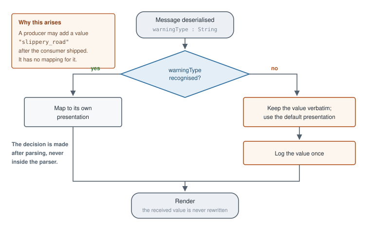
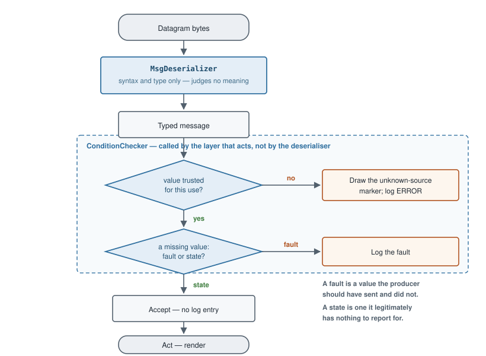

# Parsing UDP messages on the IVI side

## 1. Introduction

The IVI application receives messages as UDP datagrams on a configured port. Each datagram has to be converted into a typed Kotlin object that the presentation layer can consume: the receive path yields raw bytes, and every stage above it — repository, view model, renderer — needs fields with names and types rather than a byte buffer.

The payload is a UTF-8 JSON document. Deserialising it into Kotlin data classes gives compile-time field access, type checking at the boundary, and a single place where a malformed message is rejected. In this project the message exchanged from the ADA-ECU to the IVI-ECU is defined in [r4-ada-ivi.schema.json](../../contracts/r4-ada-ivi.schema.json).

This document covers the consumer side: the structure on the wire, the deserialisation library selected for it, and the handling that library does not provide.

## 2. Message structure

*Source: [message-structure.drawio](message-structure.drawio).*

**One message is one UDP datagram containing one UTF-8 JSON object.** There is no application-layer framing: no length prefix, no envelope, no sequence header. The JSON object is the entire payload.

The link, network and transport headers are removed by the network interface and the kernel before the datagram reaches the application, so an application-level "de-framing" step is not header removal. It is correct slicing of the receive buffer, which is where the defects occur:

- `DatagramPacket.getData()` returns the whole backing array, not the received bytes. The message occupies `data[offset until offset + length]`. Decoding the full array appends residue left by a previous, longer datagram — a silent corruption that appears only when message sizes vary.
- A reused `DatagramPacket` retains the shortened length of the previous receive. Call `packet.setLength(buffer.size)` before every `receive()`, or every datagram after the first is truncated to the shortest length observed.
- **UDP truncates without notification.** If `length == buffer.size`, the datagram may have exceeded the buffer and the remainder is lost. Treat that condition as suspect and log it. A 2 KB buffer is sufficient: a representative warning message is approximately 450 bytes.
- **UDP preserves datagram boundaries.** Unlike a stream transport, no accumulate-and-split logic is required, and none should be implemented.
- Strip a UTF-8 byte-order mark and surrounding whitespace before deserialising. A JSON parser tolerates whitespace but not a leading BOM.

### Message surface

The `type` field discriminates two variants:

| `type` | Required fields | Delivery semantics |
|---|---|---|
| `warning` | `schemaVersion`, `warningType`, `riskState`, `object`, `geometry` | Edge-triggered; raises the warning view |
| `state` | `schemaVersion`, `seq`, `vehicles` | Periodic; last value wins |

Coordinates in `geometry` and `vehicles` are ego-relative and expressed in metres, with `ego` at the origin `(0,0)`. The `geometry.vehicleC` member is nullable and is `null`, not absent, while C is untracked.

An unrecognised `warningType` value must degrade rather than raise — see §4.1.

## 3. Proposed solutions

| Candidate | Assessment | Verdict |
|---|---|---|
| **A. kotlinx.serialization** | First-party Kotlin library; compiler-plugin code generation, so no reflection on Android; sealed-class polymorphism maps directly onto the `type` discriminator; already exercised by round-trip and additive-version tests | **Selected** |
| **B. nlohmann/json through JNI or a native submodule** | A C++ library on an Android runtime. Requires a JNI boundary and an NDK build for a payload the platform already decodes natively, and duplicates a binding that exists on the producer side | Rejected |
| **C. org.json or Gson** | Reflective, untyped or weakly typed; no sealed-hierarchy support, so the discriminator must be branched by hand and every field re-checked at the call site | Rejected |

**nlohmann/json belongs on the C++ producer side.** The element shared between producer and consumer is the JSON schema, not a parser implementation: each side binds the schema in the library idiomatic to its runtime, and the round-trip tests on both sides are what keep the two bindings aligned.

Where a reusable parsing component is wanted inside `IVI_ECU/`, it is a Kotlin Gradle module wrapping the models and the configured deserialiser — see §4.3.

## 4. kotlinx.serialization

The binding declares a sealed `R4Message` type with `@SerialName("warning")` and `@SerialName("state")` subclasses ([R4Message.kt](../../IVI_ECU/app/src/main/java/com/hackathon/v2x/ivi/model/R4Message.kt)), decoded by a `Json` instance configured with `classDiscriminator = "type"` and `ignoreUnknownKeys = true`. Sealed polymorphism performs the variant selection, so no manual branch on `type` is written.

The decoder wrapping it adds failure handling:

| Input | Library behaviour | Decoder result |
|---|---|---|
| Valid `warning` or `state` | Typed subclass | Success |
| Unrecognised additional fields | Discarded (`ignoreUnknownKeys`) | Success — forward compatibility |
| `schemaVersion` above the known value | Plain `Int` field; no gate applied | Success; logged once |
| Unrecognised `warningType` | Plain `String` field; value preserved | Success — see §4.1 |
| Unrecognised `type` discriminator | `SerializationException`; the sealed hierarchy has no matching subclass | Failure, reported as unknown message type |
| Malformed or truncated JSON | `SerializationException` | Failure, reported as malformed |
| Type mismatch, e.g. `"distance": "far"` | `SerializationException` | Failure, reported as malformed |
| Missing required field | `MissingFieldException` | Failure, reported as malformed |

Receive-path design points:

- **Return a result; do not propagate an exception across the receive loop.** A failed deserialisation is logged at WARN with a bounded prefix of the payload, never the entire datagram, and reception continues. One malformed message must not prevent the next valid one from rendering.
- **Keep `isLenient = false`.** Leniency admits unquoted keys and comparable syntax deviations, which conceal producer defects. Forward compatibility is provided by `ignoreUnknownKeys`, which is a separate setting.
- **Do not add runtime schema validation.** Typed deserialisation already enforces required fields and their types; a schema validator executing on the device duplicates that work at runtime cost. Schema conformance is verified by the round-trip tests on both sides.
- **Deserialise off the main thread**, on the IO dispatcher the receive loop already occupies. At 1–10 messages per second the cost is negligible, but the main thread must never block on a socket.
- **Forward compatibility.** A message may carry data the consumer was not built for. Two cases arise: a field holding a value reserved for a feature not implemented yet (§4.1), and a field that arrives `null` where the consumer expects a value (§4.2).

The resulting pipeline:

1. Receive the datagram on the IO dispatcher; capture the byte array and the received length.
2. Decode `data[offset until offset + length]` as UTF-8; reject an empty result.
3. Deserialise into the sealed `R4Message` hierarchy.
4. Apply the semantic checks of §4.2.
5. Publish to the repository flow; view models map the result to UI state.

### 4.1 Reserved and unrecognised values — preserve, then classify above the parser

A format in service reserves fields for unimplemented behaviour and gains enumeration values after its consumers ship. A deployed consumer will therefore receive values it does not recognise.

| Strategy | Consequence |
|---|---|
| Raise | One unrecognised field discards the fields the consumer does understand |
| Substitute a placeholder | Parses, but the received value is lost to the log and to round-trip equality |
| **Preserve, classify above the parser** | The parser transcribes; presentation maps anything unrecognised to a default |

Preserving constrains the model too: declare the field as its wire type, not a closed enumeration — an enumeration forces the recognise-or-fail decision at parse time, which is the decision being deferred.

`warningType` is the worked example. It carries one recognised value today; a later producer may emit `"slippery_road"`, `"black_ice"` or anything else, and a consumer already in the field must show *something* useful without being updated. The flow below is how it handles a value it has never seen:

*Sources: [warning-type-handling.drawio](warning-type-handling.drawio), [warning-type-handling.csv](warning-type-handling.csv).*

Substituting `"unknown"` during deserialisation would pass a "does not crash" check while destroying the record of what arrived, and the log would report an unrecognised value without saying which.

### 4.2 Validation the decoder does not cover

A deserialiser enforces syntax and type; it cannot enforce meaning. Whether a well-formed value may be trusted for a given use, and whether an absent value is a fault or a state, are properties of the application rather than of the schema.

| Question the schema cannot answer | In this message | The check |
|---|---|---|
| May this value be trusted for this use? | `object.source` — valid string, possibly the wrong provenance | Render as relayed only when the source says relayed; anything else draws `[?]` and logs at ERROR |
| Is absence a fault or a state? | `geometry.vehicleC` — `null`, not absent, while C is untracked | Accept `null` as normal; the model declares it nullable and nothing logs it |

Both checks sit in a `ConditionChecker` the acting layer calls, downstream of a `MsgDeserializer` that transcribes and judges nothing:

*Sources: [semantic-check-placement.drawio](semantic-check-placement.drawio), [semantic-check-placement.csv](semantic-check-placement.csv).*

**Advice.** For any field the schema leaves open — free-form string, nullable member, optional object — ask both before writing the consumer:

- **Trust.** Would acting on a wrong value be unsafe or misleading? Then `MsgDeserializer` must not decide it. The acting layer calls `ConditionChecker` on the line before it acts, so the guard and the guarded action are read and changed together. The test of correct placement: deleting the behaviour deletes its guard with it. A guard hoisted into the deserialiser is invisible to the code it protects, and it imposes one trust rule on every other consumer — a recorder, a metrics counter — that may not need it.
- **Absence.** Decide which kind of `null` has arrived. A **fault** is a value the producer should have sent and did not; log it. A **state** is a value the producer legitimately has nothing to report for, such as `geometry.vehicleC` while C is untracked; never log it. An expected `null` reported as an error, at message rate, teaches the reader to ignore the log.

### 4.3 Where the parsing code should live

A **pure Kotlin/JVM Gradle module** holding the models, the configured `Json` instance, and the byte-slice-to-message entry point, depended upon by the application and by the simulator that produces the same messages ([producer-simulation-harness.md](producer-simulation-harness.md)), so that producer and consumer cannot diverge.

- The module carries **no Android dependencies**, which keeps it executable in a plain-JVM test job and reusable from a command-line tool.
- The models currently reside in the application module. Relocating them is a move, not a rewrite: the committed round-trip and additive-version tests move with them and must continue to pass unchanged.
