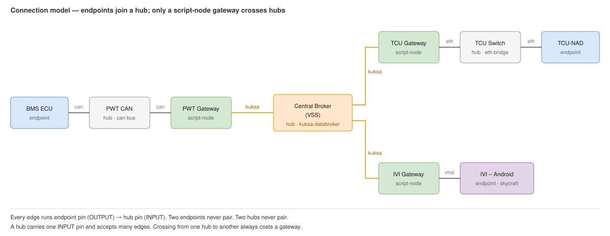

# KUKSA Node Communication — Design Note

How CarSky nodes talk over KUKSA, and why M1 does not adopt it. Referenced from [m1-cooperative-awareness.md §5](m1-cooperative-awareness.md).

## 1. What KUKSA is

- [Eclipse KUKSA](https://github.com/eclipse-kuksa) is an open-source signal broker. gRPC pub/sub over the COVESA VSS schema.
- Nodes publish and subscribe to **named signal paths**. They never address each other by IP.
- A `kuksa-databroker` node is the hub. Every participant wires one `kuksa` pin to it — a star.
- In the trial variant it replaces the baseline `eth-bridge`. R1/R2/R4 payloads ride unchanged inside custom signal values; the contracts are not re-encoded as vehicle signals.
- Topology and node configs: [blueprint-m1-cooperative-awareness-kuksa.json](../../requirements/car-sky-guide/blueprint-m1-cooperative-awareness-kuksa.json).

## 2. KUKSA vs. Ethernet Bridge

| | Ethernet Bridge (R6 baseline) | KUKSA Databroker (trial) |
|---|---|---|
| What it is | Raw L2 segment | VSS signal broker |
| How nodes talk | Direct UDP/TCP sockets | Pub/sub on typed signal paths |
| Addressing | Peer IP and port | Signal path |
| Scriptable over REST | No — `ETHERNET` is absent from the `addPin` enum, so pins are wired by hand in the UI | Yes — `KUKSA` is REST-creatable |
| Payload fit | Natural. Bytes on a socket, no schema | Awkward. Opaque payloads ride in 3 custom `string` signals |
| Status | Committed baseline | Studied alternative, not adopted |

## 3. KUKSA needs a VSS artifact

- The broker config points at a **VSS artifact** through `config.kuksa.vss.artifactId` / `versionId`.
- M1's three paths — bench→V2X CPM, V2X→ADA object, ADA→IVI warning — are in no standard VSS catalog, so a custom tree is required.
- Upload it in the UI: **Artifacts → New Artifact → category VSS → Add Version**. The REST API registers metadata only; it has no file-upload route.
- The returned artifactId and versionId fill the broker node's placeholders.

## 4. Reference topology

§2 treats KUKSA and the bridge as alternatives. In the platform's own reference blueprint [blueprint-KIS.json](../../requirements/development-platform-doc/blueprint-KIS.json) they are **complementary layers**, joined by `script-node` gateways.

### 4.1 Node roles

| Node type | Role | Schema artifact |
|---|---|---|
| `can-bus` | One CAN segment. Decodes frames for its members. | DBC |
| `kuksa-databroker` | Cross-domain source of truth. Typed VSS signals. | VSS tree |
| `script-node` | **The only translator.** Holds pins on two or more buses and moves values between them in sandboxed Lua. | none — inline `scriptContent` |
| `eth-bridge` | Raw L2 segment. No schema, no translation. | none |
| `container` / `skycraft` | Endpoints. Produce or consume; never bridge. | per-node image |

### 4.2 Analysis from sample blueprint



*Source: [kuksa-connection-model.drawio](kuksa-connection-model.drawio)*

Three chains run through the export:

| Chain | Path |
|---|---|
| CAN → KUKSA | `BMS ECU`.can → `PWT CAN` → `PWT Gateway`.can · .kuksa → `Central Broker` |
| KUKSA → Ethernet | `Central Broker` → `TCU Gateway`.kuksa · .eth → `TCU Switch` → `TCU-NAD`.eth |
| KUKSA → VHAL | `Central Broker` → `IVI Gateway`.kuksa · .vhal → `IVI – Android` |

Rules that hold across the whole export:

- **Every bus is hub-and-spoke.** Endpoint pins are `OUTPUT`, hub pins are `INPUT`, edges run `OUTPUT → INPUT`. So `kuksa ↔ kuksa`, `eth ↔ eth`, and `can ↔ can` pairings are impossible by construction.
- **No bus-to-bus edge.** Two hubs cannot be wired together. A gateway is always interposed — `powertrain_gateway.lua` puts it plainly: *"powertrain signals reach other domains ONLY via KUKSA … no CAN-to-CAN bridge here."*
- **Bridge membership is declared on the joining node.** Add an `ethernet` pin to the node and set its `target` to the bridge. There is no port model, so a bridge takes no second pin; its single `eth`/`INPUT` pin stands for the whole broadcast domain, and `pins: []` is also valid.
- **Two bridges are two domains.** KIS's `TCU Switch` and `IVI Switch` are not interconnected. A second bridge does not extend the first.
- **No fan-in limit.** One `INPUT` pin serves many edges, on a bridge or a broker alike. KIS's two-per-bridge is its topology, not a ceiling.
- **A container's ethernet address is optional.** The bridge auto-assigns from its subnet. Set a static address only where a peer needs a fixed IP, or for a Skycraft guest — bridge DHCP binds the guest MAC to the declared address.
- **A node may join several domains.** `TCU Gateway` holds `eth`+`kuksa`; `IVI Gateway` holds `eth`+`kuksa`+`vhal`. In KIS only script-nodes do this, because only they translate. Container nodes carry the same pin types and are not restricted by the platform.

### 4.3 What a pin gives the script

Pins surface in Lua as `pins.<pinname>`. The binding differs per type:

| Pin type | Lua binding | Surface |
|---|---|---|
| `CAN` | `pins.can.db.<Message>.<Signal>` | DBC-decoded signals. `:on_change(fn)` and `:publish(v)` |
| `KUKSA` | `pins.kuksa.vss.Vehicle.<path>` | VSS-typed signals. Same verbs |
| `ETHERNET` | kernel NIC `e-<pinname>` | Raw L2/L3 only, no signal objects. IP is DHCP-assigned; Lua is sandboxed and reads it via `nydus.vsomeip.iface_ip("e-eth")`. The script brings its own protocol |
| `VHAL` | `pins.vhal` | gRPC server on `:9300` for the AAOS guest |

### 4.4 Gateway script shape

CAN → KUKSA. Both sides are decoded signal objects:

```lua
local kuksa, can = pins.kuksa, pins.can
can.db.PWT_VehicleSpeed.Speed_kph:on_change(function(v)
    kuksa.vss.Vehicle.Speed:publish(v or 0)
end)
```

KUKSA → Ethernet. No signal API on the ethernet side, so the script resolves its own IP and speaks a real protocol:

```lua
local LOCAL_IP = nydus.vsomeip.iface_ip("e-eth")
assert(LOCAL_IP, "no IPv4 on e-eth yet — vsomeip cannot bind")
nydus.vsomeip.configure(...)   -- offer SOME/IP service 0x2000, event 0x8001
kuksa.vss.Vehicle.Speed:on_change(function(v) app:notify(...) end)
```

Raw UDP is also available via `nydus.net.udp(addr, port)` with `:on_recv()` and `:send_to()`.

The asymmetry is the point:

- **CAN and KUKSA are schema-typed buses.** The platform decodes them for you. A hop costs a schema artifact.
- **Ethernet is a bare NIC.** A hop costs an application protocol.

### 4.5 Applicability to M1

- M1 carries three opaque payloads: R1 CPM (ASN.1 UPER), R2 JSON, R4 JSON. None are vehicle signals.
- There is no CAN domain and nothing to translate, so the chains in §4.2 reduce to added hops.
- The gateway pattern becomes relevant only if a later milestone introduces real vehicle signals — tracked in [future/m1-future-features-register.md](future/m1-future-features-register.md).

## 5. Conclusion

- **Why it was tried.** `KUKSA` is the only pin type that is REST-creatable and available on Container and Skycraft nodes, with a broker node to star-wire into — the structural analogue of `eth-bridge`.
- **Why it is not the baseline.** It overrides the "why not kuksa" rationale in every node guide, and requirement R6 is frozen. Swapping transport means re-freezing R6 across every consumer, for a payoff that is purely operational.
- **Status.** Studied alternative. The M1 topology that uses it is recorded in [m1-cooperative-awareness.md §5](m1-cooperative-awareness.md).
