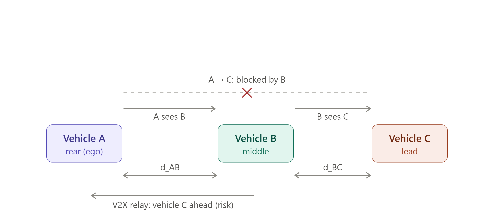
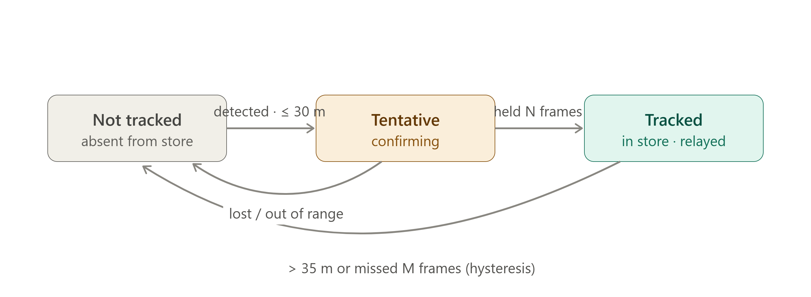

# Milestone 1 — Cooperative Vehicle Awareness (A ← B ← C)

> Requirements, scope, and tech stacks live in the authoritative report [m1-cooperative-awareness.md](../requirements/m1-cooperative-awareness.md) (R1–R19); this plan references R-numbers instead of restating them, and on any conflict the report wins. Phase structure follows the [proposal-deck timeline](../presentation/assets/m1-phase-timeline.svg) (second authority).

## 1. Introduction

Milestone 1 demonstrates **cooperative (non-line-of-sight) awareness** over V2X: making a vehicle aware of a hazard it cannot see, by relaying another vehicle's perception (report §1).

Three vehicles drive in a collinear convoy — **A** follows **B** follows **C**. Vehicle A's view of C is **blocked by B**, so A's own camera can never detect C. Vehicle B sees C and **broadcasts that perception to A over V2X**, and A displays C and its relative position without ever seeing it. **M1 builds only A's vehicle (ego)** — B and C exist as bench-generated V2X messages (R11) and as content of the provided video; the bench Scenario Player is sanctioned test equipment, not a mock to eliminate.

*Objective — B's perception of C reaches A over a V2X relay. A reconstructs C's position by composing its own measurement of B with B's reported measurement of C:* `d_AC ≈ d_AB + d_BC` *(valid for the near-collinear convoy; absolute/GPS composition is a later milestone).*

---

## 2. Scope & Assumptions

Report §1 plus its §4 decision record are the hard scope boundary; each assumption below traces there.

- **Ego-only build on CarSky.** One blueprint with four nodes — V2X ECU, ADA ECU, IVI ECU (provided AAOS), bench Scenario Player — over one Ethernet Bridge (R5, R6); the Cortex-M ECU is omitted.
- **Video is provided** (saved files) — no live camera bring-up. The detector sees **B, the visible occluder** — C is by definition never in ego's frame (R12).
- **Pretrained detector, no training**; CPU-only — no GPU requested from BTC (§4 decisions).
- **Video input spec is unconfirmed** — format / frame rate / data rate are to be studied and proposed to FPT-Mentor (report § Input constraints); Phase 2 carries that study.
- **Wire encoding is standard ASN.1 UPER** via the Vanetza ITS2 codec (R1); JSON is used only on the intra-ego links (R2, R4).
- **Messages are unsigned** — no signing/PKI stack in M1 (the R1 profile carries no security envelope).
- **No GNSS path** — sender pose values originate in bench-generated CPM contents (R11); the IVI renders relative geometry only, no map and no GNSS injection (§4 decisions).
- **Composition assumes a near-collinear, same-heading convoy** (§1 objective note).
- **Risk** is the R14 Collision Risk Assessment (CRA) abstraction with the M1 NLOS plugin on the fixed distance criterion (R13); speed-scaled risk and further hazard types are future plugins (report § Future developments).

---

## 3. Development Plan & Order of Implementation

The plan is **contract-first**: the contracts are the report's R1–R6, frozen in Phase 0 before dependent work, so every later phase is "swap mock data for real data" inside a shape that already works.

> Deviation from the deck, flagged: the deck timeline places the ADA↔IVI message definition inside Phase 2, but the display track (Phase 5) starts in parallel with Phase 2 and must build against a frozen R4 mock — so this plan freezes R4 in Phase 0 with the other contracts (contract-first principle; report authority over deck).

With the contracts frozen, three tracks run in parallel and converge at Phase 6 ([timeline](../presentation/assets/m1-phase-timeline.svg)):

- **Comms track — Phase 1:** V2X ECU + bench Scenario Player exchanging real R1 CPMs (mock perception contents until Phase 6).
- **ADA track — Phase 2 first** (skeleton + store + state machine), **then Phases 3 ∥ 4** side by side. They never call each other — they share only the R3 store: detection (R12) writes `own_sensor` entries through the JSONL subprocess boundary; fusion (R13/R14/R15) consumes the store and the live R2 feed.
- **Display track — Phase 5:** IVI HMI built against mock R4 warnings from the start.

### Order of implementation

> **Step 0 — Phase 0:** freeze R1–R6.
>
> **Step 1 — run three tracks in parallel:** Phase 1 (comms) · Phase 2 → 3 ∥ 4 (ADA) · Phase 5 (display).
>
> **Step 2 — converge:** Phase 6 replaces every mock with real data and records the R19 run.
>
> **Single-developer fallback:** run the phases sequentially 0 → 1 → 2 → 3 → 4 → 5 → 6. The parallel plan is the optimization for multiple people.

### Platform & portability

- Node/blueprint/Room mechanics, deployment steps, and the per-node table: report § Cloud development constraints and R5/R6 — not restated here.
- All team code is plain Linux processes; the V2X ECU touches the radio only through the R7 adapter seam, so the layers above it move to real modem hardware unchanged — that node's focus goal.

---

## 4. Global Definitions

The contracts are defined once, in the report: **R1** CPM profile · **R2** V2X→ADA object message · **R3** TrackedObject schema · **R4** ADA→IVI warning/state messages · **R5** node deployment · **R6** Ethernet-bridge network.

### Track admission gate (R13)

Gate constants are **externalized configuration, never literals**. R13 fixes the 30 m admission threshold; the exit hysteresis and the N/M counters come from its attached state-machine diagram — N and M are proposals to confirm.

| Constant | Value | Meaning |
|---|---|---|
| `gate_enter` | 30 m | admit C when its reported distance (R2 `object.distance`) is within this |
| `gate_exit` | 35 m | drop C only beyond this (hysteresis — no flicker at the boundary) |
| `confirm_hits` (N) | proposed 3 | consecutive in-range updates before admission |
| `miss_limit` (M) | proposed 5 | consecutive missed updates before expiry — **realized as wall-clock, see below** |

**`miss_limit` change of form, awaiting the user's re-ratification.** The [Phase 2–4 ADA HLD, decision D3](../ADA_ECU/doc/ada-ecu-design-decisions.md#d3--r13-admission-one-state-machine-both-sources) implements M as a wall-clock `TRACK_TIMEOUT_MS` (default 1000 ms = 5 periods at the slower of the two sources), not as a count. Reason: "its messages stop" is a time condition that a counter cannot express — nothing arrives to increment it — and the two sources run at independently configured cadences, so one count M would mean two different real timeouts. Intent is unchanged; the form is. Flagged here rather than silently overridden ([phase2_tasks.md § Open items item 1](phase2_tasks.md#open-items--flags-no-phase-2-subtask-may-silently-close-them)).

*Own-sensor objects traverse `not_tracked → tentative → tracked`; relayed C is admitted on R2 distance within the gate, dropped on leaving it or when messages stop, and carries `source = v2x_relayed` only. ~~Ego's own Tx (R10) snapshots `own_sensor` tracks~~ — **R10 moved to the future plan**; the B-side relay trigger is simulated by the bench scenarios (R11), so nothing in M1 consumes an ego Tx snapshot.*

---

## 5. Phases

Per-phase demo methods follow the deck's "defined output for each phase" table. Contradiction fixed, not absorbed: that table labels the HMI row "6" and the integration row "5", contradicting the deck's own timeline and narrative (phases 1, 2, **5** start in parallel; all converge at **6**) — this plan follows the timeline: **Phase 5 = HMI, Phase 6 = convergence**, matching the previous plan's numbering.

### Phase 0 — Freeze the contracts (R1–R6)

**Objective.** Every cross-track contract versioned and committed before dependent work starts.

**Tasks.**
- R1 profile document: fields, units, encoding, and the V2X exchange call flow.
- R2 / R3 / R4 schema files with per-language bindings; golden vectors for the R1 codec seam.
- Blueprint topology decided: node set (R5) and pin/edge wiring matching the communication topology (R6).

**Acceptance Criteria.**
- [x] R1 profile document committed; golden-vector CPMs encode/decode through the Vanetza codec seam.
- [x] R2, R3, R4 schemas committed; round-trip tests pass in each consumer language (C++ / Python / Kotlin).
- [x] The R4 additive-version test is defined (a consumer parsing an unknown `warningType` degrades gracefully).
- [x] Blueprint topology documented (nodes, `ethernet` pins, edges to the bridge) and validated by the baseline connectivity smoke test.

The baseline blueprint deployed as `trial2_minh_netcheck` with all nodes `Running` and smoke-test criteria C1–C5 met ([run record](doc/phase0-smoke-test-run.md)); the non-blocking residuals O3 (MTU headroom) and O4 (AAOS listener) stay open in [phase0_tasks.md](phase0_tasks.md).

### Phase 1 — Comms bring-up: V2X ECU + Scenario Player (R5–R9, R11 — **R10 moved to the future plan**)

**Objective.** Bench CPMs reach the deployed Room and decode into R2 messages at the ADA ECU. **Receive-only** — ego broadcasts nothing.

**Tasks.**
- Build & push the OCI images, author the blueprint, deploy, verify all nodes Running (R5); prove pair-wise UDP reachability (R6).
- Radio adapter seam `init · configure · subscribeRx · send` (R7); modem stub FSM with fault injection (R8).
- Rx pipeline decode → validate → dedupe → forward (R9). ~~Ego Tx via the adapter `send` (R10)~~ — **moved to the future plan; not implemented in M1.** The R7 seam still declares `send`, but nothing calls it.
- Bench scenario-configurable CPM generation (R11).
- V2X-side JSONL event logs (message rx/tx, decode results) — the R18 evidence stream starts here.

**Acceptance Criteria.**
- [ ] The blueprint deploys to a Room; the Deployment Viewer shows every node Running; the team APK launches on the AAOS node (R5).
- [ ] UDP reachability between every communicating pair; traffic captured on the bridge network (R6).
- [ ] CI import check passes — no direct transport imports above the seam; telux parity notes + port plan committed (R7).
- [ ] The full scripted call flow is acked and logged; each injected fault produces a defined, logged recovery (R8).
- [ ] Golden-vector CPMs decode correctly; the malformed-input corpus is fully rejected with zero crashes (R9).
- [ ] Different bench scenario configurations produce observably different message streams (R11).
- [ ] R2 messages observed at the ADA ECU carrying decoded bench-scenario values, not constants (R2).
- [ ] **Demo:** Wireshark capture of V2X PDUs correctly sent/received at the V2X ECU interface.

### Phase 2 — ADA scaffolding: store + state machine, no detector (R3, R13)

**Objective.** Stand up the ADA skeleton, the R3 track store, and the R13 admission state machine on **mock input**, so the pipeline works before any ML.

**Tasks.** Decomposed in [phase2_tasks.md](phase2_tasks.md); design of record is [ada-ecu-hld.md](../ADA_ECU/doc/ada-ecu-hld.md), which realizes [ada-ecu.svg](../requirements/ada-ecu.svg).

- ADA C++17 module skeleton inside [ADA_ECU/](../ADA_ECU/); CRA interface + registry + database schema defined (consumed by R14 in Phase 4).
- R3-shaped store; R13 state machine driven by mock R2 messages and mock own-sensor entries — the mocks are external stimulus (a JSONL fixture through the real detector-reader, real datagrams from `tools/mock_v2x_sender.py`), never a branch inside `src/`.
- Video-input study — **produced**: [video-source-for-r12.md](../ADA_ECU/doc/research_notes/video-source-for-r12.md) §3 is the format / frame rate / data rate proposal for FPT-Mentor (report § Input constraints); what remains is sending it. **The clip itself is already in the repo** (`ADA_ECU/media/ego-b-occluding-c.mp4`, landed by Phase 3 `12.3.7.1`), so nothing here blocks Phase 3.

**Acceptance Criteria.**
- [ ] The store exposes all R3 fields; detector-shaped and relayed-shaped entries enter through the identical interface (R3).
- [ ] Mock-driven state transitions are observable in logs and match the R13 diagram; toggling the mock off yields no tracks.
- [ ] Mock C is admitted only within `gate_enter` and dropped only beyond `gate_exit` or after `miss_limit` — no add/remove flicker.
- [ ] Gate constants are read from configuration — no literals.
- [ ] CRA database schema committed; video-input proposal sent to FPT-Mentor.
- [ ] **Demo:** build + CI round-trip tests green on the frozen contracts (golden vectors).

### Phase 3 — Object detection from video (R12) — runs ∥ with Phase 4

**Objective.** Replace the mock own-sensor input with real detection: a pretrained detector finds **B, the visible occluder**, in the provided video and estimates its distance.

**Tasks.** Decomposed in [phase3_tasks.md](phase3_tasks.md).

- YOLO11n exported to ONNX on ONNX Runtime CPU; OpenCV video decode behind the frame-source seam.
- Per-frame detection + distance estimation; stream R3 JSONL over stdout into the store (subprocess contract — no FFI, no RPC).
- **The clip is landed** at `ADA_ECU/media/ego-b-occluding-c.mp4` with its provenance sidecar (task group 3.7, `12.3.7.1`): openly-licensed dashcam footage under the Pexels License, cut and re-encoded with ffmpeg to the [research note §3 spec](../ADA_ECU/doc/research_notes/video-source-for-r12.md#3-video-input-spec-to-build-phase-3-against) — 1280×720, 20 fps CFR, 200 frames / 10.0 s, ~5 MB. It is baked into the image as one early `COPY media/ /app/media/` layer, the only way a file reaches a Container Node ([m1-video-source-and-ivi-dashcam.md §5](../requirements/m1-video-source-and-ivi-dashcam.md)). B occludes the ego lane in every sampled frame, closing from ~60 m to ~10 m; **C is synthetic** — it exists only as a position the bench asserts over V2X, so "C never visible" holds by construction and what the footage had to avoid was a decoy vehicle held in the ego lane beyond B. The clip is 10 s, and a longer run comes from **looping** it (`DETECTOR_LOOP=true`); reasoning in [the sidecar](../ADA_ECU/media/ego-b-occluding-c.source.md). The synthetic generator stays a CI fixture and cannot produce R12 evidence.

**Acceptance Criteria.**
- [ ] Detection log over the provided clip with per-frame objects and distance estimates (R12).
- [ ] Entries enter the store via the same R3 interface as relayed entries, `source = own_sensor` — mock no longer required.
- [ ] **Zero detections labeled C** — checked on the detection log by `ADA_ECU/tools/check_zero_c.py` (feeds the R19 zero-C check).
- [ ] Runs CPU-only on the provided clip; offline pace acceptable — effective inference rate ≥ 5 Hz (≤ 200 ms per sampled frame) measured on the deployed node. Live detection at speed is future scope.

### Phase 4 — Obscured-object fusion: relayed C + risk + warning (R13–R15) — runs ∥ with Phase 3

**Objective.** ADA turns live R2 traffic into a tracked ghost C, assesses NLOS collision risk through the CRA abstraction, and emits R4 warnings carrying the composed scene.

**Tasks.** Decomposed in [phase4_tasks.md](phase4_tasks.md).

- Relayed-C admission per R13 from R2 `object.distance` (`source = v2x_relayed`).
- CRA abstraction + the M1 NLOS plugin registered through it, reading/writing the Phase 2 database schema (R14).
- Scene composition (ego, B, ghost C — `d_AC = d_AB + d_BC`, lateral offsets component-wise) and edge-triggered R4 warning emission on risk transitions (R15); the periodic awareness state only if time permits (optional).
- ADA-side JSONL event logs (track transitions, risk events) completing the R18 collision-risk event list.
- **The isolated ADA test is where this phase's deployed evidence comes from** — the ADA node exercised alone against a bench emitter standing in for the V2X ECU and a bench sink standing in for the IVI, both from one `tools/ada-bench/` image, over the same addresses and ports the full blueprint uses. Procedure: [deploy-ada-ecu-walkthrough.md](../requirements/car-sky-guide/deploy-ada-ecu-walkthrough.md); decomposition: [phase4_tasks.md](phase4_tasks.md) groups 4.9–4.11. **Its three nodes run two images and GitHub Actions builds and pushes both — `m1-ada-ecu:latest` for the node under test and `m1-ada-bench:latest` for the two mocks, the latter deployed twice under different `ROLE` values. Nothing is built by hand, by anyone, on any machine** ([phase4_tasks.md § Image build and push](phase4_tasks.md#image-build-and-push)); the bench's home in `tools/` is sanctioned by [node-code-layout.md § `tools/`](../.claude/rules/node-code-layout.md#tools--test-equipment-and-ecu-mocks).
- **Then the alternative test — real bench and V2X ECU upstream** ([phase4_tasks.md](phase4_tasks.md) group 4.12, one human subtask). The ADA node stays byte-identical and only its neighbours change: the real Scenario Player at `10.99.0.10` and V2X ECU at `.11` replace the upstream mock, while the sink at `.13` stays a container so a downstream log still exists. Relayed C then originates in a real bench scenario and arrives as a real decoded CPM — the *"with bench scenarios live"* wording of the boxes below, **met without any IVI app**. A swap to `c-out-of-range.yaml` is the negative case in its real-relay form, and R11's own acceptance observed at the ADA node.
- **The full system test is not in this phase**, because it adds the *rendering* half — the God view drawing ghost C — which is R16/R17 and R19. It is planned once, [phase5_minh_tasks.md § Task Group 5.10](phase5_minh_tasks.md#task-group-510--system-verification-test-serves-r4-r5-r6-r16-r17-r18-r19), and re-recorded in Phase 6. Which configuration closes each criterion: [phase4_tasks.md § Acceptance criteria and their closing configuration](phase4_tasks.md#acceptance-criteria-and-their-closing-configuration).

**Acceptance Criteria.**
- [ ] With bench scenarios live, C's track appears with `source = v2x_relayed` only and follows the full R13 lifecycle.
- [ ] The NLOS plugin registers through the CRA interface; the abstraction + database schema are the committed artifacts (R14).
- [ ] At least one R4 warning event per scenario run, carrying the risk state and the composed geometry (R15).
- [ ] The event list reconstructs a full run offline (R18).
- [ ] **Output check:** with a scenario run live, **(a)** the ADA `[EVT]` log shows a `tracked` `own_sensor` TrackedObject for **B** and a `tracked` `v2x_relayed` TrackedObject for **C**, both with full R3 fields, plus at least one `r4_tx` carrying the emitted R4 body; **and (b)** a pcap of ADA→IVI UDP traffic decodes to the same R4 body — C's full R3 TrackedObject in `object`, B's position in `geometry.vehicleB` — correlated to the log by timestamp and length. The frozen R4 carries no full TrackedObject for B; that half is proven from the log, not the wire ([phase4_tasks.md § Phase 4 output acceptance](phase4_tasks.md#phase-4-output-acceptance)).
- [ ] **Demo:** ADA logs — collision-risk event list; optional annotated video export with per-event risk labels (§1 demo table).

### Phase 5 — IVI HMI, mock-driven (R16, R17) — display track, parallel from the start

**Objective.** The IVI renders the warning view — the God view of ego, B, and ghost C — from R4 messages alone, developed against mock warnings and integrated against real data at Phase 6.

**Tasks.** Decomposed in [phase5_minh_tasks.md](phase5_minh_tasks.md) — the authoritative Phase 5 breakdown, and the home of the **system verification test** (group 5.10), which is the only place the 5-node blueprint is run.

- Compose HMI with the R16 layout (central Display area + button/app areas) on the provided AAOS node; UDP ingest service for R4.
- 2D Canvas warning view behind the view seam (R17); optional, only if time permits: SceneView 3D through the same seam, multi-process wake-on-warning.
- **Not in this phase:** the ego video clip display ("dashcam view") in the Display area — deferred, confirmed by the user 2026-08-02. Itemized in [§6](#6-deferred-to-later-milestones).

**Acceptance Criteria.**
- [ ] The HMI runs on the AAOS node with the R16 layout; button/app areas switch what the Display area shows.
- [ ] **(Dev)** A mock R4 warning brings the warning view up showing ego, B, and ghost C at the composed positions.
- [ ] Ghost C renders from `v2x_relayed` data only; the 2D drawing is delivered (R17 — 3D stays optional).
- [ ] A newer message with an unknown `warningType` degrades gracefully (R4 additive-version test).
- [ ] Optional paths, only if built: an ADA message wakes the separate warning app; 3D renders through the view seam.

### Phase 6 — Convergence: real data end-to-end (R18, R19 — **R10 moved to the future plan**)

**Objective.** Replace every mock with **real** data and record the definition-of-done run — a swap-and-verify step, not a new build.

**Tasks.**
- Point the IVI at live ADA output. ~~Feed ego Tx (R10) from the real R12 store snapshot instead of mock contents.~~ — **moved to the future plan.**
- Full-chain rehearsal bench → V2X ECU → ADA → IVI across bench scenarios (e.g. C approaching vs C out of range).
- Record the R19 run with its captures.

**Acceptance Criteria.**
- [ ] No mocks anywhere in the ego path (the bench is sanctioned test equipment, not a mock).
- ~~[ ] Ego Tx frames captured on the bridge carry live store data, not constants (R10).~~ — **moved to the future plan; not an M1 acceptance criterion.**
- [ ] One continuous recorded run: the IVI warns and renders ghost C from `v2x_relayed` only, while the R12 detection log shows zero C for the whole run (R19).
- [ ] Wireshark/pcap of the V2X exchange and of the ADA→IVI traffic corroborates the chain (R15, R19).
- [ ] Every §1 demo-evidence method that cites logs is producible from the R18 logs.

---

## 6. Deferred to Later Milestones

The single source is the report's § Future developments, mirrored in the [future-features register](../requirements/future/m1-future-features-register.md). Standing M1 exclusions live in the report's §4 decision record (**R10 ego Tx deferred — the V2X ECU is receive-only**, Cortex-M omitted, telux port declined, 3D and multi-process optional, ego video clip deferred, no GPU, no map/GNSS on the IVI).

**Ego video clip display on the IVI — re-confirmed deferred, 2026-08-02.** [m1-video-source-and-ivi-dashcam.md §4/§6](../requirements/m1-video-source-and-ivi-dashcam.md) contains a worked design for it (option B4: ADA serves its own clip over HTTP, the IVI plays it with Media3), and §8 flags that adopting it needs the user's word. **The user's word was no.** The design stays on the shelf, and **no Phase 3, 4, 5 or 6 subtask may implement any part of it** — HTTP clip serving from the ADA node (a `http.server` line in the entrypoint, `CLIP_HTTP_ENABLED` / `CLIP_HTTP_PORT`), an `exposedPorts` entry and its gateway route, Media3/ExoPlayer and a `DASHCAM_MEDIA_URI`, a dashcam `DisplayMode`, a raw-resource clip copy in the APK and its size cost (fallback B5), any `video` pin (an R5/R6 re-freeze), or real-time detector pacing as a *requirement* ([phase3_tasks.md open item 6](phase3_tasks.md#open-items--flags-no-phase-3-subtask-may-silently-close-them)). §6 is where each has its concrete shape; reading it is not permission to build it.

## 7. Definition of Done

R19: all phases pass their acceptance criteria, and one continuous recorded run shows **vehicle C appearing on ego's IVI purely via the V2X relay** — ghost C rendered from `v2x_relayed` data only, zero direct C detections in ego's own perception — corroborated by the R19 captures.
