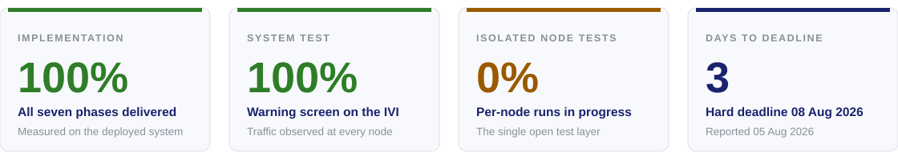
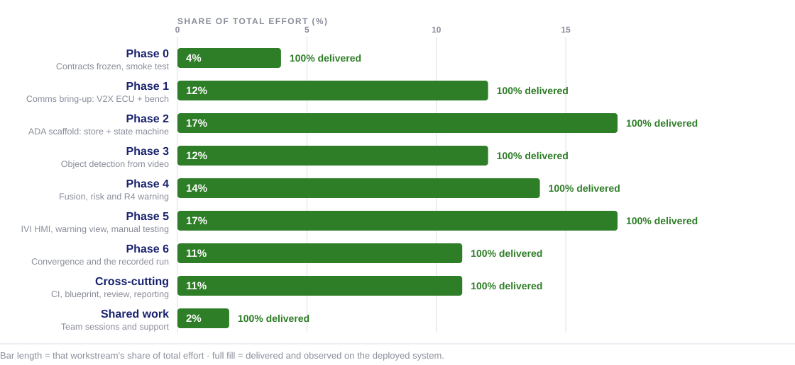
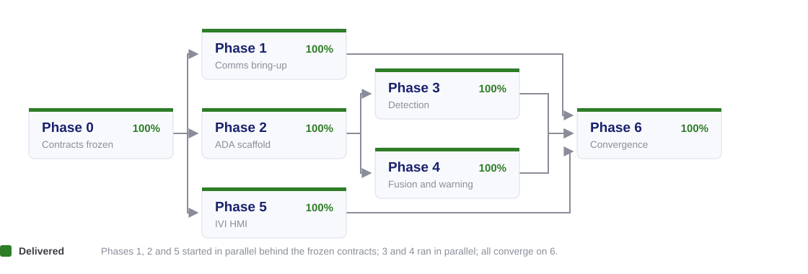
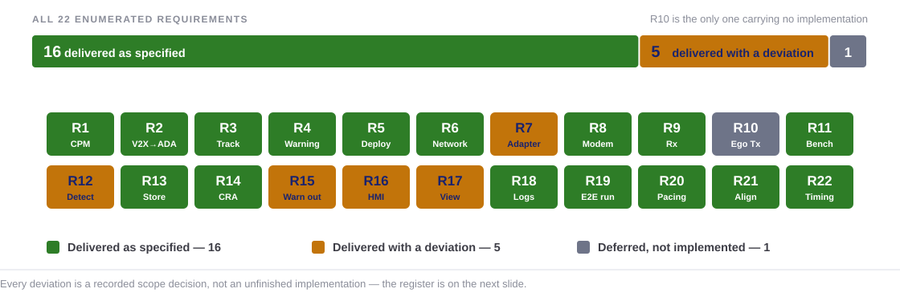
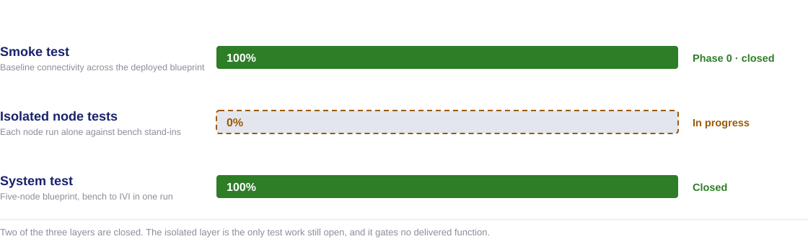
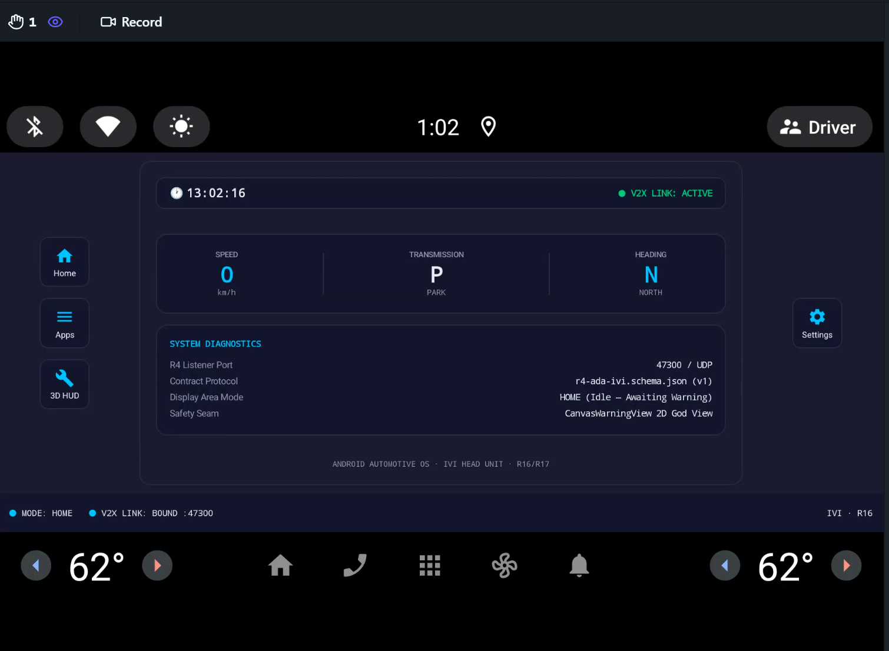
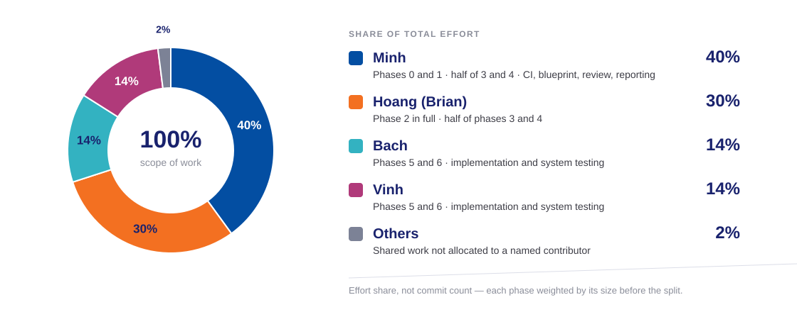
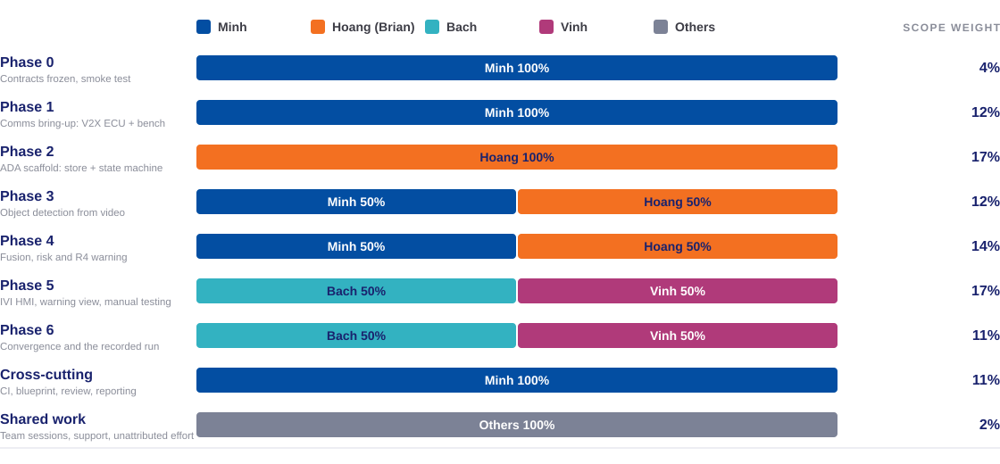
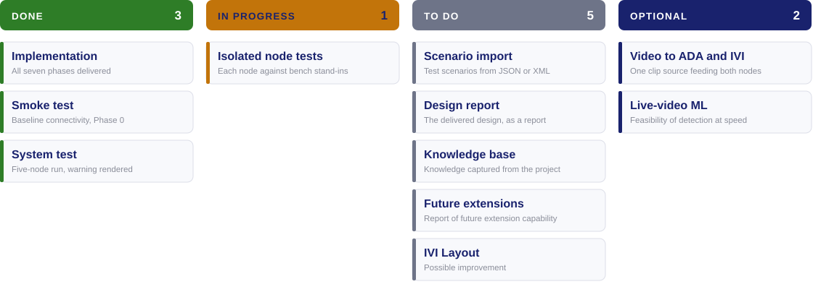

<!-- _class: lead -->
<!-- _paginate: false -->

# Milestone 1 — Progress Report

## Implementation complete · system test passed · three days to the deadline

**Cooperative Vehicle Awareness — FPT Hackathon 2026**

Reported 05 August 2026 · hard deadline 08 August 2026 · four contributors

Sources: [m1-cooperative-awareness.md](../../requirements/m1-cooperative-awareness.md) · [milestone1.md](../../plans/milestone1.md) · the recorded system-test run

---

# Table of contents

1. **Status at a glance** — the headline numbers and how they are measured
2. **Implementation** — progress by workstream, and what each phase delivered
3. **Requirement coverage** — the 22 requirements and the six that deviate
4. **Testing** — the three test layers and what each one proves
5. **Acceptance evidence** — the three surfaces a claim is read from
6. **Contribution** — scope of work by contributor
7. **Remaining work** — what is open, what is optional, and what it blocks

---

<!-- _class: lead -->

# 01 · Status at a glance

---

# Headline status

The system does the thing the milestone was defined by: **vehicle A warns its driver about vehicle C, which A's own sensors never see.**

- **Implementation is complete** across all seven phases, including Phase 6 convergence on real data.
- **The system test passed** — the warning screen renders on the IVI, and traffic was observed from every node in the blueprint.
- **One test layer is open** — the isolated per-node runs. It gates no delivered function.
- **Six requirements deviate** from the enumerated list; every deviation is a recorded scope decision.

---

# Basis of the completion figures

Percentages here come from **observable system behaviour**, not from a task board.

- **Delivered means seen working.** A function counts once it is observed in a deployed run, end to end.
- **Closed tickets are not the measure.** A closed subtask that changes nothing observable adds no percentage, and an open one whose behaviour is already live subtracts none.
- **Phases are weighted before they are combined.** They are not equal in size, so an unweighted average would flatter the small ones and hide the large ones.
- **Manual testing is counted as work.** It is the expensive part of the later phases, and the weights carry it rather than treating it as free.

| Workstream | Weight | Why it carries that weight |
|---|---|---|
| Phase 0 · contracts | 4% | Contract documents, schemas, and a single connectivity smoke test |
| Phase 1 · comms | 12% | Two node folders in two languages, plus the shared codec seam |
| Phase 2 · ADA scaffold | 17% | The ADA skeleton, the track store, and the admission state machine |
| Phase 3 · detection | 12% | Detector export, video decode, distance estimation, subprocess contract |
| Phase 4 · fusion | 14% | Relayed-object fusion, risk abstraction, warning emission, isolated bench |
| Phase 5 · IVI HMI | 17% | The HMI, the warning view, and the manual system testing built around it |
| Phase 6 · convergence | 11% | Small to build, but it carries the manual end-to-end testing and the recorded run |
| Cross-cutting | 11% | CI lanes, blueprint design, code review, management and reporting |
| Shared work | 2% | Team sessions, support, and effort not allocated to one contributor |

---

<!-- _class: lead -->

# 02 · Implementation

---

# Progress by workstream

> **Every workstream is complete.** The chart's shape carries the second message: phases 2 and 5 are more than four times Phase 0, so "seven phases done" and "the whole system done" are only the same statement once the phases are weighted.

---

# Phase dependency and parallelism

- **Phase 0 gated everything.** Nothing downstream could start until the six contracts were frozen.
- **Three lanes then ran in parallel** — comms, the ADA scaffold, and the IVI HMI — sharing only contracts.
- **Phases 3 and 4 ran in parallel** against the same ADA scaffold, one on detection and one on fusion.
- **Phase 6 was a swap, not a build** — every mock replaced by real data, then the run recorded.

---

# What each phase delivered

| Phase | Delivered | Observable in the running system |
|---|---|---|
| **0** | Six frozen contracts, the blueprint topology, the smoke test | Every node reachable on the bridge network |
| **1** | V2X ECU receive path and the bench that feeds it | Scenario-driven CPMs decoded into object messages |
| **2** | ADA track store and the admission state machine | Tracks admitted and dropped by configured gates, no flicker |
| **3** | Detector on the recorded clip, distance estimation | Vehicle B found per frame; zero detections labelled C |
| **4** | Relayed-C fusion, risk assessment, warning emission | Ghost C tracked from the relay alone; warnings emitted |
| **5** | The AAOS HMI and the warning view | Ego, B and ghost C drawn on screen from warning messages alone |
| **6** | Real data end to end, and the recorded run | One continuous run with no mock anywhere in the ego path |

> **The definition of done is the last row.** Ghost C reaches the driver's screen having never been seen by the ego vehicle's own sensors — only relayed from B over V2X.

---

<!-- _class: lead -->

# 03 · Requirement coverage

---

# Coverage across the 22 requirements

- **Sixteen are delivered as specified**, including every contract and the end-to-end run that defines done.
- **Five carry a deviation** — delivered and working, but narrower than the requirement's full text.
- **One is not implemented** — R10 ego transmission, deferred to a future milestone by decision.

---

# Deviation register

Each of the six is a decision on the record, not an implementation that fell short.

| Requirement | Deviation | Why |
|---|---|---|
| **R7** — radio adapter seam | The seam declares `send`; nothing calls it | Ego transmission moved to a future milestone, so the send path has no caller |
| **R10** — ego Tx | Not implemented | Deferred by decision; the V2X ECU is receive-only in this milestone |
| **R12** — object detection | Runs on a recorded clip at an offline pace, looped for longer runs | Live detection at road speed is future scope; CPU-only was the platform constraint |
| **R15** — warning output | Edge-triggered warnings only; no periodic awareness state | The periodic state was optional in the phase's own acceptance |
| **R16** — HMI | Warning view in the Display area; no ego dashcam clip | Deferred by user decision, 2026-08-02; the design is on the shelf, unbuilt |
| **R17** — warning view | 2D canvas delivered; no 3D SceneView | 3D was optional throughout; the view seam still admits it unchanged |

> **None of the six blocks the demonstration.** The milestone's definition of done needs the relay, the fusion and the render — all three are delivered as specified.

---

<!-- _class: lead -->

# 04 · Testing

---

# The three test layers

| Layer | State | What it proves that the others cannot |
|---|---|---|
| **Smoke test** | 100% — closed in Phase 0 | The network and the deployment work before any product code is judged |
| **Isolated node tests** | 0% — in progress | Which node is at fault when the chain misbehaves, by exercising each one alone |
| **System test** | 100% — closed | The whole chain produces the warning a driver actually sees |

- **The open layer is diagnostic, not gating.** It shortens fault-finding; it does not stand between the system and its acceptance.

---

# System test result

One run of the five-node blueprint, bench to screen, with traffic observed at every node.

| Node | Address | What it contributed to the run |
|---|---|---|
| **Scenario Player** (bench) | `10.99.0.10` | Scenario-driven CPMs describing vehicle C, on UDP `47100` |
| **V2X ECU** | `10.99.0.11` | Decoded and validated CPMs, forwarded as object messages on `47200` |
| **ADA ECU** | `10.99.0.12` | Vehicle B from its own detector, ghost C from the relay, warnings on `47300` |
| **IVI ECU** (AAOS) | `10.99.0.13` | The warning screen — ego, B and ghost C drawn from the warning message alone |
| **Ethernet Bridge** | `10.99.0.1` | The L2 network every node's pin attaches to |

- **The warning screen came up** with ghost C at its composed position, from relayed data only.
- **Traffic was seen on every hop**, so no stage of the chain is inferred from the stage before it.
- **Zero detections labelled C** in the ego vehicle's own perception for the whole run — the claim the demonstration rests on.

---

<!-- _class: lead -->

# 05 · Acceptance evidence

---

# The three evidence surfaces

Every claim in this report is read off one of three surfaces, so a run either produced it or it did not.

| Surface | What it proves | Where it is captured |
|---|---|---|
| **The HMI screen** | The driver is warned about a vehicle this car never saw | Screen recording of the AAOS node across the run |
| **Internal logs** | Each node did its own part — ingest, admission, risk, emission | `[EVT]` and `[RX]` streams inside the containers |
| **The wire** | The messages the logs claim actually crossed the network | pcap on each hop of the bridge network |

> **No single surface is sufficient.** A screen without a capture could be drawn from anything, and a log without a pcap is a node's own account of itself. The three together close the chain.

---

# HMI evidence — the screen transition

Before — MODE: HOME, awaiting a warning

&#8594;

first R4 warning arrives

After — the god view, distance and risk colour

- **The transition is the evidence.** The idle screen shows `MODE: HOME` with the R4 listener already bound on `47300`, so the warning that follows is not a start-up artefact.
- **Distance is on screen** — `d_AB` to the occluder and `d_AC` to the ghost, with the banner reading `[V2X] C · 35.0 m`.
- **Risk is carried by colour** — the glow steps yellow, orange, red; the capture must catch it changing, not just show it red.
- **Ghost C is drawn from R4 alone**, marked `source: v2x_relayed`, with the blind zone behind VehicleB.

---

# Internal log capture — the surfaces

- **Four capture points** — one per node, plus one inside the ADA container for the pcap.
- **The ADA `[EVT]` stream is the primary record**: ingest, track transition, assessment and emission, in one file.
- **The full system test writes the same lines**, so the two runs are compared line for line rather than by impression.

---

# ADA and IVI lines to capture

| Evidence | Event | The line the node emits |
|---|---|---|
| Own-sensor detection reaches the store | `own_sensor_ingest` | `{"event":"own_sensor_ingest","payload":{"id":"own:1","source":"own_sensor"}}` |
| Relayed object ingested from the V2X hop | `r2_ingest` | `{"event":"r2_ingest","payload":{"stationId":1201,"objectId":7}}` |
| VehicleB confirmed from the ego's own sensors | `track_transition` | `{"event":"track_transition","id":"own:1","to":"tracked","source":"own_sensor"}` |
| Ghost C confirmed from the relay only | `track_transition` | `{"event":"track_transition","id":"v2x:1201:7","to":"tracked","source":"v2x_relayed"}` |
| The risk step behind the on-screen colour | `assessment` | `{"event":"assessment","risk":"high","prev":"medium","d_AC":35.0}` |
| The warning emitted, carrying both vehicles | `r4_tx` | `{"event":"r4_tx","object":{"source":"v2x_relayed"},"geometry":{"vehicleB":[20.0,0.4]}}` |
| The warning received and field-checked | `[RX]` · IVI | `[RX] seq=3 risk=high cSource=v2x_relayed bPos=(20.0,0.4)` |

---

# Wire capture — the five capture points

- **Every hop is captured**, so no stage of the chain is inferred from the stage before it.
- **The ADA-to-IVI hop is captured inside the container**, because that datagram is what the render is built from.

---

# The three contracts on the wire

| Contract | Hop | Port | Encoding |
|---|---|---|---|
| **R1** — CPM | Scenario Player → V2X ECU | `47100` | ASN.1 UPER |
| **R2** — object message | V2X ECU → ADA ECU | `47200` | JSON |
| **R4** — warning | ADA ECU → IVI ECU | `47300` | JSON |

- **R1, R2 and R4 are the whole wire story** — one contract per hop, and between them they cover every link from the bench to the screen.
- **R3 is not a wire message.** The TrackedObject is the ego's internal store schema; it reaches the IVI embedded in R4's `object` field.
- **So R3 is proven from the ADA log and from the R4 payload**, not from a capture of its own — which is why the log surface and the wire surface are both required.

> **Answering the question directly: yes.** R1, R2 and R4 are the correct and complete set to capture. Adding an R3 filter would find nothing, because nothing ever sends one.

---
<!-- _class: lead -->

# 06 · Contribution

---

# Scope of work by contributor

> Shares are **effort, not commit count** — each workstream is weighted by its size first, then split between the people who did it.

---

# Contribution per workstream

- **Minh** — phases 0 and 1, half of phases 3 and 4, and the cross-cutting work: CI, blueprint, review, reporting.
- **Hoang (Brian)** — the whole of Phase 2, the largest single phase, and half of phases 3 and 4.
- **Bach and Vinh** — phases 5 and 6 together, implementing and system testing, including the manual test time.
- **Others** — the residue of shared work belonging to no single name.

---

<!-- _class: lead -->

# 07 · Remaining work

---

# The work board

- **Nothing on the board blocks the demonstration.** The delivered system runs today without any of it.
- **Three of the five to-do items are reports** — the design, what the project taught us, and what the architecture can absorb next.
- **The two optional items are explorations**, carried as ideas with a stated cost rather than as commitments.

---

<!-- _class: lead -->

# Thank you

Milestone 1 — Cooperative Vehicle Awareness · FPT Hackathon 2026
