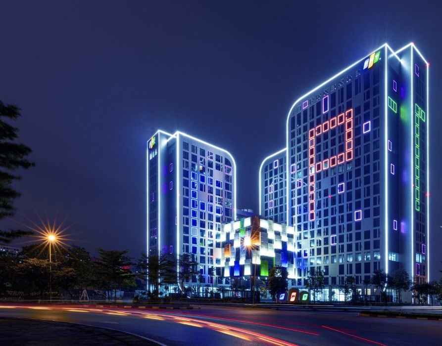

<!-- _class: lead -->
<!-- _paginate: false -->


# ADA-ECU

## Final-round technical defense

**Scale · B-only safety · latency · overload resilience**

Team KIS · FPT Hackathon 2026

---

# Four answers in one view

| Jury question | Defensible answer |
|---|---|
| **Can it scale?** | One normalized object model + pluggable risk modules; new provenance and 360° fusion require a contract/world-model extension |
| **Only B, no C?** | B stays tracked; risk stays low; no false R4 warning |
| **Different speeds?** | 101 ms observed hazard-to-IVI path; TTC escalates earlier as closing speed rises |
| **Message storm?** | Memory bounded, inputs debounced, output edge-triggered; global priority/fairness is the next scale step |

> We separate what is implemented, what is measured, and what belongs to the production roadmap.

---

# Scale-ready architecture

```text
V2X R2 ─────┐
            ├─ bounded queue ─ normalize/admit ─ TrackStore ─ CRA plugins ─ R4 → IVI
Camera R3 ──┘                                  └─ AssessmentDb + EVT
```

| Reuse seam | What can change behind it |
|---|---|
| `FrameSource` / detector output | file + synthetic implemented; live camera requires another implementation |
| normalized `TrackedObject` | V2X or ego-sensor observation after adapter/validation |
| `ICollisionRiskAssessment` | NLOS, intersection, vulnerable-road-user, braking-chain plugin |
| `(trackId, warningType)` assessment | several risk cases over the same tracked object |

**SOLID-aligned:** strong separation, small interfaces and open plugin seams; store/persistence access is still concrete by M1 scope.

---

# Honest extension boundary

| Available today | Required for the next scale |
|---|---|
| two proven provenance values: `own_sensor`, `v2x_relayed` | additive provenance contract for camera/lidar/radar identity |
| ego-frame A–B–C longitudinal composition | time alignment + ego/world transform + heading/trajectory |
| nearest tracked relayed C | spatial conflict association and multi-object ranking |
| in-memory typed store + reconstructible EVT | repository seam + asynchronous persistence/analytics |
| one registered NLOS plugin | more plugins without changing transport/store controller |

> The architecture is extensible; arbitrary sensors are not plug-and-play until their coordinates, timestamps and provenance are normalized.

---

# VehicleB without VehicleC

```text
B observations → tentative → tracked
                         ↓
              no tracked relayed C
                         ↓
          low / no_tracked_c / no trigger
                         ↓
                 zero R4 warnings
```

| Existing deterministic test | Proven result |
|---|---|
| `NoTrackedCReturnsLowWithoutDbWrites` | low, no C trigger, no assessment write |
| `NullCBeforeCIsFirstAdmitted` | numeric B geometry, nullable C |

**CarSky evidence to capture:** `own_sensor_ingest > 0`, B reaches `tracked`, zero relayed-C transitions, `r4_tx = 0`, IVI remains idle.

---

# Camera distance — pinhole estimate

YOLO11n returns VehicleB's bounding box; the distance module converts its pixel width into metres.

```text
f_px = (frame_width / 2) / tan(HFOV / 2)

d_AB = vehicle_width_m × f_px / bbox_width_px
```

| Current detector input | Value |
|---|---:|
| assumed coach width | `2.6 m` |
| effective camera HFOV | `34.4°` |
| example frame / bounding box | `1280 px / 300 px` |
| calculated focal length | `≈ 2068 px` |
| example A–B distance | **`≈ 17.9 m`** |

**Interpretation:** a wider bounding box produces a shorter estimated range. The two calibration values are tuned for the committed clip—not validated for every camera or vehicle type.

---

# Video motion — relative range only

```text
R3 speed = |d_AB(now) − d_AB(previous)| / Δt

d_AC = d_AB(camera) + d_BC(V2X)

closing rate = −Δd_AC / Δt       TTC = d_AC / closing rate
```

| Scenario | What the current code observes |
|---|---|
| A and B keep the same gap | stable box → stable `d_AB` → R3 speed near `0` |
| A closes on B/C | `d_AC` decreases → positive closing rate → TTC available |
| A and B both travel at 80 km/h | **absolute speed is unknown**; video only observes the unchanged gap |

Range thresholds still operate when TTC is null. Ego speed from CAN/GNSS, braking distance and live-camera odometry are outside Milestone 1.

---

# Latency budget and speed

| Recorded system metric | Result |
|---|---:|
| V2X decode and forward | **< 1 ms** |
| Hazard data arrival → IVI evidence | **101 ms** |

```text
sampling + network + queue + CONFIRM_HITS + fusion tick
+ 300 ms dwell + R4 network + IVI render
```

| Closing speed | TTC at 60 m | TTC at 30 m |
|---:|---:|---:|
| 5 m/s | 12 s | 6 s |
| 10 m/s | 6 s | 3 s |
| 20 m/s | 3 s | 1.5 s |
| 30 m/s | 2 s | 1 s |

TTC makes fast closure escalate before the fixed 30 m range boundary. **101 ms is one observed run, not yet a p99 SLA.**

---

# Storm protections today

| Mechanism | Failure mode contained |
|---|---|
| queue capped at 1,024; drop oldest | unbounded memory and blocked receivers |
| one core writer | races and non-deterministic state |
| 3-hit confirmation + gate hysteresis | one-frame noise and boundary flicker |
| 300 ms risk dwell | rapidly changing risk bands |
| output only on committed state edge | warning every 100 ms tick |
| parser rejection | malformed traffic crashing the node |

Queue tests prove FIFO per producer and exact accounting under overflow. They do **not** yet prove a production throughput/SLA limit.

---

# Multi-hazard scale path

```text
per-source queues → validate/coalesce → time-align/world-frame
                 → conflict association → CRA evaluation
                 → global arbiter → top-K / cooldown → IVI
```

**Deterministic priority**

1. severity descending
2. TTC ascending
3. confidence descending
4. observation age ascending
5. object id for stable ties

**Acceptance profiles:** normal, 10× burst, sustained overload, 16-object/four-direction scene, and one adversarial flooding source.

Current M1 selects only nearest relayed C; the arbiter, source fairness and drop telemetry are explicit next-scale work.

---

<!-- _class: lead -->



# The defense in one sentence

**Normalized objects and plugin risks make ADA reusable; fail-safe B-only behavior is tested; TTC adapts to closing speed; bounded ingress protects the node — and the next production step is fair ingestion plus global multi-hazard arbitration.**

Engineering study: [ADA-ECU final-round technical defense](../../documents/Delivery/ada-final-round-technical-defense.md)
