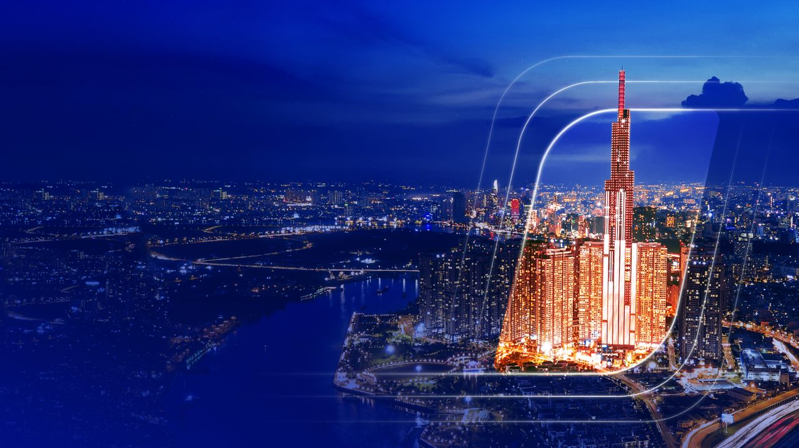
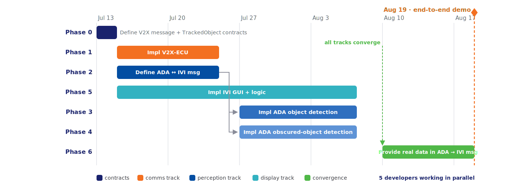
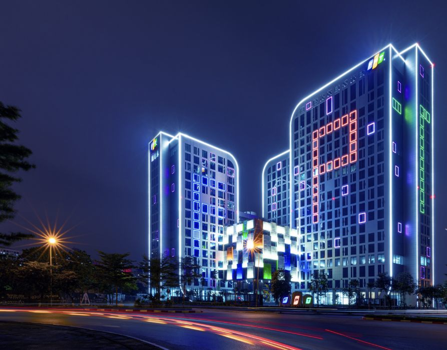

<!-- _class: lead -->
<!-- _paginate: false -->

# Cooperative Vehicle Awareness

## See the hazard before it can be seen

**Milestone 1 proposal — FPT Hackathon 2026**

Source: [m1-cooperative-awareness.md §1](../requirements/m1-cooperative-awareness.md) · [milestone1.md](../plans/milestone1.md)

---

<!-- Table of contents -->

# Table of contents

1. **Team information**
2. **Project description** — the hazard nobody sees coming, and how we make it visible
3. **Technical approach** — virtual ECUs, cloud environment, responsibilities, extensibility
4. **Development process approach** — ASPICE-style discipline, agentic AI, parallel tracks
5. **Development planning** — six phases, five developers, demo on August 19
6. **Our perspective** — why this proposal

---

<!-- ================= SECTION 1 · TEAM INFORMATION ================= -->
<!-- _class: lead -->

# 01 · Team information

---

<!-- Team information — five member cards on one slide; photos circle-framed, FPT-color accents -->

# Team information

|  **Pham Ngoc Minh** *Team Lead · Project Architect* 6 yrs software · 6 yrs telecom C++ · HMI · Telematics |  **Nguyen Danh Quang** *Telematics Engineer* 6 yrs software · 6 yrs telecom C++ · Algorithms · Protocols |  **Hoang Van Trung** *Computer Vision Engineer* 12 yrs software C++ · CUDA · Python · Model optimization |  **Nguyen Tuan Vinh** *Software Engineer* Fresher Kotlin · Android |  **Vu Xuan Bach** *Software Engineer* Fresher Modern C++ |
| ------------------------------------------------------------------------------------------------------------------------------------------------------------ | ----------------------------------------------------------------------------------------------------------------------------------------------------------------- | ------------------------------------------------------------------------------------------------------------------------------------------------------------------ | ---------------------------------------------------------------------------------------------------------------------------------- | ---------------------------------------------------------------------------------------------------------------- |

**Five developers · 24+ combined years** across C++, telematics, computer vision, HMI, and Android.

---

<!-- ================= SECTION 2 · PROJECT DESCRIPTION ================= -->
<!-- _class: lead -->

# 02 · Project description

---

<!-- Project goals -->

# Project goals — safer travel, beyond line of sight

**The accident nobody sees coming:** a vehicle braking two cars ahead is invisible to the following driver *and* to every onboard sensor — until it is too late.

- **Prevent accidents.** Vehicles share what they perceive over V2X: a hazard is detected, risk-assessed, and warned **seconds before it becomes visible** — time to slow down instead of collide.
- **Safer travel.** Awareness is no longer limited by one vehicle's line of sight — every connected vehicle extends every other's perception.
- **Effortless user experience.** The hazard appears on the in-vehicle display as an intuitive bird's-eye scene of the road ahead — glance, understand, react. No cryptic alarms, no interpretation.

**Milestone 1 proves it end-to-end:** convoy A → B → C. Vehicle A can never see C (blocked by B). B detects C and relays its perception over V2X — **C appears on A's display anyway.**

---

<!-- ================= SECTION 3 · TECHNICAL APPROACH ================= -->
<!-- _class: lead -->

# 03 · Technical approach

---

<!-- Technical approach: system design on virtual ECUs -->

# System design — a full vehicle, fully virtual

The complete E/E architecture runs as **virtual ECUs on a cloud platform** — no hardware, yet a full-system demonstration.

- **Blueprint/node model:** 1 blueprint = 1 car; 1 node = 1 ECU, packaged as a container — deploying the blueprint brings up the whole virtual vehicle.
- **Four cooperating nodes:** V2X ECU (communication), ADA ECU (perception + risk), IVI ECU (display), plus a team-built **Scenario Player** bench node emulating the modem and the world.
- Virtualization fidelity is chosen per node — full vECU for the IVI, app-level Linux containers for V2X/ADA — matching effort to what each ECU must prove.

---

<!-- Technical approach: cloud development environment & starter pack -->

# Cloud development environment and starter pack

Development runs entirely on the cloud virtual platform under its blueprint/node model — per node: the virtualization level, the development scope inside it, and the goals to achieve.

| Node                             | Virtualization level                                                     | Focus goals                                                                                                                    |
| -------------------------------- | ------------------------------------------------------------------------ | ------------------------------------------------------------------------------------------------------------------------------ |
| **IVI ECU**                      | Full vECU — developed fully; the container ships in the **starter pack** | 3D display: god view of the 3 vehicles; 2D ⇄ 3D view switching; switching to another app                                       |
| **V2X ECU**                      | App-level (Linux container) — developed in part: only certain layers     | Portability to different hardware — the developed layers move across hardware unchanged                                        |
| **ADA ECU**                      | App-level (Linux container) — developed fully                            | Collision Risk Assessment abstraction — identify risk, construct the TrackedObject struct; AI deep learning is not an M1 focus |
| **Bench node — Scenario Player** | Container — team-built, developed fully                                  | V2X message playback across different scenarios                                                                                |

---

<!-- Technical approach: ECU responsibilities -->

# ECU responsibilities — one clear job each

| Node                | Milestone-1 responsibility                                                                                                                                      |
| ------------------- | --------------------------------------------------------------------------------------------------------------------------------------------------------------- |
| **V2X ECU**         | Modem interfacing (simulated); receives V2X payloads, applies business logic, forwards to ADA; builds and broadcasts payloads from ADA data                     |
| **ADA ECU**         | Detects objects from video, estimates distance, admits tracks; fuses V2X + own perception in a **Collision Risk Assessment** abstraction; emits warnings to IVI |
| **IVI ECU**         | GUI shell with buttons + central view; renders the 3-vehicle god-view scene, including the occluded "ghost" vehicle, on warning                                 |
| **Scenario Player** | Bench node: emulates the modem connection point, plays back V2X messages at configurable rates, drives every test scenario                                      |

Track admission is an explicit, testable state machine — no hidden heuristics:

---

# V2X ECU development — hardware portability

- **Portable by construction:** application + interface layers built on the cloud move to real hardware unchanged — same code, same logic.
- **Modem firmware & proprietary layers:** simulated by the Scenario Player container.
- **Tech stack:** C++17 · Vanetza ITS2 codec (ETSI CPM, staged JSON → UPER behind one codec seam) · thin UDP adapter mirroring the production telux API.

---

# ADA ECU development — foundation for future work

- **Normalized track store:** every data source lands in one store `input data` — duplicates dropped, V2X broadcast storms prevented.
- **Collision Risk Assessment abstraction:** M1's occluded-vehicle logic is the first plugin — future risk modules plugged in without rework.
- **Single risk headquarters:** all risks fuse into one data struct — one message addresses multiple risks.
- **Modular library design:** C++ and Python consume the same inputs and produce the same database type, used to construct msg to IVI ECU.
- **Tech stack:** hybrid C++17 core (store · CRA · warning emission) + Python 3.11 detector subprocess — YOLO11n on ONNX, CPU-only (YOLOX-s fallback) · joined by TrackedObject JSONL over stdout, no FFI · UDP + versioned JSON contracts.

 

---

# IVI ECU development — seamless user experience, instant warning

- **Multi-layer, multi-app HMI:** the home app owns the frame and buttons and orchestrates the other apps.
- **Wake-on-warning:** on an obstruction event, a sleeping app wakes and draws the 3-vehicle scene — 2D/3D.
- **Tech stack:** Kotlin · Jetpack Compose shell · SceneView/Filament 3D + Compose Canvas 2D behind one view seam · UDP foreground service from ADA.

---

<!-- Technical approach: extensibility by design -->

# Designed for what comes next

Every ECU boundary is a **deliberate extension seam** — Milestone 1 ships the scenario, the architecture ships the roadmap:

- **V2X ECU — hardware portability.** Payload logic lives at the application layer, independent of modem and interface setup: a real C-V2X modem later swaps in **without touching the business logic**.
- **ADA ECU — pluggable warning scenarios.** M1's "occluded vehicle" logic is one realization of the shared Collision Risk Assessment abstraction; intersection hazards, curve blind spots, speed-scaled risk plug in as new modules. The warning message is versioned and typed so **new hazard types and criticality filtering extend it, not rework it**.
- **IVI ECU — swappable views.** The central view sits behind a binding view-interface seam: 2D today, 3D / live camera feed / multi-app wake-on-warning tomorrow — shell untouched.

Future features are not wishful thinking — they are **registered, analysed, and traced** to the seams above ([§ Future developments](../requirements/m1-cooperative-awareness.md)): live detection at 120 km/h, multiple hidden obstructions, single-message aggregation, user-opt filtering, themes.

---

<!-- ================= SECTION 4 · DEVELOPMENT PROCESS APPROACH ================= -->
<!-- _class: lead -->

# 04 · Development process approach

---

<!-- Development process: ASPICE-inspired discipline -->

# Development process — ASPICE-style discipline, hackathon speed

We simulate the ASPICE traceability chain end-to-end: **requirement ↔ architecture ↔ task ↔ commit ↔ test** — every artifact answers "why does this exist?"

- **Requirements are engineered:** every requirement passes a feasibility study and carries a **measurable KPI**, (object distance <30m)
- **Phases carry contracts:** each phase declares its input, its output, and binary acceptance criteria — a phase is done when the check passes and could be demo. 
- **Total traceability by construction:** every task ID `X.Y.Z.W` encodes requirement · phase · task · subtask; every commit carries its ID — from any line of code back to the requirement it serves in one hop.
- **Atomic units of work:** one subtask = one single objective = **one atomic commit** — reviewable code, manageable change history.

---

# Defined output for each phase

Each phase ends demo-ready — demonstration methods follow the jury-preference scores in [§ System demo requirements](../requirements/m1-cooperative-awareness.md).

| Phase     | Work                                                                         | Method to demonstrate                                                                             |
| --------- | ---------------------------------------------------------------------------- | ------------------------------------------------------------------------------------------------- |
| **0 + 1** | Frozen message contracts between nodes; functional Scenario Player + V2X ECU | **Wireshark capture** — V2X message PDUs correctly sent/received at the V2X ECU interface         |
| **2**     | Skeleton module code; ADA ↔ IVI message + database schema defined            | Build + CI round-trip tests on the frozen contracts (golden vectors)                              |
| **3 ∥ 4** | ADA object detection; ADA obscured-object detection (V2X fusion)             | **ADA logs** — collision-risk event list; annotated video export (TTC overlay + risk label)       |
| **6**     | Working HMI on the IVI ECU, driven by mock warnings                          | **2D/3D god view** of the convoy drawn on A's IVI HMI                                             |
| **5**     | Integration — real data replaces mocks, all ECUs connected                   | **Whole-project demo:** occluded C appears on A's display; Wireshark + ADA event list corroborate |

---

<!-- Development process: agentic AI, human in the loop -->

# Agentic AI with a human in the loop

AI does the volume; the process keeps it **manageable, auditable, and steerable**.

- **Three specialized agents, non-overlapping mandates:** *researcher* (requirements, feasibility, tech selection) → *architect* (high-level design, module boundaries) → *planner* (task decomposition, spawning implementation subagents). Each owns its stage — and explicitly may not do the others'.
- **Procedure as code:** every working procedure — analysis, design, planning, writing style, commit format — is a versioned rule or skill in the repository, reviewed and evolved like source code.
- **Human decision points are built in:** every proposed number is marked *(A) assumption to confirm*; user decisions are logged in a decision register; contracts are ratified by a human at freeze; scope changes are **flagged, never silently absorbed**.
- **Result:** AI velocity with audit-grade accountability — every decision has an author, a reason, and a record.

---

<!-- Development process: parallel by construction -->

# Parallel by construction — contracts first, convergence by design

Two contracts are frozen before any implementation: the **V2X message schema** and the **TrackedObject struct** — the message formats between the ECUs. Everything downstream builds against them — with mocks — so the following tracks run **in parallel**:

- **Comms track:** implement the *V2X ECU* and the *Scenario Player*; interface with the *ADA ECU*.
- **Perception track:** implement the *ADA ECU* — detect the obstruction, analyse collision risk; interface with the *IVI ECU*.
- **Display track:** bring up the 2D drawing of the 3 vehicles and the collision warning, against a mock message from the *ADA ECU*.
- The 3 tracks converge: real data replaces mocked data, and all ECUs are connected.
- **Payoff:** the 1-month timeline holds with slack; teams (and AI subagents) never block on each other's internals.

---

<!-- ================= SECTION 5 · DEVELOPMENT PLANNING ================= -->
<!-- _class: lead -->

# 05 · Development planning

---

<!-- Development planning: six phases to August 19, five developers -->

# Six phases to August 19 — five developers in parallel

**Phase 0 defines the shared contracts, then three tracks launch simultaneously.** Phases 1, 2, and 5 start in parallel; the moment phase 2 delivers, phases 3 and 4 develop side by side; every track converges at phase 6 for the end-to-end demo on **August 19**.

- **Staffing — five developers in parallel:** two on comms (phase 1) · two on perception (phase 2, then 3 ∥ 4) · one on display (phase 5) · all hands on the contracts (phase 0) and phase-6 convergence.
- **Convergence window Aug 10–19:** mock→real swap, end-to-end rehearsal, recorded demo run.

---

<!-- ================= SECTION 6 · OUR PERSPECTIVE ================= -->
<!-- _class: lead -->

# 06 · Our perspective

---

<!-- _class: lead -->
<!-- _paginate: false -->

# Why this proposal

**A safety feature you can watch work** — the invisible vehicle appears on the display.
**An architecture that is already the roadmap** — every future feature has its seam.
**A development process you can audit** — every commit traces to a requirement, every decision to a human.

---

<!-- _class: lead -->
<!-- _paginate: false -->

# Thank you!

**Cooperative Vehicle Awareness — Milestone 1** · FPT Hackathon 2026
