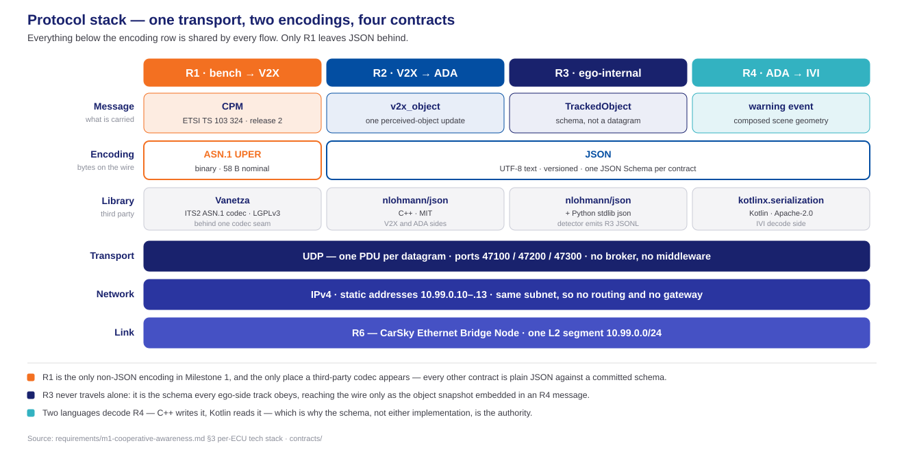
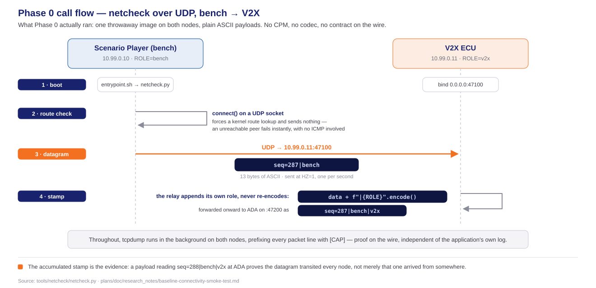

<!-- _class: lead -->
<!-- _paginate: false -->

# Phase 0 — Design Concepts

## The architecture the contracts describe

**Milestone 1 · Cooperative Vehicle Awareness — FPT Hackathon 2026**

Deck A of two — the design. How that design was planned and built is Deck B: [phase0-task-execution-deck.html](phase0-task-execution-deck.html).

Source: [phase0_tasks.md](../../plans/phase0_tasks.md) · [milestone1.md](../../plans/milestone1.md) · [phase0-contract-freeze-hld.md](../../plans/doc/phase0-contract-freeze-hld.md) · [contracts/](../../contracts/)

---

# Table of contents

1. **Terminology** — every coined word, before anything uses it
2. **The blueprint** — five nodes, one bridge, three flows
3. **The contracts** — R1, R2, R3, R4 one at a time, and where each lives
4. **Protocol stack & libraries** — one transport, two encodings, four third parties
5. **The bench and the V2X node** — what Phase 0 left behind
6. **The smoke test** — what it settled, and where the full story lives

*Tracks, lanes and task groups — the planning vocabulary — are Deck B's subject, not this deck's.*

---

<!-- _class: lead -->

# 01 · Terminology

---

# The platform's words

CarSky's own vocabulary. Every later slide uses these without re-explaining them.

| Term | What it means here |
| ---- | ------------------ |
| **Blueprint** | The design of one vehicle — its nodes and how they are wired. One blueprint is one car. Nothing runs yet. |
| **Node** | One ECU inside a blueprint. Its type decides how it runs: a **Container Node** runs an OCI image, a **Skycraft Node** runs an Android guest. |
| **Pin** | A node's connection point. Milestone 1 uses exactly one kind, the `ethernet` pin, and exactly one per node. |
| **Ethernet Bridge** | A node whose only job is to join the other nodes' pins into one network. |
| **Room** | What a deployed blueprint becomes — the live, running instance. The blueprint is the drawing; the Room is the built thing. |
| **Deployment** | The act of turning a blueprint into a Room. Only a deployment starts a container. |

- **Blueprint → Room is the whole mental model.** Editing a blueprint changes nothing that is running; a new deployment is what makes a change real.

---

# Our words

Terms this project coined or narrowed. They carry a specific meaning here that they do not carry generally.

| Term | What it means here |
| ---- | ------------------ |
| **Contract** | A frozen, versioned message definition that two nodes agree on — a JSON Schema or an encoding profile, committed to the repository. Not documentation *about* code: it is the authority the code is measured against. |
| **R-number** | The requirement identifier from the requirements report. `R1`–`R4` are the four contracts; `R5`–`R6` the platform and network; `R7` and beyond, per-node behaviour. |
| **Seam** | A boundary chosen so one side can be replaced without touching the other — the codec seam, the radio-adapter seam. |
| **Frozen** | Changed only by re-freezing across *every* consumer at once. A contract that one node edits alone is broken, not updated. |
| **Ego** | The vehicle the system runs in — vehicle A, the one whose driver gets warned. |
| **Bench** | Sanctioned test equipment that shares the Room network — here the Scenario Player, which stands in for the modem and the outside world. |

- **"Contract" is the load-bearing word in this deck.** Phase 0 produced no running feature; what it produced was contracts.

---

# The four contracts, named

The R-numbers that label every arrow on the next section's diagram. Each gets a full slide in § 03.

| | Contract | Between | Carries |
| --- | -------- | ------- | ------- |
| **R1** | CPM profile | bench → V2X ECU | The V2X message as it exists on the air |
| **R2** | `v2x_object` | V2X ECU → ADA ECU | One perceived object, handed inward |
| **R3** | `TrackedObject` | *inside* the ADA ECU | The shape every tracked object obeys, wherever it came from |
| **R4** | ADA → IVI warning | ADA ECU → IVI ECU | The warning, and the scene to draw for it |

- **Three of the four are messages between nodes. R3 is not** — it is a schema used inside one node, which is why it has no port and no arrow of its own.
- **The numbers are not a sequence of steps.** They are identifiers; R1 through R4 happen to fall in flow order, which is a convenience, not a rule.

---

# The contract vocabulary

The words the contract artifacts themselves carry — they appear in the schemas, the CI lanes and Deck B.

| Term | What it means here |
| ---- | ------------------ |
| **UPER** | *Unaligned Packed Encoding Rules* — the ASN.1 rules that pack one R1 CPM into 58 bytes. The only non-JSON encoding in Milestone 1. |
| **Octet** | One byte. ASN.1 wording, kept because the profile document uses it. |
| **Test vector** | One case: a message content paired with the exact bytes it must encode to — `nominal.json` with `nominal.uper`. |
| **Golden** | Those bytes are committed and frozen. A test encodes the `.json` and compares byte for byte against the stored `.uper`, rather than recomputing what it ought to be. |
| **Corpus** | The whole set of vectors — six here, chosen to cover the edges rather than one happy path. |

- **The six cases:** `nominal` · `mdt-max` / `mdt-min` (±2047 ms) · `conf-unavailable` (the 101 sentinel) · `gate-boundary` (an object at exactly 30 m) · `coord-large` (near the large-coordinate bound).
- **Why they exist:** the same message is encoded by C++ in the V2X ECU and decoded by a separate helper on the bench. The corpus is the one reference both are measured against.

---

<!-- _class: lead -->

# 02 · The blueprint

---

# Five nodes, not four

One blueprint is one car — vehicle A, the ego. Four of its nodes are ECU or bench roles; the fifth is the Ethernet Bridge that turns them into a network.

| Node | Node type | Address | Serves |
| ---- | --------- | ------- | ------ |
| **Scenario Player (bench)** | Container Node | `10.99.0.10` | R11 |
| **V2X ECU** | Container Node | `10.99.0.11` | R7–R9 |
| **ADA ECU** | Container Node | `10.99.0.12` | R12–R15 |
| **IVI ECU** | Skycraft Node (AAOS guest) | `10.99.0.13` | R16–R17 |
| **Ethernet Bridge** | Ethernet Bridge Node | `10.99.0.1` | R6 |

- **The bridge owns no pin of its own.** Each role node declares exactly one `ethernet` pin wired to it — a star, not a chain, on the single subnet `10.99.0.0/24`.
- **The bench is a node, not a module.** It shares the Room network as test equipment; its code never lands in the V2X ECU's folder.
- **Static addresses on purpose**, so every UDP target stays deterministic across redeploys — and each one arrives by node config, never as a literal in source.

---

# Every flow labelled by its contract

---

# The routing, in one line each

Scenario Player<small>bench</small>

→

V2X ECU<small>R1 in · R2 out</small>

→

ADA ECU<small>R3 store · R4 out</small>

→

IVI ECU<small>renders ghost C</small>

- **Every hop is same-subnet UDP.** No routing, no gateway, no broker, no middleware — three different ports on one NIC, not three different pins.
- **One PDU per datagram**, on `47100` (R1), `47200` (R2) and `47300` (R4). A message never spans two datagrams.
- **The direction is one-way at every hop** in Milestone 1. Nothing flows back from the IVI toward the bench.
- **R3 has no hop of its own** — it lives inside the ADA ECU, and reaches the wire only wrapped in an R4 message.

*What each contract actually says is the next section, one slide at a time.*

---

<!-- _class: lead -->

# 03 · The contracts

---

# R1 — the CPM profile

The V2X message as it exists on the air. The only contract that is not JSON.

| | |
| --- | --- |
| **Defines** | Which ETSI CPM fields Milestone 1 uses, their units and their bounds — a *profile*, narrowing a large standard to what the demo needs |
| **Standard** | ETSI TS 103 324, release 2 |
| **Encoding** | ASN.1 UPER — 58 bytes for the nominal case |
| **Artifacts** | `r1-cpm-content.schema.json` — the content shape · `r1-cpm-profile.md` — the field-by-field profile · `golden-vectors/` — six `.json`/`.uper` pairs |
| **Copies live in** | `V2X_ECU/contracts/` · `Scenario_Player/contracts/` |

- **Two independent implementations must agree on it** — the V2X ECU's C++ codec and the bench's encoder helper — which is exactly why the golden vectors exist.
- **CI generated the vectors, not a person**, and the same run proved regeneration is deterministic: generate twice, `diff` empty.

---

# R2 — `v2x_object`

What the V2X ECU hands inward once it has decoded the air message.

| | |
| --- | --- |
| **Defines** | One perceived-object update: identity, position, kinematics, confidence, and the timestamp it was valid at |
| **Direction** | V2X ECU → ADA ECU, UDP `47200` |
| **Encoding** | JSON, versioned |
| **Artifacts** | `r2-v2x-object.schema.json` · `samples/r2-object.json` |
| **Copies live in** | `V2X_ECU/contracts/` · `ADA_ECU/contracts/` |

- **`object.distance` is derived here, never transmitted.** The air message carries a relative position; distance is computed on arrival, so the two can never disagree.
- **One message per object update**, not a batch — a CPM describing three objects becomes three R2 messages.

---

# R3 — `TrackedObject`

Not a message. The single shape every ego-side object obeys, whoever produced it.

| | |
| --- | --- |
| **Defines** | The one track record: identity, state, geometry, provenance, and the confidence carried with it |
| **Direction** | None — internal to the ADA ECU |
| **Encoding** | JSON, versioned |
| **Artifacts** | `r3-tracked-object.schema.json` · `samples/r3-tracked-object.json` |
| **Copies live in** | `ADA_ECU/contracts/` · `IVI_ECU/contracts/` |

- **Its whole purpose is to erase the difference between sources.** An object the camera detected and an object that arrived over the relay become the same kind of thing the moment they enter the store.
- **`provenance` is what survives that flattening** — it records *how* the object was learned, which is what lets the demo prove C was never seen directly.
- **The IVI holds a copy** because R3 arrives embedded in every R4 message; the IVI must decode it even though it never receives one alone.

---

# R4 — the ADA → IVI warning

The warning, and everything needed to draw it. The IVI renders from this message alone.

| | |
| --- | --- |
| **Defines** | A versioned warning event: what the risk is, which object raised it, and the composed scene geometry to display |
| **Direction** | ADA ECU → IVI ECU, UDP `47300` |
| **Encoding** | JSON, versioned |
| **Artifacts** | `r4-ada-ivi.schema.json` · `samples/r4-warning.json` · `r4-state.json` · `r4-unknown-warning.json` |
| **Copies live in** | `ADA_ECU/contracts/` · `IVI_ECU/contracts/` |

- **The IVI performs no fusion and holds no world model.** Everything it draws comes from the message in hand, which is what keeps the display honest.
- **`r4-unknown-warning.json` is a deliberate sample** — a warning type the IVI does not recognise, proving forward compatibility is tested rather than assumed.

---

# Where the contracts live

One authority at the root; a working copy inside each node that consumes it.

| Location | Holds |
| -------- | ----- |
| **`contracts/`** | The frozen originals — all four schemas, the R1 profile, the golden vectors, the samples |
| **`V2X_ECU/contracts/`** | R1, R2 |
| **`ADA_ECU/contracts/`** | R2, R3, R4 |
| **`IVI_ECU/contracts/`** | R3, R4 |
| **`Scenario_Player/contracts/`** | R1 |

- **The copies are not forks.** `contracts/sync-manifest.json` lists every file that must match, and `contracts/check_sync.py` fails CI the moment one drifts.
- **Why copy at all:** each node folder must build on its own, with no cross-folder imports. A node reaching up into a shared directory would break that rule.
- **A node holds only what it speaks.** The bench holds R1 and nothing else, because R1 is the only contract it touches.

---

<!-- _class: lead -->

# 04 · Protocol stack & libraries

---

# One transport, two encodings, four third parties

---

# What each library is there for

Four third-party dependencies, each doing one job. All open source, all Linux.

| Library | Licence | Serves | Job |
| ------- | ------- | ------ | --- |
| **Vanetza** | LGPLv3 | R1 | ETSI ITS release-2 ASN.1 codec — the only component that speaks UPER |
| **nlohmann/json** | MIT | R2, R3, R4 | JSON binding on both C++ sides, the V2X ECU and the ADA ECU |
| **Python stdlib `json`** | PSF | R1, R3 | The bench's scenario data, and the detector's R3 output stream |
| **kotlinx.serialization** | Apache-2.0 | R3, R4 | JSON binding on the IVI, the only Kotlin node |

- **Vanetza sits behind one codec seam**, so no application code imports it directly — the standard can move without the application moving with it.
- **Nothing here is a framework.** Every one of the four is a library the code calls; none of them owns the program's control flow.
- **The transport needs no library at all** — UDP sockets come from each language's standard library.

---

<!-- _class: lead -->

# 05 · The bench and the V2X node

---

# Phase 0 built one image for both

Neither node has its real implementation yet. Phase 0 needed only to prove the wire between them, so both ran the same throwaway container.

| | Scenario Player (bench) | V2X ECU |
| --- | --- | --- |
| **Phase 0 image** | `m1-netcheck:latest` | `m1-netcheck:latest` — the same one |
| **Difference between them** | Environment variables only — `ROLE`, `NEXT_HOP_HOST`/`PORT` | Environment variables only — plus `LISTEN_PORT`, which is what makes it a relay |
| **Phase 0 role** | Source: emits one datagram per second | Relay: receives, stamps, forwards |
| **Contract touched** | None | None |

- **One image, three roles, zero code branches.** Whether a node sends, relays or sinks is decided entirely by which variables are set — the same discipline the real ECUs follow.
- **This is a deliberate placeholder, not a prototype.** No part of `netcheck.py` becomes production code; it is scaffolding that proved the topology and was then set aside.

---

# The exchange, as Phase 0 ran it

---

# What Phase 1 adds to both

Phase 0 answered *can they talk*. Phase 1 answers *what they say* — and that is where the real designs arrive.

| | Arriving in Phase 1 |
| --- | --- |
| **Scenario Player** | Scenario configs as data, the kinematic model, and the encoder helper that turns a scenario into real R1 bytes |
| **V2X ECU** | The radio-adapter seam, the modem stub behind it, and the receive pipeline: decode, validate, de-duplicate, forward as R2 |
| **Both** | A high-level design, a per-node call flow, and unit tests against the golden vectors |

- **The netcheck image retires the moment either real image lands.** Nothing carries forward from it except the confidence that the network works.
- **The per-node call flows are already drafted** in each node's `doc/` folder — they are Phase 1's material, and belong to Phase 1's deck.

---

<!-- _class: lead -->

# 06 · The smoke test

---

# Proving the wire, before the ECUs existed

Phase 0's fourth acceptance box was closed by a connectivity smoke test on blueprint `trial2_minh`. Its method, tooling, AI/human split and evidence are a deck of their own — this slide states only what it settled.

- **All five pass criteria met, 2026-07-31.** Every node running · zero errors · live per-node logs · traffic captured on the wire · the chain proven by the payload's own accumulated stamps.
- **It closed the last Phase 0 acceptance box** — blueprint topology documented *and* validated — which is what unblocked Phase 1.
- **It settled two facts every later image inherits:** which registry host actually answers, and that node images must be single-platform `linux/arm64`.
- **It left two items open** — bridge MTU headroom, and whether the AAOS guest can host a listener — neither of them blocking.
- **Full story, slide by slide:** [phase0-smoke-test-deck.html](phase0-smoke-test-deck.html) — method, tested object, testing agent, human in the loop, results. Nothing from it is repeated here.

---

<!-- _class: lead -->
<!-- _paginate: false -->

# Thank you!

**Phase 0 — Design Concepts** · FPT Hackathon 2026
