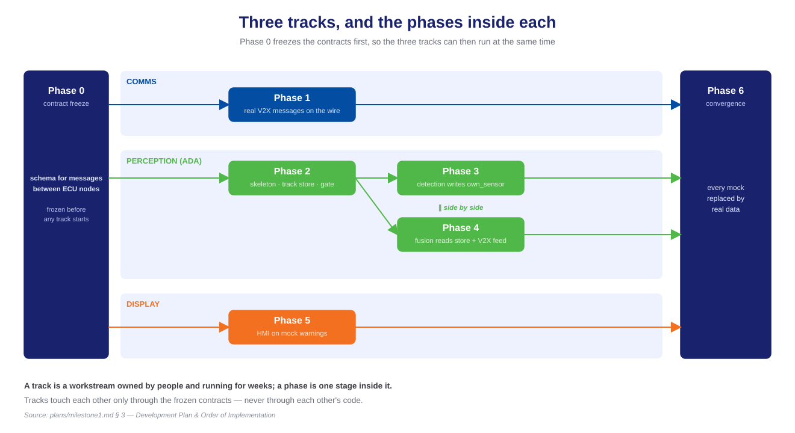
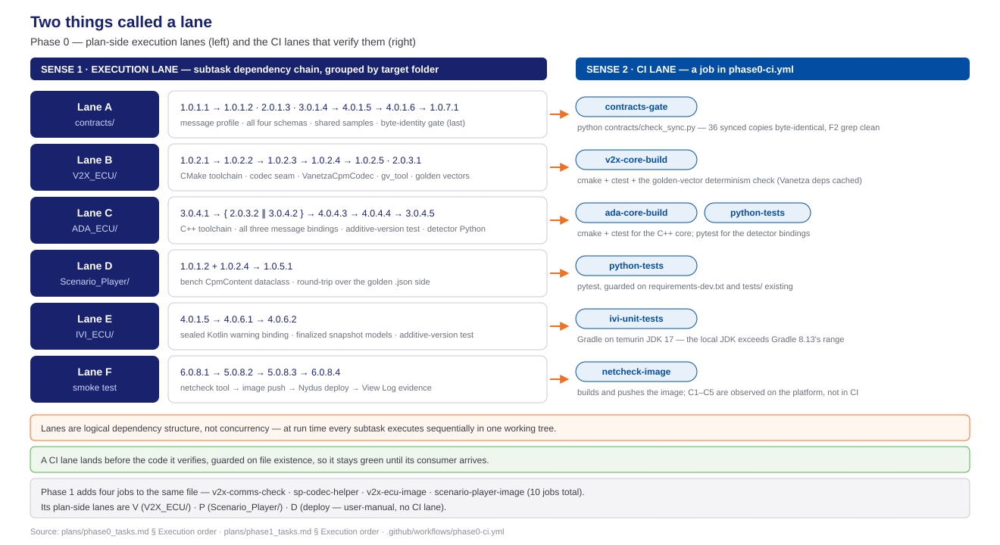

<!-- _class: lead -->
<!-- _paginate: false -->

# Phase 0 — Task Execution

## Six lanes, twenty-seven atomic commits

**Milestone 1 · Cooperative Vehicle Awareness — FPT Hackathon 2026**

contract freeze · 8 task groups · 27 subtasks · closed 2026-07-31

The architecture this phase defines is presented in Deck A: [phase0-design-concepts-deck.html](phase0-design-concepts-deck.html).

Sources: [phase0_tasks.md](../../plans/phase0_tasks.md) · [phase0-contract-freeze-hld.md](../../plans/doc/phase0-contract-freeze-hld.md) · [phase1_tasks.md](../../plans/phase1_tasks.md)

---

# Table of contents

1. **Work organization** — track, execution lane and CI lane, and their distinctions
2. **Work decomposition** — the identification scheme and the size of Phase 0
3. **Task groups** — the lane each one builds, and its consumers
4. **Code delivered** — the files added to the repository
5. **Execution order** — dependency structure, lane by lane
6. **Parallel and sequential work** — and the constraint behind each
7. **Handoff** — the inputs Phase 1 was permitted to assume

---

<!-- _class: lead -->

# 01 · Work organization

---

# Planning terminology

Phase 0 and Phase 1 both use the term *lane*, for two different concepts. Neither is a *track*.

| Term               | Definition                                                                          | Specified in                                      | Example               |
| ------------------ | ------------------------------------------------------------------------------------ | ------------------------------------------------- | --------------------- |
| **Track**          | a workstream spanning whole phases, executed by different people concurrently        | [milestone1.md §3](../../plans/milestone1.md)     | comms track = Phase 1 |
| **Execution lane** | subtasks ordered by dependency, grouped by the folder they write into                | each phase plan, *Execution order & parallelism*  | Lane B = `V2X_ECU/`   |
| **CI lane**        | one job in the GitHub Actions workflow                                               | `.github/workflows/phase0-ci.yml`                 | `v2x-core-build`      |

- **A track spans phases; a lane exists within one phase.** The V2X work is Lane B in Phase 0, Lane V in Phase 1, and part of the comms track across the milestone — three objects with three lifetimes.
- **A CI lane is work a machine performs.** It builds, tests, and passes or fails; three of the ten also push a node image. A track and an execution lane are planning structures.

---

# Tracks

A track is a workstream owned by people and measured in weeks. Three run concurrently, which is possible only because Phase 0 first froze the **contracts**.

> A **contract** is an agreed message or data format — the exact fields, types and units two nodes exchange, recorded once and changed only by agreement with every consumer. This project defines six, covering every message the nodes exchange, and defining them was the purpose of Phase 0.

| Track                | Phases        | Builds against                                                                                                               |
| -------------------- | ------------- | ---------------------------------------------------------------------------------------------------------------------------- |
| **Comms**            | 1             | real V2X messages on the wire from the outset; mock perception content until Phase 6                                         |
| **Perception (ADA)** | 2, then 3 ∥ 4 | the tracked-object store — detection writes its own entries; fusion consumes the store and the live message from the V2X ECU |
| **Display**          | 5             | mock warning messages from the outset                                                                                        |

- **Tracks share contracts, not code.** Phase 0 defines the message formats every track builds against, which is what allows each track to substitute mock input and proceed in parallel.
- **Phases 3 and 4 are one track running two phases concurrently.** They never invoke each other; they meet only at the tracked-object store.
- **The tracks converge at Phase 6**, where every mock is replaced by real data.

---

# Tracks and their constituent phases

One contract freeze, three concurrent tracks, one convergence.

---

# Execution lanes

Every lane in both phases. A lane is named after the folder it writes into, so no two modify the same files.

| Phase | Lane | Writes into        | Depends on                       | Deliverable                                                                     |
| ----- | ---- | ------------------ | -------------------------------- | ------------------------------------------------------------------------------- |
| **0** | A    | `contracts/`       | nothing — it is the source       | the message profile, all four schemas, the shared samples                       |
| **0** | B    | `V2X_ECU/`         | A, from its codec steps onward   | C++ toolchain, the codec seam, the six reference messages                       |
| **0** | C    | `ADA_ECU/`         | A, from its bindings onward      | ADA toolchain and its C++ and Python message bindings                           |
| **0** | D    | `Scenario_Player/` | A and B                          | the bench-side message record and its round-trip test                           |
| **0** | E    | `IVI_ECU/`         | A                                | the Kotlin bindings the display decodes into                                    |
| **0** | F    | the live blueprint | nothing                          | the baseline connectivity smoke test, executed on the platform                  |
| **1** | V    | `V2X_ECU/`         | the Phase 0 contracts            | receive pipeline, application, node image                                       |
| **1** | P    | `Scenario_Player/` | the contracts and the codec seam | the bench application and its encoder helper                                    |
| **1** | D    | the deployed Room  | V and P                          | image push, deployment, and log inspection confirming message arrival           |

- **Within a lane the order is fixed.** Each subtask consumes the output of its predecessor.
- **Between lanes there is no inherent order.** A through F are identifiers, not a sequence; only a stated dependency sequences them, and a dependency always names an artifact.

---

# Continuous integration as the verification path

The development host has neither Docker nor a Linux subsystem. Every Linux build, C++ compilation and Gradle run therefore executes on GitHub Actions; CI is the verification path rather than a supplementary check.

- **Ten jobs in one workflow file:** `contracts-gate` · `python-tests` · `ada-core-build` · `v2x-core-build` · `v2x-comms-check` · `sp-codec-helper` · `ivi-unit-tests` · `netcheck-image` · `v2x-ecu-image` · `scenario-player-image`.
- **The file `phase0-ci.yml` defines every job.** Phase 1 added four jobs to it rather than establishing a second workflow.

---

<!-- _class: lead -->

# 02 · Work decomposition

---

# Task identification scheme

Every task and subtask carries the identifier `X.Y.Z.W`.

| Segment | Meaning                | Value in `2.0.3.1`               |
| ------- | ---------------------- | -------------------------------- |
| `X`     | the requirement served | the V2X-to-ADA object message    |
| `Y`     | the phase              | 0 — the contract freeze          |
| `Z`     | the task group         | group 0.3 — V2X-to-ADA bindings  |
| `W`     | the subtask            | the V2X-side binding, one commit |

**The group number is not the requirement number.** `2.0.3.1` and `3.0.4.2` sit in different groups and serve different requirements; one group may hold subtasks from several requirements, which is why group 0.3 contains both `2.0.3.1` and `2.0.3.2`.

---

# Decomposition summary

- **8 task groups, 27 subtasks, 6 lanes.** Lane A `contracts/` 6 · lane B `V2X_ECU/` 6 · lane C `ADA_ECU/` 6 · lane D `Scenario_Player/` 1 · lane E `IVI_ECU/` 2 · lane F smoke test 4 · plus the integrity gate and the CI workflow, one subtask each.
- **Three execution kinds.** 24 subtasks implemented by AI agents, 1 executed by the deployment agent, 2 performed manually in the platform UI. All three are tracked identically; only the performer differs.
- **One subtask has one objective, one atomic commit, a passing build and passing unit tests.** A subtask without a recorded status line has not started.
- **Verification is performed by GitHub Actions.** The development host has neither Docker nor a Linux subsystem, and its JDK exceeds the range the Gradle wrapper supports; lane D alone could be executed locally.

---

# Task groups mapped onto lanes

The required sequence on the left; the verification that proves it on the right.

---

# Acceptance criteria

| Criterion                                                                                                 | Closed by                                                       | Evidence                                                                                                                                                                                                       |
| --------------------------------------------------------------------------------------------------------- | --------------------------------------------------------------- | -------------------------------------------------------------------------------------------------------------------------------------------------------------------------------------------------------------- |
| V2X message profile committed; the reference messages encode and decode through the codec seam            | `1.0.1.1` · `1.0.1.2` · `1.0.2.1`–`1.0.2.5`                     | the [`v2x-core-build` lane green](https://github.com/mnpham2101/FPT-Hackathon2026/actions/runs/30608005574) — all six reference messages decode to their readable form and re-encode to identical bytes       |
| V2X-to-ADA, tracked-object and warning schemas committed; round-trip tests pass in C++, Python and Kotlin | group 0.1 schemas and six round-trip suites across groups 0.3–0.6 | the [`contracts-gate` lane green](https://github.com/mnpham2101/FPT-Hackathon2026/actions/runs/30608202261), over all 36 synchronised copies                                                                   |
| The warning-message additive-version test is defined                                                      | `4.0.1.6` · `4.0.4.4` · `4.0.6.2`                               | the [`ada-core-build` lane green](https://github.com/mnpham2101/FPT-Hackathon2026/actions/runs/30602717230) — one shared fixture, both consumers                                                               |
| Blueprint topology documented and validated                                                               | `6.0.8.1` · `5.0.8.2` · `5.0.8.3` · `6.0.8.4`                   | a live deployment rather than a CI run: 5 of 5 nodes Running, criteria C1–C5 met                                                                                                                              |

> Three criteria were closed by a green pipeline. The fourth required deployment to the platform and inspection of the logs, which is why lane F needed manual completion.

---

<!-- _class: lead -->

# 03 · Task groups

---

# Each task group builds a lane, or supplies a later phase

| Task group                                                  | Deliverable and lane                                                                                                                                                                                                                 |
| ----------------------------------------------------------- | ------------------------------------------------------------------------------------------------------------------------------------------------------------------------------------------------------------------------------------ |
| **0.1** — contract source of truth, `contracts/`            | The V2X message profile, all four message schemas and the shared samples. **Implements lane A.** Its files are the compile-time input of every other lane and of every binding written after Phase 0.                                |
| **0.2** — V2X ECU toolchain, codec seam, reference messages | The C++17 build, the single V2X codec source, and the six reference messages. **Implements lane B.** The Phase 1 receive pipeline decodes through this seam; the bench encoder helper reuses the same sources.                       |
| **0.3** — V2X-to-ADA bindings, both C++ ends                | One handwritten binding per node, producer and consumer. **Spans lanes B and C** — `2.0.3.1` in `V2X_ECU/`, `2.0.3.2` in `ADA_ECU/`. Phase 1 forwards that message using exactly these bindings.                                     |
| **0.4** — ADA ECU contract layer                            | ADA toolchain, tracked-object and warning C++ bindings, the additive-version test, and the Python detector binding. **Implements lane C.** Phase 2 extends the tree; Phases 3 and 4 meet at the tracked-object structure.             |
| **0.5** — Scenario Player contract layer                    | The bench-side content record and its reference round-trip test. **Implements lane D.** The Phase 1 bench begins here, and it deliberately stops short of an encoder.                                                                |
| **0.6** — IVI Kotlin warning and snapshot bindings          | The sealed Kotlin warning binding and the finalised tracked-object snapshot models. **Implements lane E.** The Phase 5 interface decodes into these models rather than defining its own.                                             |
| **0.7** — contract integrity gate and CI                    | The byte-identity gate over every synchronised copy, and the Linux verification workflow. **Implements the gate and the CI lanes.** Every subsequent subtask in the project is verified by this file.                                |
| **0.8** — baseline connectivity smoke test                  | Build, push, deployment and log inspection of the netcheck tool on the live blueprint. **Implements lane F.** It is why Phase 1 could assume a deployable Room and reachable nodes.                                                  |

---

<!-- _class: lead -->

# 04 · Code delivered

---

# Shared contracts, the integrity gate, CI, and the bench tool

| File group                                                                     | Delivered by                                                         | Function                                                                                                                                                                                      |
| ------------------------------------------------------------------------------ | -------------------------------------------------------------------- | -------------------------------------------------------------------------------------------------------------------------------------------------------------------------------------------- |
| `contracts/` — `r1-cpm-profile.md`, four JSON Schemas, five shared samples     | group 0.1, subtasks `1.0.1.1` through `4.0.1.6`                      | The single source of truth every node copies from. It freezes, and re-freezes, as one unit.                                                                                                   |
| `contracts/golden-vectors/` — six readable and encoded pairs                   | `1.0.2.4`                                                            | The reference messages: the content of each, with the exact bytes it must encode to. Generated by a build-only tool and published by the CI run that proved regeneration is byte-stable.      |
| `contracts/sync-manifest.json` and `check_sync.py`                             | `1.0.7.1`                                                            | Maps 21 sources onto 36 node-local copies and exits non-zero on any byte difference; it also carries the banned-token check over the V2X sources.                                             |
| `.github/workflows/phase0-ci.yml`                                              | created by `1.0.7.2`; lanes added by `1.0.2.1`, `3.0.4.1`, `5.0.8.2` | The build workflow — the project's Linux verification path, where C++ builds, Gradle tests and image builds execute.                                                                          |
| `tools/netcheck/` — `Dockerfile`, `entrypoint.sh`, `capture.sh`, `netcheck.py` | `6.0.8.1`                                                            | The netcheck tool: one temporary image, three container roles, started automatically at node start with no manual intervention.                                                               |

---

# Per-node code — libraries, message definitions, skeletons

| File group                                                                                                     | Delivered by                    | Function                                                                                                                                                                              |
| -------------------------------------------------------------------------------------------------------------- | ------------------------------- | ------------------------------------------------------------------------------------------------------------------------------------------------------------------------------------- |
| `V2X_ECU/src/codec/` — `cpm_codec.hpp`, `vanetza_cpm_codec.{hpp,cpp}`                                          | `1.0.2.2`, `1.0.2.3`            | The V2X library files: the codec seam interface and its single implementation over the ITS release-2 message type. No component above the seam converts units.                        |
| `V2X_ECU/src/contracts/r2_message.{hpp,cpp}` and `V2X_ECU/contracts/*.schema.json`                             | `2.0.3.1`, `1.0.2.2`            | The V2X message definitions: the V2X-to-ADA producer binding and the synchronised schema copies it is written against.                                                                |
| `V2X_ECU/CMakeLists.txt` · `tools/golden_vectors/main.cpp` · `tests/`                                          | `1.0.2.1`, `1.0.2.4`, `1.0.2.5` | Toolchain with exact dependency versions, the generator that never ships in the node image, and the tests holding every reference message to its exact bytes.                         |
| `ADA_ECU/` — `CMakeLists.txt`, `src/contracts/` for all three messages, `detector/contracts/tracked_object.py` | group 0.4 and `2.0.3.2`         | The ADA skeleton: the consuming end of the V2X-to-ADA message, the producing end of the warning message, and the tracked-object structure the Python detector subprocess emits.       |
| `Scenario_Player/player/contracts/cpm_content.py` and the reference `.json` fixtures                           | `1.0.5.1`                       | The bench side of the codec seam as a standard-library record — content model only, no encoder, by explicit constraint.                                                               |
| `IVI_ECU/app/.../model/R4Message.kt` and the finalised `R3Snapshot.kt` and `SceneGeometry.kt`                  | `4.0.6.1`, `4.0.6.2`            | The IVI skeleton's data layer: the sealed Kotlin binding the interface decodes into, including its tolerant handling of unrecognised warning types.                                   |

---

<!-- _class: lead -->

# 05 · Execution order

---

# Six lanes, and the work each permits in parallel

- **Horizontal position denotes dependency depth** — the distance of a unit of work from the start of the phase — not calendar time.

---

# Lane A — the initial work

`contracts/` produces documents and schemas, and therefore depends on no build and no toolchain. It divides into two independent chains: the V2X message profile, which supplies the bench and the V2X-to-ADA schemas, and the tracked-object schema, which supplies the warning schema and its additive-version fixture.

---

# Lane B — a five-step chain with one binding alongside

Each codec step compiles against its predecessor, so the chain permits no shortcut. The V2X-to-ADA binding requires only the toolchain and its schema, and therefore proceeded alongside the chain rather than after it.

---

# Lane C — a fan-out on the toolchain, then a strict sequence

The two message bindings share only the CMake setup and therefore proceeded concurrently. Everything after them is strictly ordered: the warning message embeds the tracked-object record, the additive test requires the warning binding, and the Python validator requires all four.

---

# Lanes D and E — the two lanes that waited

Neither lane was slow; both were blocked on frozen artifacts. Lane D required the reference messages produced by lane B, and lane E required the warning schema and its additive fixture. This is the cost of a contract-first approach, and it is paid once.

---

# The integrity gate and the CI lanes — opposite ends of the ordering

The integrity gate is the one subtask deliberately scheduled last: it fails on a missing target, so it can execute only once all ten copy-landing subtasks exist. The CI workflow is the inverse — it landed on the first day and guarded every job it could not yet execute.

---

# Lane F — the smoke test and its manual steps

Fully parallel with every other lane, because it shares no file with any node folder. Internally it permits no reordering, and its final two steps are platform-UI work that the plan tracks but no agent performs.

---

<!-- _class: lead -->

# 06 · Parallel and sequential work

---

# Dependency structure

| Relationship                 | Scope                                                     | Constraint                                                                                                                                       |
| ---------------------------- | --------------------------------------------------------- | ------------------------------------------------------------------------------------------------------------------------------------------------ |
| **Parallel — across lanes**  | A, B, C, F and CI all begin with no predecessor           | They write disjoint folders: `contracts/`, `V2X_ECU/`, `ADA_ECU/`, `tools/netcheck/`, `.github/`. No shared file, therefore no ordering          |
| **Parallel — within lane A** | `1.0.1.1` against `3.0.1.4`                               | The tracked-object schema references neither the V2X message nor the V2X-to-ADA message, so the two chains are independent from the outset       |
| **Parallel — within lane B** | `2.0.3.1` against the `1.0.2.x` chain                     | The V2X-to-ADA binding requires the toolchain and a schema, not the codec                                                                        |
| **Parallel — within lane C** | `2.0.3.2` against `3.0.4.2`                               | Different schemas, the same toolchain, different files                                                                                          |
| **Sequential — lane B**      | `1.0.2.1` → `1.0.2.2` → `1.0.2.3` → `1.0.2.4` → `1.0.2.5` | Each step is the compile-time input of the next; the reference messages cannot exist before the codec that produces them                         |
| **Sequential — lane F**      | `6.0.8.1` → `5.0.8.2` → `5.0.8.3` → `6.0.8.4`             | An image cannot be pushed before it is written, a tag cannot be deployed before it is pushed, nor logs read from a node that is not running      |
| **Sequential — final step**  | `1.0.7.1` after all ten copy-landing subtasks             | The gate walks a manifest and fails on a missing target, so a partial run would prove nothing                                                    |

---

<!-- _class: lead -->

# 07 · Handoff

---

# Inputs available to Phase 1

The Phase 1 plan opens with an explicit input list. Every entry is a Phase 0 deliverable; the handoff is itself a contract.

- **Frozen contracts on disk.** `contracts/` with the reference messages, `sync-manifest.json` and `check_sync.py`. Phase 1 extended the manifest rather than re-deriving it.
- **A codec seam to build on.** `V2X_ECU/src/codec/` and `src/contracts/` with the `CMakeLists.txt` baseline. The Phase 1 receive pipeline decodes through the same seam, and the bench encoder helper is built from byte-identical copies of those sources.
- **A bench that already carries the wire format.** `Scenario_Player/player/contracts/cpm_content.py` and the reference `.json` fixtures.
- **A platform proven deployable.** `tools/netcheck/` executed on real nodes, so Phase 1 planned deployment tasks rather than re-proving the network.
- **Six active CI lanes.** `contracts-gate`, `python-tests`, `v2x-core-build`, `ada-core-build`, `ivi-unit-tests`, `netcheck-image` — Phase 1 added four more to the same workflow file without rewriting it.

---

# Deferred work from Phase 0

- **Two smoke-test items remain open.** The maximum-packet-size probe was optional and was not executed; the AAOS listener check was unavailable on this deployment. Neither blocks Phase 0 or Phase 1.
- **Incoming traffic to the IVI ECU has indirect evidence only.** The ADA node's transmit and capture lines prove the message left the network addressed to the IVI ECU, not that anything received it. The gap closes when the real listener lands there.
- **The bench encoding path was deliberately left undecided.** `1.0.5.1` was explicitly prohibited from improvising one; the decision belongs to the bench design, where it was subsequently made.

> A green pipeline proves the code. The plan file proves the process, including the parts that did not proceed as planned.

---

<!-- _class: lead -->
<!-- _paginate: false -->

# Thank you

**Phase 0 — Task Execution** · Milestone 1 · FPT Hackathon 2026
