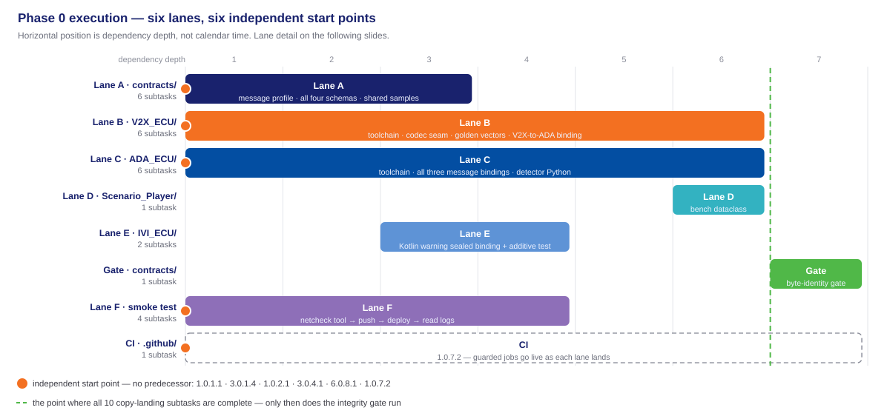
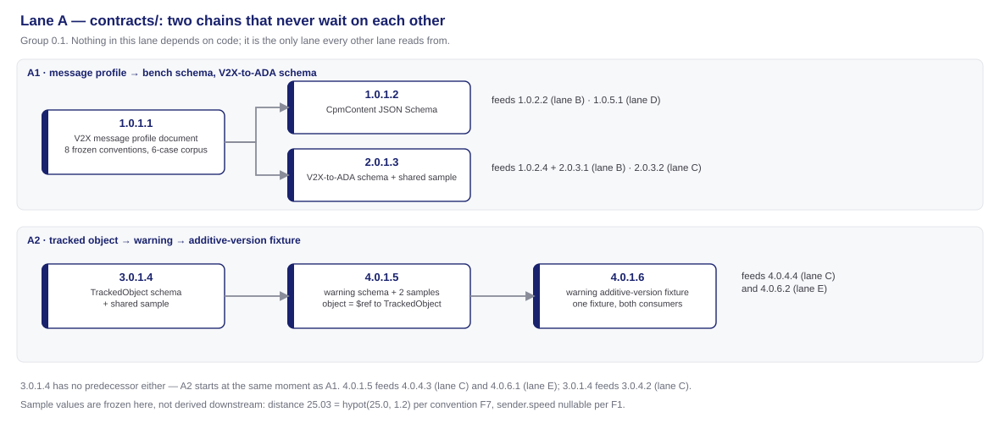
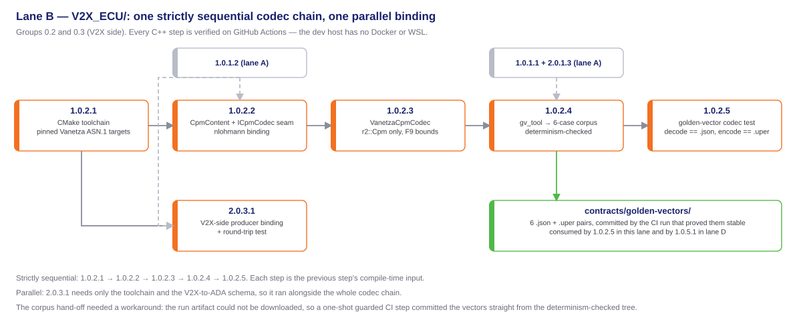
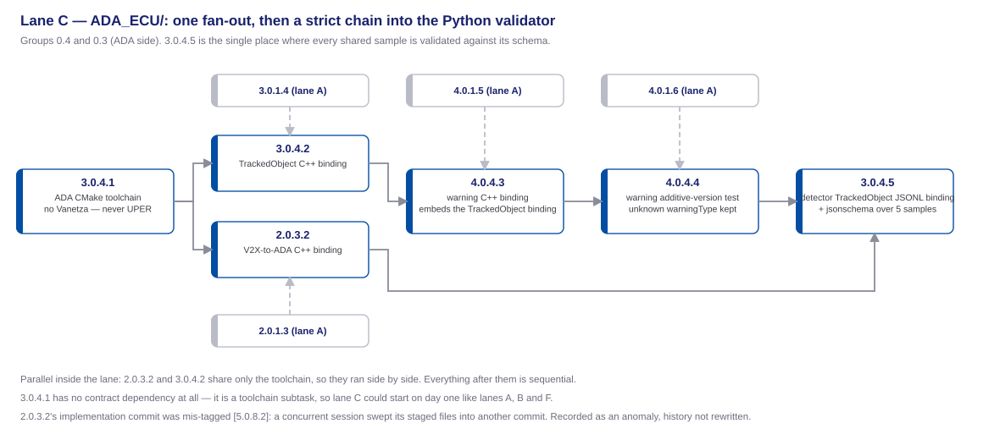
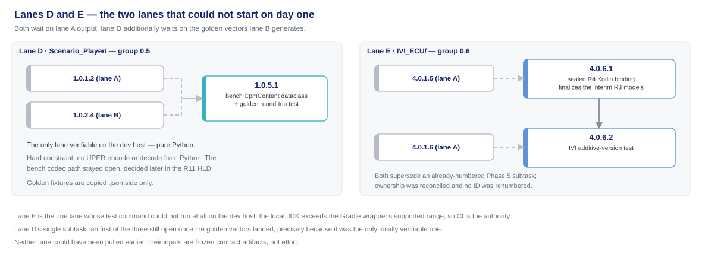
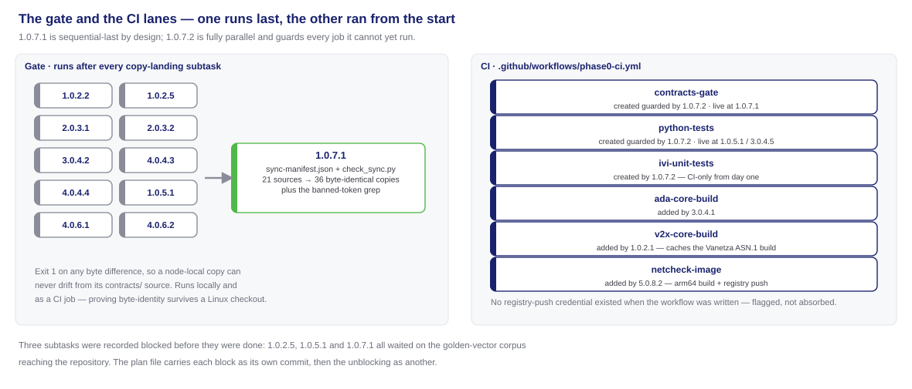
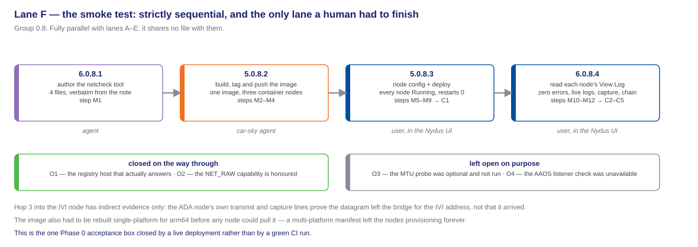

<!-- _class: lead -->
<!-- _paginate: false -->

# Phase 0 — Task Execution

## From six lanes to twenty-seven atomic commits

**Milestone 1 · Cooperative Vehicle Awareness — FPT Hackathon 2026**

contract freeze · 8 task groups · 27 subtasks · closed 2026-07-31

Source: [phase0_tasks.md](../../plans/phase0_tasks.md) · [phase0-contract-freeze-hld.md](../../plans/doc/phase0-contract-freeze-hld.md) · [phase1_tasks.md](../../plans/phase1_tasks.md)

---

# Table of contents

1. **How work is cut** — the ID scheme, and the shape of Phase 0
2. **Task groups** — which lane each group builds, and who consumes it
3. **Code delivered** — the files Phase 0 put in the repository
4. **Execution order** — lane by lane, one diagram at a time
5. **Parallel or sequential** — and what forced each
6. **Handoff** — what Phase 1 was allowed to assume

---

<!-- _class: lead -->

# 01 · How work is cut

---

# The unit of work is a subtask, and its ID says everything

Every task and subtask carries `X.Y.Z.W`. Read it and you know which requirement the work serves, which phase it belongs to, which feature it groups under, and which atomic commit closed it.

| Segment | Reads as | In `2.0.3.1` |
| ------- | -------- | ------------ |
| `X` | the requirement served | R2 — the V2X-to-ADA object message |
| `Y` | the phase | 0 — the contract freeze |
| `Z` | the task group | group 0.3 — R2 bindings, both C++ ends |
| `W` | the subtask | the V2X-side binding, one commit |

**The group number is not the requirement number.** `2.0.3.1` and `3.0.4.2` sit in different groups and serve different requirements; a group can hold subtasks from several requirements, which is why group 0.3 contains both `2.0.3.1` and `2.0.3.2`.

---

# What Phase 0 looked like as a work item

- **8 task groups, 27 subtasks, 6 lanes.** Lane A `contracts/` 6 · lane B `V2X_ECU/` 6 · lane C `ADA_ECU/` 6 · lane D `Scenario_Player/` 1 · lane E `IVI_ECU/` 2 · lane F smoke test 4 · plus the integrity gate and the CI workflow, one subtask each.
- **Three execution kinds.** 24 subtasks implemented by spawned agents, 1 executed by the deployment agent, 2 performed by the user in the Nydus UI. The plan tracks all three the same way; only the executor differs.
- **One subtask, one objective, one atomic commit** — plus a build that passes and unit tests that pass. A subtask without a `**Status:**` line in the plan file is not started.
- **Verification was never local for C++ or Kotlin.** The dev host has no Docker and no WSL, and its JDK exceeds the Gradle wrapper's supported range, so GitHub Actions is the verification authority. Only lane D could be run on the developer's own machine.

---

# The four acceptance boxes, and what actually closed them

| Acceptance box | Closed by | Proof |
| -------------- | --------- | ----- |
| R1 profile committed; golden vectors encode and decode through the codec seam | `1.0.1.1` · `1.0.1.2` · `1.0.2.1`–`1.0.2.5` | CI run 30608005574 — the 6-case corpus decodes to its `.json` and re-encodes to the exact octets |
| R2 / R3 / R4 schemas committed; round-trip tests pass in C++, Python and Kotlin | group 0.1 schemas + six round-trip suites across groups 0.3–0.6 | CI run 30608202261, with the integrity gate green over 36 synced copies |
| The R4 additive-version test is defined | `4.0.1.6` · `4.0.4.4` · `4.0.6.2` | CI run 30602717230 — one shared fixture, both consumers |
| Blueprint topology documented and validated | `6.0.8.1` · `5.0.8.2` · `5.0.8.3` · `6.0.8.4` | a live deployment, not a CI run: 5/5 nodes Running, criteria C1–C5 met |

> Three boxes were closed by a green pipeline. The fourth could only be closed by deploying to the platform and reading the logs — which is why lane F needed a human to finish it.

---

<!-- _class: lead -->

# 02 · Task groups

---

# Every task group builds a lane, or feeds a later phase's lane

| Task group | What it delivers, and which lane it serves |
| ---------- | ------------------------------------------ |
| **0.1** — contract source of truth, `contracts/` | Writes the R1 profile document plus the R1–R4 schemas and shared samples. **Implements lane A.** Its files are the compile-time input of every other lane and of every binding written after Phase 0. |
| **0.2** — V2X ECU toolchain, codec seam, golden vectors | Brings up the C++17 build, freezes the single R1 codec source, generates the vector corpus (R1). **Implements lane B.** Phase 1's receive pipeline decodes through this seam; the bench encoder helper reuses the same sources. |
| **0.3** — R2 bindings, both C++ ends | One handwritten R2 binding per node, producer and consumer (R2). **Splits across lanes B and C** — `2.0.3.1` in `V2X_ECU/`, `2.0.3.2` in `ADA_ECU/`. Phase 1 forwards R2 with exactly these bindings. |
| **0.4** — ADA ECU contract layer | ADA toolchain, R3 and R4 C++ bindings, the additive-version test, the Python detector binding (R3, R4). **Implements lane C.** Phase 2 extends the tree; Phases 3 and 4 meet across the R3 struct. |
| **0.5** — Scenario Player contract layer | The bench-side CpmContent dataclass and its golden round-trip test (R1). **Implements lane D.** Phase 1's bench starts here — and it deliberately stops short of an encoder. |
| **0.6** — IVI Kotlin R4 and R3 binding | The sealed Kotlin R4 binding and the finalized R3 snapshot models (R4). **Implements lane E.** Phase 5's HMI decodes into these models instead of defining its own. |
| **0.7** — contract integrity gate and CI | The byte-identity gate over every synced copy, and the Linux verification workflow (R1–R4). **Implements the gate and the CI lanes.** Every later subtask in the project is verified by this file. |
| **0.8** — R5/R6 baseline connectivity smoke test | Builds, pushes, deploys and reads the netcheck tool on the live blueprint (R5, R6). **Implements lane F.** It is why Phase 1 could assume a deployable Room and reachable nodes. |

---

<!-- _class: lead -->

# 03 · Code delivered

---

# Shared contracts, the gate, the pipeline, the bench tool

| File group | Delivered by | Purpose |
| ---------- | ------------ | ------- |
| `contracts/` — `r1-cpm-profile.md`, four JSON Schemas, five shared samples | group 0.1, subtasks `1.0.1.1` through `4.0.1.6` | The single source of truth every node copies from. It freezes, and re-freezes, as one unit. |
| `contracts/golden-vectors/` — six `.json` + `.uper` pairs | `1.0.2.4` | The R1 fixtures. Generated by a build-only tool and published by the CI run that proved regeneration byte-stable. |
| `contracts/sync-manifest.json` + `check_sync.py` | `1.0.7.1` | Maps 21 sources onto 36 node-local copies and exits 1 on any byte difference; it also carries the banned-token check over the V2X sources. |
| `.github/workflows/phase0-ci.yml` | created by `1.0.7.2`; lanes added by `1.0.2.1`, `3.0.4.1`, `5.0.8.2` | The build-configuration workflow — the project's Linux verification path, where C++ builds, Gradle tests and image builds actually run. |
| `tools/netcheck/` — `Dockerfile`, `entrypoint.sh`, `capture.sh`, `netcheck.py` | `6.0.8.1` | The netcheck tool: one throwaway image, three container roles, self-starting at node start with no manual exec. |

---

# Per-node code — libraries, message definitions, skeletons

| File group | Delivered by | Purpose |
| ---------- | ------------ | ------- |
| `V2X_ECU/src/codec/` — `cpm_codec.hpp`, `vanetza_cpm_codec.{hpp,cpp}` | `1.0.2.2`, `1.0.2.3` | The V2X library files: the codec seam interface and its only implementation over the ITS-r2 CPM type. Nothing above the seam converts units. |
| `V2X_ECU/src/contracts/r2_message.{hpp,cpp}` + `V2X_ECU/contracts/*.schema.json` | `2.0.3.1`, `1.0.2.2` | The V2X message-definition files: the R2 producer binding and the synced schema copies it is written against. |
| `V2X_ECU/CMakeLists.txt` · `tools/golden_vectors/main.cpp` · `tests/` | `1.0.2.1`, `1.0.2.4`, `1.0.2.5` | Toolchain with exact dependency pins, the vector generator that never ships in the node image, and the tests that hold the corpus to its bytes. |
| `ADA_ECU/` — `CMakeLists.txt`, `src/contracts/` R2 · R3 · R4, `detector/contracts/tracked_object.py` | group 0.4 plus `2.0.3.2` | The ADA skeleton: the consuming end of R2, the producing end of R4, and the R3 line shape the Python detector subprocess will speak. |
| `Scenario_Player/player/contracts/cpm_content.py` + golden `.json` fixtures | `1.0.5.1` | The bench side of the codec seam as a stdlib dataclass — model only, no encoder, by explicit constraint. |
| `IVI_ECU/app/.../model/R4Message.kt` + finalized `R3Snapshot.kt` and `SceneGeometry.kt` | `4.0.6.1`, `4.0.6.2` | The IVI skeleton's data layer: the sealed Kotlin binding the HMI decodes into, including its lenient handling of unknown warning types. |

---

<!-- _class: lead -->

# 04 · Execution order

---

# Six lanes, six places the work could start at once

Horizontal position is dependency depth, not calendar time — how far a piece of work sits from the start of the phase.

---

# Lane A — the only lane nobody waits behind

`contracts/` writes documents and schemas, so it depends on no build and no toolchain. It splits into two chains that never touch each other: the R1 profile feeding the CpmContent and R2 schemas, and the R3 schema feeding R4 and the additive-version fixture.

---

# Lane B — a five-step chain, with one binding running beside it

Each codec step compiles against the previous one, so the chain admits no shortcut. The R2 binding needs only the toolchain and the R2 schema, so it ran alongside the whole chain rather than after it.

---

# Lane C — fan out on the toolchain, then a single file at a time

The two R2/R3 bindings share only the CMake setup, so they ran side by side. Everything after them is strictly ordered: R4 embeds R3, the additive test needs the R4 binding, and the Python validator needs all four.

---

# Lanes D and E — the two that had to wait

Neither lane was slow; both were blocked on frozen artifacts. Lane D needed the golden vectors that lane B generates, lane E needed the R4 schema and its additive fixture. That is the cost of contract-first, and it is paid once.

---

# The gate and the CI lanes — opposite ends of the ordering

The integrity gate is the one subtask deliberately scheduled last: it fails on a missing target, so it can only run once all ten copy-landing subtasks exist. The CI workflow is the opposite — it landed on day one and guarded every job it could not yet run.

---

# Lane F — the smoke test, and the only lane a human had to finish

Fully parallel with everything else, because it shares no file with any node folder. Internally it admits no reordering at all, and its last two steps are Nydus UI work the plan tracks but no agent performs.

---

<!-- _class: lead -->

# 05 · Parallel or sequential

---

# Every arrow is a real dependency, never a default assumption

| Relationship | What it covers | What forces it |
| ------------ | -------------- | -------------- |
| **Parallel — across lanes** | A, B, C, F and CI all start with no predecessor | They write disjoint folders: `contracts/`, `V2X_ECU/`, `ADA_ECU/`, `tools/netcheck/`, `.github/`. No shared file, no ordering |
| **Parallel — inside lane A** | `1.0.1.1` against `3.0.1.4` | The R3 schema references neither R1 nor R2, so the two chains are independent from the first minute |
| **Parallel — inside lane B** | `2.0.3.1` against the whole `1.0.2.x` chain | The R2 binding needs the toolchain and a schema, not the codec |
| **Parallel — inside lane C** | `2.0.3.2` against `3.0.4.2` | Different schemas, same toolchain, different files |
| **Sequential — lane B** | `1.0.2.1` → `1.0.2.2` → `1.0.2.3` → `1.0.2.4` → `1.0.2.5` | Each step is the next step's compile-time input; the corpus cannot exist before the codec that writes it |
| **Sequential — lane F** | `6.0.8.1` → `5.0.8.2` → `5.0.8.3` → `6.0.8.4` | You cannot push an image that has not been written, deploy a tag that was not pushed, or read logs from a node that is not running |
| **Sequential — last of all** | `1.0.7.1` after all ten copy-landing subtasks | The gate walks a manifest and fails on a missing target, so partial runs are meaningless |

---

<!-- _class: lead -->

# 06 · Handoff

---

# What Phase 1 was allowed to assume

Phase 1's plan opens with an explicit input list. Every line of it is a Phase 0 deliverable — the handoff is a contract, not a hope.

- **Frozen contracts on disk.** `contracts/` with golden vectors, `sync-manifest.json` and `check_sync.py`; Phase 1 extended the manifest rather than re-deriving it.
- **A codec seam to build on.** `V2X_ECU/src/codec/` and `src/contracts/` plus the `CMakeLists.txt` baseline — Phase 1's receive pipeline decodes through the same seam, and the bench's encoder helper is built from byte-synced copies of those sources.
- **A bench that already speaks the wire shape.** `Scenario_Player/player/contracts/cpm_content.py` and the golden `.json` fixtures.
- **A platform proven deployable.** `tools/netcheck/` ran on real nodes, so Phase 1 planned deployment tasks instead of re-proving the bridge.
- **Six live CI lanes.** `contracts-gate`, `python-tests`, `v2x-core-build`, `ada-core-build`, `ivi-unit-tests`, `netcheck-image` — Phase 1 added four more to the same workflow file without rewriting it.

---

# Carried forward, and recorded rather than rounded up

- **Two smoke-test items stay open.** The MTU headroom probe was optional and not run; the AAOS listener check was unavailable on this deployment. Neither blocks Phase 0 or Phase 1.
- **Hop 3 has indirect evidence only.** The ADA node's own transmit and capture lines prove the datagram left the bridge for the IVI address — not that it arrived. The gap closes when the real listener lands.
- **The bench encode path was left undecided on purpose.** `1.0.5.1` was explicitly forbidden from improvising one; the decision belongs to the bench design, and that is where it was made.
- **Two report errata were flagged, not absorbed.** A sample distance and a sender-speed wording both disagree with the frozen conventions; the contracts use the derived and nullable values while the report is corrected by its owner.
- **Three subtasks were recorded blocked before they were done,** and one implementation commit carries the wrong tag because a concurrent session swept its staged files. Both are in the plan file as they happened; the history was not rewritten.

> A green pipeline proves the code. The plan file is what proves the process — including the parts that did not go to plan.

---

<!-- _class: lead -->
<!-- _paginate: false -->

# Thank you!

**Phase 0 — Task Execution** · Milestone 1 · FPT Hackathon 2026
