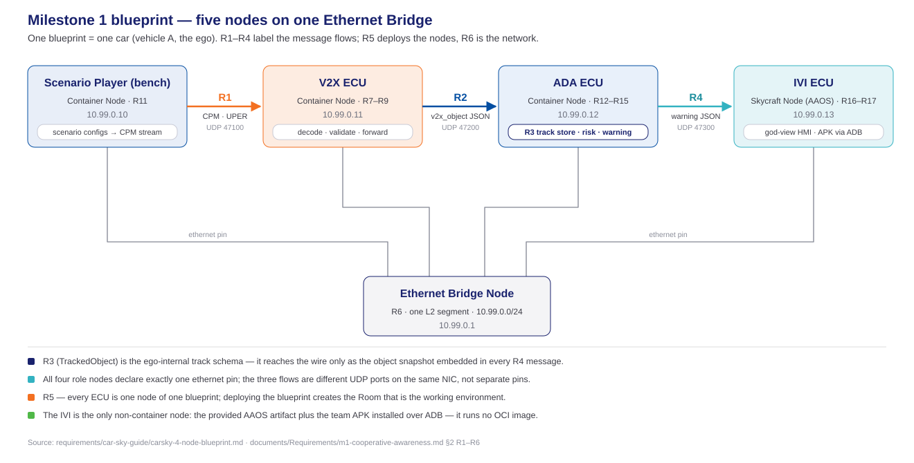
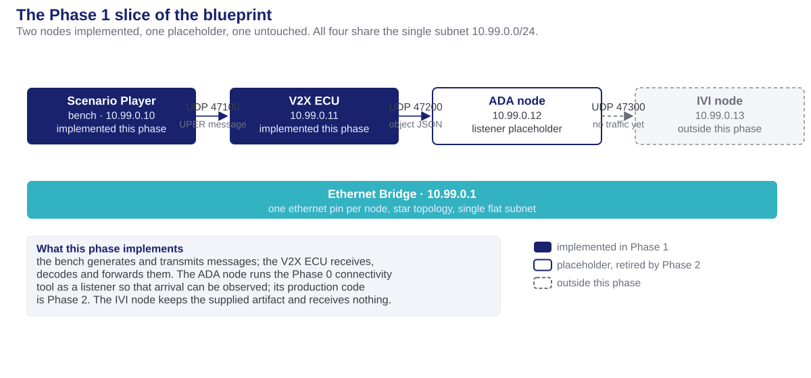
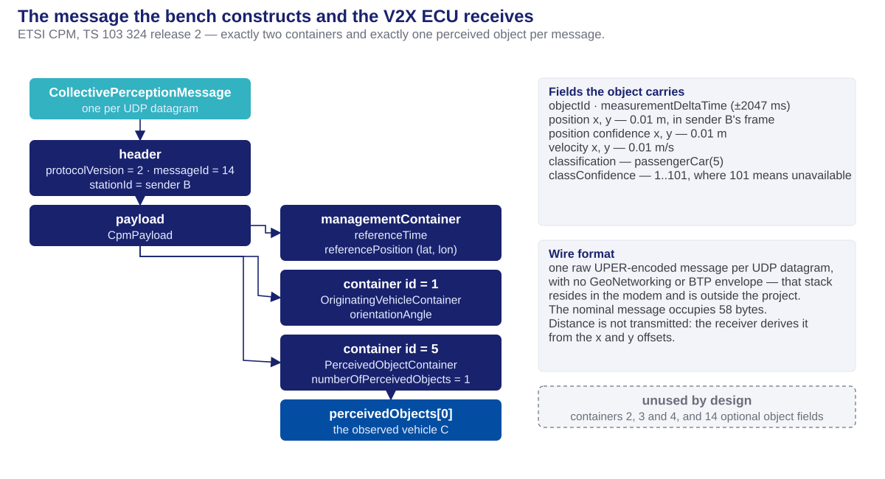
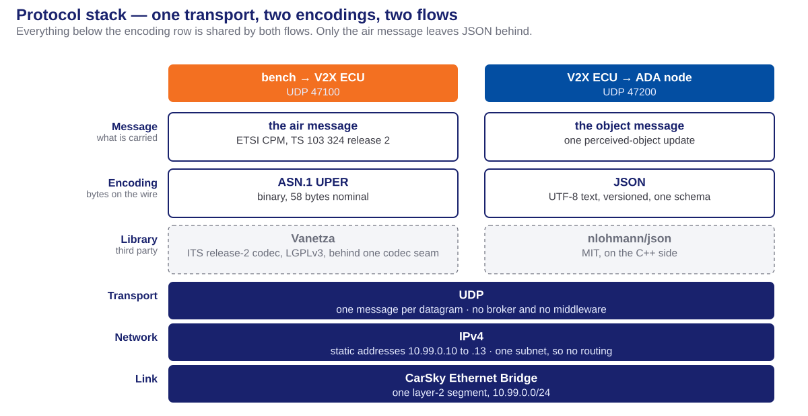
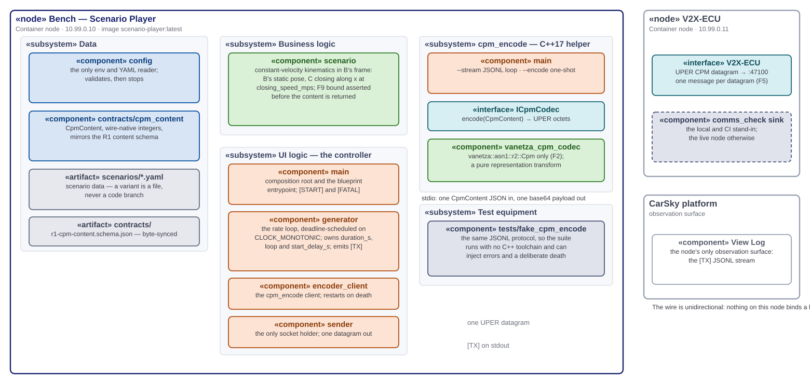
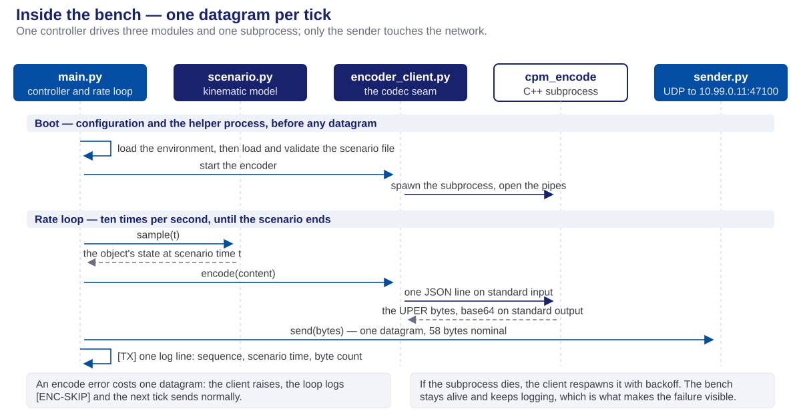
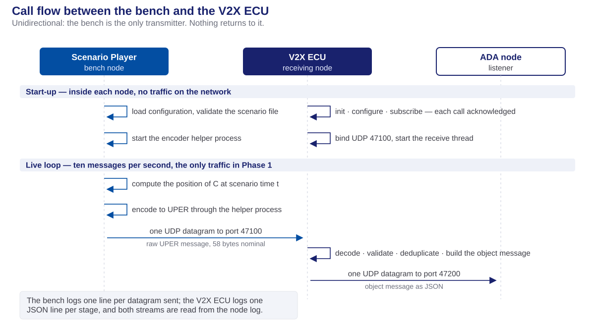

<!-- _class: lead -->
<!-- _paginate: false -->

# Phase 1 — Design Concepts

## The Scenario Player constructs the message; the V2X ECU receives it

**Milestone 1 · Cooperative Vehicle Awareness — FPT Hackathon 2026**

Node designs in detail: [V2X ECU](phase1-design-v2x-ecu-deck.html) · [Scenario Player](phase1-design-scenario-player-deck.html)

Planning and execution of this design: [phase1-task-execution-deck.html](phase1-task-execution-deck.html). Preceding phase: [phase0-design-concepts-deck.html](../phase0/phase0-design-concepts-deck.html).

Sources: [V2X ECU HLD](../../V2X_ECU/doc/v2x-ecu-hld.md) · [Scenario Player HLD](../../Scenario_Player/doc/scenario-player-hld.md) · [r1-cpm-profile.md](../../contracts/r1-cpm-profile.md) · [contracts/](../../contracts/)

---

# Table of contents

1. **Terminology** — every term this deck uses, defined before use
2. **The blueprint** — the whole topology, then the slice Phase 1 implements
3. **The messages** — the air message and the object message, and where each is defined
4. **Protocol stack and libraries** — the layers, and the third parties that serve them
5. **The blueprint nodes** — the image each runs, its architecture, and its call flow
6. **Testing** — the configurations that exercise each node, and the equipment they need
7. **Handoff** — what Phase 2 inherits

---

<!-- _class: lead -->

# 01 · Terminology

---

# Platform terminology

The CarSky platform's vocabulary. Every later slide uses these terms without restating them.

| Term | Definition |
| ---- | ---------- |
| **Blueprint** | The design of one vehicle: its nodes and their wiring. One blueprint is one vehicle. Nothing executes. |
| **Node** | One ECU within a blueprint. A **Container Node** runs an OCI image; a **Skycraft Node** runs an Android guest. |
| **Pin** | A node's connection point. Milestone 1 uses one kind, the `ethernet` pin, and one per node. |
| **Ethernet Bridge** | A node whose sole function is to join the other nodes' pins into one network. |
| **Room** | The running instance of a deployed blueprint. |
| **Deployment** | The act of converting a blueprint into a Room. Only a deployment starts a container. |

- **Editing a blueprint changes nothing that is running.** Only a new deployment applies a change, which is why every configuration change in this phase is followed by a redeployment.

---

# Project terminology

Terms this project defined or narrowed.

| Term | Definition |
| ---- | ---------- |
| **Contract** | A frozen, versioned message definition agreed between two nodes, committed to the repository. It is the authority against which code is measured. |
| **Frozen** | Changed only by re-freezing across every consumer simultaneously. |
| **Seam** | A boundary positioned so that one side can be replaced without modifying the other — here, the codec seam and the radio interface. |
| **Bench** | Sanctioned test equipment sharing the Room network: the Scenario Player, which stands in for the modem and the external world. |
| **Ego** | The vehicle the system runs in — vehicle A, whose driver receives the warning. |
| **Reference message** | One committed pair: a message content in readable form, with the exact bytes it must encode to. Six exist. |

- **The bench is not a mock.** It is a node on the production network transmitting real messages; no downstream component can distinguish it from a vehicle.

---

# The two messages this phase carries

Both were frozen in Phase 0. Phase 1 is the first phase to produce and consume them.

| | Message | Between | Content |
| --- | ------- | ------- | ------- |
| **R1** | the air message — a CPM profile | bench → V2X ECU | One perceived object as it exists on the air, encoded to bytes |
| **R2** | the object message | V2X ECU → ADA ECU | The same object decoded into SI units, as JSON |

- **R1 and R2 are identifiers, not names.** This deck calls them the air message and the object message; the identifiers appear because the repository and the schemas use them.
- **A third message exists but is not carried this phase.** The warning message from the ADA node to the display is Phase 5 work.

---

<!-- _class: lead -->

# 02 · The blueprint

---

# The whole topology

---

# The slice Phase 1 implements

---

<!-- _class: lead -->

# 03 · The messages

---

# The air message

The V2X message as it exists on the air. The only message in the milestone that is not JSON.

| | |
| --- | --- |
| **Defines** | The ETSI CPM fields Milestone 1 uses, with their units and bounds — a profile narrowing a large standard to what the demonstration requires |
| **Standard** | ETSI TS 103 324 v2.1.1, release 2 |
| **Direction** | bench → V2X ECU, UDP `47100` |
| **Encoding** | ASN.1 UPER — 58 bytes for the nominal case, one message per datagram |
| **Artifacts** | `r1-cpm-content.schema.json` · `r1-cpm-profile.md` · `golden-vectors/` — six content and byte pairs |
| **Copies held in** | `V2X_ECU/contracts/` · `Scenario_Player/contracts/` |

- **Two independent implementations must agree on it:** the encoder inside the bench and the decoder inside the V2X ECU. The reference messages exist for exactly that reason, and Phase 1 verifies the encoder against them byte for byte.

---

# The structure of the air message

---

# The object message

What the V2X ECU forwards inward once it has decoded the air message.

| | |
| --- | --- |
| **Defines** | One perceived-object update: identity, position, kinematics, confidence, and the time at which it was valid |
| **Direction** | V2X ECU → ADA ECU, UDP `47200` |
| **Encoding** | JSON, versioned, one datagram per object update |
| **Artifacts** | `r2-v2x-object.schema.json` · `samples/r2-object.json` |
| **Copies held in** | `V2X_ECU/contracts/` · `ADA_ECU/contracts/` |

- **Distance is derived, never transmitted.** The air message carries a relative x and y offset; the V2X ECU computes the distance on arrival, so the transmitted position and the derived distance cannot disagree.
- **Units change at this boundary.** The air message uses 0.01 m and 0.1 degree integers; the object message uses metres, metres per second and degrees.
- **One message per object update**, not a batch.

---

# Where the contracts are held

One authority at the repository root, and a working copy inside each node that consumes it.

| Location | Holds |
| -------- | ----- |
| **`contracts/`** | The frozen originals: the schemas, the profile document, the six reference messages, the samples |
| **`V2X_ECU/contracts/`** | the air message, the object message |
| **`Scenario_Player/contracts/`** | the air message |
| **`ADA_ECU/contracts/`** | the object message, and the two later contracts |

- **The copies are not forks.** `contracts/sync-manifest.json` lists every file that must match and `contracts/check_sync.py` fails the build as soon as one diverges. Phase 1 extended it from 36 to **47 tracked copies**.
- **Phase 1 added a new kind of tracked copy.** Beyond schemas, the manifest now covers the pinned codec version and the codec sources themselves, because the bench compiles the same encoder the V2X ECU decodes with.

---

<!-- _class: lead -->

# 04 · Protocol stack and libraries

---

# The protocol stack

---

# The libraries this phase uses

Three third-party dependencies. All are open source and Linux-compatible.

| Library | Licence | Serves | Function |
| ------- | ------- | ------ | -------- |
| **Vanetza** | LGPLv3 | the air message | ETSI ITS release-2 ASN.1 codec — the only component that handles UPER. Linked dynamically, ASN.1 targets only |
| **nlohmann/json** | MIT | the object message | JSON binding inside the V2X ECU |
| **PyYAML** | MIT | scenario configuration | Parses the bench's scenario files |

- **One codec, two build contexts.** The bench and the V2X ECU compile the same Vanetza version, pinned once in `contracts/vanetza-pin.cmake` and copied byte-identically into both builds.
- **None of the three is a framework.** Each is a library the code invokes; none owns the program's control flow.
- **The transport requires no library.** UDP sockets come from the C++ and Python standard libraries.

---

<!-- _class: lead -->

# 05 · The blueprint nodes

---

# Delivered images

Three container images run in the phase's Room. Two of them are Phase 1 deliverables; the third is Phase 0 equipment kept in place.

| Node | Image | Role | Messages | State after Phase 1 |
| ---- | ----- | ---- | -------- | ------------------- |
| **Scenario Player** | `m1-scenario-player:latest` | Source — one object update every 100 ms | Produces the air message | A complete bench application: configuration loading, a kinematic model, an encoder helper process, and the transmission loop. [Its own deck](phase1-design-scenario-player-deck.html) |
| **V2X ECU** | `m1-v2x-ecu:latest` | Relay — decode, validate, deduplicate, forward | Consumes the air message, produces the object message | A complete receiving application: the radio interface and its simulated modem, the four-stage receive pipeline, the forwarder, the event log, and in-container traffic capture. [Its own deck](phase1-design-v2x-ecu-deck.html) |
| **ADA node** | `m1-netcheck:latest` — Phase 0's connectivity tool | Sink — prints each arriving body | Receives the object message, interprets none of it | **A placeholder**, retired when Phase 2 implements the node |
| **IVI node** | None — the supplied artifact, on a Skycraft node | Not exercised | None | Unchanged, and receives no traffic in this phase |

- **The two new images are built for the platform's processor** and pushed to `registry.hackathon-2.carsky.io`; the placeholder is kept only so that the object message has somewhere to arrive and be read.
- **The radio is simulated, and is labelled as such.** The interface mirrors a production modem's four calls; behind it, a state machine acknowledges each call and injects faults on request. Replacing it with a real modem changes nothing above the interface.

---

# Scenario Player architecture

---

# Reading the component diagrams

---

# Scenario Player internal call flow

---

# V2X ECU architecture

---

# V2X ECU internal call flow — start-up

---

# V2X ECU internal call flow — reception and decoding

---

# V2X ECU internal call flow — forwarding

---

# Overall callflows between nodes

---

<!-- _class: lead -->

# 06 · Testing

---

# How each node is tested

Four configurations, differing only in what stands at the seams and on the wire.

| Configuration | Scenario Player | V2X ECU |
| ------------- | --------------- | ------- |
| **Unit — fakes at every seam** | A fake encoder helper, and injected send, clock and sleep callables | A fake codec, a map-backed environment, injected clocks, a loopback socket |
| **Integration — the real codec** | The built `cpm_encode` over the six reference messages, byte for byte | The real decoder over the frozen corpus, and over a malformed corpus it must reject rather than crash on |
| **Loopback — the comms check** | — | The built application against a stand-in sink, driven by the reference messages, with the log chain asserted |
| **Deployed — the Room** | The bench against the real V2X ECU, evidenced from both node logs | The live bench upstream and the listener at the ADA address |

- **The expected output is identical in the last two**, because only the sender and the sink change. A difference between them is a bench or platform finding, never a node one.
- **A fake codec cannot prove the real one rejects garbage**, which is why the malformed corpus runs against the actual decoder.

---

# The test equipment the design depends on

Scaffolding, not production code, but part of the design because the phase's evidence depends on it.

- **A message transmitter and a log-chain assertion**, held in `tools/comms_check/`. The transmitter sends the six reference messages; the assertion confirms that every received message produced an arrival event, a decode event carrying the decoded content, and a forwarding event carrying the object message. It fails if any link is missing.
- **In-container traffic capture** on the V2X ECU. That node's interface sees both live flows, so it is the single capture point. Capture writes readable lines to the node log and exports rotating capture files through the log as encoded blocks, because the platform offers no file download.
- **A listener on the ADA node**, which prints complete message bodies so that the decoded values are visible before the ADA node has any code of its own.

> Captured traffic displays as UDP data rather than an ITS protocol tree: the wire format carries no GeoNetworking or BTP envelope, so the evidence is payload-byte correlation.

---

<!-- _class: lead -->

# 07 · Handoff

---

# What Phase 2 inherits

Phase 2 implements the ADA node's track store and admission logic. The following are Phase 1 deliverables it need not re-establish.

- **An observed message format.** Object messages arrive at the ADA node with real decoded values; Phase 2 builds against a format that has been seen on a running system, not only agreed on paper.
- **The derivations are already performed.** Distance, SI units, confidence conversion and sender speed are computed in the V2X ECU, so the ADA node receives finished values.
- **An evidence stream.** Every stage of the receive path emits one JSON line with running counters — the format later phases use to reconstruct a complete run.
- **A characterised platform.** Both node images build for the platform's processor, push to its registry and run; the node-configuration deviations are recorded in the run record.
- **Reusable test equipment**, none of it node-specific: the message transmitter, the log-chain assertion, and the listener.

---

# What does not carry forward, and what is still open

- **The listener on the ADA node is a placeholder.** It is Phase 0 connectivity equipment, and Phase 2 replaces it entirely. No part of it becomes production code.
- **The vehicle does not transmit.** Transmission was moved out of the milestone; the radio interface declares the call, and nothing invokes it.
- **Three configuration defaults are proposals.** The retry ceiling, the retry backoff and the duplicate-message window are externalised as configuration, but the values themselves await ratification.
- **One acceptance clause has no owner.** Whether the display node's application must launch in this phase is not covered by either design document.

> A design is not an implementation. Everything above is designed and implemented; what remains outstanding is deployment evidence, which the [task-execution deck](phase1-task-execution-deck.html) records.

---

<!-- _class: lead -->
<!-- _paginate: false -->

# Thank you

**Phase 1 — Design Concepts** · Milestone 1 · FPT Hackathon 2026
