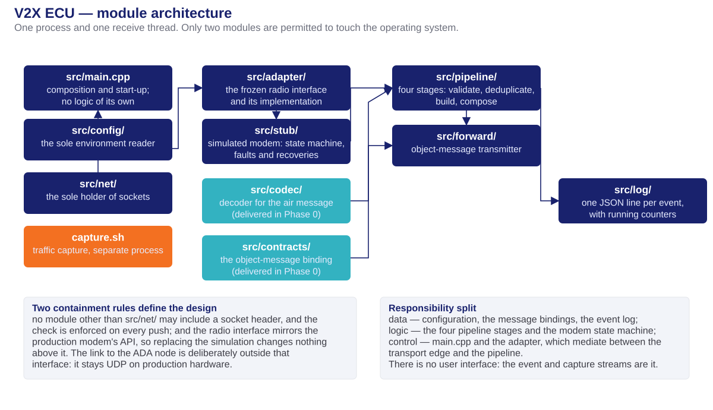
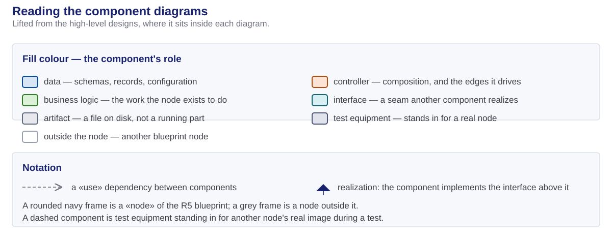
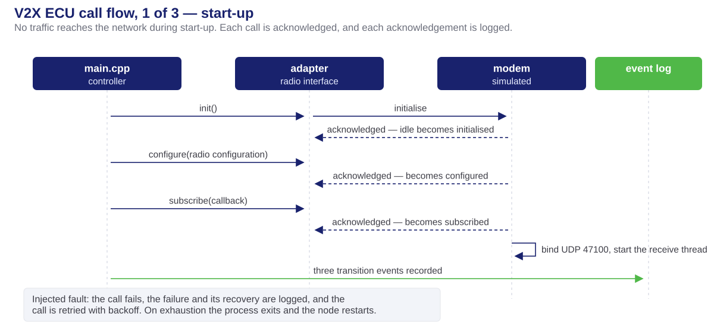
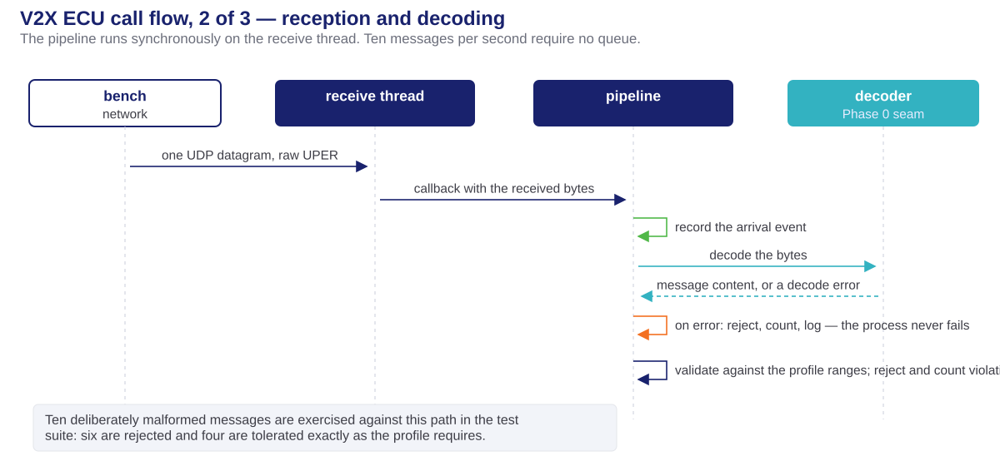
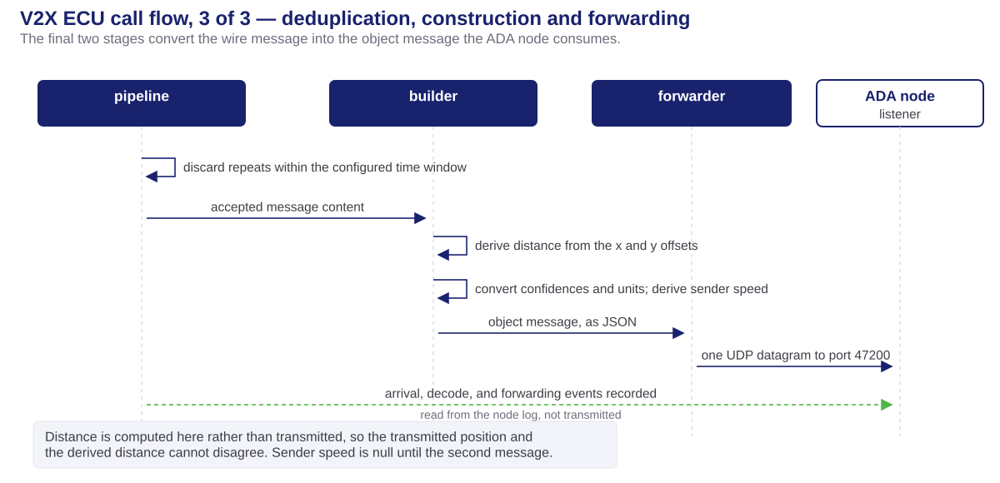

<!-- _class: lead -->
<!-- _paginate: false -->


# Phase 1 — V2X ECU Design

## The receiving node, module by module

**Milestone 1 · Cooperative Vehicle Awareness — FPT Hackathon 2026**

Companion to [phase1-design-deck.html](phase1-design-deck.html), which defines the terminology, the blueprint and the two messages. Nothing from it is repeated here.

Source: [v2x-ecu-hld.md](../../V2X_ECU/doc/v2x-ecu-hld.md)

---

# Table of contents

1. **Module architecture** — the submodules and the two containment rules
2. **Folder layout** — where each module lives
3. **Build toolchain** — how the node is compiled, tested and packaged
4. **Call flow** — start-up, reception, and forwarding, in three parts
5. **Configuration** — every value the blueprint injects
6. **Observation** — the event stream and traffic capture

---

<!-- _class: lead -->


# 01 · Module architecture

---

# The modules and their dependencies



---

# Reading the diagram



---

# What each submodule does

| Module | Responsibility |
| ------ | -------------- |
| `src/main.cpp` | Composition and start-up sequence. Constructs every part, drives the three radio calls, then serves traffic. No logic of its own |
| `src/config/` | Reads and validates the environment into an immutable record. The only module that reads the environment |
| `src/net/` | Owns the UDP socket, with the file descriptor released automatically. The only module permitted to include a socket header |
| `src/adapter/` | The frozen radio interface — `init`, `configure`, `subscribeRx`, `send` — and its implementation over the simulated modem, including the receive thread |
| `src/stub/` | The simulated modem: a four-state machine that acknowledges each call, rejects out-of-order calls, injects the configured fault and performs the defined recovery |
| `src/pipeline/` | Four stages — validate, deduplicate, build, and the composition that runs them in order on the receive thread |
| `src/forward/` | Transmits the object message to the ADA node. Consumes the socket module; contains no socket code |
| `src/log/` | Writes one JSON line per event, carrying the running counters and, for two event kinds, the message payload itself |

---

# Two containment rules define the design

- **Only `src/net/` may include a socket header.** A check runs on every push and fails, naming the file, if any module above the radio interface includes a system socket header. This is what makes the interface real rather than aspirational.
- **The radio interface mirrors a production modem's API.** Its four calls, their order and their result codes correspond to the telux radio API, recorded in `doc/telux-parity-and-port-plan.md`. Replacing the simulation with a real modem changes nothing above the interface.
- **The link to the ADA node is deliberately outside that interface.** It remains UDP on production hardware, so placing it behind a radio interface would misrepresent the system.
- **The transmit call is declared and never invoked.** Vehicle transmission was moved out of the milestone; the declaration keeps the interface complete and returns a not-supported result.

---

<!-- _class: lead -->


# 02 · Folder layout

---

# Abridged folder structure

```
V2X_ECU/
├── Dockerfile              multi-stage: compile stage, then a slim runtime with tcpdump
├── entrypoint.sh           starts capture in the background, then the application
├── capture.sh              two capture processes: readable lines, and rotating files
├── CMakeLists.txt          libraries, the executable, and every test target
├── contracts/              the two schemas, synchronised copies
├── cmake/vanetza-pin.cmake the pinned codec version, a synchronised copy
├── src/
│   ├── main.cpp            composition root
│   ├── config/ · net/      the sole environment reader · the sole socket owner
│   ├── adapter/ · stub/    the radio interface and its implementation · the simulated modem
│   ├── codec/              the decoder for the air message         (Phase 0)
│   ├── contracts/          the object-message binding              (Phase 0)
│   ├── pipeline/           validator · deduper · builder · composition
│   ├── forward/            the object-message transmitter
│   └── log/                the event-stream writer
├── tools/
│   ├── check_transport_imports.py   the socket-containment check
│   └── extract_pcap.sh              host-side capture extraction, never in the image
├── tests/                  11 suites, mirroring src/ one directory per module
│   └── fixtures/           the six reference messages · ten malformed messages
└── doc/                    this design, the call-flow source, the porting notes
```

- **Test directories mirror source directories**, so the suite covering a module is always at the same path under `tests/`.

---

<!-- _class: lead -->


# 03 · Build toolchain

---

# How the node is compiled, tested and packaged

| Concern | Tool | Detail |
| ------- | ---- | ------ |
| **Language** | C++17 | One process and one receive thread; no raw owning pointers |
| **Build system** | CMake ≥ 3.22 | One static library per module, one executable, one test target per module |
| **Dependencies** | CMake FetchContent | Vanetza at a pinned commit, ASN.1 targets only; nlohmann/json v3.11.3 |
| **Unit tests** | GoogleTest and CTest | 11 suites; the suite is the definition of done for a subtask |
| **Container image** | Docker, multi-stage | A compile stage, then a slim runtime carrying the executable, the capture script and tcpdump |
| **Licence posture** | dynamic linking | The codec is LGPLv3, so it is linked dynamically and its shared library is staged into the runtime |
| **Verification** | GitHub Actions | `v2x-core-build` compiles and tests · `v2x-comms-check` runs the application end to end · `v2x-ecu-image` builds and pushes the image |

- **The codec version is pinned once and shared.** `contracts/vanetza-pin.cmake` holds the commit and the target list; both this build and the bench's encoder build consume byte-identical copies, and the copy gate fails if they diverge.
- **The image is built for the platform's ARM processor under emulation**, which takes approximately nineteen minutes and is therefore built by CI rather than on a developer machine.

---

<!-- _class: lead -->


# 04 · Call flow

---

# Part 1 — start-up



---

# Part 2 — reception and decoding



---

# Part 3 — deduplication, construction and forwarding



---

# The four pipeline stages

| Stage | Rule |
| ----- | ---- |
| **Decode** | The decoder returns either message content or an error. An error is rejected, counted and logged; the process never fails |
| **Validate** | Mandatory fields must be present and every value must fall inside the profile's range, including the measurement-time bound the profile narrows below the wire's own limit. Each violation is counted by reason |
| **Deduplicate** | The key is the sender, the object identifier and the measurement time. Repeats inside a sliding window are discarded and counted |
| **Build** | Distance is computed from the x and y offsets; confidences are converted, with the unavailable sentinel becoming a null value; sender speed is derived from consecutive positions and is null until the second message; the receipt time is stamped |

- **Every stage is a separate class with its own test suite**, and the composition injects them. That is what allows each rule to be proven in isolation before the pipeline exists.
- **Ten deliberately malformed messages exercise the whole path.** Six are rejected; four are tolerated exactly as the profile requires, because they are valid messages that differ only in fields the profile ignores.

---

<!-- _class: lead -->


# 05 · Configuration and observation

---

# Every value the blueprint injects

| Variable | Default | Meaning |
| -------- | ------- | ------- |
| `LISTEN_PORT` | `47100` | The port the receive thread binds |
| `ADA_ECU_HOST` / `ADA_ECU_PORT` | `10.99.0.12` / `47200` | The object-message destination |
| `FAULT_PLAN` | `none` | Fault injection: none, initialisation failure, configuration rejection, or subscription loss |
| `INIT_RETRY_MAX` | `3` *(proposed)* | Retry ceiling before the process exits |
| `RETRY_BACKOFF_MS` | `500` *(proposed)* | Backoff between retries |
| `DEDUPE_WINDOW_MS` | `1500` *(proposed)* | The duplicate-message window |
| `EVENT_LOG_PATH` | *(empty)* | An optional file sink for the event stream |
| `CAPTURE_FILTER` · `PCAP_DIR` · `CAPTURE_ROTATE_S` | `udp` · `/data/capture` · `60` | Capture filter, output directory and rotation period |

- **No tunable value appears as a literal in the source.** The defaults live in one table in one module, and the blueprint overrides them per node.
- **Three defaults are architecture proposals**, marked as such until ratified. They are externalised either way.

---

# The event stream and traffic capture

- **One JSON line per event**, prefixed so it can be separated from capture output in the same log: arrival, decode success, decode rejection, validation rejection, duplicate discarded, message forwarded, state transition, fault injected, recovery.
- **Two events carry their payload.** The decode-success event embeds the decoded content and the forwarding event embeds the object message, so the event stream alone demonstrates reception, decoding and forwarding without a second tool.
- **Every line carries the running counters**, so a single line states how many messages have been received, rejected, discarded and forwarded.
- **Capture runs as a separate process** started before the application, so a capture failure can never block reception. It emits readable lines to the log and exports rotating capture files as encoded blocks, because the platform provides no file download.
- **Capture degrades rather than fails.** If the platform does not grant the capability, the script logs the fact and continues.

> The V2X ECU interface is the single capture point, because it is the only interface that sees both live flows.

---

# Open items

- **Three configuration defaults await ratification** — the retry ceiling, the retry backoff and the duplicate-message window.
- **Captured traffic does not display as an ITS protocol tree.** The wire format carries no GeoNetworking or BTP envelope, so a capture tool shows UDP data; the evidence is correlation of payload bytes and timestamps against the reference messages and the event stream.
- **The node's start command and capabilities must be set by hand** in the platform UI, as the REST interface cannot set node configuration.

---

<!-- _class: lead -->
<!-- _paginate: false -->


# Thank you

**Phase 1 — V2X ECU Design** · Milestone 1 · FPT Hackathon 2026
