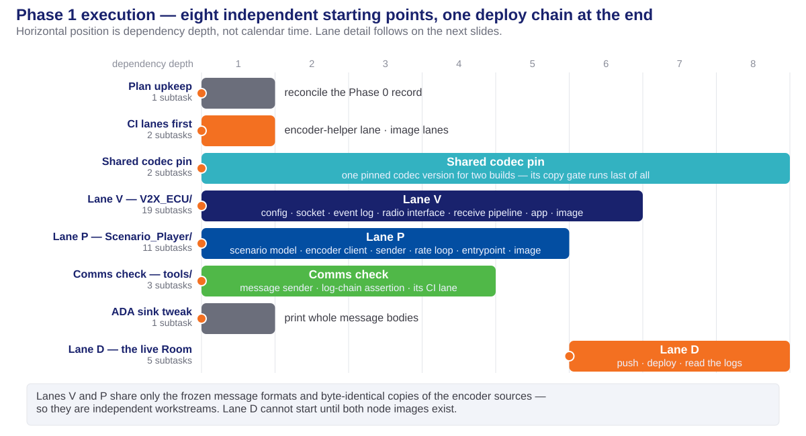
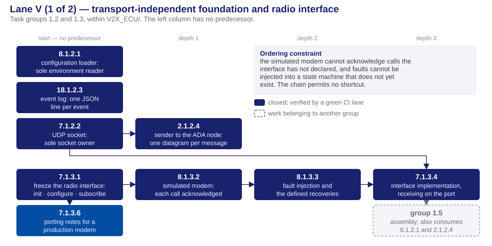
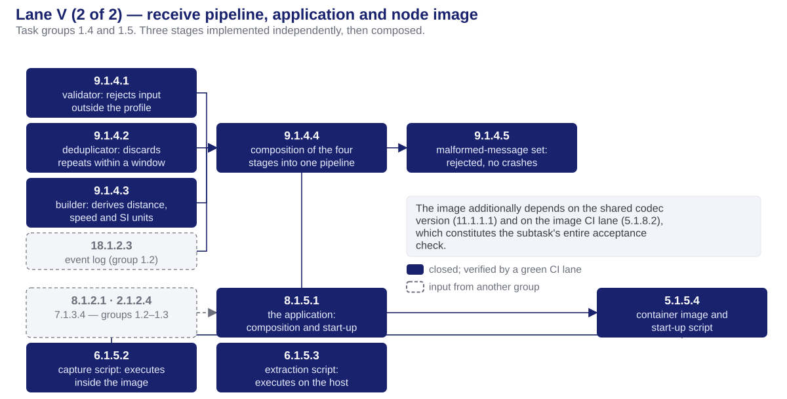
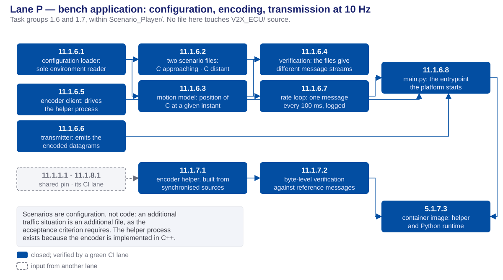
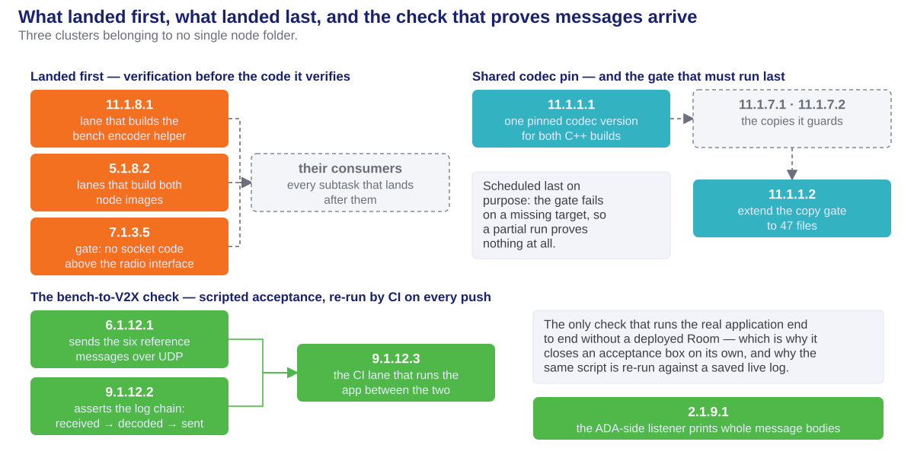
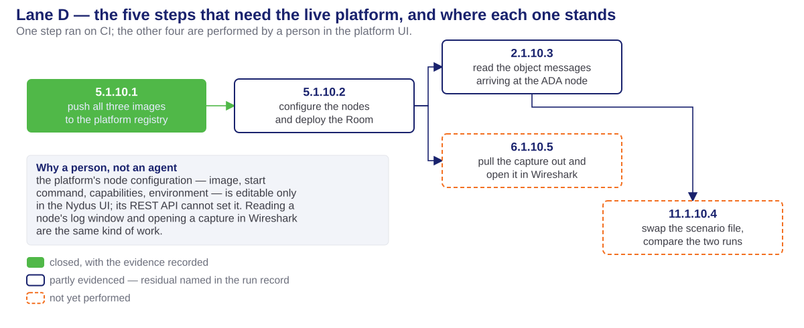

<!-- _class: lead -->
<!-- _paginate: false -->

# Phase 1 — Task Execution

## Comms bring-up: decomposition, execution and verification status

**Milestone 1 · Cooperative Vehicle Awareness — FPT Hackathon 2026**

12 task groups · 44 subtasks · 40 closed · 4 outstanding, all manual

Preceding phase: [phase0-task-execution-deck.html](../phase0/phase0-task-execution-deck.html) · [phase0-design-concepts-deck.html](../phase0/phase0-design-concepts-deck.html)

Sources: [phase1_tasks.md](../../plans/phase1_tasks.md) · [phase1-comms-run.md](../../plans/doc/deprecated/phase1-comms-run.md) · design documents for the [V2X ECU](../../documents/Design/MODULE-DESIGN/V2X-ECU/v2x-ecu-hld.md) and the [bench](../../documents/Design/MODULE-DESIGN/SCENARIO-PLAYER/scenario-player-hld.md)

---

# Table of contents

1. **Work organization** — track, execution lane and CI lane
2. **Work decomposition** — identification scheme, phase size, execution responsibility
3. **Task groups** — the deliverable of each of the twelve
4. **Code delivered** — the files added to the repository
5. **Execution order** — dependency structure, lane by lane
6. **Parallel and sequential work** — and the constraint behind each
7. **Verification status** — the nine acceptance criteria and the scope of their evidence
8. **Handoff** — inputs available to Phase 2, and the outstanding work

---

<!-- _class: lead -->

# 01 · Work organization

---

# Phase objective and scope

- **Objective.** The bench transmits synthetic traffic messages; the V2X ECU receives, decodes and forwards each one to the ADA ECU as an object message.
- **Reception only.** The vehicle transmits nothing in this phase.
- **Entry condition.** Phase 1 could begin only because Phase 0 had frozen the message formats.
- **Exit condition.** Nine acceptance criteria, each closed by a stated piece of evidence.
- **Two node folders were developed concurrently:** the V2X ECU in C++ and the bench, named the Scenario Player, in Python. They share no source code — only the frozen message formats and byte-identical copies of the encoder sources.

> The bench is sanctioned test equipment, not a mock. It is a node on the production network transmitting real messages; no downstream component can distinguish it from a vehicle.

---

# Planning terminology

Three distinct concepts are referred to as a *track* or a *lane*. They are not interchangeable.

| Term               | Definition                                                                         | Specified in                                      | Phase 1 example           |
| ------------------ | ---------------------------------------------------------------------------------- | ------------------------------------------------- | ------------------------- |
| **Track**          | a workstream spanning whole phases, executed by different people concurrently      | [milestone1_high_level_plan.md](../../documents/Plan/milestone1_high_level_plan.md)        | the comms track = Phase 1 |
| **Phase**          | one stage, with an input list and acceptance criteria                              | [task-planning-conventions.md](../../.claude/rules/task-planning-conventions.md) | Phase 1 |
| **Execution lane** | subtasks ordered by dependency, named after the folder they write into             | the phase plan, *Execution order & parallelism*   | Lane V = `V2X_ECU/`       |
| **CI lane**        | one job in the GitHub Actions workflow; it builds, tests, and passes or fails      | [phase1-ci.yml](../../.github/workflows/phase1-ci.yml) | `v2x-comms-check`    |

- **Lane letters are local to a phase and do collide.** Phase 0 Lane D is the bench folder; Phase 1 Lane D is the deployment chain.
- **Lane letters do not express an order.** Only a stated dependency sequences one lane against another, and a dependency always names an artifact.
- **Only a CI lane executes.** A track and an execution lane are planning structures.

---

# Execution lanes

Each lane is named after the folder it writes into; no two lanes modify the same files.

| Lane            | Writes into          | Depends on                              | Deliverable                                                            |
| --------------- | -------------------- | --------------------------------------- | ----------------------------------------------------------------------- |
| **V**           | `V2X_ECU/`           | the Phase 0 message formats             | receive pipeline, application, capture scripts, container image        |
| **P**           | `Scenario_Player/`   | the message formats and encoder sources | bench application, encoder helper, container image                     |
| **Shared**      | `contracts/`         | nothing initially; everything at close  | one pinned codec version for two builds; the copy-integrity gate       |
| **CI**          | `.github/workflows/` | nothing                                 | four verification jobs, delivered before the code they verify          |
| **Comms check** | `tools/comms_check/` | the event-log format                    | scripted proof that a transmitted message is received and forwarded    |
| **D**           | the deployed Room    | lanes V and P                           | image push, deployment, log inspection, scenario swap, traffic capture |

- **Lanes V and P are logically parallel.** They were executed consecutively only because all subtasks share one working folder on one machine.

---

# Continuous integration as the verification path

- **The development machine runs Windows without Docker or a Linux subsystem.** Every C++ compilation, container image and Linux test therefore executes on GitHub Actions.
- **Ten jobs across two workflow files.** Phase 0 established six in `phase0-ci.yml`; Phase 1 added `sp-codec-helper`, `v2x-comms-check`, `v2x-ecu-image` and `scenario-player-image` in `phase1-ci.yml`. Both run on every push, so the split is a matter of maintenance, not of coverage.
- **For a C++ subtask, "tests pass" is defined as "the lane is green".** No alternative execution environment exists, so the definition of done cites a run identifier.
- **Three runs verify the phase:** [8 lanes green](https://github.com/mnpham2101/FPT-Hackathon2026/actions/runs/30697863324) over the phase's code · [10 lanes green](https://github.com/mnpham2101/FPT-Hackathon2026/actions/runs/30698630956) adding both node images, which also pushed them to the platform registry · [10 lanes green](https://github.com/mnpham2101/FPT-Hackathon2026/actions/runs/30700052056) confirming the malformed-message tests.
- **The image lanes carried the highest schedule risk.** The message library is compiled for the platform's ARM processor under emulation; both images built within the six-hour ceiling at the first attempt, in approximately 19 and 20 minutes.

---

<!-- _class: lead -->

# 02 · Work decomposition

---

# Task identification scheme

Every task and subtask carries the identifier `X.Y.Z.W`.

| Segment | Meaning                | Value in `9.1.4.4`                                 |
| ------- | ---------------------- | -------------------------------------------------- |
| `X`     | the requirement served | safe decoding of incoming messages                 |
| `Y`     | the phase              | 1 — comms bring-up                                 |
| `Z`     | the task group         | group 1.4 — the receive pipeline                   |
| `W`     | the subtask            | the fourth: composition of the four stages         |

- **The group number is not the requirement number.** Group 1.5 contains `8.1.5.1`, `6.1.5.2`, `6.1.5.3` and `5.1.5.4` — four requirements in one group, because together they deliver a single outcome: a V2X ECU that runs, captures its own traffic and ships as an image.

---

# Decomposition summary

- **12 task groups, 44 subtasks, six lanes.** Lane V 19 · lane P 11 · deployment 5 · comms check 3 · shared codec version 2 · CI 2 · ADA listener 1 · plan maintenance 1.
- **One subtask has one objective, one atomic commit, a passing build and passing unit tests.** A subtask without a recorded status line has not started.
- **Every subtask brief is self-contained** — file paths, message fields, acceptance criterion — so the implementing agent need not read the wider codebase.
- **No tunable value is hardcoded.** Ports, peer addresses, retry counts, the duplicate-message window, the capture filter and the scenario itself are configuration injected by the platform.
- **39 of the 44 subtasks required no platform access.** This was deliberate: deployment was the scarce resource, so all work that could be verified off-platform was scheduled first.

---

# Execution responsibility

| Performer                        | Count | Scope                                                                                             |
| -------------------------------- | ----- | --------------------------------------------------------------------------------------------------|
| **AI implementation agents**     | 39    | All application code, tests and CI jobs; one atomic commit per subtask                            |
| **Cloud platform (CarSky)**      | 1     | Planned for the platform agent: push of the three images to the registry                          |
| **Manual, in the platform UI**   | 4     | Node configuration, deployment, log inspection, scenario swap, capture analysis                   |

- **The platform step was executed by CI.** The registry credential was already present as a repository secret, so the image lanes performed the push themselves; the platform agent was not required and was never available.
- **Manual execution is unavoidable for the remaining four.** Node configuration — image, start command, capabilities, environment — is editable only in the platform UI; the REST API cannot set it. Log inspection and capture analysis are equally console operations.
- **All 44 subtasks are tracked identically.** Only the performer differs; the evidence requirement does not.

---

<!-- _class: lead -->

# 03 · Task groups

---

# Task groups 1.1 – 1.6

| Task group                                  | Deliverable and lane                                                                                                                                                            |
| ------------------------------------------- | --------------------------------------------------------------------------------------------------------------------------------------------------------------------------------|
| **1.1** — shared codec version, copy gate   | One pinned codec version consumed by both C++ builds, and the integrity gate extended from 36 to 47 tracked copies. **Shared lane;** its gate is scheduled last in the phase.    |
| **1.2** — V2X ECU foundation                | The sole environment reader, the sole socket owner, the event log, and the sender to the ADA node. **Lane V.** No component above these is aware of the transport.               |
| **1.3** — radio interface, simulated modem  | The four-call radio interface a production modem would implement, and a simulated modem that acknowledges each call, injects faults on request and recovers from them. **Lane V.** |
| **1.4** — receive pipeline                  | Decode, reject messages outside the agreed profile, discard duplicates, convert to SI units, forward. Four stages tested independently, then composed. **Lane V.**               |
| **1.5** — application, capture, image       | The application itself, traffic capture inside the container, host-side extraction, and the deployable image. **Lane V.**                                                        |
| **1.6** — bench application                 | Configuration loading, the two scenario files, the motion model, the encoder client, the transmitter, the rate loop and the entrypoint. **Lane P.**                              |

---

# Task groups 1.7 – 1.12

| Task group                                | Deliverable and lane                                                                                                                                                              |
| ----------------------------------------- | -----------------------------------------------------------------------------------------------------------------------------------------------------------------------------------|
| **1.7** — bench encoding path             | A C++ helper process invoked by the Python bench, built from byte-identical copies of the V2X ECU encoder sources and verified against the six reference messages, plus the bench image. **Lane P.** |
| **1.8** — two CI jobs                     | The helper build lane and the two node-image lanes. Delivered before their consumers, each guarded to skip until the code it verifies exists.                                       |
| **1.9** — ADA-side listener               | The listener on the ADA node prints complete message bodies rather than the first 96 characters, so the deployment can display the payload.                                        |
| **1.10** — deployment and verification    | Push, configure, deploy, then collect evidence from the running nodes. **Lane D** — one step on CI, four performed manually.                                                       |
| **1.11** — plan maintenance               | Reconciliation of the Phase 0 acceptance record with the state Phase 0 actually reached. Documentation only.                                                                      |
| **1.12** — bench-to-V2X check             | A transmitter, a log-chain assertion script, and the CI job that runs the application between them. The only check that exercises the complete application without a deployed Room. |

---

<!-- _class: lead -->

# 04 · Code delivered

---

# Deliverables — V2X ECU

| File group                                                                | Delivered by                             | Function                                                                                                          |
| ------------------------------------------------------------------------- | ---------------------------------------- | -------------------------------------------------------------------------------------------------------------------|
| `src/config/` · `src/net/` · `src/log/` · `src/forward/`                  | `8.1.2.1` `7.1.2.2` `18.1.2.3` `2.1.2.4` | Foundation: the sole environment reader, the sole socket owner, the JSON event stream, the sender to the ADA node  |
| `src/adapter/` · `src/stub/`                                              | `7.1.3.1` – `7.1.3.4`                    | The frozen four-call radio interface and the simulated modem behind it, with fault injection and defined recoveries |
| `src/pipeline/` — validator, deduplicator, builder, composition           | `9.1.4.1` – `9.1.4.4`                    | Decode, validate against the profile, discard duplicates, convert to metres and m/s, forward. Each stage tested independently |
| `src/main.cpp` · `CMakeLists.txt`                                         | `8.1.5.1`                                | The application: composition and start-up sequence only, with no logic of its own                                 |
| `tests/` — 11 suites · `tests/fixtures/malformed/` — 10 cases             | all groups, `9.1.4.5`                    | Including the malformed-message set: six that must be rejected, four that must be tolerated                       |
| `capture.sh` · `tools/extract_pcap.sh` · `Dockerfile` · `entrypoint.sh`   | `6.1.5.2` `6.1.5.3` `5.1.5.4`            | In-container capture, host-side extraction, and the deployable image                                              |
| `tools/check_transport_imports.py` · `doc/telux-parity-and-port-plan.md`  | `7.1.3.5` `7.1.3.6`                      | The gate confining socket code below the radio interface, and the changes required by a production modem          |

---

# Deliverables — bench, shared configuration, test equipment

| File group                                                                     | Delivered by                     | Function                                                                                                     |
| ------------------------------------------------------------------------------ | -------------------------------- | ---------------------------------------------------------------------------------------------------------------|
| `player/config.py` · `scenarios/default.yaml` · `scenarios/c-out-of-range.yaml` | `11.1.6.1` `11.1.6.2`            | Configuration loading, and two traffic situations expressed as data: C approaching, and C stationary out of range |
| `player/scenario.py` · `player/generator.py`                                   | `11.1.6.3` `11.1.6.7`            | The position of C at a given instant, and the loop that emits one message every 100 ms                       |
| `player/encoder_client.py` · `player/sender.py` · `main.py`                    | `11.1.6.5` `11.1.6.6` `11.1.6.8` | Communication with the encoder helper, transmission, and the entrypoint the platform starts                  |
| `codec_helper/` — `cpm_encode` · `Dockerfile`                                  | `11.1.7.1` `5.1.7.3`             | A C++ encoder built from byte-identical copies of the V2X ECU sources, and the bench image carrying it        |
| `tests/` — 10 suites, 116 local tests, and the encoder verification            | `11.1.6.4` `11.1.7.2`            | Including proof that the two scenario files produce different message streams, and that the helper output matches the reference messages exactly |
| `contracts/vanetza-pin.cmake` · `contracts/sync-manifest.json`                 | `11.1.1.1` `11.1.1.2`            | One pinned library version for both builds; the gate now covers 47 byte-identical copies                     |
| `tools/comms_check/` · `tools/netcheck/netcheck.py`                            | `6.1.12.1` `9.1.12.2` `2.1.9.1`  | Test equipment: the transmitter, the log-chain assertion, and the listener printing complete bodies           |

---

<!-- _class: lead -->

# 05 · Execution order

---

# Execution overview

- **Horizontal position denotes dependency depth** — the distance of a unit of work from the start of the phase — not calendar time.

---

# Lane V (1 of 2) — foundation and radio interface

---

# Lane V (2 of 2) — receive pipeline, application, image

---

# Lane P — bench application

---

# Verification lanes, shared codec version, comms check

---

# Lane D — deployment and live verification

- **The Room was deployed and object messages were received.** The outstanding items are narrower than the deployment itself: per-node status, a scripted check over a saved log, the second scenario, and a capture file.

---

<!-- _class: lead -->

# 06 · Parallel and sequential work

---

# Dependency structure

| Relationship                        | Scope                                                                 | Constraint                                                                                                                  |
| ----------------------------------- | ---------------------------------------------------------------------- | ----------------------------------------------------------------------------------------------------------------------------|
| **Parallel — the two node lanes**   | all of `V2X_ECU/` against all of `Scenario_Player/`                   | Disjoint folders. The lanes meet only at the frozen message formats and the byte-identical encoder copies                   |
| **Parallel — within the foundation**| configuration reader, socket, event log                               | Distinct files and no shared type; only the forwarder requires the socket                                                   |
| **Parallel — within the pipeline**  | validator, deduplicator, builder                                      | No stage invokes another; only the composition requires all three                                                           |
| **Sequential — the radio chain**    | interface, simulated modem, faults, receive thread                    | Each step is the compile-time input of the next                                                                             |
| **Sequential — CI before code**     | three verification jobs before the subtasks they verify               | A subtask whose acceptance criterion is a green lane requires that lane to exist on the day it lands                        |
| **Sequential — final step**         | the copy-integrity gate, after every new copy exists                  | The gate fails on a missing target; an earlier run would prove nothing                                                      |
| **Sequential — deployment chain**   | push, configure and deploy, inspect logs, swap scenario               | An image cannot be deployed before it is pushed, nor logs read from a node that is not running                              |

> All subtasks were executed one at a time, because every agent shared a single working folder. The parallel entries above state the dependency structure — the work that could proceed concurrently given additional workers.

---

<!-- _class: lead -->

# 07 · Verification status

---

# Acceptance criteria

| Criterion                                                          | Status     | Evidence                                                                   |
| ------------------------------------------------------------------- | ---------- | ----------------------------------------------------------------------------|
| No socket code above the radio interface                           | **closed** | The gate executes on every push; the porting notes are committed           |
| Start-up calls acknowledged; every fault recovers                  | **closed** | Unit tests and the end-to-end CI job; **not** a deployed node              |
| Reference messages decode; malformed messages rejected             | **closed** | Through the production decoder: 6 rejected, 4 correctly tolerated, no crashes |
| A bench message is received, decoded and forwarded                 | **closed** | The `v2x-comms-check` job, which fails if any link is removed              |
| Both images build for the platform; the Room deploys               | *partial*  | Built, pushed, pulled and executed; per-node status not yet confirmed      |
| Traffic captured on the bridge network                             | *partial*  | Capture is active and shows both directions; no file has been retrieved    |
| Different scenarios produce different message streams              | *partial*  | Proven in the model and at byte level; the live swap is outstanding        |
| Object messages at the ADA ECU are not constant values             | *partial*  | Observed live and verified; the scripted check over a saved log is outstanding |
| **Demonstration:** the capture opened in Wireshark                 | **open**   | Requires a log from a Room that has run a full rotation period             |

---

# Scope of the evidence

- **Verified by machine on every push:** the import gate, the fault recoveries, the malformed-message tests, and the complete received–decoded–forwarded chain. These are re-proven at every commit.
- **Observed once, on a live Room:** object messages at the ADA node with `distance` decreasing by exactly **0.25 m per message** at 10 messages per second, matching the 2.5 m/s closing speed in the scenario file. The derived distance equals `hypot(50.25, 1.2)` to every printed digit, confirming computation from the decoded position rather than transfer of a transmitted value.
- **Measured incidentally:** the complete decode-to-forward path required **142–151 µs**, consistently, across every sampled message pair.
- **Not yet evidenced:** every item requiring a saved log export — the scripted log check, the second scenario, and the capture file.

> The bench-to-V2X check is not vacuous. Removal of the forward event fails it at the forward link; removal of the decoded payload fails it at the decode link. Its capacity to fail was tested.

---

<!-- _class: lead -->

# 08 · Handoff

---

# Inputs available to Phase 2

Phase 2 implements the ADA ECU track store and admission logic on mock input. The following are Phase 1 deliverables and need not be re-proven.

- **Object messages arrive at the ADA node.** Their structure, units and field values were verified against the running bench, so Phase 2 builds against an observed format rather than an agreed one.
- **The platform is characterised.** Images build for its processor, push to its registry and execute; the node-configuration deviations — the start command is space-separated, not a JSON array — are recorded in the run record.
- **The event stream exists.** Every stage of the receive path emits one JSON line with running counters; later phases reconstruct a complete run from this format.
- **Ten CI jobs verify the tree on every push**, four of them added by this phase, and the copy-integrity gate covers 47 files.
- **Test equipment is node-independent** and therefore reusable: the transmitter, the log-chain assertion, and the listener printing complete bodies.

---

# Outstanding work

40 of the 44 subtasks are closed. No agent work, CI work or new code remains; all four outstanding items are performed manually in the platform UI.

| Subtask    | Required action                                                                                                                                       |
| ---------- | ------------------------------------------------------------------------------------------------------------------------------------------------------ |
| `5.1.10.2` | Confirm per-node Running status and a restart count of zero in the Deployment Viewer, rather than the summary header, which reported "Pending — 0/0 nodes ready" during normal traffic |
| `2.1.10.3` | Record the start-up call sequence, which is emitted once at node start, and execute the log-chain check over a saved log export                        |
| `11.1.10.4`| Reconfigure the bench to the second scenario file, redeploy, and compare the two log sets                                                              |
| `6.1.10.5` | Save a log containing a capture block, run the extraction script, and open the result in Wireshark                                                     |

- **One deployment session closes all four.** The final three read the same node log; one restart and one sufficiently long log download serve all of them, provided the Room has completed a full capture rotation period.
- **Two decisions remain with the owner, neither of them a task:** ratification of the retry and duplicate-window defaults, and whether the display-application clause belongs to this phase, which no design document covers.

---

<!-- _class: lead -->
<!-- _paginate: false -->

# Thank you

**Phase 1 — Task Execution** · Milestone 1 · FPT Hackathon 2026
