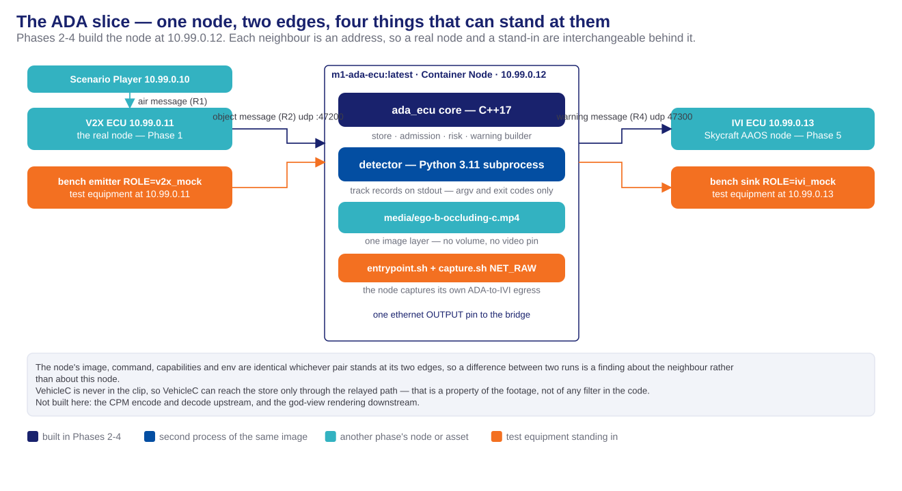
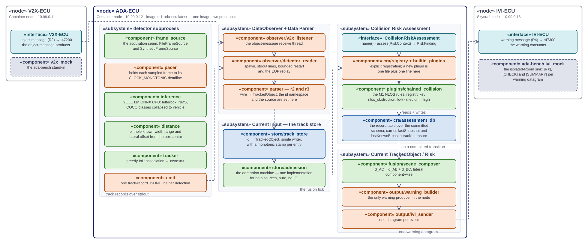
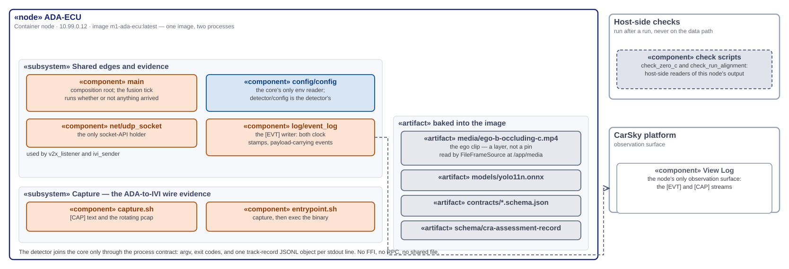
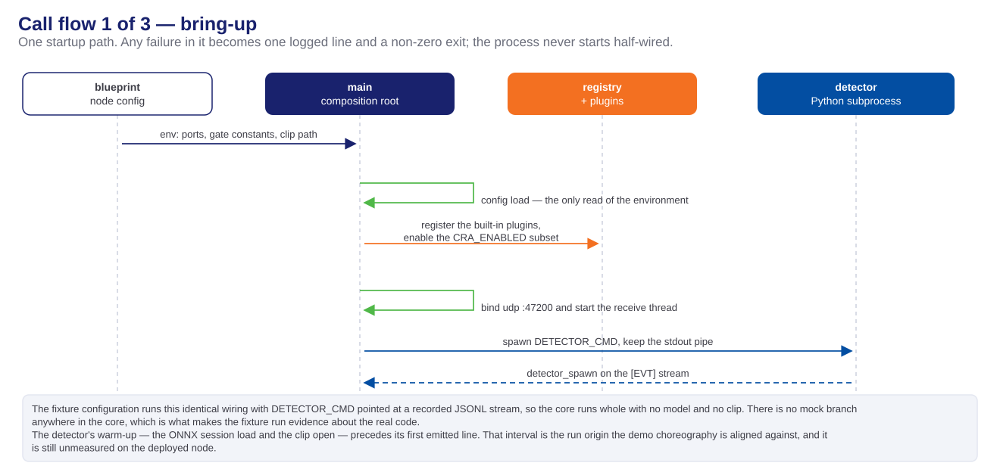
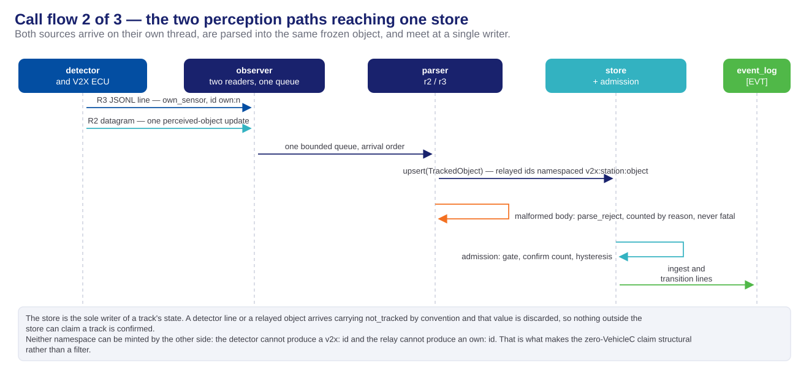
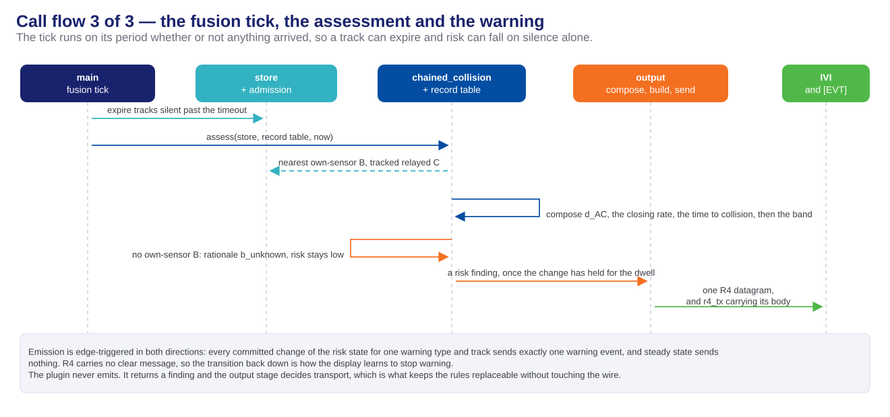
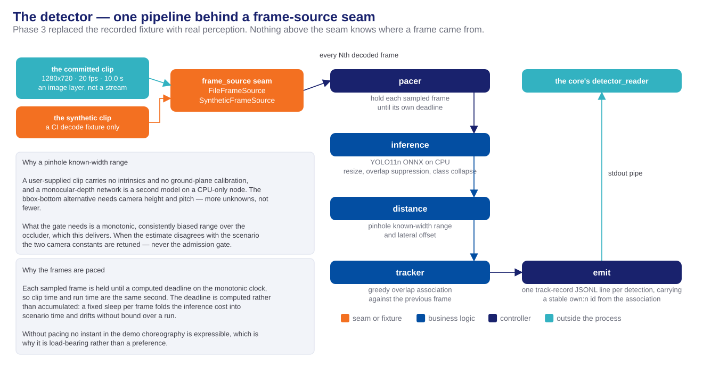
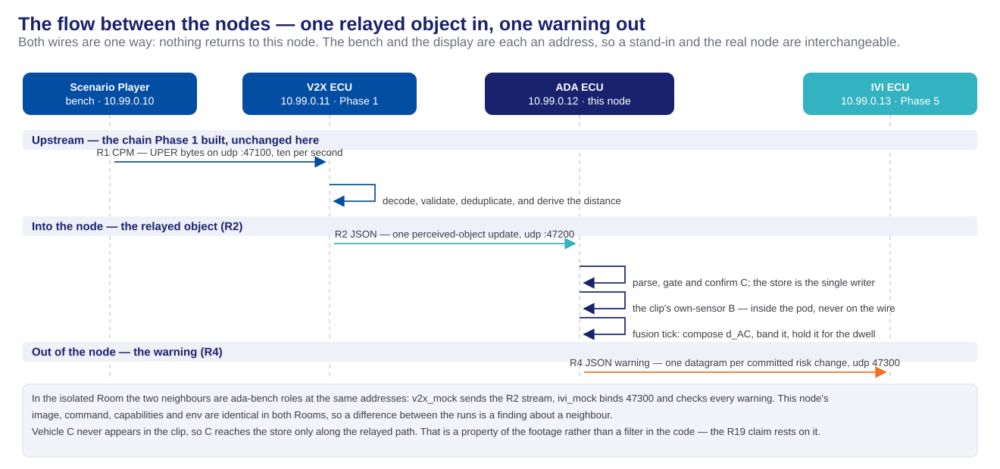
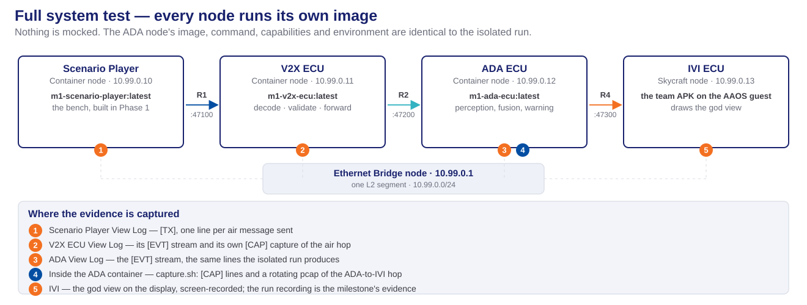

<!-- _class: lead -->
<!-- _paginate: false -->

# Phases 2-4 — ADA ECU Design

## Ego's perception and fusion node, module by module

**Milestone 1 · Cooperative Vehicle Awareness — FPT Hackathon 2026**

Deck A of two — the design. How that design was planned and executed is Deck B: [phase2-4-ada-ecu-task-execution-deck.html](phase2-4-ada-ecu-task-execution-deck.html).

Sources: [ada-ecu-hld.md](../../documents/Design/ADA-ECU/ada-ecu-hld.md) · [ada-ecu-design-decisions.md](../../documents/Design/ADA-ECU/ada-ecu-design-decisions.md) · [contracts/](../../contracts/) · [m1-cooperative-awareness.md](../../requirements/m1-cooperative-awareness.md)

---

# Table of contents

1. **Terminology** — every term this deck uses, before it is used
2. **The blueprint** — five nodes, and the one these three phases build
3. **The contracts** — the object message (R2) in, the track record (R3) owned, the warning message (R4) out, and one node-local schema
4. **Protocol stack and libraries** — three channels, and the third parties that serve them
5. **The blueprint nodes** — the image each runs, the ADA node's architecture, and its call flows
6. **Testing** — the configurations that exercise the node, and the equipment they need
7. **Handoff** — what Phase 5 and the demo run inherit

*Task groups, subtasks, execution order and CI runs are Deck B's subject.*

---

<!-- _class: lead -->

# 01 · Terminology

---

# Platform vocabulary

CarSky's own words. Every later slide uses them without restating them.

| Term | Definition |
| ---- | ---------- |
| **Blueprint** | The design of one vehicle: its nodes and their wiring. Nothing executes. |
| **Node** | One ECU within a blueprint. A **Container Node** runs a container image; a **Skycraft Node** runs an Android guest. |
| **Pin** | A node's connection point. This node declares exactly one, an `ethernet` pin. |
| **Ethernet Bridge** | A node whose only function is to join the other nodes' pins into one network. |
| **Room** | The running instance of a deployed blueprint. |
| **View Log** | The platform's window onto a node's standard output — this node's only observation surface. |

- **A Container Node has no volume and no bind mount.** A file reaches it by being inside its image, which is why the demo clip is an image layer.

---

# Project vocabulary

Terms this project defined or narrowed. Each carries a specific meaning here.

| Term | Definition |
| ---- | ---------- |
| **Contract** | A frozen, versioned message definition agreed between two nodes, committed to the repository as a JSON Schema. |
| **Frozen** | Changed only by re-freezing across every consumer at once. A contract edited by one node alone is broken, not updated. |
| **Seam** | A boundary positioned so one side can be replaced without modifying the other. |
| **Ego** | The vehicle the system runs in — vehicle A, whose driver is warned. |
| **VehicleB** | The occluder directly ahead of ego, and the only vehicle ego's own camera sees. |
| **VehicleC** | The vehicle beyond VehicleB, which ego's camera can never see and which reaches ego only over the V2X relay. |
| **Bench** | Sanctioned test equipment sharing the Room network, standing in for the outside world. |
| **Isolated Room** | A reduced Room in which bench roles stand at the neighbouring nodes' addresses, so this node runs alone. |

- **The god view is the display's overhead drawing of the three vehicles**, and "ghost VehicleC" is its name for the relayed one. This node composes VehicleC's position; drawing it is the IVI's work.

---

# The node's own vocabulary

Coined or narrowed by this design. Every diagram label below is one of these.

| Term | Definition |
| ---- | ---------- |
| **ADA Core** | The C++17 process that owns the sockets, the track store and the output stage. The detector runs beside it as a separate Python process. |
| **Track** | One entry in the track store: an identity, a position, a range, a provenance and a state. |
| **Update** | One admission-relevant observation of a track — one relayed message, or one detector line. |
| **Gate** | The proximity threshold pair that admits and drops a track, with hysteresis between them. |
| **Composed range** | `d_AC = d_AB + d_BC` — ego's own estimate of VehicleB plus VehicleB's reported range to VehicleC. |
| **Risk band** | A level — `low`, `medium`, `high` — that a total, ordered condition table assigns to the composed range and its rate of change. |
| **Plugin** | One risk rule realizing the assessment interface, found by its registry key. |
| **Dwell** | The interval a risk change must hold before it is committed and emitted. |
| **`[EVT]` stream** | One JSON line per event on standard output, carrying both a monotonic and a wall-clock stamp. |

---

<!-- _class: lead -->

# 02 · The blueprint

---

# Five nodes, one bridge

One blueprint is one vehicle — ego. Four nodes carry a role; the fifth joins them into a network.

- **IP Addresses are static by design**, injected through node configuration, never written as literals in source code.

---

# The ADA slice these three phases build

---

<!-- _class: lead -->

# 03 · The contracts

---

# The object message (R2) — from the V2X ECU

What the V2X ECU passes inward once it has decoded the air message (R1).

| | |
| --- | --- |
| **Direction** | V2X ECU → ADA ECU, one way, UDP to `10.99.0.12:47200`, one message per datagram |
| **Encoding** | UTF-8 JSON, `type: "v2x_object"`, one message per perceived-object update |
| **Required fields** | `schemaVersion` · `type` · `stationId` · `rxTime` · `sender` (lat, lon, heading, speed) · `object` (objectId, timeOfMeasurement, distance, position, speed, classification, confidence) |
| **Normative file** | `contracts/r2-v2x-object.schema.json` — **frozen** |
| **Node copy** | `ADA_ECU/contracts/r2-v2x-object.schema.json`, byte-identical, bound by `src/contracts/r2_message` |

- **`object.distance` is the admission input, and the V2X ECU derives it and forward to ADA-ECU** This node reads the field as received and never recomputes it.
- **`position.confidence` is a position accuracy in metres** is not used by ADA's internal logic and is dropped
- **`object.confidence` in an object message is recorded as `0.0` in the track record** when it arrives as JSON `null`, because the track record's field is required

---

# The track record (R3) — the ADA node's internal message

The record type held by `store/track_store`. It addresses no node, so it has no direction: it is serialized on one internal link and nested inside the warning message.

| | |
| --- | --- |
| **Role** | The single record type for a tracked object. Both perception sources emit it, so `store/track_store` holds one type and no downstream rule branches on origin |
| **Producers** | `detector/emit` serializes `own_sensor` entries onto standard output · `parser/r2_parser` constructs `v2x_relayed` instances from the object message · `parser/r3_parser` constructs `own_sensor` instances from the detector's lines |
| **Consumers** | `store/track_store` holds every instance and is the sole writer of `state` · `output/warning_builder` nests a track record in each warning message |
| **Serialized on** | Two links: the detector-to-ADA-Core pipe, one JSON object per line; and the `object` field of a warning datagram |
| **Never serialized** | Inside the ADA Core. It is a C++ object, handed to the main loop through a bounded queue and never re-encoded |
| **Required fields** | `id` · `class` · `source` · `position` · `distance` · `speed` · `confidence` · `state` · `timestamps` (measured, received, lastUpdated) |
| **Normative file** | `contracts/r3-tracked-object.schema.json` — **frozen** |
| **Node copy** | `ADA_ECU/contracts/r3-tracked-object.schema.json`, copied byte-for-byte from the normative file |
| **Bound by** | `src/contracts/tracked_object` in the ADA Core, and `detector/contracts/tracked_object` in the detector — code written against that copy, not a copy of it |

---

# The track record (R3) — field rules beyond the schema

Four rules the JSON Schema cannot state, because each names the module that owns a field rather than the field's type.

- **`source` is an enumeration of exactly two values** — `own_sensor` and `v2x_relayed` — and it is what the whole cooperative-awareness claim rests on.
- **`store/track_store`, the consumer above, is the sole writer of `state`.** A record arriving from either parser carries `not_tracked` by convention, and the store discards that value rather than reading it.
- **Track identity is namespaced by source:** `own:<n>` from the detector's own association, `v2x:<stationId>:<objectId>` from the relay. Neither producer can mint the other's identifier.
- **Expiry does not read `lastUpdated`.** The serialized stamps are wall-clock; expiry compares a monotonic stamp `store/track_store` keeps beside each entry.

---

# The warning message (R4) — the ADA node's output

The ADA output warning, and everything the display needs to draw the scene.

| | |
| --- | --- |
| **Direction** | ADA ECU → IVI ECU, one way, UDP to `10.99.0.13:47300`, no framing header |
| **Encoding** | UTF-8 JSON; two message kinds discriminated by `type`, the schema being a `oneOf` |
| **Warning event** | `schemaVersion` · `type` · `warningType` · `riskState` · `object` — a whole track-record snapshot of VehicleC — · `geometry` with `ego`, `vehicleB` and a nullable `vehicleC` |
| **Awareness state** | `schemaVersion` · `type` · `seq` · `vehicles`, last-value-wins by sequence number. Optional in the design |
| **Normative file** | `contracts/r4-ada-ivi.schema.json` — **frozen**, embedding the track-record schema by reference |
| **Node copy** | `ADA_ECU/contracts/r4-ada-ivi.schema.json`, copied byte-for-byte from the normative file |
| **Bound by** | `src/contracts/r4_message`; `output/warning_builder` is the node's only producer of these messages |

- **`object.source` is `v2x_relayed` on every warning this node emits**, because only a relayed track can be VehicleC. The display's provenance guard renders the ghost on that value alone.
- **`warningType` and `riskState` are plain strings in the schema**, so an unknown value degrades at the consumer rather than being rejected. The `low` / `medium` / `high` vocabulary is used.
- **`geometry.vehicleB` is required and never null;** `geometry.vehicleC` is nullable in warning messages.

---

# The CRA assessment record — node-local database

The collision-risk assessment reads and writes one committed schema. This is that artifact.

| | |
| --- | --- |
| **File** | `ADA_ECU/schema/cra-assessment-record.schema.json` |
| **Shape** | One record per assessed track: 14 required fields, keyed by `trackId` plus `warningType` |
| **What it carries** | The last committed risk state and when it was entered · the assessment's lifetime · the last and prior composed range · the derived closing rate and time to collision · the last track-record snapshot · the last known VehicleB position · an emitted count and a rationale |
| **Where it lives at run time** | In process, behind a typed accessor. Every write is also appended to the `[EVT]` stream, so the table is reconstructible offline |

- **Two of its fields exist to survive an erasure.** The last snapshot and the last known VehicleB position are what let a *clearing* warning still carry a required `object` and a required `vehicleB` after the track is gone.
- **A database engine was rejected.** SQLite would add a dependency and a file lifecycle to a node with no volume, and buy nothing over the `[EVT]` append the node already makes. The table is C++ objects in memory; the committed JSON file is its schema, not its contents.

---

# Where the contracts live

One authority at the repository root, and a byte-identical working copy inside each node that uses it.

| Location | Holds |
| -------- | ----- |
| **`contracts/`** | The frozen originals — all four schemas, the air-message profile (R1), the reference vectors and the samples |
| **`ADA_ECU/contracts/`** | the object message (R2), the track record (R3), the warning message (R4) |
| **`ADA_ECU/schema/`** | The assessment record — node-local, not part of the manifest |
| **`ADA_ECU/tests/fixtures/samples/`** | The shared samples, synced the same way |

- **The copies are not forks.** `contracts/sync-manifest.json` lists every file that must match and `contracts/check_sync.py` fails as soon as one diverges — 47 copies across the repository.
- **The reason for copying:** each node folder must build independently with no cross-folder reads, which a shared directory would breach.
- **A node-local fork would be a second, unversioned contract** — tightening a field, promoting one to required — that keeps passing after the real one changes. That is what the gate exists to prevent.

---

<!-- _class: lead -->

# 04 · Protocol stack and libraries

---

# The node's protocol stack

---

# The libraries and their licences

Nine third-party dependencies, each performing one function. All open source and Linux-compatible.

| Library | Version | Licence | What it serves |
| ------- | ------- | ------- | -------------- |
| **nlohmann/json** | v3.11.3 | MIT | the object message in, the track record in the store, the warning message out — every JSON binding in the ADA Core |
| **ONNX Runtime** | 1.28.0 | MIT | The detector's inference session, CPU execution provider only |
| **OpenCV** (`opencv-python-headless`) | 5.0.0.93 | Apache-2.0 | Video decode behind the frame-source seam |
| **NumPy** | 2.4.6 | BSD-3-Clause | The detector's array arithmetic |
| **YOLO11n weights** | — | AGPL-3.0 | The detection model, exported once to ONNX and committed |
| **Python standard-library `json`** | 3.11 | PSF | The detector's track-record output lines |
| **GoogleTest** | v1.14.0 | BSD-3-Clause | The ADA Core's unit suites, driven by CTest |
| **pytest** · **jsonschema** | ≥ 8 · ≥ 4.18 | MIT | The detector's suites, and schema validation in test |

- **None of these is a framework.** Each is a library the code calls; none owns the program's control flow.
- **Deliberately absent: an ASN.1 codec**, because this node never sees a CPM, and **any database engine**, because the assessment table is in process.
- **The three detector wheels are pinned** to versions proven to install as prebuilt `aarch64` wheels, so an image build never falls back to compiling under emulation.

---

<!-- _class: lead -->

# 05 · The blueprint nodes

---

# Delivered images

One row per node of the blueprint. Only the third is built by these phases; the bench below it is test equipment rather than a node.

| Node | Image | Role | Messages | State after Phases 2-4 |
| ---- | ----- | ---- | -------- | ---------------------- |
| **Scenario Player** | `m1-scenario-player:latest` | Bench — one object update every 100 ms | Produces R1 | Phase 1's node, unchanged. Absent from the isolated Room |
| **V2X ECU** | `m1-v2x-ecu:latest` | Relay — decode, validate, deduplicate, forward | Consumes R1, produces R2 | Phase 1's node, unchanged. A bench role stands at its address in the isolated Room |
| **ADA ECU** | `m1-ada-ecu:latest` | Perception and fusion — the node these phases build | Consumes R2, holds R3, produces R4 | One image, two processes: the C++17 ADA Core and the Python detector subprocess |
| **IVI ECU** | None — an APK on the Skycraft node | Display — the god view | Consumes R4 | **Not built here.** Phase 5's work; a bench role binds its port in the isolated Room |
| **Ethernet Bridge** | None — a platform node type with no image | Joins every node's `ethernet` pin into one L2 segment | Carries all three flows | Unchanged since Phase 0 |
| *ADA bench* | `m1-ada-bench:latest`, from `tools/ada-bench/` | Test equipment — two roles selected by `ROLE` | Emits R2 as `v2x_mock`, receives R4 as `ivi_mock` | Built by these phases. **Not a node of the blueprint** — it stands in for two |

- **The two stand-in roles are one image**, and nothing on this node's side changes when a stand-in replaces a neighbour.

---

# Component architecture — the data path

v2x_listener<small>object msg · udp :47200</small>

→

input_queue<small>two producers</small>

→

parsers<small>→ TrackedObject</small>

→

track_store<small>admit · refresh · expire</small>

→

cra plugin<small>risk band</small>

→

fusion<small>composed range</small>

→

output<small>warning · udp :47300</small>

---

# ADA architecture — utility and supporting modules

---

# Reading the component diagrams

- **Both halves above are one diagram**, cropped from the design's own component map. The copy in `ADA_ECU/doc/` is the authority.

---

# Component layer separation

Each component sits in one layer, held there by the rule in the right-hand column.

| Layer | Components | The rule that keeps it separate |
| ----- | ---------- | ------------------------------- |
| **Data** | the frozen bindings, the track store, the assessment table with its schema, the configuration reader, the event log | Models and stores hold no rules: the store keeps, refreshes and erases entries but never decides what a distance means |
| **Business logic** | admission, the chained-collision plugin, the scene composer, and the detector's inference, distance and association | Pure functions of their inputs. None opens a socket, reads the environment or formats a wire message |
| **Controller** | the composition root, both observers, both parsers, the warning builder, the sender, and the detector's entry point, pacer and emitter | The controller owns the clock, the threads, the subprocess and the sockets, and holds no rules |

- **Each layer lacks a capability another layer holds, and the code enforces it.** Admission decides and never transmits — `output/ivi_sender` is the node's only sender. A risk plugin returns a finding and never formats a message — `output/warning_builder` is the only producer of warning messages. The detector cannot write to the store at all: it is a separate process, so its detections enter as JSON lines through `parser/r3_parser`, the same entry the relayed path uses.
- **Four named components sit in no row above** — the socket holder, the plugin registry, the frame-source seam and the detector's configuration reader. The component diagram colours the first three; the table is what is incomplete. § Open items.

---

# Phase 2 — the mock-driven scaffold

The whole pipeline standing up before any machine learning, driven by external stimulus.

| What Phase 2 made | Why it is shaped that way |
| ----------------- | ------------------------- |
| The ADA Core's holders — one configuration reader, one socket holder, one event writer, one bounded queue | Each concern has exactly one place it can be changed, and the socket header appears in one translation unit |
| Both parsers, and a corpus of one-defect malformed inputs | Every rejection is counted by reason and none is fatal; a conforming producer must yield a zero reject count |
| The track store and the admission machine | The machine is pure and source-agnostic, parameterized only by what counts as an update |
| The assessment interface, its registry and its record schema | Frozen in Phase 2 so Phase 4's plugin proves the claim that adding one is one new file plus one line |
| The composition root, the image and the entry point | One startup path; any failure becomes one logged line and a non-zero exit |

- **The mocks are stimulus, never a branch.** A recorded own-sensor stream reaches the ADA Core through the *real* reader, and mock relayed traffic arrives as real datagrams on the real socket — so there is no mock code path anywhere in `src/`.
- **"No input yields no tracks" is a configuration**, not a code path: the detector disabled and no traffic arriving.

---

# Phase 3 — the clip, and the range it yields

The detector's only input is a file inside the image. That is a platform finding, not a preference.

| | |
| --- | --- |
| **The clip** | `ADA_ECU/media/ego-b-occluding-c.mp4` — 1280×720, 20 fps constant, 200 frames, 10.0 s, ~5 MB |
| **Provenance** | Openly-licensed dashcam footage, Pexels License — commercial use and modification permitted; credited in `media/ego-b-occluding-c.source.md` |
| **Content** | VehicleB is the frontmost in-lane vehicle in every sampled frame, closing from roughly 60 m to 10 m. VehicleC is never in the footage |
| **How it reaches the node** | One image layer. A Container Node has no volume, no bind mount and no file-injection field |
| **Sampling** | Every fourth decoded frame — 5 Hz effective, against a budget of 200 ms per sampled frame |

- **The `video` pin was rejected**, and its cost is the reason: no C++ client, an undocumented frame header, and 590 Mbit/s of raw pixels for content a local file serves at 0.5 MB/s — plus a re-freeze of the platform and network contracts.
- **The range estimate is calibrated, not assumed.** The two camera constants ship at 2.6 m and 34.4° after a retune against this clip; the default car width put VehicleB inside the gate from the first frame. The gate itself was not moved, and never is.
- **A 10 s clip means every long-run behaviour depends on looping**, and the gap across a wrap must stay under the track timeout or ego's own VehicleB track expires between cycles.

---

# Phase 4 — fusion and emission

Live relayed traffic becomes a tracked VehicleC, an assessed risk, and one warning on the wire.

| Component | Its single responsibility |
| --------- | ------------------------- |
| **Scene composer** | VehicleB from the nearest own-sensor track, VehicleC at `d_AB + d_BC` longitudinally and offset laterally component-wise, ego at the origin |
| **Chained-collision plugin** | The M1 non-line-of-sight rules: the composed range, its closing rate and time to collision against three bands, debounced |
| **Assessment record table** | The prior record every edge trigger and closing rate needs, and the snapshots a clearing warning needs |
| **Warning builder** | The node's only producer of warning messages — a risk finding plus the composed geometry onto the frozen binding |
| **IVI sender** | The node's only outbound socket — one datagram per event, and one event line carrying the body |

- **The plugin never emits.** It returns a finding; the output stage decides transport. That is what keeps a rule replaceable without touching the wire.
- **`d_AC` needs `d_AB`, so with no own-sensor VehicleB there is no chain.** The assessment returns `low` with an explicit rationale and logs that it was skipped — which is also why a *clearing* warning can always fill the required `vehicleB` from the last known position.
- **Adding a future plugin is one new file plus one line** in `src/cra/builtin_plugins.cpp`, with no edit to the interface, the store, the emitter or any existing plugin. Registration is explicit rather than static, because a linker discards unreferenced registrars in a static library.

---

# The risk bands and the emission rule

The table is total and ordered — the first matching row wins, so no state matches two rows and none matches none.

| | Band | Condition |
| --- | ---- | --------- |
| **1** | `high` | VehicleC tracked **and** (composed range ≤ 30 m **or** time to collision ≤ 3 s) |
| **2** | `medium` | VehicleC tracked **and** (composed range ≤ 60 m **or** time to collision ≤ 6 s) |
| **3** | `low` | everything else — no tracked VehicleC, no known VehicleB, or a tracked VehicleC neither near nor closing fast |

- **The bands threshold the composed range; the gate thresholds the relayed range alone.** They measure different quantities, so no ordering holds between them and the loader asserts none — a check relating the two would collapse the risk level into track identity.
- **60 m and 30 m put the first warning on a comparison rather than a derivative.** The composed range at VehicleC's admission is about 47 m, so the range clause commits the transition on its own with 13 m of margin, tolerating a range-estimate bias up to 1.7×. At 25 m the transition would ride entirely on a time to collision derived from the noisiest quantity in the node.
- **Every committed change emits exactly one warning, in both directions**, and steady state emits nothing. The message set carries no explicit clear event, so the transition back down is the only way the display learns to stop warning.
- **These five risk values are architecture proposals awaiting ratification.** They are externalized, so ratifying or retuning is a node-configuration edit.

---

# Configuration — every value the deployment injects

No tunable appears as a literal. The ADA Core reads its values in one place, the detector in one other.

| Core | Default | Meaning |
| ---- | ------- | ------- |
| `V2X_LISTEN_HOST` · `V2X_LISTEN_PORT` | `0.0.0.0` · `47200` | The relayed-message ingress |
| `IVI_ECU_HOST` · `IVI_ECU_PORT` | `10.99.0.13` · `47300` | The warning egress |
| `GATE_ENTER_M` · `GATE_EXIT_M` · `CONFIRM_HITS` | `30` · `35` · `3` | The admission band and the confirmation count |
| `TRACK_TIMEOUT_MS` · `FUSION_TICK_MS` | `1000` · `100` | Silence before erasure · the tick period |
| `RISK_NEAR_M` · `RISK_CRITICAL_M` · `RISK_DWELL_MS` | `60` · `30` · `300` | The two range bands and the debounce |
| `DETECTOR_CMD` · `DETECTOR_ENABLED` | the detector entry point · `true` | The subprocess, and how a fixture replaces it |
| `VIDEO_CLIP_PATH` · `DETECTOR_FRAME_STRIDE` | the baked clip · `4` | The frame source and the decimation |
| `DETECTOR_CLIP_FPS` · `VEHICLE_WIDTH_M` · `CAMERA_HFOV_DEG` | `20.0` · `2.6` · `34.4` | The rate pacing targets, and the two pinhole constants |

- **Only the addresses, the ports and the two gate constants have a committed source.** Every other default above is this design's proposal.
- **A value the blueprint omits falls through to the application's own default**, never to one baked into the image. Startup validation then orders values of one quantity, bounds single values, and does nothing more.

---

# Internal call flow, part 1 — bring-up

---

# Internal call flow, part 2 — two perception paths, one store

---

# The admission machine

---

# Internal call flow, part 3 — the fusion tick and the warning

---

# Internal call flow — inside the detector subprocess

---

# The flow between the nodes

---

<!-- _class: lead -->

# 06 · Testing

---

# Acceptance evidence

Each is read from a named surface, so a run either produced it or did not.

| Evidence | Surface | Example |
| -------- | ------- | ------- |
| Own-sensor detections reach the store | ADA log · `[EVT]` | `{"event":"own_sensor_ingest","payload":{"id":"own:1",…}}` |
| Relayed objects ingested at ≥ 90 % of the sender's count, none rejected | ADA log · `[EVT]` | `{"event":"r2_ingest","payload":{"stationId":1201,…}}` |
| Both tracks confirmed, one per source | ADA log · `[EVT]` | `{"event":"track_transition","id":"v2x:1201:7","to":"tracked"}` |
| A warning carrying both vehicles — the strongest line, both tracks alive at one instant | ADA log · `[EVT]` | `{"event":"r4_tx","object":{"source":"v2x_relayed"},"geometry":{…}}` |
| The warning datagram on the wire | ADA container · pcap | `[CAP] IP 10.99.0.12.51044 > 10.99.0.13.47300: UDP` |
| The warning received and field-checked | sink log · `[RX]` | `[RX] seq=3 … risk=medium cSource=v2x_relayed bPos=(11.0,0.4)` |
| Nothing ego saw claims to be VehicleC | host check | `tools/check_zero_c.py` → 0 across its three rules |
| Pacing and warning onset within bounds | host check | `tools/check_run_alignment.py` → K1–K6 |
| The gate holds VehicleC out — the negative case | ADA log · `[EVT]` | ingest still rising, zero `track_transition` |

---

# Test setup — the isolated test

---

# Test setup — the full system test

Two configurations run before this one: unit tests over the pure modules against hand-computed values, and a fixture-driven ADA Core replaying a recorded own-sensor stream through the real reader — no model, no clip, and no branch inside `src/` that knows the difference.

---

<!-- _class: lead -->

# 07 · Handoff

---

# What Phase 5 and the demo run inherit

Written as the next stage's input list.

| | What may now be assumed |
| --- | --- |
| **The message it consumes** | The warning message is frozen and this node is its only producer. Every warning carries a whole track-record snapshot of VehicleC with `source` `v2x_relayed`, a required numeric VehicleB position, and a nullable VehicleC position |
| **When a warning arrives** | Edge-triggered on a committed risk change, in both directions, after the debounce. Steady state is silent, and there is no clear message — the downgrade is the clear |
| **The vocabulary it renders** | Three risk levels and one warning type, `nlos_obstruction`; an unknown value must degrade rather than be rejected |
| **The address it binds** | UDP `47300` at `10.99.0.13`, one message per datagram, no framing header |
| **The evidence it joins** | The `[EVT]` stream reconstructs a run offline, and this node captures its own traffic toward the display |
| **The onset it can rely on** | No warning before the eighth second of a cycle is a property of configuration and bench scenario data — no contract, no code, and no orchestrator carries it |
| **The tooling it inherits** | The bench sink as a stand-in for its own node, and the host-side readers of this node's output |

- **Nothing carries forward from the Phase 2 mocks.** The recorded stream and the relayed-message emitter are retired by the detector and by a real upstream.

---

# What deliberately did not ship

Stated plainly, so nothing is assumed present that is not.

- **The periodic awareness state.** The binding carries the message and the rate key is validated, but no path emits it and the default leaves it off. The design words it optional and no acceptance criterion depends on it.
- **The run-alignment checker.** The design designates a host-side checker for the six timing checks; it is not written, because two of its inputs — the bench's monotonic stamp and the detector's line shape — are other phases' to land first.
- **The deployed measurements.** The detector's warm-up interval and its inference rate on the platform's own processor are unmeasured, and the warm-up is the one value the demo choreography cannot be aligned without.
- **The annotated video export** with per-event risk labels, optional in the plan and built by nothing.
- **Every part of the display's dashcam view** — no clip serving, no exposed port, no media player and no video pin. A worked design for it exists; reading it is not permission to build it.
- **The radar and live-camera inputs** drawn in the requirement's own figure. There is no radar and no camera bring-up in this milestone, and frame acquisition sits behind a seam so a live source arrives later as one more implementation.

---

<!-- _class: lead -->
<!-- _paginate: false -->

# Thank you

**Phases 2-4 — ADA ECU Design** · Milestone 1 · FPT Hackathon 2026
