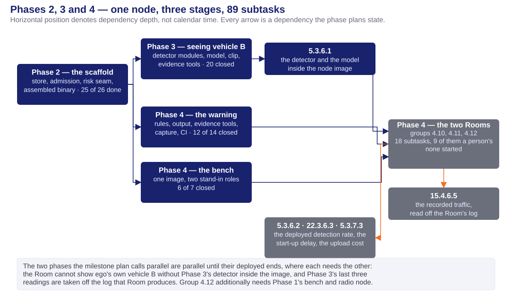
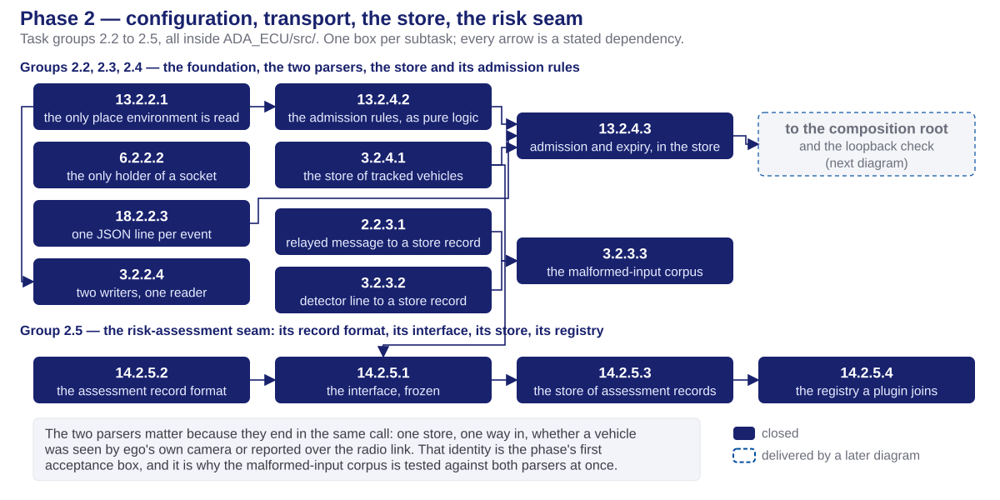
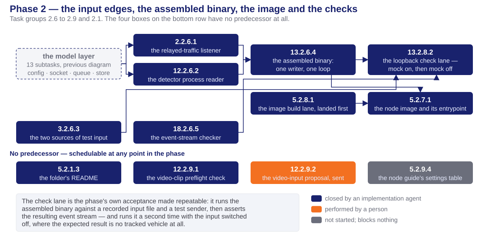
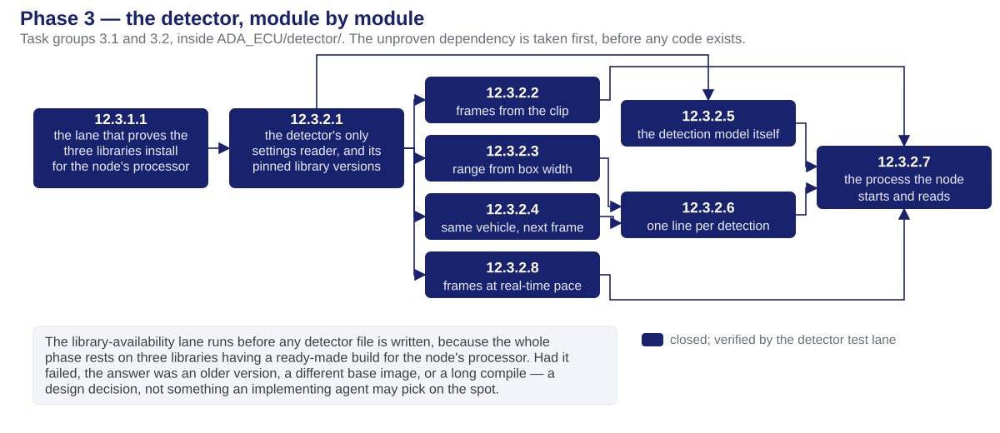
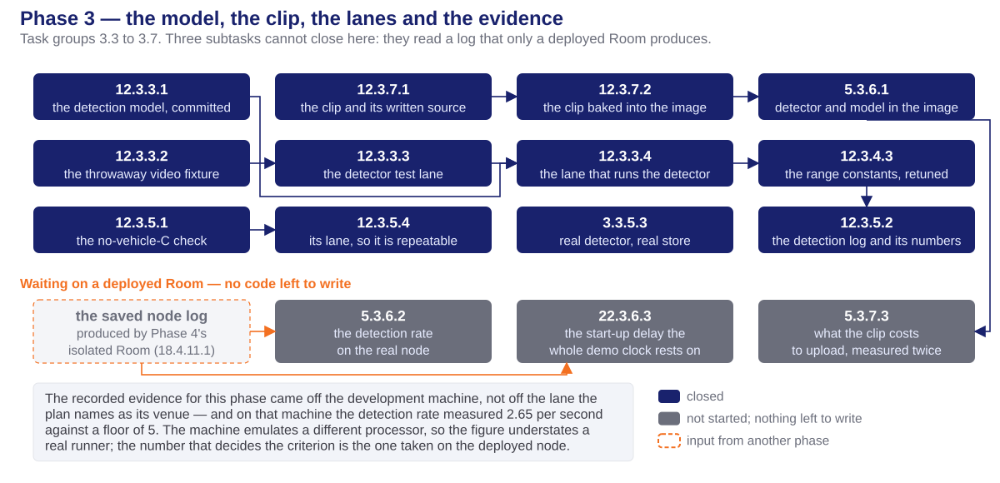
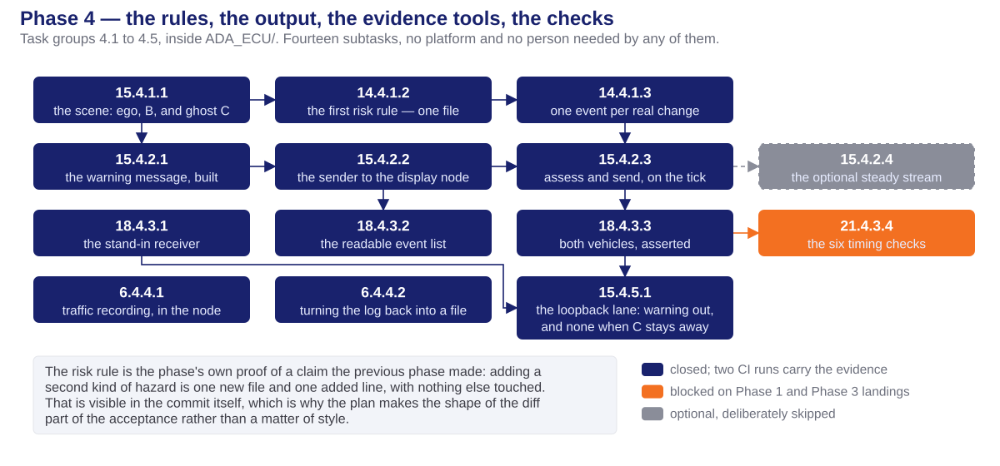
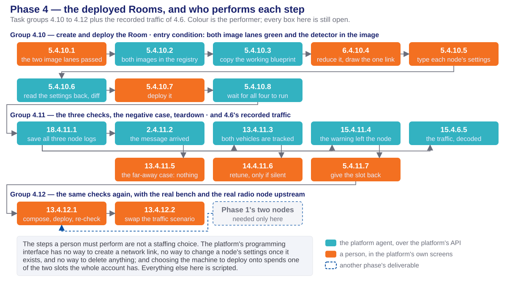
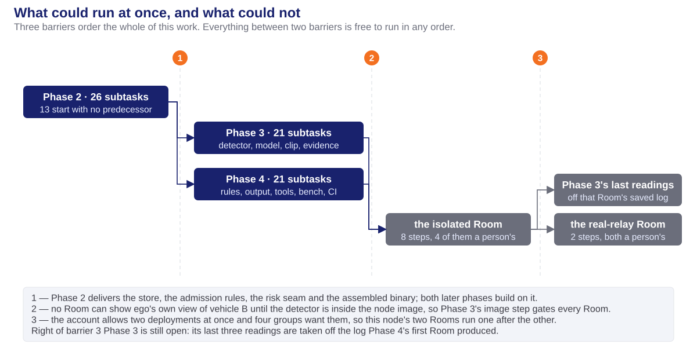

<!-- _class: lead -->
<!-- _paginate: false -->

# ADA ECU — Task Execution

## Phases 2, 3 and 4: decomposition, execution and verification status

**Milestone 1 · Cooperative Vehicle Awareness — FPT Hackathon 2026**

26 task groups · 89 subtasks · 64 closed · 24 outstanding · 1 skipped

Design of the same three phases: [phase2-4-ada-ecu-design-deck.html](phase2-4-ada-ecu-design-deck.html)

Preceding decks: [phase1-task-execution-deck.html](../phase1/phase1-task-execution-deck.html) · [phase0-task-execution-deck.html](../phase0/phase0-task-execution-deck.html)

Sources: [phase2_tasks.md](../../plans/phase2_tasks.md) · [phase3_tasks.md](../../plans/phase3_tasks.md) · [phase4_tasks.md](../../plans/phase4_tasks.md) · [milestone1_high_level_plan.md](../../documents/Plan%20and%20Proposal/milestone1_high_level_plan.md) · the run records in [plans/doc/](../../plans/doc/)

---

# Table of contents

1. **Work organization** — the vehicles, the terms, the verification lanes
2. **Work decomposition** — identifiers, size, and who performed each unit
3. **Phase 2** — the scaffold: store, admission rules, risk seam
4. **Phase 3** — seeing vehicle B in the video
5. **Phase 4** — the composed scene, the risk, the warning
6. **Parallel and sequential work** — three barriers and what forced each
7. **Verification status** — and the venue every piece of evidence came from
8. **Handoff and open items**

---

<!-- _class: lead -->

# 01 · Work organization

---

# The words this deck uses

**The ADA ECU is the computer these three phases build.** It takes a report about vehicle C over the radio link, sees vehicle B for itself in the video, adds the two ranges together to place C, decides whether that is dangerous, and warns the display computer. How it is built inside is the design deck's subject, linked from the cover; this deck is only about how the work was organized and how it ran.

| Term | What it means |
| ---- | ------------- |
| **ego** | the vehicle being built. Only its computers exist in this project; the other two are content |
| **vehicle B** | the vehicle directly ahead. Ego's own camera can see it |
| **vehicle C** | the vehicle beyond B. Ego's camera can **never** see it, because B blocks the view |
| **ghost C** | vehicle C placed on ego's picture of the world from *another vehicle's report*, never from ego's own sensors |
| **frozen** | fixed before anything that depends on it is built, and not changed afterwards without re-agreeing it with every consumer |
| **seam** | an interface put in deliberately so that one side can be replaced without touching the other |
| **the bench** | test equipment that plays a traffic scenario and transmits it as real radio messages. A node on the real network, not a mock inside a program |
| **blueprint · Room** | the platform's description of a set of nodes and the links between them; and one *running* deployment of it. **Two Rooms exist for the whole account** |

---

# Planning terminology

Three different things in this project are called a *track* or a *lane*. They are not interchangeable.

| Term | Definition | Specified in | Example here |
| ---- | ---------- | ------------ | ------------ |
| **Track** | a workstream spanning whole phases, run by different people at once | [milestone1_high_level_plan.md](../../documents/Plan%20and%20Proposal/milestone1_high_level_plan.md) | this node is one track: phase 2, then 3 and 4 |
| **Phase** | one stage, with an input list and acceptance criteria | [task-planning-conventions.md](../../.claude/rules/task-planning-conventions.md) | Phase 3 |
| **Task group** | subtasks that jointly deliver one feature or one solution | as above | group 3.2 — the detector's modules |
| **Subtask** | one objective, one commit, build and tests passing | as above | `12.3.2.3` — range from box width |
| **Execution lane** | a dependency chain, named after the folder it writes into | each phase plan, *Execution order & parallelism* | `ADA_ECU/detector/` |
| **CI lane** | one job in a build workflow; it passes or fails | [.github/workflows/](../../.github/workflows/) | `ada-core-build` |

- **Lane letters are local to a phase and do collide** — earlier phases used letters; these three name their lanes after folders instead.
- **Lane letters and group numbers express no order.** Only a stated dependency sequences one unit against another, and a dependency always names an artifact.
- **Only a CI lane executes.** A track and an execution lane are planning structures, not programs.

---

# The node's ten verification lanes, and where each is maintained

Every workflow file carries the same triggers, so **every lane runs on every push wherever it lives.** Placement decides where a lane is maintained, never whether it runs — the rule is [ci-lane-placement.md](../../.claude/rules/ci-lane-placement.md): a lane lives with the node it exercises.

| File | Lanes | What they prove |
| ---- | ----- | --------------- |
| `phase2-ci.yml` | `ada-core-build` · `ada-loopback-check` | the core compiles and its unit tests pass; the assembled program admits and drops a vehicle as designed, and produces nothing when its input is switched off |
| `phase3-ci.yml` | `ada-detector-wheels` · `ada-detector-tests` · `ada-detector-run` · `ada-zero-c` | the three libraries have a ready-made build for the node's processor; the detector's own tests; the one place the real detector runs; nothing is ever labelled vehicle C |
| `phase4-ci.yml` | `ada-ecu-image` · `ada-bench-image` · `ada-bench-selfcheck` · `ada-e2e-loopback` | both container images build and publish; the two stand-in roles talk to each other; the whole chain from a relayed report to a warning on a socket |

> **Two discrepancies, flagged rather than settled.** All three plans place `ada-core-build` in `phase0-ci.yml` and quote the earlier convention — *a lane belongs to the phase that created it*. The standing rule is the opposite, and the workflow file already holds that lane in `phase2-ci.yml`; the plans' text is stale. Separately, all three plans name a lane `python-tests` in acceptance criteria, and no workflow file defines it: its work was split into `sp-unit-tests` and `ada-detector-tests`, which under the same rule retires the old name.

---

<!-- _class: lead -->

# 02 · Work decomposition

---

# Task identification scheme

Every task and subtask carries the identifier `X.Y.Z.W`, assigned once and never renumbered.

| Segment | Meaning | Value in `14.4.1.2` |
| ------- | ------- | ------------------- |
| `X` | the requirement served | the risk-assessment seam, with rules registered through it |
| `Y` | the phase | 4 — the composed scene, the risk, the warning |
| `Z` | the task group | group 4.1 — scene composition and the first risk rule |
| `W` | the subtask | the second: the rule itself, plus one line registering it |

- **The group number is not the requirement number.** Group 2.2 contains `13.2.2.1`, `6.2.2.2`, `18.2.2.3` and `3.2.2.4` — four different requirements in one group, because together they deliver one thing: a program that can read its settings, hold a socket, write an event and queue what arrives.
- **A retired identifier is never reused.** Phase 3 reserves two that are not in use; Phase 4 lists nine retired ones.
- **A suggested branch per phase, never created by the planner:** `feat/phase2-ada-scaffold`, `feat/phase3-ada-detector`, `feat/phase4-ada-fusion-warning`. Phase 3's record shows the work ran on `feat/phase3-object-detection` instead — a divergence from its own suggestion, noted here rather than corrected.

---

# Decomposition summary

- **26 task groups, 89 subtasks, one node folder.** Phase 2 nine groups and 26 subtasks · Phase 3 seven and 24 · Phase 4 ten and 39.
- **One subtask has one objective, one commit, a passing build and passing unit tests.** Anything not required by that objective belongs to a different subtask.
- **Every brief is self-contained** — file paths, message fields, the acceptance criterion — so the implementing agent need not read the wider codebase to start.
- **No tunable value is hardcoded.** The proximity gate, the risk thresholds, the frame stride, the clip path, the peer addresses and the recording filter are all settings the platform injects; a literal outside the two settings readers is a defect.
- **67 of the 89 subtasks need neither the platform nor a person.** That was deliberate: the deployment slot is the scarce resource, so everything provable off the platform was scheduled first.
- **The development machine cannot run any of it.** It is Windows on an ARM processor with no container engine, so for every C++ and every image subtask "the tests pass" is defined as "the lane is green", and the definition of done cites a run identifier.

---

# Execution responsibility

| Performer | Phase 2 | Phase 3 | Phase 4 | Total |
| --------- | ------- | ------- | ------- | ----- |
| **Implementation agent** — code, tests, workflow files | 25 | 21 | 21 | **67** |
| **Platform agent** — deploy, read node logs, gather evidence | 0 | 3 | 9 | **12** |
| **A person** — console screens, credentials, correspondence | 1 | 0 | 9 | **10** |

- **Phase 3 additionally lists three person-steps with no identifier**, because they sit outside the task tree: creating and pushing the branch, confirming each build run and downloading what it produced, and fetching the model weights when the machine has no route to them.
- **The person-steps are not a staffing choice.** The platform's programming interface has no way to create a network link between nodes, no way to change a node's settings once the node exists, and no delete operation; and choosing the machine to deploy onto spends one of two slots the whole account has, which is the owner's call.
- **An agent session holds no browser and no code-hosting credential**, which is why confirming a build run is a person's step even though the build itself is not.
- **CarSky is the cloud platform, and it is a hard dependency.** Every claim this node can only make while running — the detector opening its clip, the warning leaving the node, the traffic recorded on the wire — exists only inside a CarSky Room, and the whole account has two of them while four groups of work want them.

---

# The three phases as one arc

- **The two phases the milestone plan calls parallel are parallel until their deployed ends**, where each needs the other. The detail of each block follows, one phase per section.

---

<!-- _class: lead -->

# 03 · Phase 2 — the scaffold

---

# Phase 2 — objective, input, output

- **Objective.** Stand the node up on stand-in input: settings, socket, event stream, queue, the store of tracked vehicles, the admission rules, and the seam risk rules will later plug into. Nothing sees a camera and nothing assesses risk yet.
- **Input.** The four message formats frozen in Phase 0, this node's design document, and the *shape* of the relayed report the radio node sends — consumed from a test sender, with no live radio node required.
- **Nothing in this phase waits on a person before it can start.** One subtask is a person's, and it has no dependants.
- **Stand-in input is external stimulus, never a branch in the program.** The camera side is the real subprocess reader pointed at a recorded file; the radio side is a real datagram on the real socket. "Switching the input off" is a setting plus an idle sender, not a code path.
- **Output.** Six acceptance boxes, all six marked closed.

> **Suggested branch:** `feat/phase2-ada-scaffold`, one branch for the phase, branched from the main line. Documentation and evidence records commit straight to the main line.

---

# Phase 2 — the nine task groups

| Task group | Deliverable |
| ---------- | ----------- |
| **2.1** — orientation | The folder's README, pointing at the design rather than restating it. |
| **2.2** — foundation | The only settings reader, the only socket owner, the event stream, and the queue with two writers and one reader. |
| **2.3** — parsers | Both wire shapes mapped onto one record type, plus a corpus of broken input that must be rejected without a crash. |
| **2.4** — store and admission | The store of tracked vehicles, the admission rules as pure logic, and the two joined together with expiry on silence. |
| **2.5** — risk seam | The interface a risk rule implements, its record format, the store of those records, and the registry a rule joins. Empty of rules by design. |
| **2.6** — input edges and assembly | The two input threads, the two stimulus sources, the event-stream checker, and the assembled program itself. |
| **2.7** — image | The deployable container image and its start-up script. |
| **2.8** — verification lanes | The loopback check lane, and the image lane — both landed *before* the code they verify. |
| **2.9** — video input | The clip format preflight, the specification sent to the mentor, and the settings table in the node guide. |

---

# Phase 2 — execution order (1 of 2)

- **Thirteen of this phase's subtasks have no predecessor at all** — these four foundation modules, both parsers, the store, the record format, and the independent row on the next slide.

---

# Phase 2 — execution order (2 of 2)

- **The image lane was written before the image existed**, guarded to skip until it did, so the subtask that wrote the image had a verification criterion on the day it landed.

---

# Phase 2 — code delivered

| File group | Delivered by | Function |
| ---------- | ------------ | -------- |
| `src/config/` · `src/net/` · `src/log/` · `src/observer/input_queue.hpp` | `13.2.2.1` `6.2.2.2` `18.2.2.3` `3.2.2.4` | The only settings reader; the only holder of a socket; one JSON line per event with two clock stamps; a bounded queue that drops the oldest rather than blocking a socket thread |
| `src/parser/` · `tests/fixtures/malformed/` | `2.2.3.1` `3.2.3.2` `3.2.3.3` | Both wire shapes to one record type, through the frozen bindings only; thirteen one-defect inputs, each with its expected disposition asserted |
| `src/store/` | `3.2.4.1` `13.2.4.2` `13.2.4.3` | The store; the admission rules as a pure function of state, count, distance and elapsed time; the two joined, with expiry measured on a clock that a time correction cannot move |
| `src/cra/` · `schema/cra-assessment-record.schema.json` | `14.2.5.1` – `14.2.5.4` | The frozen interface, its fourteen-field record format, the store of those records, and explicit registration — no static initialisation |
| `src/observer/` · `src/main.cpp` | `2.2.6.1` `12.2.6.2` `13.2.6.4` | The two input threads, and the assembled program: one writer, one loop, one clean shutdown |
| `tools/` · `tests/fixtures/own_sensor_mock.jsonl` | `3.2.6.3` `18.2.6.5` `12.2.9.1` | The two stimulus sources, the event-stream checker that turns a saved log into a pass or fail, and the clip format preflight |
| `Dockerfile` · `entrypoint.sh` · `.dockerignore` · two workflow files | `5.2.7.1` `5.2.8.1` `13.2.8.2` | The deployable image, and the two lanes that build and exercise it |

---

# Phase 2 — acceptance status

All six boxes are marked closed. What closed each:

| Acceptance box | Closed by |
| -------------- | --------- |
| The store holds both kinds of record, and both enter through the identical call | The nine-field round trip, and the case that puts a camera-shaped and a relayed-shaped record through the same call |
| State changes visible in the log; none at all when the input is switched off | Both arms of the loopback lane |
| Admitted only within 30 m, dropped only beyond 35 m, no flicker | Boundary cases at 29.9 / 30.0 / 30.1 m and 34.9 / 35.0 / 35.1 m, an oscillating sequence yielding exactly one admission, and expiry on silence |
| The gate values come from configuration, never a literal | One settings reader for the whole program |
| The risk record format committed; the video specification sent | The committed schema with a validating sample; the mentor's confirmation of 2026-08-04 |
| **Demonstration:** build and frozen-format round trips green | `ada-core-build` |

> **Where that green run is recorded.** Every C++ subtask in this phase defers its build and tests to `ada-core-build`, and no status line in the Phase 2 plan cites a run identifier. The green run those criteria rest on is recorded in the **Phase 4** plan — run `30919076468`, on that phase's branch head, which carries the Phase 2 code.

---

<!-- _class: lead -->

# 04 · Phase 3 — seeing vehicle B

---

# Phase 3 — objective, input, output

- **Objective.** Replace the recorded stand-in input with real perception: a pretrained detector finds **vehicle B** in the provided clip, estimates its range, and streams one record line per detection into the same store through the same call.
- **Input.** Phase 2's subprocess boundary — the command it launches and the lines it reads back — and its image; the frozen record binding; and the clip itself — ten seconds, 1280×720, 20 frames per second, openly licensed, with a written record of its source, its licence, its exact encode command and a verdict on its content.
- **The clip is ten seconds and the runs are longer**, so the detector loops it. Every duration-sensitive check in this phase and the next is worded against a looped run, not a single pass.
- **Vehicle C is not in the footage at all.** It exists only as a position asserted over the radio link, so "ego never sees C" holds by construction; what the footage had to avoid was a decoy vehicle held in ego's lane beyond B.
- **Output.** Four acceptance boxes: three marked closed, one open.

> **Suggested branch:** `feat/phase3-ada-detector`. The plan's own record shows the work on `feat/phase3-object-detection`.

---

# Phase 3 — the seven task groups

| Task group | Deliverable |
| ---------- | ----------- |
| **3.1** — library feasibility | The lane that proves three libraries have a ready-made build for the node's processor. **Taken before any detector code exists.** |
| **3.2** — detector modules | Eight modules: settings, frames, range, identity across frames, the model session, the emitted line, real-time release, and the process the node starts. |
| **3.3** — model, fixture, lanes | The committed model and the one-off export that made it; a throwaway video fixture; the test lane and the lane that actually runs the detector. |
| **3.4** — range calibration | Two camera constants retuned against the real clip, so the estimated range crosses the admission gate exactly once per pass. |
| **3.5** — evidence and store integration | The falsifiable no-vehicle-C check and its lane; the real detector driving the real store; the detection log and its measurements. |
| **3.6** — image and deployed measurement | The detector and the model inside the image, then two readings that only a deployed node can give. |
| **3.7** — the clip in the repository and in the image | The clip and its written source record, one line of the image recipe, and what that layer costs to upload. |

---

# Phase 3 — execution order (1 of 2)

- **The one unproven assumption was taken first.** Had those libraries had no ready-made build, the answer was an older version, a different base image, or a long compile under emulation — a design decision, escalated rather than chosen on the spot.

---

# Phase 3 — execution order (2 of 2)

- **Three subtasks have no code left to write.** They read a saved node log that only the next phase's first deployment produces.

---

# Phase 3 — code delivered

| File group | Delivered by | Function |
| ---------- | ------------ | -------- |
| `detector/config.py` · `detector/requirements.txt` | `12.3.2.1` | The detector's only settings reader, and the three libraries pinned to the versions the feasibility lane proved |
| `detector/frame_source.py` · `distance.py` · `tracker.py` · `pacer.py` | `12.3.2.2` – `12.3.2.4` · `12.3.2.8` | Frames behind an interface, so a future camera is one new implementation; range from box width; identity across frames; each frame released at its real-world instant |
| `detector/inference.py` · `emit.py` · `main.py` | `12.3.2.5` – `12.3.2.7` | The model session on the processor alone, one record line per detection through the frozen binding, and nothing else on its output |
| `models/yolo11n.onnx` · `tools/export_yolo11n.py` | `12.3.3.1` | The committed model and its one-off export, kept out of the image so the build stays reproducible offline |
| `media/ego-b-occluding-c.mp4` and its source record · three added lines of `Dockerfile` | `12.3.7.1` `12.3.7.2` `5.3.6.1` | The clip with its licence, its exact encode command and both checksums; then clip, model and detector in the image, in that layer order |
| `tools/check_zero_c.py` · `tools/make_sample_video.py` · `detector/tests/` | `12.3.5.1` `12.3.3.2` · group 3.2 | Three rules that fail the run if ego ever claimed to have seen C; a fixture its own docstring forbids as evidence; every module tested alone |
| `phase3-ci.yml` — four lanes | `12.3.1.1` `12.3.3.3` `12.3.3.4` `12.3.5.4` | The libraries, the detector's own tests, the one place the real detector runs, and the no-vehicle-C check made repeatable |

---

# Phase 3 — acceptance status

| Acceptance box | Status | Evidence, and its venue |
| -------------- | ------ | ----------------------- |
| A detection log with per-frame objects and range estimates | **closed** | Recorded from a run on the **development machine** — not the lane the plan names as this subtask's venue |
| Entries reach the store the same way relayed ones do; the stand-in is retired | **closed** | A second arm of the loopback lane, driving the real detector over the committed clip |
| **No detection is ever labelled vehicle C** | **closed** | Three falsifiable rules, its own lane, and the structural fact that the detector cannot mint a relayed identifier |
| Runs on the processor alone at an acceptable pace | **open** | 2.65 detections per second measured, against a floor of 5 — on a machine emulating a different processor. The deciding measurement is on the deployed node |

- **The retune is the phase's most concrete finding.** With the default camera constants, vehicle B's estimated range started *inside* the 30 m gate and never crossed it; at 2.6 m assumed width and a 34.4° field of view the series runs 60 m to 11 m and crosses once per pass. The admission gate was never touched — it is a requirement value, and the camera constants are estimates.
- **Two flaws recorded rather than absorbed:** at the retuned scale B sits 2.29 m right of frame centre, so the selection rule's own ±2 m bound no longer holds; and the detector intermittently returns a near-full-width false box for up to three frames, which the next phase's nearest-vehicle choice must survive.

> **A gap in the record itself.** Twenty-one of this phase's 24 subtasks are ticked done, and only **one** carries a status line. The plan's own rule is that no status line means not started, so this phase's done-marking rests on its checkboxes and its run record rather than on per-subtask evidence.

---

<!-- _class: lead -->

# 05 · Phase 4 — the warning

---

# Phase 4 — objective, input, output

- **Objective.** Turn a live relayed report into a tracked ghost C, add ego's own range to B to place it, decide the risk level through the seam Phase 2 froze, and send a warning to the display computer on every real change of level — with the evidence to prove all of it, in the log and on the wire.
- **Input.** Phase 2 complete. Phase 3 is needed for the deployed part only, because without a real detector in the image there is no camera-seen vehicle B on a running node. Phase 1 is needed for one group only.
- **Three configurations, run in that order, each replacing one stand-in with a real node.** The **isolated Room** has both neighbours mocked, so every failure is this node's. The **real-relay Room** replaces the upstream mock, so a regression there belongs to the radio node. The **system test** replaces the downstream mock, and it is the display phase's to run, not this one's.
- **This phase does not run the system test and cannot.** What that adds is *rendering* — drawing ghost C on a screen — which is the display phase's acceptance, not this node's.
- **Output.** Six acceptance criteria, none of them ticked yet.

> **Suggested branch:** `feat/phase4-ada-fusion-warning`, with `feat/phase4-ada-isolated-room` offered as a clean alternative because the Room groups share no file with the fusion code.

---

# Phase 4 — task groups 4.1 to 4.5

| Task group | Deliverable |
| ---------- | ----------- |
| **4.1** — scene and the first risk rule | Ego, B and ghost C in one frame of reference; the first risk rule, registering through the frozen seam; and one committed transition per real change of level, in both directions. |
| **4.2** — output | The warning message built through the frozen binding only, sent as one datagram, from the single loop. Plus one optional steady stream, deliberately not built. |
| **4.3** — evidence tools | A stand-in receiver, the readable collision-risk event list, and the assertions the phase's own output criterion rests on. One further tool is blocked. |
| **4.4** — traffic recording | Recording inside the container, and turning a saved log back into a file a protocol analyser can open. Both ported unchanged from the radio node's proven pair. |
| **4.5** — the end-to-end lane | One lane running the whole chain on a loopback socket, with a second arm where the relayed vehicle stays far away and the expected result is **no warning at all**. |

- **The first risk rule is this phase's proof of a claim the previous phase made:** adding a hazard type is one new file plus one added line, with the interface, the store, the sender and every other rule untouched. That shape is visible in the commit, which is why the plan makes the diff part of the acceptance.

---

# Phase 4 — task groups 4.6 to 4.12

| Task group | Deliverable |
| ---------- | ----------- |
| **4.6** — the recorded traffic | One subtask: extract the recording from a saved node log and read the warning out of the packet bytes. |
| **4.9** — Room prerequisites | The stand-in emitter and the stand-in sink, one image serving both roles, its build lane, its loopback self-check, and the settings specification the Room is typed from. **Everything unproven, proved before a Room slot is spent on it.** |
| **4.10** — create and deploy | Eight strictly ordered steps: confirm both images published, copy the working blueprint, reduce it, draw the one missing network link, type each node's settings, read them back and diff, deploy, wait for every node to run. |
| **4.11** — the three checks | The relayed report arrived and raised its event; both vehicles are in the store at the same instant; the warning left the node carrying both. Then the far-away negative case, a contingency retune, and teardown. |
| **4.12** — the real relay | The same checks again with the real bench and the real radio node upstream, then a scenario swap. **No new checks and no new identifiers.** |

- **The three checks do not substitute for one another.** The first two prove what happened *inside* the node; the third proves it *left* the node. Two green and the third silent is a routing failure, not a partial pass.

---

# Phase 4 — execution order: the code

- **Fourteen subtasks, no platform and no person.** Twelve are closed and green; one is blocked on other phases reaching the main line, and one is the optional stream that was skipped.

---

# Phase 4 — execution order: the Rooms

---

# Phase 4 — code delivered

| File group | Delivered by | Function |
| ---------- | ------------ | -------- |
| `src/fusion/scene_composer.*` | `15.4.1.1` | Ego at the origin, B from the nearest camera-seen vehicle, ghost C at the sum of the two ranges — and "not composable" when B is unknown |
| `src/cra/plugins/chained_collision.*` and one line of `builtin_plugins.cpp` | `14.4.1.2` `14.4.1.3` | Three ordered risk bands, first match winning; a level must hold for 300 ms before it commits; exactly one event and one message per committed change, downgrades included |
| `src/output/warning_builder.*` · `ivi_sender.*` | `15.4.2.1` `15.4.2.2` | The only producer of the warning message in the node, and one datagram per warning with the whole body also written to the event stream |
| `src/main.cpp` — the assessment tick | `15.4.2.3` | Expire, assess, compose, build, send — still one thread, still one writer |
| `tools/mock_ivi_receiver.py` · `event_report.py` · `check_evt_log.py` | `18.4.3.1` `18.4.3.2` `18.4.3.3` | A stand-in receiver that validates; the event list a person reads; and the assertion that both vehicles were tracked at the same instant with a warning carrying both |
| `capture.sh` · `tools/extract_pcap.sh` | `6.4.4.1` `6.4.4.2` | Live traffic text plus a rotating recording carried out through the log, and the host-side script that reverses it |
| `tools/ada-bench/` · `blueprint-ada-isolated.json` | `2.4.9.2` `4.4.9.3` `5.4.9.4` `5.4.9.1` | One image and two roles standing in for the neighbours, and the settings specification the Room is typed from and diffed against |
| `phase4-ci.yml` — three lanes | `15.4.5.1` `5.4.9.5` `2.4.9.7` | The end-to-end lane, the bench image lane, and the bench loopback self-check |

---

# Phase 4 — acceptance status

Not one of the six criteria is ticked. What is already closed, and what each still needs:

| Acceptance criterion | Closed off the platform | Still needs |
| -------------------- | ----------------------- | ----------- |
| C tracked only ever from the relayed source, through its whole lifecycle | Unit tests and the end-to-end lane | A deployed node, then the real relay |
| The risk rule registers through the seam; seam and record format are the artifacts | **Complete** — one new file, one added line, green | Nothing |
| At least one warning per run carrying the composed geometry | The end-to-end lane, both arms | The same, on the wire, from a node |
| The event list reconstructs a whole run afterwards | The tool, run over a synthetic full run | The same, over a real node's log |
| **Demonstration:** the collision-risk event list | The tool | The same, over a real node's log |
| Both vehicles reach the display path, by log **and** by recorded traffic | The log half, asserted in the lane | The recorded traffic |

- **The evidence that exists is two build runs.** Run `30919076468` carried the core build; run `30919076595` carried the end-to-end lane, both image lanes and the bench self-check, all green on the first live attempt, with the observed risk sequence recorded rather than asserted.

> **A box that lags its own evidence.** The second criterion's closing work is done, green, and the phase plan itself states that it closes entirely off the platform — yet the criterion is still unticked in the milestone plan. That is a discrepancy for the owner to settle; this deck reports it rather than deciding it.

---

<!-- _class: lead -->

# 06 · Parallel and sequential work

---

# Three barriers, and what sits between them

---

# Dependency structure

Every subtask ran one at a time, because the agents share one working folder on one machine. The parallel rows state the dependency structure — the work that could proceed at once given more workers.

| Relationship | Scope | The constraint behind it |
| ------------ | ----- | ------------------------ |
| **Parallel — the two later phases** | all of Phase 3 against all of Phase 4 | They never call each other. They meet only at the store: one writes camera-seen records into it, the other reads it. Two shared files sequence two edits, not the phases |
| **Parallel — within the foundation** | settings reader, socket, event stream, queue | Four files, no shared type; only the queue's consumers need more than one of them |
| **Parallel — the rules against the bench** | Phase 4's fusion code against its stand-in bench | Different folders entirely — the bench must be able to change without rebuilding the thing it tests |
| **Sequential — the risk seam** | record format, interface, record store, registry | Each is the compile-time input of the next |
| **Sequential — verification before code** | four lanes landed before the subtasks they verify | A subtask whose criterion is a green lane needs that lane to exist on the day it lands |
| **Sequential — the whole deploy chain** | images, then nodes, then links, then validation, then settings read-back, then the Room | The written procedure's ordering is binding: a node cannot reference an image that is not published, nor a log be read from a node that is not running |
| **Sequential — the two Rooms** | the isolated Room, then the real-relay Room | Two deployment slots for the whole account, wanted by four groups. The second Room takes the slot teardown releases |

---

<!-- _class: lead -->

# 07 · Verification status

---

# The three venues of the evidence

A closed subtask does not mean the same thing in all three phases. There are three venues, and they carry different weight.

| Venue | What it proves | What it cannot |
| ----- | -------------- | -------------- |
| **A build lane, on every push** | The code compiles, the unit tests pass, the whole chain runs on a loopback socket, the images build and publish | Nothing about the real node: not the processor's speed, not the network between nodes, not that a clip opens where it was baked in |
| **The development machine** | Detection content, the shape of the range series, the no-vehicle-C verdict — all venue-independent facts | Any timing figure. It emulates a different processor, so its numbers understate a real runner and cannot close a rate criterion |
| **A deployed node in a Room** | The detector opening its clip, the rate on two processor cores, the warning leaving the node, the traffic on the wire | Nothing yet — **no subtask in these three phases has been closed at this venue** |

- **64 subtasks are closed. Every one of them closed at the first two venues.** The third venue is where 21 of the 24 outstanding subtasks live.
- **A green image lane is not proof that an image reached the registry.** The publish step is gated on a credential; without it the image still builds and the lane still ends green with a notice. Two subtasks exist purely to confirm the registry's own answer before a Room is created.
- **The end-to-end lane can fail, and that was tested.** Its second arm holds the relayed vehicle out of range and requires **zero** warnings, so the lane cannot pass on the mere presence of traffic.

---

# Open items carried forward

Only items someone must still know or act on. Settled history stays in the plan files.

| Open item | Whose decision |
| --------- | -------------- |
| **What "its messages stopped" means.** The milestone plan says five consecutive missed updates; the design implements one second of silence, because nothing arrives to increment a counter and the two input sources run at independently configured rates. Same intent, different form | the owner |
| **The risk thresholds — 60 m and 30 m — are proposals.** They were chosen so that the *range* comparison alone commits the first warning, rather than a time-to-collision figure derived from the noisiest quantity in the node. No lane asserts a fixed sequence until they are ratified | the owner |
| **The warning message carries C's whole record but only B's position.** Both whole records are in the event stream, so the evidence is complete twice over; widening the message would re-open a frozen format across two languages and six copies, days from the deadline | the owner |
| **Whether real-time pacing is a ratified requirement.** The pacer is built to the design's designation of it, and the demo's timing cannot be placed without it | the owner |
| **Two documents disagree on when C's composed position may be empty.** The plan follows the frozen format and reports the other reading | architecture |
| **One measurement closes no acceptance box in any phase** — what the clip costs to upload. Either record it as a fifth check or move it to the phase that owns the publish | the planner |
| **Two Rooms for the whole account, wanted by four groups of work** | the planner |

---

<!-- _class: lead -->

# 08 · Handoff

---

# Inputs available to Phase 5 and Phase 6

- **A node that already does the whole job on a loopback socket.** A relayed report becomes a tracked ghost C, the scene is composed, a risk level is decided and a warning is sent — re-proven by one lane on every push, with a negative arm that fails if a warning appears when it should not.
- **The warning message on the wire, in its frozen shape.** The display phase can build against it without waiting for a Room, and a stand-in receiver that validates each message is already committed.
- **The readable collision-risk event list**, working on a saved log with no live process — which is what makes the "reconstructs a whole run afterwards" criterion demonstrable, and what the final recorded run will use.
- **The image the final blueprint deploys**, carrying the program, the detector, the model and the clip, built and published only by a build lane — nothing in this node is ever built by hand.
- **A written procedure for the Room** with a stated performer for every step, so the same route can be re-run for the final recording rather than reconstructed.

**What does not carry forward.** Nothing here draws anything — the on-screen view of ghost C is the display phase's. No claim about this node has yet been made on a running node. The optional steady stream is off by default, asserted off in test, and stays that way.

---

# Outstanding work

24 of the 89 subtasks are open. Two need another phase's code; one is documentation; the remaining 21 need a Room.

| Where | What remains |
| ----- | ------------ |
| Phase 2 | `5.2.9.4` — the settings table in the node guide. Blocks nothing; the Room's values come from the blueprint specification instead |
| Phase 3 | `5.3.6.2` · `22.3.6.3` — the detection rate and the start-up delay, both read off the first Room's saved log. `5.3.7.3` — the upload cost, from two image builds and a real publish |
| Phase 4 | `21.4.3.4` — the six timing checks, waiting on the bench's timestamp field and the detector's line shape reaching the main line. `5.4.9.6` — confirming the image lane, waiting on the detector being in the image |
| Phase 4 | Groups 4.10 to 4.12 and the recorded traffic — 18 subtasks, 9 of them a person's, inside two Rooms run one after the other |

- **One deployment session moves the largest block.** The same three saved logs close all three checks, the recorded traffic, and two of Phase 3's readings — which is why saving them is its own subtask, ahead of the checks rather than inside each one.
- **The start-up delay is the one measurement another track is waiting on.** The bench's own timing value is derived from it, so it is the narrowest path out of this node into the final recorded run.

---

<!-- _class: lead -->
<!-- _paginate: false -->

# Thank you

**ADA ECU — Task Execution** · Phases 2, 3 and 4 · Milestone 1 · FPT Hackathon 2026
