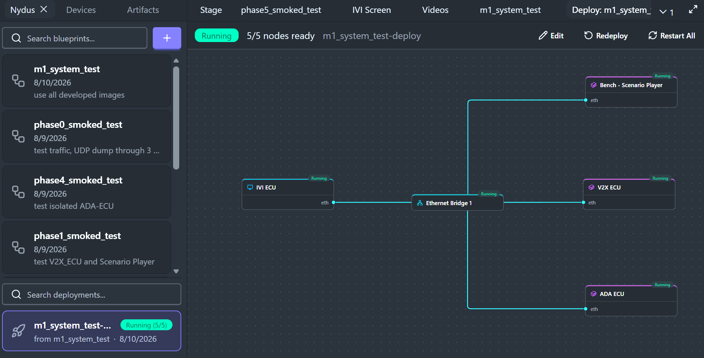
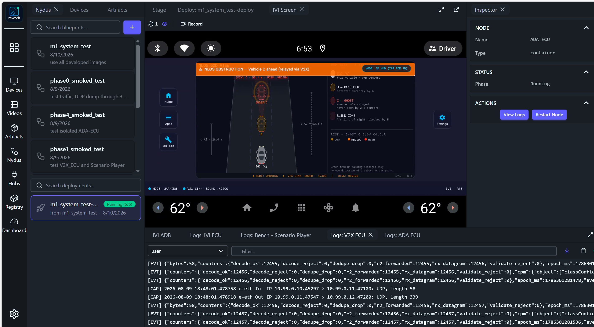
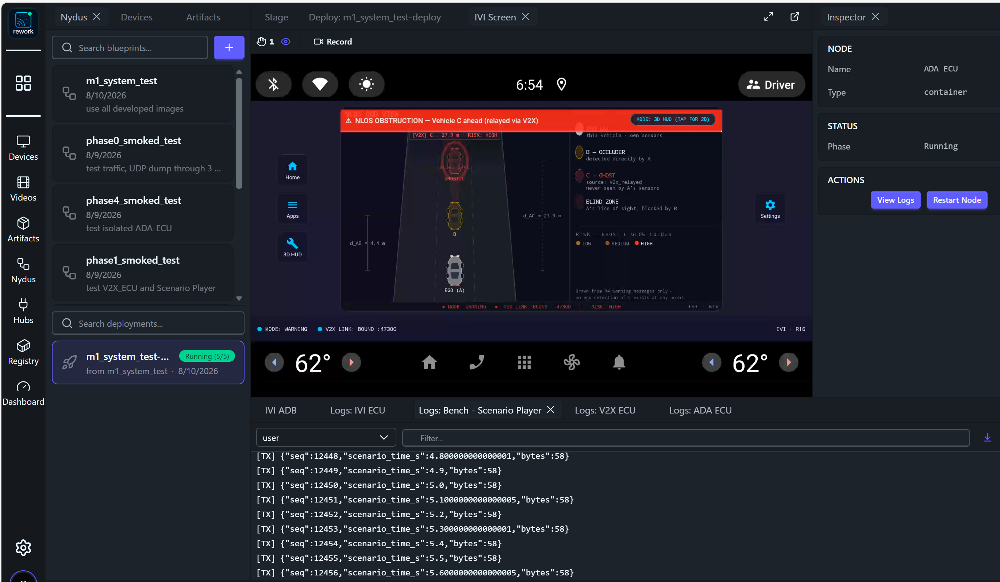

<!-- _class: lead -->
<!-- _paginate: false -->

# M1 System Delivery

## Acceptance evidence for the Cooperative Awareness System

**Milestone 1 · Team KIS — FPT Hackathon 2026**

Lead: Pham Ngoc Minh · 2026-08-10 · Full report: [system-delivery.md](../../documents/Delivery/Acceptance/system-delivery.md)

---

# Table of contents

1. **Introduction** — the mission, the team, and how the evidence folder reads
2. **System Under Test** — the deployed blueprint, the nodes, and the data flow
3. **Resources** — platform baseline and the CI, utility, isolated-test and provenance tooling
4. **System test evidence** — evidence types, the four evidence items, and the delivery timeline

---

<!-- _class: lead -->

# 01 · Introduction

---

# Mission and Milestone 1 scope

- **Vehicle A** cannot see **vehicle C** — its line of sight is blocked by **vehicle B**, directly in front, in the same lane.
- **B's perception of C** reaches A over a **V2X relay**; A renders ghost C from the relayed data alone.
- Milestone 1 builds **only vehicle A**, entirely on the CarSky cloud platform; B and C are simulated by the bench.
- Definition of done: one continuous run, **zero direct C detections on A**, ghost C rendered from `v2x_relayed` only.

---

# Team and report identity

| Field | Value |
| --- | --- |
| **Team ID** | KIS |
| **Lead** | Pham Ngoc Minh — mnpham1986@gmail.com |
| **Solution name** | Cooperative Awareness System |
| **Reported version** | Milestone 1 (Tag: V2.0 M1 Round2) |
| **Evidence folder** | `documents/Delivery/Acceptance/` |

- **System evidence is reported in the delivery page** — [system-delivery.md](../../documents/Delivery/Acceptance/system-delivery.md), this deck's full version.
- **Reproduction guides** — [Test-Guides](../../documents/Delivery/Test-Guides/README.md): APK deploy, test runs, log and pcap collection.

---

<!-- _class: lead -->

# 02 · System Under Test

---

# The deployed blueprint

A complete five-node blueprint — three ECUs, the Scenario Player bench, and the Ethernet bridge. The bench generates V2X messages as if received from another vehicle in the same lane, directly in front.

---

# Node responsibilities

| Node | Responsibility | Input → Output |
| --- | --- | --- |
| **Bench — Scenario Player** | Plays the scenario describing vehicle C | scenario file → mocked CPM messages (`:47100`) |
| **V2X-ECU** | Decodes, validates, dedupes, forwards | CPM messages → decoded CPM information (`:47200`) |
| **ADA-ECU** | Fuses relay + own-sensor B, assesses risk | decoded CPM + looped saved video → warning (`:47300`) |
| **IVI-ECU** | Renders the driver warning | warning from ADA → warning screen |

- Design authorities: [System Design](../../documents/Design/SYSTEM-DESIGN/system-design.md) · [Module Design](../../documents/Design/MODULE-DESIGN/README.md) per node.

---

# Data flow and mocked inputs

- **Amber, dashed — mocked**: no vehicle sends the CPM messages; no live camera exists — the ADA-ECU loops a saved 10 s video stored in its own image.
- **Navy, solid — real messages under test**: V2X-ECU → ADA-ECU and ADA-ECU → IVI-ECU.

---

<!-- _class: lead -->

# 03 · Resources

---

# Baseline resources

| Resource | What it is |
| --- | --- |
| **KIS device** | The team's entry in the Devices panel; hosts the deployment-bound widgets |
| **IVI Screen widget** | Live AAOS framebuffer — the warning-screen evidence surface, with recording |
| **IVI ADB widget** | The Local ADB tunnel for APK install and logcat collection |
| **AAOS image** | Starter-pack `ANDROID_IMAGE` artifact, `0.0.1`, `aarch64` — the IVI guest |
| **Skycraft node** | VM node type running the AAOS guest (IVI-ECU) |
| **Container node** | Container node type running the registry images (bench, V2X, ADA) |
| **Ethernet bridge** | `eth-bridge`, subnet `10.99.0.0/24` — every node's pin, one star |

---

# CI lanes

Six workflows, one per phase, identical triggers — **every lane runs on every push**. A lane is maintained with the node it exercises.

| Workflow | What it verifies |
| --- | --- |
| `phase0-ci.yml` | Contract sync · unit tests on built `m1-netcheck` |
| `phase1-ci.yml` | Unit tests on built `m1-v2x-ecu` · `m1-scenario-player` |
| `phase2-ci.yml` | Unit tests on the ADA-ECU core build |
| `phase3-ci.yml` | Unit tests on the ADA detector · the zero-C gate |
| `phase4-ci.yml` | Unit tests on built `m1-ada-ecu` · `m1-ada-bench` |
| `phase5-ci.yml` | Unit tests on built `app-debug.apk` |

---

# Utility tools

| Tool | Purpose |
| --- | --- |
| `INSTALL-IVI-APK.cmd` | Install the APK, own the ADB tunnel |
| `COLLECT-LOGS.cmd` | Collect every node log + guest logcat, check against expected results |
| `EXTRACT-PCAP.cmd` · `capture.sh` | Export and produce the Wireshark captures |
| `check_v2x_log.py` · `adb logcat` | Assert the V2X chain · read the app's `[RX]` lines |

- Smoke test: the `m1-netcheck` connectivity container proved the platform baseline in `phase0_smoked_test`.

> Procedures: [Test-Guides README](../../documents/Delivery/Test-Guides/README.md) — it links every guide.

---

# Isolated ECU test tools

Every ECU is also exercised alone — mock images stand in for its neighbours in a reduced blueprint.

| Test — image under test | Mock images | Blueprint |
| --- | --- | --- |
| **Isolated V2X** — `m1-v2x-ecu` | `m1-scenario-player` — plays the remote vehicle's CPM stream | `phase1_smoked_test` |
| **Isolated ADA** — `m1-ada-ecu` | `m1-ada-bench` ×2 — `ROLE=v2x_mock` upstream · `ROLE=ivi_mock` downstream | `phase4_smoked_test` |
| **Isolated IVI** — `app-debug.apk` | `m1-r4-sim` — scripted ADA stand-in firing warnings at `:47300` | `phase5_smoked_test` |

- `COLLECT-LOGS.cmd` carries a shortcut per blueprint.

---

# Data provenance tool

- The definition of done: vehicle C reaches A **only through the V2X relay** — the ADA-ECU's own detector must never produce C.
- `check_zero_c.py` (`ADA_ECU/tools/`) fails on any detection claiming `v2x_relayed`, any `v2x:` track id, or an own-sensor detection at C's relayed range and time.
- The `ada-zero-c` CI lane runs the real detector over the committed ego clip and gates every push on the check.
- A clean pass prints the examined counts — an empty log cannot pass vacuously.

---

<!-- _class: lead -->

# 04 · System test evidence

---

# Types of evidence

| Type | What it proves |
| --- | --- |
| **Warning screen** | The driver-facing rendering happened |
| **Internal log** | Each node produced and consumed what it should |
| **Wireshark capture** | What crossed the wire, byte-exact — exported from the V2X/ADA logs |

- No single surface is sufficient: the screen does not prove where the data came from, the log does not prove anything rendered, and neither proves what crossed the wire.

> Collection procedure per type: [testing-guide.md § Step 3](../../documents/Delivery/Test-Guides/testing-guide.md).

---

# Expected evidence per node

| Node | Warning screen | Internal log | Wireshark capture |
| --- | --- | --- | --- |
| **Bench — Scenario Player** | — | `[TX]` lines only | — |
| **V2X-ECU** | — | `[EVT]` decode/forward counters | CPM in `:47100`, object out `:47200` |
| **ADA-ECU** | — | `[EVT]` fusion/risk counters | Object in `:47200`, warning out `:47300` |
| **IVI-ECU** | God View with ghost C | `[RX]` lines in the app logcat | — |

- The two captures **fit the expected call flow** — each hop appears on the wire exactly where the design says it should.

---

# Evidence 1 — Warning screen and IVI log

- Banner **NLOS OBSTRUCTION — Vehicle C ahead (relayed via V2X)**; C dashed as a ghost, `source: v2x_relayed — never seen by A's sensors`.
- Logcat: `[RX] R4WarningEvent(…)` with **riskState low → medium → high**.

---

# Evidence 2 — ADA-ECU internal log

- `own_sensor_ingest` (highlighted) counts **vehicle B detections from the ADA-ECU's own sensor path** — beside `r2_ingest`, the relayed CPM information.
- The ADA-ECU **loops its 10 s saved video** to keep B detected for the demo — no live camera.

---

# Evidence 3 — V2X-ECU log

- Counters climb in lockstep: `rx_datagram` → `decode_ok` → `r2_forwarded`; every reject counter stays 0.
- `[CAP]` shows both wire sides: CPM in on `:47100` (58 B), decoded object out on `:47200` (339 B).

---

# Evidence 4 — Bench log

- `[TX]` lines: `seq` climbs monotonically, `scenario_time_s` advances through the 10 s scenario.
- The **bench resends the scenario cyclically**, so the demo stream runs continuously — the only mocked wire source.

---

# The delivery timeline — one warning cycle

- The bench replays its 10 s scenario and the ADA-ECU loops its 10 s video → the cycle **repeats every 10.13 s**. Full event table: [system-delivery.md](../../documents/Delivery/Acceptance/system-delivery.md).

---

# Timeline events and measured latencies

| Event | Δ cycle | | Path | Measured |
| --- | --- | --- | --- | --- |
| **E0** replay starts — C 70 m ahead | 0.00 s | | CPM decode + forward (E1→E3) | < 1 ms |
| **E6** C crosses the 30 m gate → tentative | 8.38 s | | V2X → ADA ingest (E3→E4) | 42 ms |
| **E7** C confirmed tracked (`v2x_relayed`) | 8.58 s | | CPM arrival → warning sent (E1→E8) | 67 ms |
| **E8** risk low→medium · warning → `:47300` | 8.92 s | | CPM arrival → IVI `[RX]` (E1→E9) | **101 ms** |
| **E9** warning on the IVI — ghost C drawn | 8.95 s | | replay start → first warning (E0→E9) | 8.95 s |
| **E10** risk high · **E12** reset, ghost cleared | 9.62 · 10.82 s | | cycle period | 10.13 s |

- **Vehicle B** is tracked continuously from the own-sensor path on the looped video (`d_AB ≈ 4.2 m`) — it never needs a gate event.

---

# Log time and the demo video

| Surface | Timestamp | Domain |
| --- | --- | --- |
| `[EVT]` lines (V2X, ADA) | `epoch_ms` · `mono_ms` | Unix ms UTC · monotonic |
| `[CAP]` lines (V2X, ADA) | `18:43:50.407` | UTC wall clock (tcpdump) |
| IVI logcat `[RX]` | `08-09 18:43:50.508` | guest clock, UTC, within ~35 ms |
| Bench `[TX]` | `seq` + `scenario_time_s` only | replay position — wall clock taken at the V2X-ECU |

- The demo video (`video-evidence/system-test.mp4`, 3 min 23 s) is a different run of the **same deployment and scenario** — clocks differ, the cycle does not: ≈ 20 repetitions of E0–E12.
- Watch per cycle: banner **MEDIUM** ~8.9 s after replay start → **HIGH** +0.7 s → cleared +1.2 s at the wrap; ghost C carries `source: v2x_relayed` throughout.

---

<!-- _class: lead -->

# Thank you

Team KIS · Cooperative Awareness System · full report: system-delivery.md
