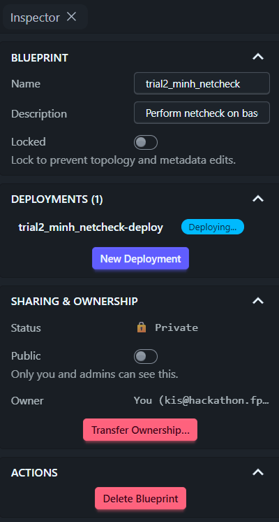
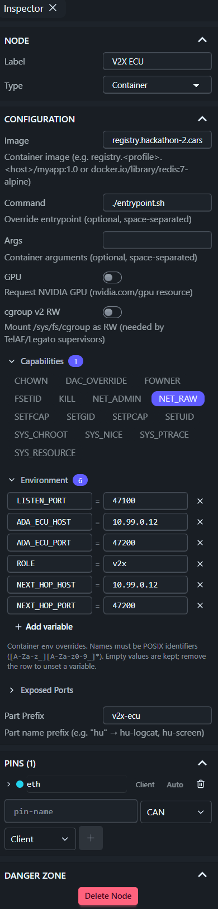
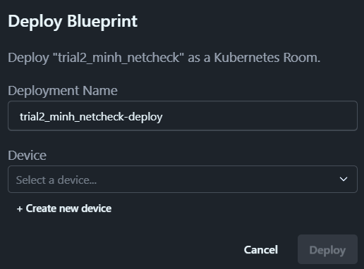

# Deploying a Blueprint on CarSky — End-to-End Walkthrough

Worked example: the **netcheck** connectivity test ([tools/netcheck/](../../tools/netcheck/)), from source file to running Room. Every step **M1–M12** of [baseline-connectivity-smoke-test.md](../../plans/doc/research_notes/baseline-connectivity-smoke-test.md) is covered here in order — several are performed by an agent rather than by hand, and [§5](#5-work-division-between-ai-and-human) states which; that note owns the test's *design* (why each check exists, pass criteria C1–C5), this guide owns the *doing*.

Use it as the template for deploying any container node — the ECU images follow the identical path with different images and env.

---

## 1. Introduction

Getting code onto CarSky is three hand-offs:

```
your code  ──build──▶  container image  ──push──▶  registry  ──pull──▶  CarSky node
 (git repo)            (GitHub Actions)              (Zot)              (Room)
```

Nothing is ever installed onto a node by hand. A node's config *names* an image; the platform pulls it when the Room deploys. Change behaviour → edit config and redeploy. Change code → rebuild, push, redeploy.

The netcheck example proves the network works before any ECU code exists: one image on three nodes, each playing a different role via environment variables, relaying a datagram bench → V2X → ADA → IVI.

---

## 2. Tools and concepts

### 2.1 Docker

**Docker** packages an application with everything it needs to run — OS libraries, runtime, dependencies — into one **image**. A running copy of an image is a **container**. Because the image carries its own environment, it runs identically on a laptop, a CI runner, and a cloud cluster; this is what removes "works on my machine".

A **Dockerfile** is the recipe. Ours ([tools/netcheck/Dockerfile](../../tools/netcheck/Dockerfile)) picks a base OS, installs Python and tcpdump, copies three scripts in, and declares what runs at start.

> Reference: [Docker overview](https://docs.docker.com/get-started/docker-overview/) · [Dockerfile reference](https://docs.docker.com/reference/dockerfile/)

### 2.2 GitHub Actions

**GitHub Actions** runs commands on GitHub's servers when something happens in the repository. We use it because the developer machine has no Docker or Linux — GitHub's Linux machines build and test instead.

### 2.3 Workflow, YAML, events, jobs, runners

A **workflow** is a YAML file in `.github/workflows/`. Ours is [phase0-ci.yml](../../.github/workflows/phase0-ci.yml).

| Concept | Meaning | In our file |
|---|---|---|
| **Event** | What triggers the workflow | `on: push` — every push to any branch |
| **Job** | A named group of steps; jobs run in parallel by default | `netcheck-image`, `v2x-core-build`, `ivi-unit-tests`, … |
| **Step** | One command or reusable action inside a job | "Build netcheck image", "Push to CarSky Zot registry" |
| **Runner** | The machine executing a job | `runs-on: ubuntu-latest` |
| **Secret** | Encrypted value injected at run time, never printed | `secrets.CARSKY_ZOT_API_KEY` |

Each job starts on a clean machine, so it checks the code out first (`actions/checkout`).

**Reading the raw YAML, briefly:**

- `key: value` — one mapping entry; nesting is indentation (2 spaces), no braces.
- `- item` — a list entry; a job's `steps:` is a list of these.
- `${{ ... }}` — an expression evaluated at run time, e.g. `${{ secrets.CARSKY_ZOT_API_KEY }}`.
- `|` before a block — a literal multi-line string, used for a multi-line `run:` script.

> Reference: [GitHub Actions documentation](https://docs.github.com/actions) — workflow syntax, contexts, and expressions in full.

### 2.4 Zot — the container registry

**Zot** is the image warehouse CarSky runs. Upload an image once; any node can pull it by name. Ours: `https://registry.hackathon-2.carsky.io/`.

**Credentials.** Sign in to the Zot web UI through **A8 Keycloak** (single sign-on), then create an **API key** (`zak_…`, shown once). That key is the *password* for `docker login`; the username is the registry account. Full procedure: [zot-registry-api-key.md](zot-registry-api-key.md).

**Host caveat:** `registry.hackathon-2.carsky.io` is the verified **push** host from outside (CI, dev machine); `registry.carsky.io` answers 502 externally. **Resolved:** nodes pull from this same host — the earlier pull failures were a single-platform-image requirement, not a host mismatch. See [phase0-smoke-test-run.md § Standing requirement](../../plans/doc/phase0-smoke-test-run.md).

**How the push works from GitHub Actions** — run by the `netcheck-image` job. Images must be single-platform `linux/arm64` ([phase0-smoke-test-run.md § Standing requirement](../../plans/doc/phase0-smoke-test-run.md)); attestations stay disabled so the result is one manifest, not an index:

```
docker login <registry-host> -u <account> --password-stdin   # key supplied from the secret
docker buildx build --platform linux/arm64 --provenance=false --sbom=false \
  -t <registry-host>/m1-netcheck:latest --push tools/netcheck/
```

The key lives only in GitHub Secrets and is never written to the repository.

### 2.5 CarSky — platform model

CarSky simulates a vehicle's electronic architecture in the cloud.

**Two different credentials, easily confused:**

| Credential | Format | Used for |
|---|---|---|
| **Keycloak login** | email + password | Signing in to the CarSky and Zot web UIs |
| **CarSky API key** | `a8k_…` | REST API calls (blueprints, deployments, logs) |
| **Zot API key** | `zak_…` | `docker login` to the registry only |

**The object model:**

| Term | What it is |
|---|---|
| **Blueprint** | The design of one vehicle: which nodes exist, how they are wired. Edited on the Nydus canvas. Not running. |
| **Node** | One simulated ECU or piece of bench equipment inside a blueprint. Types used here: **Container** (runs an image), **Skycraft** (runs an Android VM), **Ethernet Bridge** (the virtual network). |
| **Pin / edge** | A node's connector and the wire joining it to the bridge. Our four role nodes each have one `ethernet` pin wired to the bridge — a star. |
| **Device** | The Kubernetes resource pool a deployment runs on. **Not** an ECU — just the target machine pool chosen at deploy time. |
| **Deployment / Room** | A running instance of a blueprint. One blueprint can be deployed several times; the account allows 2 concurrent deployments. |

**What Zot provides to CarSky:** the images. A Container node's `image` field is a Zot address; at deploy time the platform pulls that image and starts it. If the image is missing, or the host is wrong, the node hangs in `Provisioning` with `trying and failing to pull image`.

---

## 3. Prerequisites

All three must hold before M5. Without them the deploy cannot complete, and the failure appears late — as a node stuck in `Provisioning` or a chain that stops at a hop.

| Prerequisite | Established by | Checked at |
|---|---|---|
| The job that builds and pushes this image ran green on the latest push | [phase0-ci.yml](../../.github/workflows/phase0-ci.yml), job `netcheck-image` | [M3 + M4](#m3--m4--build-and-push-automatic) |
| The image is in Zot on the push host of §2.4, single-platform `linux/arm64` | The same job | [M4](#m3--m4--build-and-push-automatic)'s catalog check |
| The blueprint exists, and each role node has one `ethernet` pin wired to the bridge at `10.99.0.10`–`.13` | Drawn by hand on the Nydus canvas | [M6](#m6--check-the-wiring) |

All three credentials of §2.5 are in hand: the Keycloak login for the web UIs, the CarSky API key for REST, and the Zot key stored as the GitHub secret of [M2](#m2--store-the-registry-credential-as-a-github-secret).

---

## 4. Step-by-step: deploying netcheck (M1–M12)

### M1 — Write the application code

[tools/netcheck/](../../tools/netcheck/) holds four files: `netcheck.py` (send / receive / relay), `capture.sh` (tcpdump), `entrypoint.sh` (starts capture in the background, netcheck in the foreground), and `Dockerfile`.

Two rules make one image serve three roles:

- **Nothing about the topology is in the code** — addresses, ports, and role come from environment variables.
- **The container starts the test itself**, so a deploy alone produces evidence; no shell session is ever needed.

### M2 — Store the registry credential as a GitHub secret

1. Create the Zot API key ([zot-registry-api-key.md](zot-registry-api-key.md)).
2. GitHub repository → **Settings → Secrets and variables → Actions → New repository secret**.
3. Name `CARSKY_ZOT_API_KEY`, value `zak_…`.

The registry account is not secret and lives in the workflow (`REGISTRY_USER`); override it with the `CARSKY_REGISTRY_USER` repository *variable* if the account changes.

### M3 + M4 — Build and push (automatic)

Both are done by the `netcheck-image` job on every push — no local Docker required.

**Requires the CI workflow script.** This is automatic only because [phase0-ci.yml](../../.github/workflows/phase0-ci.yml) already has a `netcheck-image` job that builds and pushes this exact image. If that job doesn't exist yet, or its `PLATFORMS`/tag/registry don't match the target, fix the `.yml` first — there is nothing to verify without it.

**Verify:** GitHub → **Actions** → newest **phase0-ci** run → job **netcheck-image**:

- *"Build netcheck image"* green → **M3 done**.
- *"Push to CarSky Zot registry"* prints `pushed …/m1-netcheck:latest` → **M4 done**. If it prints `secret not set`, M2 is incomplete.

**Independent check:** the image appears in the Zot UI image list, or via the registry API `GET /v2/_catalog`.

### M5 — Choose the blueprint

Nydus → blueprint list → open the target (here `trial2_minh_netcheck`).

Working on a **clone** keeps the known-good baseline untouched — recommended. Deploying also creates a snapshot named `<name>-deploy`; **always edit the original**, never the snapshot.

Clicking empty canvas shows the **blueprint** Inspector — the panel that owns the whole design rather than one node:



| Control | Use |
|---|---|
| Name / Description | Identify the trial — put the differentiator here, never in code |
| **Locked** | Freezes topology and metadata edits; leave off while configuring |
| **Deployments (n)** + **New Deployment** | Live Rooms from this blueprint, and where M9 starts |
| Public / Owner | Private by default; owner is the CarSky account (the same identity used for the registry) |
| **Delete Blueprint** | Only after its deployments are deleted (M12) |

### M6 — Check the wiring

Confirm each of the four role nodes has one `ethernet` pin wired to the Ethernet Bridge, with addresses `10.99.0.10` (bench), `.11` (V2X), `.12` (ADA), `.13` (IVI).

> **Warning — do not add nodes or pins here.** The REST API cannot create `ETHERNET` pins, and a JSON import silently drops them. If a clone lost its pins, re-draw the four edges by hand on the canvas. On our blueprint the wiring is already correct: nothing to do.

### M7 — Configure the three container nodes

**The most important step.** Click a node, edit in the Inspector, click the canvas to commit.



> Capture that screenshot **only after the values are verified correct** (§7). The first run's screenshot showed `NEXT_HOP_HOST = 10.99.0.2` and `ROLE = V2X` — both wrong — and would teach the mistakes it was meant to prevent.

**Common to all three nodes:**

| Field | Value | Explanation |
|---|---|---|
| Image | `registry.hackathon-2.carsky.io/m1-netcheck:latest` | Same host CI pushes to. Must be single-platform `linux/arm64` ([phase0-smoke-test-run.md § Standing requirement](../../plans/doc/phase0-smoke-test-run.md)) — a multi-platform manifest index fails to pull. |
| Command | `./entrypoint.sh` | Overrides the container entrypoint. Relative to the image's workdir `/app` — `/entrypoint.sh` (absolute) does not exist and the container dies at start. May be left empty: the Dockerfile already defaults to it. |
| Args | *(empty)* | Not used. |
| Capabilities | `NET_RAW` | Linux privilege for opening raw sockets, required by `tcpdump` in `capture.sh`. Without it capture degrades to packet counters and criterion C4 weakens. |
| Exposed Ports | *(empty)* | Only needed to reach a container from outside the Room. Node-to-node traffic on `10.99.0.x` needs nothing. |
| Pins / Part Prefix | *(unchanged)* | Set by the baseline; touching them breaks the wiring or the log routing. |

**Per node — environment variables.** Names are read verbatim by [netcheck.py](../../tools/netcheck/netcheck.py); a misspelling is silently ignored, and a wrong address produces `[ERR] no route`.

| Node | Field | Value | Explanation |
|---|---|---|---|
| **Bench** `10.99.0.10` | `ROLE` | `bench` | Read as `ROLE`; labels every log line and is appended as the stamp `\|bench`. Lowercase, to match the expected log. |
| | `NEXT_HOP_HOST` | `10.99.0.11` | Read as `NH`; destination of `sendto()`. The V2X node's pin address. |
| | `NEXT_HOP_PORT` | `47100` | Read as `NP`; must equal V2X's `LISTEN_PORT`. |
| | *(no `LISTEN_PORT`)* | — | The bench only sends. Setting it would make it a relay. |
| **V2X ECU** `10.99.0.11` | `ROLE` | `v2x` | Adds the `\|v2x` stamp proving the datagram transited this node (criterion C5). |
| | `LISTEN_PORT` | `47100` | Read as `LISTEN`; the receiver binds `0.0.0.0:47100`. Must equal the bench's `NEXT_HOP_PORT`. |
| | `NEXT_HOP_HOST` | `10.99.0.12` | ADA's pin address. **Type carefully — `10.99.0.2` is a different, non-existent host.** |
| | `NEXT_HOP_PORT` | `47200` | Must equal ADA's `LISTEN_PORT`. |
| **ADA ECU** `10.99.0.12` | `ROLE` | `ada` | Adds the `\|ada` stamp. |
| | `LISTEN_PORT` | `47200` | **Add this name.** The baseline's `V2X_LISTEN_PORT` is a different variable and is not read by this image — keep it, but add `LISTEN_PORT` alongside. |
| | `NEXT_HOP_HOST` | `10.99.0.13` | The IVI node. |
| | `NEXT_HOP_PORT` | `47300` | The IVI hop (see M10). |

Optional, defaults are fine: `HZ` (1 message/second), `PAD` (payload padding, for the MTU check), `START_DELAY_S` (20 s, so receivers are listening first), `CAPTURE_FILTER` (`udp`).

Leftover baseline variables (`ADA_ECU_HOST`, `SCENARIO_CONFIG`, `GATE_ENTER_M`, …) are ignored and harmless.

### M8 — Leave the IVI node alone

The Skycraft node runs an Android VM, not a container — it cannot run these scripts. It only needs its **VM image artifact** attached (artifact `AAOS`, version `0.0.1`, arch `aarch64` — [node-ivi-ecu.md](node-ivi-ecu.md)). Without it the deploy is rejected outright:

> `invalid blueprint: node 'IVI ECU': skycraft requires 'image' config with VM image artifact details`

### M9 — Deploy → criterion C1

**New Deployment** opens the Deploy dialog:



- **Deployment Name** — defaults to `<blueprint>-deploy`; keep it unless running two Rooms from one blueprint.
- **Device** — pick an **existing** entry from the dropdown (§2.5: the K8s resource pool, not an ECU). `+ Create new device` is unnecessary here and eats into the 2-concurrent-deployment budget.

Then **Deploy**, and wait until every node badge reads `Running` with restart count 0 — that is **C1**. The Android node takes longer than the containers.

*Stuck in `Provisioning`* almost always means the image could not be pulled: re-check the M7 image field, host, and that M4 actually pushed. Diagnosis procedure: [carsky-room-diagnostics](../../.claude/skills/carsky-room-diagnostics/SKILL.md).

### M10 — Read the logs → criteria C2–C5

Click each node → **View Log**. The programs are already running; nothing to type.

| Node | Expect |
|---|---|
| Bench | `[NET] bench route to 10.99.0.11:47100 OK, egress address 10.99.0.10` then `[TX] bench #0 …` |
| V2X | `[RX] v2x #1 from 10.99.0.10 … body=seq=0\|bench` then `[TX] v2x #1 relayed to 10.99.0.12:47200` |
| ADA | `[RX] ada #1 … body=seq=0\|bench\|v2x` — the accumulated stamps are **C5** |
| any | `[CAP] … IP 10.99.0.10.x > 10.99.0.11.47100: UDP` — tcpdump on the wire, **C4** |

Zero `[ERR]` lines is **C2**; a live, readable log per node is **C3**.

### Checking IVI RX traffic (hop 3)

Until the IVI listener is installed on the Android node, it produces no `[RX]`/`[TX]` logs like the other three nodes. Two ways to check it received ADA's relay, strongest first — per [baseline-connectivity-smoke-test.md §7](../../plans/doc/research_notes/baseline-connectivity-smoke-test.md#7-the-ivi-hop) — and record which was used.

**Note:** a REST-driven listener (`POST` a `toybox nc -u -l -p 47300` to the VM shell route, `GET` the result) is not doable — the VM shell route returns 502 on this deployment, same as `screenshot`/`accessibility`/`container-exec` ([carsky-rest-api-blueprint.md](carsky-rest-api-blueprint.md)). Toybox's availability can't even be checked until that's fixed.

#### Option 1 — ADA-side evidence (currently the only working option)

ADA's `[TX] … relayed to 10.99.0.13:47300` plus its `[CAP]` line proves the datagram was put on the wire — it does not prove IVI received it.

#### Option 2 — Wait for the real R4 listener

Once the IVI listener is installed, hop 3 verifies through the actual UDP path and this whole check retires — no netcheck-specific verification needed from then on.

### M11 — Optional: MTU headroom

Set `PAD=1400` on the bench node and redeploy. If large datagrams do not arrive while small ones do, bisect the value to find the ceiling — the bridge is a tunnelled fabric, so 1500 bytes is not guaranteed. Feeds the CPM message-size budget.

### M12 — Tear down

**Delete Deployment** when finished; the blueprint is untouched and redeployable. Only 2 deployments may run at once, so releasing one matters.

---

## 5. Work division between AI and human

The split is not a preference — it follows from what an agent can reach. An agent runs CLI tools and authenticated REST calls; it cannot use the Nydus canvas, a browser download, or its own eyes. The `M` labels are step names, not the assignment.

| Action | AI / Human | Description |
|---|---|---|
| [M1 — Write the application code](#m1--write-the-application-code) | Neither | A development deliverable; the four source files exist before the procedure starts |
| [M2 — Store the registry credential](#m2--store-the-registry-credential-as-a-github-secret) | Human | GitHub repository settings; the key is pasted once and never echoed |
| [M3 + M4 — Trigger the build and push](#m3--m4--build-and-push-automatic) | AI | Push a commit; the `netcheck-image` job runs on every push |
| [M4 — Confirm the run passed](#m3--m4--build-and-push-automatic) | Human | Actions web UI; an agent session holds no GitHub token |
| [M4 — Confirm the image reached the registry](#m3--m4--build-and-push-automatic) | AI | Registry catalog and tag list over `curl` |
| [M5 — Choose the blueprint](#m5--choose-the-blueprint) | Human | Nydus blueprint list and Inspector; edit the original, never the snapshot |
| [M6 — Check the wiring](#m6--check-the-wiring) | AI | `GET /api/v1/blueprints/{id}` returns every pin, edge and address |
| [M6 — Draw a missing pin or edge](#m6--check-the-wiring) | Human | Nydus canvas; REST cannot create `ETHERNET` pins |
| [M7 — Configure the three container nodes](#m7--configure-the-three-container-nodes) | Human | Node Inspector; no REST route updates an existing node's config |
| [M7 — Read the stored config back](#m7--configure-the-three-container-nodes) | AI | The same blueprint read-back returns image, command, env and capabilities |
| [M8 — Confirm the IVI node's VM artifact](#m8--leave-the-ivi-node-alone) | AI | Also in that read-back; its absence gets the deploy rejected outright |
| [M8 — Attach a missing VM artifact](#m8--leave-the-ivi-node-alone) | Human | Node Inspector, from the artifact store |
| [M9 — Deploy](#m9--deploy--criterion-c1) | Human | **New Deployment** dialog; picking the Device is a human call |
| [M9 — Poll node phases until Running](#m9--deploy--criterion-c1) | AI | `GET /api/v1/deployments/{roomId}/nodes`; also yields each `nodeKey` |
| [M10 — Read every node's log](#m10--read-the-logs--criteria-c2c5) | AI | Logs route with `container=user`; C2–C5 are all text |
| [M10 — Record the hop-3 evidence](#checking-ivi-rx-traffic-hop-3) | AI | The ADA node's `[TX]` and `[CAP]` lines, and which method was used |
| [Verify the capture in Wireshark](#6-expected-outputs-and-acceptance) | Human | A judgement on the datagrams themselves, made outside the platform |
| [M11 — Set `PAD` and redeploy](#m11--optional-mtu-headroom) | Human | A bench node config edit, then a fresh deployment |
| [M11 — Read the logs for the ceiling](#m11--optional-mtu-headroom) | AI | Compare arrivals across `PAD` values on the same logs route |
| [M12 — Tear down](#m12--tear-down) | Human | **Delete Deployment**; releases one of the two Room slots |

Five notes on the rows above:

- **M1 belongs to neither column.** The deploying agent writes no product code, and no human writes it at bring-up time — the sources are a development deliverable this procedure consumes.
- **M7 has no agent route.** `/batch` adds nodes, pins and edges; no update or delete op exists anywhere in the API, so an existing node's config is edited in the UI and only read back over REST.
- **Confirming the run flips to AI** on a machine with an authenticated `gh` CLI. Without it, the Actions web UI is the only route.
- **Deploy and teardown have REST calls and stay Human anyway.** Each consumes or releases one of the two Room slots, and that call is the user's.
- **Every AI row needs a credential supplied at run time** — the CarSky API key for the REST rows, the registry account and key for the registry check. An agent stores neither.

---

## 6. Expected outputs and acceptance

Two outputs. The logs are what the run produces; the capture is the human's corroboration that the datagrams were really on the wire.

| Output | Retrieved at | Accepted when |
|---|---|---|
| One live log per container node — bench, V2X, ADA | [M10](#m10--read-the-logs--criteria-c2c5) | **C1** every node `Running`, restart count 0 · **C2** no `[ERR]` line · **C3** a live, readable log per node · **C4** a `[CAP]` line on the sending node · **C5** the accumulated stamp `seq=0\|bench\|v2x` at ADA |
| The traffic capture, read by a human | The same logs | A human reads the capture and confirms UDP datagrams on `47100`, `47200` and `47300` between `10.99.0.10`–`.13`, matching the counts and timing of the `[TX]`/`[RX]` lines |

**The capture this image produces is text, not a `.pcap`.** [capture.sh](../../tools/netcheck/capture.sh) runs `tcpdump -l` and prefixes each line `[CAP]`; it writes no capture file. Opening the traffic in Wireshark instead needs the `tcpdump -w` and base64 log export described in [traffic-capture-wireshark.md](traffic-capture-wireshark.md), which the netcheck image does not ship — confirm which of the two a run is expected to produce before relying on either.

---

## 7. Mistakes already made — check these first

Every row below cost real time on the first run (2026-07-31). They are ordered by how expensive they were.

| # | Mistake | Symptom | Fix |
|---|---|---|---|
| 1 | **Deployed before doing M7.** The clone carried the baseline's ECU images (`registry.carsky.io/m1-v2x-ecu:latest` …), which do not exist yet. | All three container nodes stuck in `Provisioning`; the bridge and IVI reach `Running`. Log API reports `waiting to start: trying and failing to pull image`. | Apply M7 to all three nodes, delete the failed deployment, redeploy. |
| 2 | **Wrong registry host in CI** — `registry.carsky.io` instead of `registry.hackathon-2.carsky.io` for the *push*. | The push itself fails (502) or lands nowhere the catalog shows. | Push to the `hackathon-2` host — nodes pull from the same host (M7); the image also needs to be single-platform `linux/arm64` (see [§ Standing requirement](../../plans/doc/phase0-smoke-test-run.md)). |
| 3 | **Typo in an address** — `NEXT_HOP_HOST = 10.99.0.2` instead of `10.99.0.12`. | Node runs and logs, but `[ERR] no route to 10.99.0.2:47200`; the chain stops at that hop, so C5 never appears downstream. | Re-read each address digit by digit; they differ by one character. |
| 4 | **`ROLE` in uppercase** (`V2X` instead of `v2x`). | Runs, but log lines and the datagram stamp read `\|V2X`, so the expected `seq=0\|bench\|v2x` never matches and C5 cannot be confirmed by eye. | Lowercase: `bench`, `v2x`, `ada`. |
| 5 | **Absolute command path** — `/entrypoint.sh` instead of `./entrypoint.sh`. | Container exits immediately; restart count climbs. The script lives in the image workdir `/app`, not at the filesystem root. | Use `./entrypoint.sh`, or clear the field and let the image's own default run. |
| 6 | **IVI node missing its VM artifact.** | Deploy rejected outright: `skycraft requires 'image' config with VM image artifact details`. | Attach artifact `AAOS` v`0.0.1`, arch `aarch64` (M8). |
| 7 | **Renaming instead of adding on ADA** — the baseline's `V2X_LISTEN_PORT` is not read by this image. | ADA never binds a socket, so it receives nothing. | **Add** `LISTEN_PORT=47200`; leave the old variable in place. |
| 8 | **Editing the `-deploy` snapshot.** Deploying creates a copy named `<blueprint>-deploy`. | Edits appear to save but the next deploy ignores them. | Always edit the original blueprint. |

**Before deploying, verify by reading the config back** rather than trusting the Inspector's truncated fields — `GET /api/v1/blueprints/{id}` returns each node's stored `config` exactly, and catches #2, #3, #4 and #5 in one look.

## 8. Quick reference

| Thing | Value |
|---|---|
| Registry host (push) | `registry.hackathon-2.carsky.io` |
| Image (node pull reference) | `registry.hackathon-2.carsky.io/m1-netcheck:latest`, single-platform `linux/arm64` |
| GitHub secret | `CARSKY_ZOT_API_KEY` (`zak_…`) |
| Node addresses | bench `.10` · V2X `.11` · ADA `.12` · IVI `.13` on `10.99.0.0/24` |
| Ports | bench→V2X `47100` · V2X→ADA `47200` · ADA→IVI `47300` |
| Pass criteria | C1 Running · C2 no `[ERR]` · C3 live log · C4 `[CAP]` capture · C5 accumulated stamps |

*Screenshots referenced above live in `requirements/car-sky-guide/images/`; capture them from Nydus when exporting this guide to slides.*
