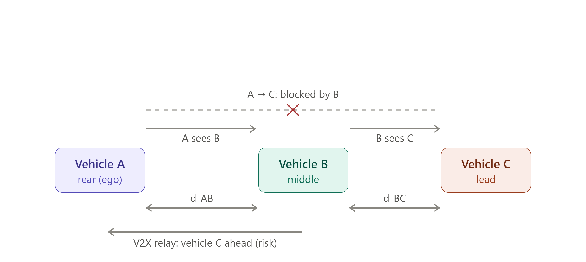
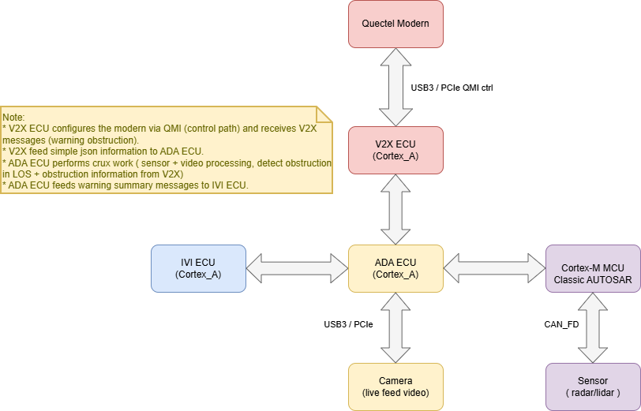

# Requirement Analysis & Technical Solution Report — M1: Cooperative Vehicle Awareness

## 1. Project description

### Project Goals

The system makes a vehicle aware of a hazard it cannot see, by relaying another vehicle's perception.

### Milestone 1 development goals

Milestone 1 scopes implementation to one scenario, built on a cloud virtual environment:

Three vehicles drive in a collinear convoy — **A** follows **B** follows **C**. Vehicle A's view of C is **blocked by B**, so A's own camera can never detect C. Vehicle B *can* see C, detects it, and **broadcasts that perception to A over V2X**. The result: both A and B display vehicle C and its relative position, even though A never sees C directly.

*Objective — B's perception of C reaches A over a V2X relay. A reconstructs C's position by composing its own measurement of B with B's reported measurement of C:* `d_AC ≈ d_AB + d_BC` *(valid for the near-collinear convoy; absolute/GPS composition is a later milestone).*

### System design

The 4-ECU design below realizes the goals above; per-ECU M1 scope is in the responsibility list right after it.

### ECU responsibility

- **V2X ECU**
  - Configures the modem and interfaces with it — simulated only in M1.
  - Connects to the V2X network — simulated, or a 3rd-party library entirely, in M1.
  - Receives V2X message payloads, applies business logic, forwards results to the ADA ECU (M1).
  - Receives information from the ADA ECU, constructs V2X message payloads, forwards to V2X (M1).
  - M1 scope is strictly limited to business logic and V2X message construction.
- **ADA ECU**
  - Configures the camera — not done in M1.
  - Receives live video feeds — not done in M1.
  - Detects objects in video — in M1, only from saved video files, not a live feed.
- **IVI ECU**
  - Displays GUI and applications, including a 3D view.
  - Receives information from ADA and renders it.

### Input constraints

- V2X control messages and V2X data (broadcast messages) are inputs to the V2X ECU and carry inter-vehicle communication. Development focuses on both extracting **and** constructing application-layer data — e.g. "there is an obstruction ahead of me, broadcast it" and "a broadcast was received, check what it is."
- The V2X protocol stack itself ships in the modem and is out of scope for this project.
- Modem↔Cortex-A interfacing (boot-up, configuration) *could* be implemented at the interface layer; control-plane messages *could* be constructed by the V2X ECU and sent to the modem to satisfy the required 3GPP call flow.
- Live video is the ADA ECU's eventual input; in M1, video files are provided instead.
- Video format, frame rate, data rate, and capture conditions are not yet known — these *should be studied and proposed* to FPT-Mentor so a supported input spec can be provided.
- A pre-trained model *should be used* to detect the obstruction (vehicle C) — no training in M1.
- The ADA ECU → IVI ECU data path *must be* developed — enumerated as **R20** (round 2, 2026-07-08).

### System Demo requirements

Referral methods of demonstration, scored 1 (low) – 10 (high) on preference:

| Method            | Demonstrates                            | Prefer score |
| ----------------- | --------------------------------------- | ------------ |
| Scenario player   | V2X messages across different scenarios | 10           |
| 3D drawing        | Video feed and obstruction              | 10           |
| 2D drawing        | Video feed and obstruction              | 8            |
| Wireshark capture | V2X messages on the wire                | 7            |
| Logging           | Events, incoming messages, data         | 1            |

### Numbering

**Requirement numbers 1–20 are project-global and frozen permanently** as the `X` segment of task IDs `X.Y.Z.W` per [research-report-format.md](../.claude/rules/research-report-format.md) — never reused or renumbered. R1–R18 were published at round-1 convergence; **R19–R20 were appended at round-2 convergence (2026-07-08)** — the display re-scope (§ user decisions below).

- **Notation:** every proposed numeric value is marked **(A) = assumption to confirm** — none exists verbatim in the plan doc; the user may veto any of them (see §4, flag F7). **Dependency** lines state what each requirement depends on — another requirement's output (Rx), external data, or environment facts — instead of an assessment code; *none* = self-contained. (ACH/RISK verdict codes removed 2026-07-08 by user decision; feasibility reasoning stays in the text and the §2 table.)

## 3. Feedback from FPT Mentors:

- **FPT-Mentor Q&A response, 2026-07-08 — read [m1-phase1-working-environment.md](m1-phase1-working-environment.md) before analysing or updating R1–R20.** That file is the authoritative, ingested record of FPT-Mentor's feedback; this entry is a pointer, not a substitute — [[project-researcher]] must read it to understand development environment and development tool for this project. 

- **Environment re-check:** 2026-07-08 — the bench-node model (team builds only the ego vehicle A; B and C exist as scenario-player message streams; no radio, no modem, no platform camera; nodes share the host clock) cross-checked against R1–R18. Adjustments appear inline as *Env 2026-07-08* notes throughout §2.

- **User decisions 2026-07-08 (round 2, binding inputs):** (D1) B-side display dropped — only ghost C on A's view needed; (D2) the GUI runs as a real application on the virtual IVI ECU; (D3) no JavaScript and no WebSocket in the ego software path; (D4) GUI framework candidates fixed to {Slint+Rust, React, Flutter}; (D5) GUI evaluation focus 3D → 2D → aesthetics, applied within criteria C1–C4; (D6) M1 GUI = buttons + central view window switching to a 2D **or** 3D 3-car view on an ADA warning; (D7) camera live feed in the central view = future requirement. Applied as the R16 revision, new R19/R20, §3(i)/(j), and flags F10–F13/SC-1.

## 4. Others

- **Authorship:** converged output of a two-researcher adversarial review — Researcher Alpha (implementability / M1-speed emphasis) vs. Researcher Beta (standards-conformance / extensibility emphasis). Round-1 contested points and resolutions: [round-1 record](../.claude/prompts/scratchpad-requirement-analysis-round1/adversarial-review-record.md). **Round 2 (2026-07-08, display re-scope + CUDA verdict):** same personas; Alpha's Flutter-first display pick prevailed after Beta's evidence-based concession — [round-2 record](../.claude/prompts/scratchpad-requirement-analysis-round2/adversarial-review-record.md) (§6 Appendix holds the pointers).

---

## 2. Enumerated requirements (1–20)

**Ordering rationale: urgency.** Contracts (1–2) block all three tracks — the plan is contract-first by design. Then per-track requirements in the plan's own dependency/phase order (comms 3–6, perception 7–12, convergence 13–14, display/composition 15–16), capstone 17, and the cross-cutting dataset precondition 18. **R19–R20 (round-2 display additions) are appended after R18**; their internal order is contract-first — R20 (data-path contract) unblocks R19 (shell) unblocks R16-integration.

### Contracts (Step 0)

**R1 — Frozen V2X message schema, normative target = ETSI TS 103 324 CPM.** A versioned (v1.0) schema document + reference implementation of the perceived-object message, carrying `stationId`, `generationDeltaTime`, sender reference position/time, and a perceived-object entry (`objectId`, relative position/distance, `classification`, `confidence`) — per plan §4. The **single normative target is ETSI TS 103 324 CPM** (v2.1.1 ASN.1, freely auditable at the [ETSI forge](https://forge.etsi.org/rep/ITS/asn1/cpm_ts103324)); SAE J3224 SDSM is referenced informatively only, because it is paywalled and therefore unauditable under the open-source-only constraint. The schema **must carry object reference-point semantics** (CPM defines them; R15's composition math requires them). Field names/nesting mirror the CPM containers (management / station data / perceived-object) with the standard's units, ranges, and resolutions, so a later ASN.1 codec swap changes no field semantics. Enforcement: a pydantic model is the single source of truth (JSON Schema generated *from* it), validating every message at runtime; an encode→decode round-trip test and a mapping-coverage check run in CI.
- **Dependency: none** — pure specification work, days; ETSI spec and ASN.1 are public.
- **KPI:** mapping table traces 100% of schema fields to a TS 103 324 field path with standard units/resolution; round-trip unit test reproduces 100% of fields bit-exact; 0 range violations at runtime across all demo runs.
- Vague→precise: "standard-conformant schema" → *every field traceable 1:1 to a TS 103 324 CPM field, verified by a committed mapping table + CI round-trip test; reference-point semantics explicit.*
- **Env 2026-07-08:** requirement unchanged — TS 103 324 stays the normative target. The JSON *enforcement mechanism* above is under supersession review: the bench-node model makes standard UPER encoding near-free, moving the recommended route to codec-only UPER via asn1tools (ASN.1 modules + round-trip test replace pydantic/JSON-Schema as the conformance check); **user ratifies at the R1 freeze** — supersession chain in [control/data-plane §2–3](m1-phase1-control-data-plane.md).

**R2 — Frozen TrackedObject struct.** The 9-field struct of plan §4 (`id, class, source, first_seen, last_seen, bbox, distance, confidence, state`) implemented as one typed model shared by detection, distance, gate, relay, and display code — never redefined.
- **Dependency: none** — specification work from plan §4 alone.
- **KPI:** unit test constructs the struct with all 9 fields (timestamps in ms since epoch, distance in m), exercises all `state` and `source` enum values; one-definition check passes (single import source, zero duplicate definitions).

### Comms track (Phase 1)

**R3 — V2X broadcast service, auto-start on boot.** A Linux service auto-starts on boot, initializes the transport, and broadcasts the full R1 schema with mock object contents at 10 Hz (A).
- **Dependency: R1** (schema for the broadcast payload); transport mechanism = thin send/recv adapter, final bench→ego carrier confirmed by FPT-Mentor after blueprint submission ([working-env note](m1-phase1-working-environment.md)).
- **KPI:** after a cold reboot, service is active within 30 s (A); observed message rate 10 Hz ± 10% over a 60 s window (A).
- Vague→precise: "runs the broadcast loop" → *10 Hz sustained, rate error ≤ 10% over 60 s (A)* — 10 Hz matches the CAM/BSM upper rate so the stub is rate-realistic.
- **Env 2026-07-08:** the auto-start service is the **ego vECU's** TX heartbeat; B's broadcasts are emitted by the bench scenario player, not a second team-built vehicle. "Cold reboot" = ego node restart. Dependency/KPI unchanged.

**R4 — Peer reception + full-field parse.** The receiving vehicle logs every received message parsed into 100% of schema fields, both directions (A↔B).
- **Dependency: R1** (schema to parse against), **R3** (traffic on the channel); bench scenario player as the peer sender.
- **KPI:** delivery ratio ≥ 99% over a 10-minute bench-LAN soak (A) — on a wired bench, lower indicates a bug, and a 10-min run exposes buffer/leak issues a 60 s check misses; every received message logs all schema fields with 0 unit/range assertion violations.
- **Env 2026-07-08:** "both directions (A↔B)" = **ego↔bench** — the ego logs bench-injected CAM/CPM, the bench logs the ego heartbeat (peer mirror, [working-env note, deliverable 1](m1-phase1-working-environment.md)). The soak runs on the bench→ego channel with the impairment profile disabled. KPI numbers unchanged.

**R5 — Common timebase across A and B.** Both hosts' timestamps are comparable within a bound; the offset is *measured*, not assumed.
- **Dependency: none** — shared host clock by construction (FPT-Mentor-confirmed); chrony only measures it.
- **KPI:** measured clock offset |Δt| ≤ 50 ms via chrony/NTP peering on the stub path, ≤ 10 ms when GNSS-disciplined (A), sustained over 10 min; offset logged at 0.1 Hz via chrony tracking report cross-checked by a round-trip-halved UDP echo probe.
- Vague→precise: "offset within an agreed bound" → *≤ 50 ms (stub/NTP), ≤ 10 ms (GNSS) (A)*.
- **Ordering note:** R5 must land before R14's latency KPI is measurable — a cross-host latency number is meaningless between unsynchronized clocks.
- **Env 2026-07-08:** platform nodes share the host clock (FPT-Mentor-confirmed), so the offset is ~0 by construction — still measured via chrony per the KPI, never assumed; the ≤ 10 ms GNSS-disciplined branch is out of scope with hardware removed from the project (see R6).

**R6 — GNSS/modem provider bring-up (cloud-only, simulated).** **No hardware is used in any part of this project — development is entirely cloud/virtual (user decision 2026-07-08).** A provider service sources GNSS position+time from the scenario-player feed (or a 3rd-party simulator) at 1 Hz (A) and writes a startup log naming the active provider (`sim`), format-identical to what a hardware path would produce (plan §3's substitution table).
- **Dependency:** scenario-player position feed ([working-env note, deliverable 1](m1-phase1-working-environment.md)); optionally a 3rd-party modem/baseband simulator or — preferred — a V2X message simulator/generator: candidate research spawned 2026-07-08, findings in [m1-v2x-simulator-tools.md](m1-v2x-simulator-tools.md).
- **KPI:** startup log names the active provider and reports a fix within 120 s (A) of service start; position logged at 1 Hz ± 0.1 Hz; log format verified by a parser kept provider-agnostic.
- **Supersession note:** the original R6 was hardware-conditional (QMI/AT modem bring-up if a C-V2X modem is available, mock provider otherwise; RISK-gated on hardware availability with a week-2 go/no-go, flag F1). Env 2026-07-08 first deferred the hardware branch (no modem/baseband on the platform); the user decision of 2026-07-08 removes hardware from the **entire project**, not just M1 — [product-fit note](m1-product-fit-quectel-modem.md) stays as reference for a hypothetical future hardware milestone only.

### Perception track (Phases 2–4)

> **Env 2026-07-08 (R7–R12):** the perception track is video-file-driven and environment-neutral — it runs wherever the provided clips are processed (dev machine or bench side); the platform has no camera and none is needed (plan §2: no live camera bring-up). Its Phase-4 output feeds the scenario player's CPM content at Phase 5 (see R13). R7–R12 otherwise unchanged.

**R7 — Video harness with per-frame timestamps.** The provided video opens; container/codec/fps/resolution detected and logged; frames stream with per-frame timestamps.
- **Dependency:** a video clip (any clip suffices for the harness itself; the demo-grade package is R18).
- **KPI:** 100% of frames delivered exactly once; timestamps strictly monotonic (jitter ≤ 1 frame period); metadata log matches `ffprobe` output for the same file.

**R8 — TrackedObject store + admission state machine (mock-driven).** Store exposes all R2 fields; the `not_tracked → tentative → tracked → expired` manager runs off an injected synthetic C.
- **Dependency: R2** (the frozen struct the store exposes).
- **KPI:** with mock on, log shows a full lifecycle cycle with timestamps; with mock off, zero tracks over the whole clip (binary); transitions obey `confirm_hits`/`miss_limit` exactly in a scripted-input unit test (0 deviations).

**R9 — Detection of C + in-lane lead selection.** Pretrained detector finds C as `car`/`truck`; the in-lane lead (largest central bbox) is selected when multiple vehicles are present; bboxes are written to the store.
- **Dependency: R7** (frame stream), **R8** (store to write bboxes into); pretrained COCO weights, no training (plan §2).
- **KPI:** recall ≥ 90% (A) of frames where C is visible and within 50 m (A); lead selection correct in ≥ 95% (A) of multi-vehicle frames on a hand-labeled 200-frame sample; mock path disabled (binary).

**R10 — Perception throughput.**
- **Dependency: R9** (the detector whose throughput is measured); nano detector on CPU meets it — GPU is margin, not a dependency.
- **KPI:** detection update rate ≥ 10 Hz (A) with mean per-frame latency ≤ 100 ms (A) on the demo machine; a documented frame-skip policy is allowed as long as the update rate holds.
- Vague→precise: "keeps pace with the video frame rate (or agreed latency target)" → *≥ 10 Hz effective update rate, ≤ 100 ms mean latency, frame-skip permitted and documented (A)* — 10 Hz matches R3's message rate so perception never bottlenecks the relay.
- **CUDA verdict 2026-07-08 (round 2, converged):** **CUDA/GPU is NOT required for M1 — Python on CPU meets this KPI.** Official Ultralytics CPU-ONNX figures (COCO, 640 px): YOLO11n = 56.1 ± 0.8 ms ≈ 17.8 FPS (~1.8× margin), YOLOv8n ≈ 80.4 ms ≈ 12.4 FPS (caches: [yolo11](../.claude/references/yolo11-cpu-inference-benchmarks.md), [nano models](../.claude/references/yolo-nano-cpu-inference-benchmarks.md)). GPU availability on the platform is **not assured** (hosting unconfirmed; F2's CARLA contingency already budgets a *separate* GPU machine) — **no M1 KPI may depend on GPU**. Derated-vCPU risk (~85–110 ms on 1.5–2×-slower vCPUs) is covered by this KPI's own levers (documented frame-skip, input 640→416 ≈ 2× faster, ONNX-Runtime/OpenVINO backend); action: measure on the actual node at the week-4 spike. The future 120 km/h live-feed feature *does* require GPU-class acceleration — spec in §5 (future-features register), stack-openness decision deferred as flag F11.

**R11 — Monocular distance per leg.** Per-frame range to the lead from bbox-bottom ground-plane projection (camera intrinsics + height), written back to the track.
- **Dependency: R18** (camera intrinsics + ground truth — the ±15% tolerance is untestable without calibration), **R9** (bboxes to project) — ±15% is realistic for ground-plane projection on a flat road with correct intrinsics/camera height, but degrades with pitch bounce and bbox-bottom noise. Mitigations: validate on KITTI first (real noise); 5-frame median filter (A); height-prior cross-check.
- **KPI:** ≥ 90% (A) of frames within ±15% of ground truth for true range 10–50 m (A) on a calibrated clip; distance present on the track every frame C is detected.
- Vague→precise: "agreed tolerance (e.g. ±15%)" → *±15%, scoped to 10–50 m, ≥ 90% of frames (A)*.

**R12 — Active proximity gate, constants externalized.** Admission only when ≤ `gate_enter` (30 m) for `confirm_hits` (3) consecutive frames; drop only beyond `gate_exit` (35 m) or after `miss_limit` (5) misses. All four constants in a config file (constitution rule 5 — no hardcoded tunables).
- **Dependency: R11** (per-frame distance the gate thresholds on), **R8** (state machine it drives).
- **KPI:** on a synthetic approach/retreat sweep with injected Gaussian noise σ = 2 m (A), exactly one admit and one drop event (0 flicker oscillations); changing a constant in config alters behavior without rebuild (binary); static check finds no gate literals in code.
- Vague→precise: "no add/remove flicker at the boundary" → *0 state oscillations under a σ = 2 m noise sweep across the 30–35 m band (A)*.

### Convergence (Phase 5)

**R13 — Real-data relay gated on track state.** B's broadcast carries real Phase-4 data for C and includes C **only while C is `tracked`**.
- **Dependency: R9–R12** (real Phase-4 track output as message content), **R3/R4** (transport path carrying it).
- **KPI:** zero mock code on the transmit path (binary — mock modules not imported, assertable in the startup log); relay starts ≤ 1 message period (100 ms @ 10 Hz) after C enters `tracked` and stops ≤ 1 period after C leaves; transmitted perceived-object fields match store values for the same timestamp (log diff = 0).
- **Env 2026-07-08:** "B's broadcast" is emitted by the bench scenario player — Phase 5 swaps its CPM perceived-object content from scripted mock to the **real Phase-4 track output for C** (perception pipeline → store → scenario player's message builder). The zero-mock KPI applies to that content source plus the ego path; the scenario player itself is test equipment, not a mock (see R17). Dependency/KPI otherwise unchanged.

**R14 — Relayed-track admission on A + end-to-end latency.** A decodes and creates a `source = v2x_relayed` track carrying B's reference position/time; latency within bound; relayed track expires after `miss_limit` missed periods (mirror of R12).
- **Dependency: R5** (timebase must land first — the latency KPI is meaningless without it), **R13** (relayed message stream to admit).
- **KPI:** latency from B's frame-capture timestamp to A's relayed-track creation ≤ **300 ms p95** (A), with 200 ms as the engineering target; B's reference position/time present (field-presence check); mirror-expiry honored.
- Vague→precise: "agreed latency bound" → *≤ 300 ms p95 (200 ms target) (A)*. Budget: ≤ 100 ms detection (mean; p95 higher) + up to one 100 ms message period + ~5 ms stub network/codec + ±50 ms clock-offset measurement uncertainty — a 200 ms p95 *acceptance* bound fails its own worst-case arithmetic, hence 300 ms as the smallest honest bound.
- **Env 2026-07-08:** the shared host clock removes the ±50 ms offset-measurement term from the budget, making the 200 ms target comfortably reachable; **300 ms p95 stays the acceptance bound** (conservative, hardware-portable). Configured scenario-player delay/jitter (impairment option (b)) is excluded from the KPI's measured path or set to 0 for the acceptance run. Dependency unchanged. *Round-2 note:* R14's consumer chain is now ADA → R20 → R19/R16; KPI unchanged.

### Display track (Phase 6) + capstone

**R15 — Distance composition on A, with reference-point correction.** A measures `d_AB` locally, composes `d_AC = d_AB + d_BC` (lateral offsets component-wise), **after applying a configured `ref_point_offset_B` correction** (externalized per constitution rule 5; semantics carried in R1's schema; ground-truth reference convention declared per R18).
- **Error-budget derivation (why the KPI has this shape):** d̂_AC = d_AB(1+ε₁) + d_BC(1+ε₂) ⇒ relative error = (ε₁·d_AB + ε₂·d_BC)/(d_AB+d_BC), a convex combination of ε₁, ε₂ — bounded by max(|ε₁|,|ε₂|) ≤ 15% for *any* sign combination (same-sign worst case exactly 15%; opposite signs partially cancel). **The naive "two ±15% legs compound to ±30%" claim is false** — proportional error through a sum of positive lengths cannot exceed the worse leg. The tolerance widening is needed for the **additive** terms instead: (a) *reference-point bias* — A measures camera→B-rear, B measures its camera→C-rear, so true A→C = d_AB + (B-rear→B-camera ≈ 3–4 m) + d_BC; uncorrected this is a systematic ~7–8% underestimate at 50 m that alone would break a plain ±20% bound (0.15·d_AC + 3.5 m ≈ 22% at 50 m) — the correction constant is what makes the KPI passable; (b) *temporal skew* — v_rel × (latency + |Δt|) ≈ 5 m/s × 0.35 s ≈ 1.75 m; (c) heading/collinearity cosine error < 0.5% below 5° misalignment — negligible for the scripted convoy (plan §2 assumption holds).
- **Dependency: R11** (twice — both distance legs), **R18** (composed ground truth), the `ref_point_offset_B` correction being configured and applied.
- **KPI:** |d̂_AC − d_AC| ≤ **0.15·d_AC + 2.0 m** for ≥ 90% of composed samples over the demo range (A) (≈ ±19–20% at 50 m); `ref_point_offset_B` present in config, not code; composition arithmetic verified exactly by a mock-input unit test.
- Vague→precise: "composed d_AC matches ground truth within the agreed tolerance" → *≤ 0.15·d_AC + 2.0 m, ≥ 90% of samples, after reference-point correction (A)*. *Round-2 note:* the composed d_AC is now also the payload positioning R16's ghost marker, delivered over R20.

**R16 (rev. 2026-07-08) — Ghost C on A's BEV in the IVI central view.** A's IVI GUI (the R19 shell's central view window) renders a bird's-eye view of the 3-car convoy — ego A, lead B, and **C as an occluded "ghost" marker**, sourced `source = v2x_relayed`, positioned from R15's composed d_AC with an on-screen numeric range. Built against a mock R20 message first (per plan's mock-then-real); integrated with real relayed data at Phase 5/6.
- **Supersession note (round 2):** the original R16 was a *dual* display — "direct C on B" + "ghost C on A's BEV" — with the Env 2026-07-08 note re-wording the B side to a bench perception visualization and flagging the render target as F9. **User decision D1 strikes the B-side half entirely** (no requirement, no KPI); D2 makes the render surface a real GUI app on the IVI vECU (R19), closing F9. The bench-side OpenCV perception overlay survives only as an optional, unscored dev diagnostic. The §3(f) OpenCV pick is superseded by §3(i).
- **Dependency: R1** (mock message shape), **R14** (relayed track at integration), **R15** (composed position for the marker), **R19** (GUI shell hosting the central view), **R20** (ADA→IVI path), flag **F13** (surface delivery).
- **KPI (requirement-level, judge-visible):** ghost C appears ≤ **2 s (A)** after B's first `not_tracked→…→tracked` transition (measured via the R5-synced timebase — a prerequisite); ghost marker updates ≤ **500 ms (A)** after message receipt at the ego; C's marker renders **only** with `source = v2x_relayed` (binary — no direct-detection path can draw it; operationalizes R17's DoD at the GUI). Frame-rate KPI lives in R19 (one fact, one place). Budget consistency: R14 300 ms p95 + ADA ≈ 50 ms + R20 50 ms + R19 switch 300 ms + marker 500 ms ≈ 1.2 s < 2 s.
- **Diagnostic measurement (not the requirement KPI):** time from A's first admitted relayed message to ghost render ≤ 1 s (A) — isolates the display slice when the 2 s budget is missed.
- Vague→precise: "ghost C on A's bird's-eye view" → *ghost marker in the R19 central-view 3-car scene, `v2x_relayed`-sourced, within the KPIs above*; "display C and its relative position" → *marker at composed d_AC (R15) with numeric range on screen*.

**R17 — End-to-end demo (Definition of Done).** With no mocks anywhere in the path, C appears on A's display purely via B's V2X relay while A's own perception never detects C.
- **Dependency: R11, R18** flags resolving, plus every phase's output — mechanical integration once those hold (R6's hardware condition is gone: cloud-only).
- **KPI:** one continuous recorded demo run in which (a) A's detector log contains **zero** direct detections of C, (b) **A's IVI GUI central view (R19) shows ghost C sourced `v2x_relayed`** *(reworded round 2 — "A's BEV" = the R16 scene inside the R19 shell)*, (c) all six phases' acceptance checklists are ticked. Binary pass/fail.
- **Env 2026-07-08:** "no mocks anywhere in the path" re-worded for the bench-node model — the scenario player is the environment's world simulation (test-equipment role, sanctioned by FPT-Mentor), not a mock; the check applies to (a) the ego software path and (b) the relayed CPM carrying **real Phase-4 perception output**, not scripted objects. A's zero-detection check = the detector running on the A-view clip. Conditionality: the R6 hardware condition drops (hardware removed from project scope); R11 and R18 remain.

### Cross-cutting precondition

**R18 — Demo dataset package.** A validated demo dataset exists, containing: **(i)** two synchronized clips from one convoy (A-view and B-view), **(ii)** C occluded from A's view for the demo duration, **(iii)** per-frame ground-truth d_AB, d_BC, d_AC with a declared reference-point convention, **(iv)** camera intrinsics for both cameras. Provided by end of week 3 (A); if any item is missing, the CARLA scenario-recording task (~1 week, GPU machine) is scheduled (flag F2).
- **Dependency:** external video provider, or the CARLA contingency task (~1 week, GPU machine) if the checklist fails. Without this package, R11's tolerance and R15's composed tolerance are **untestable** (no existing dataset, KITTI included, offers a synchronized occluded-convoy pair with d_AC truth), and A's clip may not even have C occluded.
- **KPI:** 4-item checklist above complete; ground truth sanity-checked against the scenario script (or measurement notes); intrinsics load successfully in the distance module.
- **Env 2026-07-08:** unchanged — and now doubly load-bearing: the scenario player's trajectories and CPM content must stay consistent with the clips' ground truth (item iii), which becomes the single source for both perception validation and scenario scripting ([working-env note, deliverable 1](m1-phase1-working-environment.md)).

### Display track additions (round 2, 2026-07-08)

> Added at round-2 convergence from user decisions D1–D7; scope pull-forward recorded as **SC-1** (§4). Contract-first order within the track: R20 → R19 → R16-integration.

**R19 — IVI GUI shell app on the IVI vECU.** A GUI application (framework per the §3(i) pick — requirement text stays framework-neutral) running as a real process on the IVI vECU: **≥ 2 enumerated buttons (A)** (proposed: 2D/3D view toggle, demo reset — set to confirm) + a **central view window**; idle state shows a placeholder/status; on a warning message from the ADA ECU (R20) the central view switches to the R16 3-car scene — **2D committed for acceptance, 3D best-effort stretch (F12)**; on warning clear/expiry it switches back. The central view's renderer sits behind a **view-interface seam — a binding design obligation** (renderer swappable 2D canvas ↔ future 3D without touching the shell; the seam is what carries the future 2D/3D-switching feature and the §3(i) fallback swap).
- **Dependency: R2** (displayed fields), **R20** (input path), flag **F13** (surface delivery + the week-4 render-spike gate).
- **Feasibility:** achievable on the 2D path; 3D stretch **at-risk** (software-GL on a virtual ECU — measure at the week-4 spike).
- **KPI:** warning-receipt → central-view switch ≤ **300 ms (A)**; button press → visible response ≤ **100 ms (A)**; scene view sustains ≥ **15 FPS (A)** at ≥ **800×480 (A)** on the vECU (software rendering allowed); app auto-starts with the IVI node ≤ **30 s (A)** (R3-style); runs on the IVI vECU (binary — process list + rendered surface on the node, not a developer desktop).
- Vague→precise: "some buttons" → *≥ 2 enumerated buttons (A)*; "the central view window switch to … 2D or 3D view" → *2D committed + 3D stretch, warning-driven state machine `idle ⇄ warning-view`, switch ≤ 300 ms (A)*.

**R20 — ADA→IVI warning/track data path.** A **versioned JSON message** (schema version + warning type + R2-derived track snapshot: `id, class, source, distance`/composed d_AC, `confidence, state`, timestamp) carried over a **UDP datagram behind a thin adapter** (same adapter+config discipline as R3/R4); works same-host and cross-node, so the ECU-placement decision stays with [[project-architecture]]; encoding swappable behind the adapter (a later milestone may unify on UPER); **SOME/IP is the named M2+ upgrade path inside the same seam**. Satisfies the plan input constraint "the ADA ECU → IVI ECU data path *must be* developed" — previously unenumerated.
- **Dependency: R2** (fields), **R15** (composed d_AC as payload).
- **Feasibility:** achievable — stdlib sockets and JSON codecs on both ends, 1–2 days.
- **KPI:** ADA-emit → IVI-receive latency ≤ **50 ms p95 same-host / ≤ 100 ms p95 cross-node (A)**; delivery ≥ **99.9% (A)** over a 10-min soak on the node network (mirrors R4's soak discipline); 100% field encode→decode round-trip test in CI; **binary check: no WebSocket library and no JS runtime importable anywhere in the ego software path** (operationalizes user decision D3).
- Vague→precise: "the ADA→IVI data path must be developed" → *the versioned UDP JSON message + adapter above, with the KPIs above*; "no JS and no WebSocket" → *the importability binary check above*.

## 3. Vague → precise translation table (consolidated)

| Plan wording (original)                                                           | Precise, testable translation                                                                                                                                    | Where  |
| --------------------------------------------------------------------------------- | ---------------------------------------------------------------------------------------------------------------------------------------------------------------- | ------ |
| "agreed latency bound" (Phase 5)                                                  | E2E B-frame-capture → A-track-creation ≤ 300 ms p95, 200 ms target (A)                                                                                           | R14    |
| "agreed tolerance (e.g. ±15%)" (Phase 4)                                          | per-leg: ≥ 90% of frames within ±15%, true range 10–50 m (A)                                                                                                     | R11    |
| "composed d_AC … within the agreed tolerance" (Phase 6)                           | ≤ 0.15·d_AC + 2.0 m for ≥ 90% of samples, after `ref_point_offset_B` correction (A) — derivation in R15; naive "15%+15%→30%" compounding is mathematically false | R15    |
| "keeps pace with the video frame rate (or … latency target)" (Phase 3)            | ≥ 10 Hz effective update rate, ≤ 100 ms mean latency, documented frame-skip allowed (A)                                                                          | R10    |
| "offset within an agreed bound" (Phase 1)                                         | \|Δt\| ≤ 50 ms (stub/NTP), ≤ 10 ms (GNSS-disciplined) (A), measured and logged                                                                                   | R5     |
| "starts automatically on boot"                                                    | active ≤ 30 s after cold reboot (A)                                                                                                                              | R3     |
| "broadcast … receive on the peer vehicle"                                         | 10 Hz ± 10% rate (A); ≥ 99% delivery over 10-min bench soak (A); 100% field parse                                                                                | R3, R4 |
| "reads GNSS … periodically"                                                       | 1 Hz ± 0.1 Hz (A); first 3D fix ≤ 120 s of service start (A)                                                                                                     | R6     |
| "standard-conformant schema"                                                      | 100% field mapping to ETSI TS 103 324 CPM + CI round-trip + runtime validation                                                                                   | R1     |
| "no add/remove flicker at the boundary"                                           | 0 oscillations under σ = 2 m noise sweep across 30–35 m (A)                                                                                                      | R12    |
| "C is detected"                                                                   | recall ≥ 90% (visible, ≤ 50 m); lead selection ≥ 95% on 200-frame labeled sample (A)                                                                             | R9     |
| "ghost C on A's bird's-eye view" *(was "both … display C" — B-side struck by D1)* | ghost ≤ 2 s of B's first `tracked` (A); marker update ≤ 500 ms (A); `v2x_relayed`-only render (binary)                                                           | R16    |
| "some buttons + a central view window" (D6)                                       | ≥ 2 enumerated buttons (A) + central view with warning-driven `idle ⇄ warning-view` state machine                                                                | R19    |
| "switch to … 2D or 3D view of the 3 cars" (D6)                                    | 2D committed acceptance + 3D best-effort stretch (F12); switch ≤ 300 ms (A); ≥ 15 FPS @ ≥ 800×480 (A)                                                            | R19    |
| "the ADA→IVI data path must be developed" (plan input constraint)                 | versioned UDP JSON message + thin adapter; ≤ 50/100 ms p95 (A); ≥ 99.9% delivery (A); CI round-trip                                                              | R20    |
| "no JS and no WebSocket" (D3)                                                     | binary: no WebSocket library, no JS runtime importable in the ego software path                                                                                  | R20    |

---

## 2. Feasibility study result

### Whole-input verdict

**ACHIEVABLE within 2 months for 2–3 developers** (tight-but-possible for one developer on the plan's sequential fallback), **conditional on three early decisions**:

1. **Week-2 hardware go/no-go (F1):** the UDP-multicast stub is the *committed M1 acceptance path*; real modem/PC5 work proceeds only if an OBU is in hand by end of week 2 — otherwise R6 runs its mock-provider KPI and PC5 stays deferred (plan §6 already allows this).
2. **Week-3 demo-dataset checklist (R18/F2):** the 4-item package (two synced clips, occlusion, ground truth + reference convention, intrinsics) must be confirmed by week 3, else the CARLA task is scheduled. Without it, R11/R15 acceptance criteria are untestable.
3. **Mechanically enforced schema conformance at contract freeze (R1):** conformance to TS 103 324 is checked (mapping table + round-trip test + runtime validation), not asserted — asserted-but-unverified conformance is fake conformance and would make the M2 ASN.1 swap a rewrite.

**Env 2026-07-08:** decision 1 (F1) is resolved — the platform has no modem/baseband (FPT-Mentor: radio out of scope), and by user decision of the same date **no hardware is used in any part of this project**: the stub/bench path *is* the acceptance path, and [m1-product-fit-quectel-modem.md](m1-product-fit-quectel-modem.md) becomes reference-only. Decisions 2 and 3 stand. The bench-node model adds no net scope: the scenario player absorbs the peer-side comms work already counted in the comms track ([working-env note, Phase 1 work targets](m1-phase1-working-environment.md)).

**Round 2 (2026-07-08, display re-scope):** verdict stays **ACHIEVABLE**. The judge-visible surface moves from a dev-machine OpenCV window to a real GUI app on the IVI vECU (SC-1, user-directed) plus an ADA→IVI IPC link — display-track effort grows from ~1 week to **2 weeks nominal (Flutter path) / 2–3 weeks (Slint fallback path)**, consuming roughly half of the ~2-week slack below. New display-track risk carriers: **F13** (GUI surface delivery on the cloud vECU — week-4 render-spike gate) and **F12** (3D would be at-risk if made acceptance-gating; it is not — 2D committed). Dropping the B-side display (D1) refunds a small amount of work but does not offset the vECU-GUI growth.

Reasoning: the plan is already de-risked — contract-first, mock-then-real, three parallel tracks, stub escape hatch. Every phase is individually a known-technology build. Critical path is the perception track (Phases 2→3→4 ≈ 3–4 weeks), parallelizing against comms (~1 week on stub) and display (~2 weeks — round 2); Phase 5 integration ≈ 1 week; ~1 week of slack remains for gate tuning against real monocular jitter and demo rehearsal. Nothing in the input requires deferred-scope items (§6) — the round-2 GUI pull-forward is a *user-directed* scope change, recorded as SC-1, not silently absorbed. Everything requested is implementable with open-source, Linux-native tooling, with the license flags argued in §3(d)/(e)/(i) and listed in §4.

### Per-requirement verdicts

| R#         | Dependency                                                                                          | Reasoning (abridged; full reasoning in §1)                                                                                                           |
| ---------- | --------------------------------------------------------------------------------------------------- | ---------------------------------------------------------------------------------------------------------------------------------------------------- |
| 1, 2       | None — pure specification work                                                                      | Days of work; ETSI references public. (R1 enforcement mechanism pending UPER ratification — Env 2026-07-08.)                                         |
| 3, 4, 5    | R1 schema (R3, R4); bench scenario player as peer sender; R5 none (shared host clock)               | UDP/JSON/chrony on a bench LAN — days, low risk.                                                                                                     |
| **6**      | Scenario-player position feed; optional 3rd-party simulator ([research](m1-v2x-simulator-tools.md)) | **Cloud-only by user decision 2026-07-08 — no hardware in any part of the project.** Simulated provider + startup log is the acceptance path.        |
| 7, 8       | Any video clip (R7); R2 struct (R8)                                                                 | OpenCV harness + state machine, commodity work.                                                                                                      |
| 9, 10      | R7 + R8 (R9); R9 (R10)                                                                              | Pretrained COCO car detection at ≥ 10 Hz on CPU (nano model) is commodity — CUDA not required (round-2 verdict, R10 note).                           |
| **11**     | **R18** (intrinsics + ground truth); R9 (bboxes)                                                    | ±15% needs correct intrinsics/camera height; untestable if calibration is missing. Mitigations: KITTI validation, median filter, height cross-check. |
| 12, 13, 14 | R11 + R8 (R12); R9–R12 + R3/R4 (R13); **R5 first** + R13 (R14)                                      | Gate/relay logic + stub latency budget met ~10× over; R14 strictly after R5.                                                                         |
| **15**     | **R11 (twice) + R18** + configured `ref_point_offset_B`                                             | Highest-fan-in requirement; error budget explicit in §1.                                                                                             |
| 16 (rev.)  | R1 + R14 + R15 + **R19 + R20**; flag F13                                                            | 2D marker scene in the R19 shell — achievable; KPIs unchanged from round 1; B-side half struck (D1).                                                 |
| 17         | R11 + R18 flags + all phase outputs                                                                 | Mechanical integration once those hold (R6 hardware condition gone — cloud-only); DoD clause (b) reworded to the R19 surface.                        |
| **18**     | **External video provider**; CARLA contingency if checklist fails                                   | Provider-dependent; CARLA task ~1 week on a GPU machine.                                                                                             |
| **19**     | R2 + R20; **F13** (surface delivery + week-4 render gate)                                           | Achievable on the 2D path (mature framework, two runners); 3D stretch at-risk (software-GL on a vECU — week-4 spike measures it).                    |
| 20         | R2 + R15                                                                                            | Achievable — stdlib UDP + JSON both ends, 1–2 days; placement-agnostic.                                                                              |

---

## 3. Technical solution analysis

All candidates pass the hard constraints (open-source, Linux) unless explicitly disqualified. C1–C4 = the ranked criteria in [solution-selection-criteria.md](../.claude/rules/solution-selection-criteria.md): C1 implementability, C2 M1 speed/ease, C3 future features, C4 smaller-dependency tie-break.

### (a) Transport — serves R3, R4, R13, R14

| Candidate                                    | License     | Assessment                                                                                                                                                                                                                                                                                                  |
| -------------------------------------------- | ----------- | ----------------------------------------------------------------------------------------------------------------------------------------------------------------------------------------------------------------------------------------------------------------------------------------------------------- |
| **Plain UDP multicast (OS sockets, stdlib)** | stdlib      | C1: cannot fail on a bench LAN; debuggable with tcpdump/Wireshark. C2: hours. C3: connectionless best-effort broadcast is semantically the same model as PC5 — gate/expiry logic tuned on the stub stays valid on real radio. C4: zero deps.                                                                |
| ZeroMQ pub/sub (pyzmq)                       | MPL-2.0/BSD | Works, but adds a dependency for one small periodic datagram, and its TCP session semantics *hide* the loss behavior R12/R14 must tolerate — a worse PC5 analogue.                                                                                                                                          |
| Vanetza (ETSI GeoNetworking/BTP stack)       | LGPLv3      | Real ITS stack, but C++ with weeks of integration and link-layer plumbing, and **its CPM is the outdated TR 103 562 shape, not TS 103 324** ([riebl/vanetza#194](https://github.com/riebl/vanetza/issues/194)) — it does not deliver current-spec conformance. Rejected for M1 on C1/C2; see M2 note below. |
| Vendor PC5 SDK                               | proprietary | **Disqualified** — not open-source (hard constraint). If an OBU arrives, SDK use is a user-authorized hardware exception, never a shortlisted solution.                                                                                                                                                     |

**Pick: plain UDP multicast behind a ~5-function transport interface** (`send(bytes)`, `recv()→bytes`, lifecycle). **Drivers: C1 + C2**, with C4 over ZeroMQ; C3 is bought for ~an hour of interface code, not a heavier stack.

**Env 2026-07-08:** pick unchanged in shape — the thin send/recv interface is exactly what FPT-Mentor's "transport confirmed after blueprint submission" model requires; multicast vs unicast (and any infra-level impairment, option (a)) is a FPT-Mentor-confirmed adapter-config change only. Channel impairment moves from infrastructure (`tc netem` in plan §3) to the scenario player's config-driven drop/delay/jitter (FPT-Mentor-recommended option (b), [working-env note](m1-phase1-working-environment.md)).

**M2 transport wording (binding for downstream docs):** *M2 transport TBD; Vanetza is the leading open-source candidate, adoption conditional on TS 103 324 CPM support (tracked: [riebl/vanetza#194](https://github.com/riebl/vanetza/issues/194)), re-evaluated at M2 kickoff.* A name-commitment now would bind M2 to a stack that does not yet encode the normative target.

### (b) Message encoding + normative target — serves R1, R4, R13

| Candidate                                                                                  | Assessment                                                                                                                                                                                 |
| ------------------------------------------------------------------------------------------ | ------------------------------------------------------------------------------------------------------------------------------------------------------------------------------------------ |
| **JSON (stdlib) mirroring TS 103 324 CPM structure, enforced by pydantic + mapping table** | C1: certain. C2: hours; human-readable logs satisfy R4's "parsed into fields" for free. C3: 1:1 field mapping makes the M2 ASN.1 swap codec-only. C4: stdlib + pydantic.                   |
| Full ASN.1 UPER now (asn1tools MIT + ETSI CPM modules)                                     | True wire conformance, but plan §6 explicitly defers full ASN.1; ETSI module wrangling costs days–weeks and opaque payloads slow every debug cycle — C2 loses for zero M1 acceptance gain. |
| Vanetza-provided encoding                                                                  | Encodes the outdated TR 103 562 CPM — fails the conformance goal it exists to serve.                                                                                                       |
| Protobuf / CBOR                                                                            | Neither the standard encoding nor human-readable — a middle option that buys nothing. Rejected.                                                                                            |

**Pick: JSON mirroring TS 103 324 CPM field-for-field**, with the pydantic model as the single source of truth (JSON Schema generated *from* the model), the R1 mapping table, runtime validation of every message, and a CI round-trip test. **Normative target: ETSI TS 103 324 CPM only** — its [spec](https://www.etsi.org/deliver/etsi_ts/103300_103399/103324/02.01.01_60/ts_103324v020101p.pdf) and [ASN.1](https://forge.etsi.org/rep/ITS/asn1/cpm_ts103324) are free, so conformance is auditable at zero cost; SAE J3224 is paywalled → unauditable under open-source-only (informative reference only). **Drivers: C1 + C2** pick JSON (plan §2 blesses it); the mapping discipline is the plan's own hard requirement ("the schema must be standard-conformant") made falsifiable, and the cheap C3 insurance.

**Env 2026-07-08 — pick under supersession review:** this pick was premised on the pre-mentor model (hand-rolled stub between two team-run vECUs; plan §2's "if hand-rolling, JSON is acceptable"). The bench-node model makes standard UPER encoding near-free — asn1tools + official ETSI modules on both sides, no stack bring-up — and plan §2 says to use the standard encoding when it is free. Recommended route: **UPER codec-only over UDP**, JSON retained as the documented fallback; **user ratifies at the R1 freeze**. Full comparison and supersession chain: [control/data-plane §2–3](m1-phase1-control-data-plane.md). Original pick text above preserved — flagged, not silently absorbed. *(Scope note, round 2: this ratification governs the peer-visible V2X wire only — the internal ADA→IVI path is JSON regardless, see §3(j).)*

### (c) Language(s) per track — serves all

| Candidate                                                                                | Assessment                                                                                                                                                                                                                                                              |
| ---------------------------------------------------------------------------------------- | ----------------------------------------------------------------------------------------------------------------------------------------------------------------------------------------------------------------------------------------------------------------------- |
| **Python 3.10+ everywhere (all three tracks; modem control via qmicli subprocess)**      | C1: highest — perception is Python-locked anyway (PyTorch/YOLO); one language = no cross-language schema drift. C2: fastest; shared pydantic schema classes across tracks. C3: sufficient — future Vanetza/C++ hides behind the transport interface. C4: one toolchain. |
| Python perception + C++ (standalone asio, per the small-lib principle — not Boost) comms | Two build systems + a serialization seam for zero M1 benefit: the 300 ms budget is beaten ~100× by Python UDP+JSON (single-digit ms). Better only if Vanetza lands — which is an M2 decision.                                                                           |
| C++ everywhere                                                                           | Perception in C++ (libtorch/ONNX) is the riskiest possible M1 path. Rejected on C1.                                                                                                                                                                                     |

**Pick: single-language Python 3.10+ mono-stack.** **Drivers: C1 + C2.** The durable asset is the frozen R1 schema, not the transport code; an M2 C++ rewrite lives behind the same interface.

**Round 2 (2026-07-08) — mono-stack broken for the display track, flagged, not silently absorbed:** the GUI on the IVI vECU (D2) is written in **Dart** per the §3(i) pick (Rust if the fallback fires); comms, perception, and the scenario player stay Python. The mono-stack rationale (no cross-language schema drift) is preserved by the contract-first R20 seam: the only Python↔Dart surface is the versioned R20 JSON message, round-trip-tested in CI.

### (d) Detector — serves R9, R10 (license position included)

| Candidate                                           | License                                                                                                           | Assessment                                                                                                                            |
| --------------------------------------------------- | ----------------------------------------------------------------------------------------------------------------- | ------------------------------------------------------------------------------------------------------------------------------------- |
| **Ultralytics YOLO11n / YOLOv8n (pretrained COCO)** | **AGPL-3.0** ([license](https://www.ultralytics.com/license), [repo](https://github.com/ultralytics/ultralytics)) | C1: highest — plan names it; car/truck classes pretrained; huge install base. C2: 3-line API, best docs; nano model ≥ 10 Hz on CPU.   |
| YOLOX-s                                             | Apache-2.0                                                                                                        | Proven and permissive; repo maintenance stale since ~2022, clunkier inference API — modestly behind on C1/C2. **Pre-named fallback.** |
| RT-DETR / RF-DETR                                   | Apache-2.0                                                                                                        | Good accuracy; transformer inference heavier on CPU — risks R10 without a GPU.                                                        |
| torchvision SSDlite / Faster R-CNN                  | BSD-3                                                                                                             | Works; weaker realtime ergonomics on CPU.                                                                                             |

**License position (explicit):** AGPL-3.0 is OSI-approved open source; the project's hard constraint bans *commercial/paid* tools, not copyleft (Vanetza's LGPLv3 sits in the same family uncontroversially). **Ultralytics therefore passes the hard constraints.** The real consequence is IP-shaped and belongs to the user: AGPL is viral — if this project is later productized proprietarily, the only exits are Ultralytics' *paid* enterprise license (disqualified: paid) or a detector swap. **Pick: Ultralytics YOLO11n (fallback v8n), drivers C1 + C2**, with two conditions: (i) flag F4 puts the AGPL accept/reject in the user's hands; (ii) the detector sits behind a one-function interface (`frame → [bbox, class, conf]`) so the **YOLOX-s (Apache-2.0) swap is a contained ~2-day change** if AGPL is rejected. R9/R10 KPIs are detector-agnostic by design. *Round-2 note: the CPU-vs-CUDA verdict for this detector is recorded at R10 — CPU committed for M1, GPU only for the future live-feed milestone (§6, F11).*

### (e) Monocular distance method + validation data — serves R11, R15, R18

Method:

| Candidate                                                                           | Assessment                                                                                                                                                      |
| ----------------------------------------------------------------------------------- | --------------------------------------------------------------------------------------------------------------------------------------------------------------- |
| **bbox-bottom ground-plane projection (pinhole; intrinsics + camera height/pitch)** | C1: strong on the flat near-collinear convoy §2 assumes — ±10–15% typical at 10–50 m. C2: closed-form, NumPy only. C3: extends to the lateral offset R15 needs. |
| Known-height similar triangles (car prior ≈ 1.5 m)                                  | ±15–25% due to vehicle-size variance; kept as a cheap per-frame **sanity cross-check** (~30 lines).                                                             |
| Monocular depth nets (Depth Anything / MiDaS)                                       | Scale-ambiguous → *adds* a calibration problem; heavy. Rejected on C1/C2/C4.                                                                                    |

**Pick: ground-plane projection primary + similar-triangles cross-check. Drivers: C1 + C2.**

Validation data — **two distinct needs, deliberately split**:

| Need                                       | Source                                             | Rationale                                                                                                                                                                                                                                                                                                                                               |
| ------------------------------------------ | -------------------------------------------------- | ------------------------------------------------------------------------------------------------------------------------------------------------------------------------------------------------------------------------------------------------------------------------------------------------------------------------------------------------------- |
| Per-leg validation (R9, R11)               | **KITTI** (raw clips + calib + LiDAR ground truth) | Download-and-go: real imagery/noise, intrinsics and ground-truth range included — hours, not days (C2). **License position:** KITTI is CC BY-NC-SA; acceptable because it is an *evaluation instrument*, never a shipped or linked component — nothing KITTI-derived ships. Flagged (F5) for the user; CARLA becomes the validation source if rejected. |
| Composed-d_AC + demo clips (R15, R17, R18) | **CARLA** (MIT) — via the R18 checklist trigger    | No existing dataset (KITTI included) provides two synchronized clips of one occluded convoy with d_AC ground truth; CARLA scripts exactly that and exports truth + intrinsics. Required *unless* the provided video package passes R18's 4-item checklist (C1: without it, Phase 6's tolerance criterion is untestable).                                |

### (f) Display / BEV — serves R16 — **SUPERSEDED (round 2, 2026-07-08) by §3(i)/(j)**

> **Supersession note:** this pick assumed the judge-visible surface was a dev-machine OpenCV window. User decisions D1/D2 strike the B-side display and move the surface to a real GUI app on the IVI vECU — see §3(i) (framework) and §3(j) (data path). OpenCV survives only as an optional, unscored bench-side perception diagnostic. Original text preserved below, per the report's supersession convention.

| Candidate                                                 | License        | Assessment                                                                                                                       |
| --------------------------------------------------------- | -------------- | -------------------------------------------------------------------------------------------------------------------------------- |
| **OpenCV drawing for both camera overlay and BEV canvas** | Apache-2.0     | Already a project dependency (R7); rectangles/circles/text at 30+ FPS; a BEV is a blank canvas with two markers and range rings. |
| matplotlib animation                                      | BSD-compat     | Interactive redraw is a few FPS — **risks R16's 15 FPS floor**. Rejected on C1.                                                  |
| Rerun viewer                                              | MIT/Apache-2.0 | Capable but a new heavyweight tool for two markers — C4 loses.                                                                   |
| Foxglove                                                  | not fully open | **Disqualified** — no longer fully open-source.                                                                                  |

**Pick (superseded): OpenCV for both surfaces. Drivers: C2 + C4** — zero new dependencies; the plan itself defers a production GUI.

**Env 2026-07-08 (superseded with the pick):** OpenCV assumes a Linux render surface. If the ego blueprint puts the IVI on an AAOS node, the A-side surface becomes an Android BEV app instead (flag F9); the bench-side perception visualization (R16's re-worded "B display") stays OpenCV regardless. *(F9 closed at round 2 — see §4.)*

### (g) Service management — serves R3

| Candidate                             | Assessment                                                                                                                                                                                                                                                                  |
| ------------------------------------- | --------------------------------------------------------------------------------------------------------------------------------------------------------------------------------------------------------------------------------------------------------------------------- |
| **systemd unit**                      | Present on every target Linux (real OBU images included); the plan's acceptance criterion is phrased in systemd terms; one 10-line unit file; zero install.                                                                                                                 |
| supervisord                           | Itself needs a boot-start mechanism (…systemd) — circular; strictly worse.                                                                                                                                                                                                  |
| Docker + restart policy               | Container adds GPU/device passthrough friction for perception; packaging is a later nice-to-have.                                                                                                                                                                           |
| Adaptive AUTOSAR Execution Management | **Effectively disqualified** — no viable open-source Adaptive EM exists; commercial offerings are paid. The plan's "or Adaptive AUTOSAR EM" branch is unreachable under the hard constraints → **propose striking it** (flag F6); plan-text cleanup, not a capability loss. |

**Pick: systemd. Drivers: C1 + C2 + C4 unanimously.** *(Round-2 note: R19's GUI auto-start KPI reuses the same mechanism on the IVI node.)*

### (h) Timebase tooling — serves R5, R14, R16

| Candidate                                                                                 | Assessment                                                                                               |
| ----------------------------------------------------------------------------------------- | -------------------------------------------------------------------------------------------------------- |
| **chrony (+ gpsd SHM on the hardware path; NTP peer mode host-to-host on the stub path)** | One tool covers both paths; good step/jitter behavior; tracking report gives the R5 offset KPI directly. |
| ntpd                                                                                      | Older, slower convergence, no advantage.                                                                 |
| systemd-timesyncd                                                                         | SNTP client only — cannot peer two hosts or ingest gpsd. Rejected on C1.                                 |
| linuxptp (PTP)                                                                            | Sub-µs precision is overkill for a 50 ms bound; NIC hardware-timestamp dependency. Rejected on C4.       |

**Pick: chrony. Drivers: C1 + C2** (C4 over PTP). The gpsd-SHM branch assumed hardware GNSS — moot since hardware left project scope (2026-07-08).

### (i) IVI GUI framework — serves R16, R19 (round 2, 2026-07-08; supersedes §3(f) for the judge-visible surface)

Evaluation lens per user decision D5 — **3D capability first, then 2D, then aesthetics — applied within C1–C4**. Candidates fixed by D4. Constraint screening first: **React is disqualified before scoring by D3 (no JS), argued, not silently dropped** — React is definitionally a JavaScript library (browser/webview DOM, React Native's Hermes engine, and react-three-fiber all execute JS); no JS-free React runtime exists; its embedded delivery needs a browser/webview stack on the vECU and its natural data path is WebSocket (also banned). Its MIT license and best-in-class three.js 3D are therefore moot; if D3 is ever relaxed, this comparison must be re-run.

| Axis                   | **Flutter (Dart; prebuilt C++ engine)**                                                                                                                                                                                                                                                                                                                                                                                                       | Slint + Rust                                                                                                                                                                                                   | React (ref. only — disqualified)          |
| ---------------------- | --------------------------------------------------------------------------------------------------------------------------------------------------------------------------------------------------------------------------------------------------------------------------------------------------------------------------------------------------------------------------------------------------------------------------------------------- | -------------------------------------------------------------------------------------------------------------------------------------------------------------------------------------------------------------- | ----------------------------------------- |
| 3D (D5 rank 1)         | Official route (flutter_gpu + flutter_scene) is **preview, master-channel-only, Impeller-gated, paused Nov 2025** — unavailable on stable-channel flutter-elinux; stable-channel 2.5D via perspective `Transform` ships today ([cache](../.claude/references/flutter-3d-flutter-scene-gpu-status.md), [cache](../.claude/references/flutter-3d-impeller-flutter-gpu-status.md))                                                               | No built-in 3D; **stable GL-underlay API** + WGPU/Bevy route since 1.12, but both are DIY Rust+GL glue ("integration needs work" — [cache](../.claude/references/slint-3d-wgpu-bevy-integration.md))           | three.js — best raw 3D, unusable under D3 |
| 2D (D5 rank 2)         | Best-in-class canvas (`CustomPaint`), animation, layout — the R16 scene + R19 shell is a textbook app                                                                                                                                                                                                                                                                                                                                         | Fully capable declarative 2D; **pure-CPU SoftwareRenderer + LinuxKMS** = strongest render-fallback guarantee ([cache](../.claude/references/slint-software-renderer-linuxkms.md))                              | good                                      |
| Aesthetics (D5 rank 3) | Material/theming out of the box; largest ecosystem                                                                                                                                                                                                                                                                                                                                                                                            | Adequate (fluent/material/cosmic styles)                                                                                                                                                                       | good                                      |
| Embedded-Linux/IVI fit | **Two runners:** flutter-elinux (Sony, BSD-3, Wayland/DRM-GBM/X11, x64+arm64) or stock Flutter desktop Linux (GTK/X11 + llvmpipe); **AGL ships Toyota's production embedded Flutter** ([caches](../.claude/references/flutter-elinux-embedded-linux-embedder.md): [AGL/Toyota](../.claude/references/agl-flutter-automotive-adoption.md))                                                                                                     | First-class embedded (LinuxKMS/software renderer)                                                                                                                                                              | needs browser/Electron — worst            |
| License                | **BSD-3 end-to-end — clean, no flag**                                                                                                                                                                                                                                                                                                                                                                                                         | **GPLv3 only** on an IVI/embedded target (royalty-free tier excludes embedded; commercial tier paid ⇒ disqualified — [cache](../.claude/references/slint-licensing-triple-license.md)) ⇒ flag **F10**          | MIT (moot)                                |
| C1 / C2                | C1 high (mature, two runners, production precedent; team ramps Python→Dart fast); C2 highest                                                                                                                                                                                                                                                                                                                                                  | C1 medium (Rust ramp on the judge-visible track is the dominant schedule risk; beta Python bindings are not a safe emergency path — [cache](../.claude/references/slint-python-bindings-status.md)); C2 lowest | —                                         |
| C3 / C4                | C3 split: wins ecosystem/themes/AAOS portability; **liability recorded verbatim:** flutter_gpu is paused — "matures on Flutter's roadmap" is not currently true; the future 2D/3D switch may need the Texture-widget + native-GL escape hatch, which is why **R19's view-interface seam is a binding design obligation**. Multi-process liabilities (per-app engine RAM, 100s-of-ms engine cold start) recorded in §5. C4 loses (engine size) | C3 split: wins 3D-route stability + footprint/wake-on-warning; C4 wins outright                                                                                                                                | —                                         |

**Pick: Flutter (Dart) — first choice; Slint + Rust pre-named fallback. Drivers: C1 + C2.** Reasoning under the rules: C1 attaches to the *committed* milestone scope, and D6 commits 2D (3D is stretch, F12) — so the 3D axis, where neither survivor has production-grade low-effort 3D today, lands at C3 and cannot outvote the C1/C2 gap; the dominant C1 risk is the team writing the judge-visible GUI in a never-used language, where Dart's ramp, hot reload, two Linux runners, and the AGL/Toyota production precedent beat Slint's renderer guarantee + Rust ramp; C2 is conceded to Flutter by both reviewers; C4 is conceded to Slint (tie-breaker only, not tied).

**Fallback gate (falsifiable, week 4 — ties to F13):** the render-surface spike on the *actual* IVI vECU tests **both** Flutter runners (flutter-elinux; else stock GTK/X11 + llvmpipe) and must demonstrate **≥ 15 FPS @ ≥ 800×480 plus input events** (the R19 KPI). If neither runner passes, the Slint fallback fires and F10 activates — that is the whole gate, no later re-litigation. **F10 (Slint GPLv3) must be pre-decided by the user now** so the fallback is executable without a licensing stall. R20's framework-agnostic data path + R19's view-interface seam make the swap UI-layer-only.

### (j) ADA→IVI data path (the WebSocket replacement) — serves R20 (round 2, 2026-07-08)

| Candidate                                                                        | Assessment                                                                                                                                                                                                                                                                                                                    |
| -------------------------------------------------------------------------------- | ----------------------------------------------------------------------------------------------------------------------------------------------------------------------------------------------------------------------------------------------------------------------------------------------------------------------------- |
| **UDP datagram (localhost or inter-node), versioned JSON payload, thin adapter** | **Pick.** C1: stdlib on both ends (Python `socket`/`json`; Dart `RawDatagramSocket`/`dart:convert`; Rust `std::net`/serde_json on the fallback) — the framework swap never touches the data path; survives both ECU placements (single node or TCU/IVI split); tcpdump-debuggable like the V2X path. C2: hours. C4: zero deps |
| Unix domain socket                                                               | Same-host only — dies if ADA and IVI land on different vECU nodes (placement is architecture's open decision); no compensating advantage. Rejected                                                                                                                                                                            |
| zenoh                                                                            | Capable pub/sub, but +1 dependency for one point-to-point link (C4) and no mature Dart binding (C1 risk on the GUI side). Rejected                                                                                                                                                                                            |
| D-Bus                                                                            | Daemon/policy plumbing on a vECU, weak Dart support, wrong shape for 10 Hz streaming. Rejected                                                                                                                                                                                                                                |
| SOME/IP (vsomeip)                                                                | SDV-canonical but C++/Boost-heavy, no Dart binding — C1/C2 cost for zero M1 gain. **Named M2+ upgrade path inside the same adapter seam**                                                                                                                                                                                     |

**Payload encoding: versioned JSON — deliberately decoupled from the R1 UPER ratification.** R1's UPER rationale is peer-visible wire fidelity; ADA→IVI is host-internal — no standard governs it, no hardware ever delivers it. UPER here would force a second ASN.1 toolchain on the GUI end (asn1tools is Python-only; **no mature Dart UPER codec exists**) — real C1/C4 cost buying zero conformance value. JSON costs nothing on either end and keeps GUI debugging human-readable (C2); the adapter keeps the encoding swappable if a later milestone unifies on UPER. **Drivers: C1 + C2 + C4.** (Resolution record: [round-2 record](../.claude/prompts/scratchpad-requirement-analysis-round2/adversarial-review-record.md), point 8.)

### Stack summary (per track)

| Track                | Stack                                                                                                                                                                                                                                                                                                                   |
| -------------------- | ----------------------------------------------------------------------------------------------------------------------------------------------------------------------------------------------------------------------------------------------------------------------------------------------------------------------- |
| Contracts            | JSON schema normatively mapped to ETSI TS 103 324 CPM; pydantic models (single source of truth, JSON Schema generated from them); versioned schema doc + mapping table with reference-point semantics — *encoding mechanism pending UPER ratification at the R1 freeze (Env 2026-07-08, §3(b))*                         |
| Comms                | Python 3.10+, stdlib UDP multicast behind a swappable transport interface, chrony (+gpsd) timebase, systemd service; GNSS/modem = simulated provider only (hardware removed from project scope — 2026-07-08; simulator candidates in [m1-v2x-simulator-tools.md](m1-v2x-simulator-tools.md))                            |
| Perception           | Python, OpenCV `VideoCapture` (PyAV only if timestamp precision forces it), Ultralytics YOLO11n/v8n (AGPL — flag F4; YOLOX-s pre-named fallback), NumPy ground-plane distance + height-prior cross-check, YAML-config gate constants — **CPU committed, no GPU dependency (R10 round-2 note)**                          |
| Display (round 2)    | **Flutter (Dart) GUI shell on the IVI vECU** — runner order flutter-elinux, else stock GTK/X11 + llvmpipe; **Slint + Rust pre-named fallback** behind the week-4 render gate (F10/F13); R20 versioned-JSON UDP from ADA; 2D committed, 3D stretch (F12); OpenCV demoted to dev-only bench diagnostic (§3(f) superseded) |
| Validation/demo data | KITTI (per-leg, flag F5) + CARLA (composed + demo clips, via R18 checklist trigger)                                                                                                                                                                                                                                     |

---

## 4. Proposed scope/requirement changes & flags (user accept/reject)

Flags F1–F13 and scope-change record SC-1 moved out of this file 2026-07-08 — they are a record for human review only, kept at [deprecated/m1-scope-change-flags.md](deprecated/m1-scope-change-flags.md). In-text references like "§4, flag Fx" resolve there; agents consume flag *outcomes* from the requirement text above, not the flag record.

---

## 5. Future-features register (recorded, not M1 scope)

The register moved out of this file 2026-07-08 to [future/m1-future-features-register.md](future/m1-future-features-register.md) — the single authoritative future-features source (it fully absorbs the original goals prompt's future-features list; `.claude/prompts/project_goals.md` is retired as a source). [[project-researcher]] looks future features up there per the [future-features-analysis skill](../.claude/skills/future-features-analysis/SKILL.md); in-text references to "§5" resolve there.

---

## 6. Appendix — adversarial requirement analysis & solution proposal record

Per-round contested points, resolutions, and key external sources live with each round's debate scratchpad, per [requirement-analysis-and-solutioning](../.claude/skills/requirement-analysis-and-solutioning/SKILL.md) (moved out of this file 2026-07-08):

- **Round 1** (five contested points: schema conformance, validation data, composed error budget, Vanetza M2, KPI numbers): [.claude/prompts/scratchpad-requirement-analysis-round1/adversarial-review-record.md](../.claude/prompts/scratchpad-requirement-analysis-round1/adversarial-review-record.md)
- **Round 2** (2026-07-08, display re-scope + CUDA; six contested points 6–11: GUI framework pick, gate direction, R20 encoding, 120 km/h derivation, effort & KPI numbers, flag numbering): [.claude/prompts/scratchpad-requirement-analysis-round2/adversarial-review-record.md](../.claude/prompts/scratchpad-requirement-analysis-round2/adversarial-review-record.md) — position papers and rebuttals are siblings of that file.
