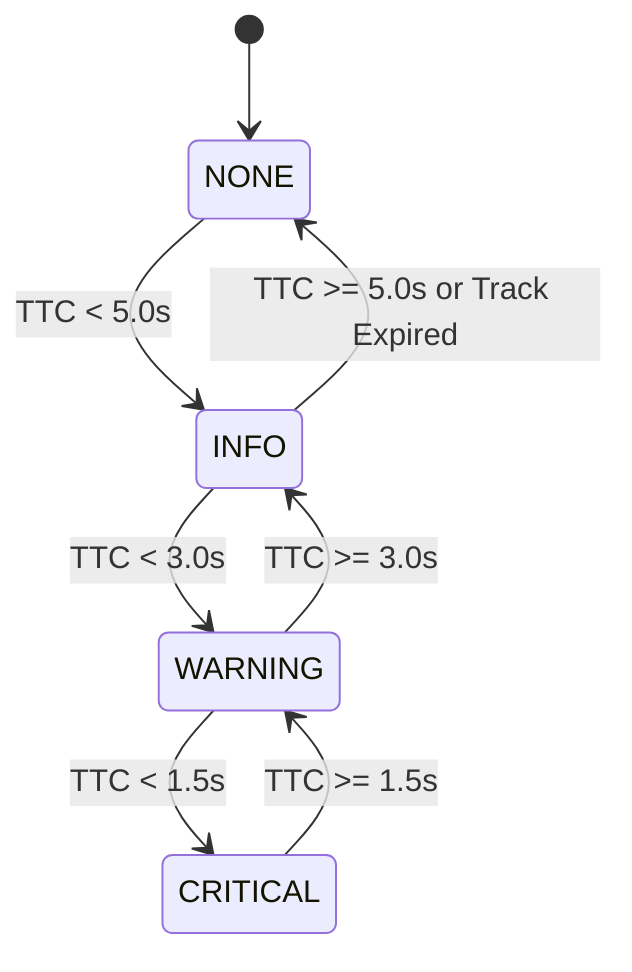
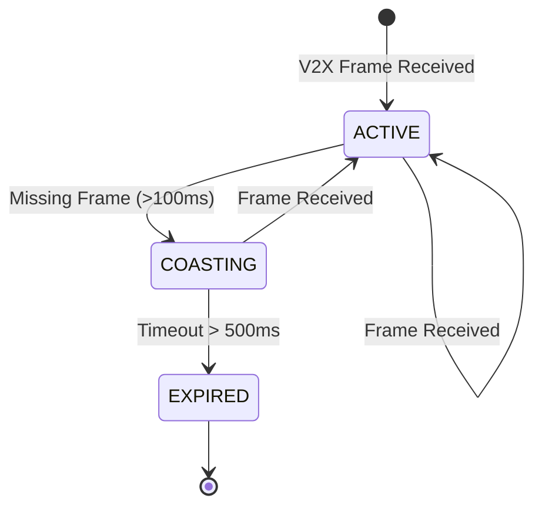

# Data Model & Schema Definitions: ICW Handling in ADA_ECU

## Core Data Structures (C++ Structs)

### 1. `RelayedTrack`
Represents a vehicle track received from V2X ECU.

```cpp
namespace ada::cra {

enum class TrackState {
    ACTIVE,
    COASTING,
    EXPIRED
};

struct RelayedTrack {
    uint32_t object_id;
    double pos_x_m;        // Relative X position (meters)
    double pos_y_m;        // Relative Y position (meters)
    double vel_x_mps;      // Velocity X (m/s)
    double vel_y_mps;      // Velocity Y (m/s)
    double heading_rad;    // Heading angle (radians)
    uint64_t timestamp_ms; // Last update timestamp
    TrackState state;
};

} // namespace ada::cra
```

### 2. `ICWConflictPoint`
Result of intersection trajectory calculation.

```cpp
namespace ada::cra {

struct ICWConflictPoint {
    bool has_conflict;
    double ttc_sec;            // Time-to-collision in seconds
    double distance_m;         // Relative distance to conflict point
    double separation_min_m;   // Minimum predicted separation at closest point
};

} // namespace ada::cra
```

### 3. `ICWRiskLevel` & `ICWWarningPayload`
Risk state and warning message sent from ADA_ECU to IVI_ECU (R4 message extension).

```cpp
namespace ada::cra {

enum class ICWRiskLevel {
    NONE = 0,
    INFO = 1,
    WARNING = 2,
    CRITICAL = 3
};

struct ICWWarningPayload {
    uint32_t warning_id;
    std::string warning_type = "ICW";
    ICWRiskLevel risk_level;
    uint32_t target_object_id;
    double distance_m;
    double ttc_sec;
    uint64_t timestamp_ms;
};

} // namespace ada::cra
```

---

## State Transition Diagrams

### ICW Risk Level Transitions



### Track Coasting Lifecycle


